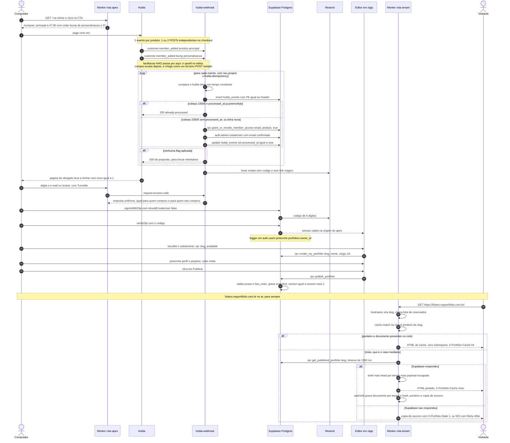

# Plano de produto: MyPortifolio

Documento único de produto, arquitetura, dados, fluxo, editor, fases e riscos do
**MyPortifolio**: o portfólio do Helio virando produto vendido para outras pessoas.

Ele **substitui integralmente o plano v1** (`tasks/_plano/plano-v1-obsoleto.md`, apagado),
que foi escrito sob duas premissas erradas (tenant por caminho e cobrança recorrente).
O que sobreviveu do v1 foi o detalhe técnico: SQL, mapeamento de campo e desenho de editor.

## As quatro decisões do dono, travadas, que não se reabrem

1. **Cobrança:** pagamento único, acesso vitalício. Não existe assinatura, inadimplência,
   `past_due`, carência nem suspensão por falta de pagamento.
2. **Marca e domínio:** `myportifolio.com.br`, zona já criada na Cloudflare, produto
   chamado **MyPortifolio**.
3. **URL do comprador:** subdomínio `fulano.myportifolio.com.br`, nunca caminho.
4. **Customização:** a base é só conteúdo (mesmo layout, mesmo visual), com personalização
   e facilitação vendidas em cima.
5. **Preço, low ticket:** principal a R$ 47,90, order bump de personalização a R$ 37,00, e
   facilitação a R$ 297 como upsell dentro do editor, fora do checkout, porque é hora de
   trabalho humano e não escala no preço de um bump (ver 9.2).

## Índice

- [Fatos de plataforma e o que ainda não foi verificado](#fatos-de-plataforma-e-o-que-ainda-não-foi-verificado)
- [1. O produto em uma página](#1-o-produto-em-uma-página)
- [2. Decisão de arquitetura](#2-decisão-de-arquitetura)
- [3. Mapa do sistema](#3-mapa-do-sistema)
- [4. Modelo de dados](#4-modelo-de-dados)
- [5. Fluxo de pagamento, conta e acesso](#5-fluxo-de-pagamento-conta-e-acesso)
- [6. O editor](#6-o-editor)
- [7. Estrutura de pastas depois da mudança](#7-estrutura-de-pastas-depois-da-mudança)
- [8. Plano de execução em fases](#8-plano-de-execução-em-fases)
- [9. Decisões do dono](#9-decisões-do-dono)
- [10. Riscos e plano B](#10-riscos-e-plano-b)
- [Glossário de nomes](#glossário-de-nomes)
- [Registro de revisão](#registro-de-revisão)

---

## Fatos de plataforma e o que ainda não foi verificado

### Verificado (use, não re-verifique, não contradiga)

| Fato | Consequência no plano |
|---|---|
| **Rotas de Worker suportam curinga.** `*.myportifolio.com.br/*` casa subdomínios. Regra documentada: `*.example.com/*` casa **só** subdomínios, enquanto `*example.com/*` casaria `myexample.com` também. Todo hostname precisa de registro DNS proxiado para invocar o Worker | O renderizador público é um Worker com rota curinga (seção 2) |
| **Custom domains de Cloudflare Pages não documentam suporte a curinga** | O renderizador público **não pode ser Pages**. A pasta `functions/` do plano v1 morre |
| **Workers com Static Assets** servem estático e código servidor no mesmo deploy, por `assets: { directory, binding }`, com `env.ASSETS.fetch(request)`, mais `not_found_handling` e `run_worker_first` | Um Worker só resolve shell estático e SSR por tenant, sem skew de hash de asset entre dois deploys |
| **Resposta gerada por Worker não entra no cache da Cloudflare só por ter `s-maxage`.** O Worker roda depois da decisão de cache | Cachear exige Cache API explícita (`caches.default.put`/`match`) ou Cache Rule na zona. É o achado 11 |
| **Os tokens Cloudflare do dono não têm permissão de Cache Purge** | Invalidação é **sempre** por chave versionada, nunca por purge |
| **Zona `myportifolio.com.br` existe na conta** (id `67579cef2f0a7010548217ab9e59547b`, plano Free, tipo `full`) e está com status **`active`**: o dono trocou os nameservers no registro.br, a delegação propagou (`kipp.ns.cloudflare.com` e `serenity.ns.cloudflare.com`) e o Universal SSL foi emitido na ativação | A ação manual que bloqueava tudo **já aconteceu**. O portão 0 da fase 0 não pergunta se ela vai acontecer: ele **reconfere por comando** que continua valendo, porque delegação de domínio é estado que pode regredir |
| **TLS curinga funciona no domínio real.** Com `AAAA * -> 100::` **proxiado** na zona, três hostnames que nunca tiveram registro próprio fecharam handshake com certificado publicamente confiável, SANs `myportifolio.com.br` e `*.myportifolio.com.br`, emissor Google Trust Services, no plano Free | É a resposta de S1, e ela veio **sim**. Custo por hostname é zero: nenhum comprador acima do centésimo vira custo mensal eterno contra pagamento único. Cloudflare for SaaS deixa de ser dependência da v1 e volta a ser só o caminho de "cliente traz o domínio dele" |
| **A zona está limpa:** só os três registros que a Cloudflare cria para domínio sem e-mail (`MX .`, `TXT v=spf1 -all`, `TXT _dmarc p=reject`) | Nenhum risco de derrubar coisa em produção. Ligar o Resend **exige reescrever o SPF e o DMARC**, senão o e-mail de código é rejeitado na origem |
| **O token MASTER escreve DNS** (testado com criação e remoção de um TXT de sondagem). O token DEPLOY **não** lê nem escreve DNS | O CLAUDE.md global descreve o MASTER como read-only, e isso está errado |
| **Supabase:** 2 organizações, 2 projetos ativos no Free. Um projeto novo cabe | O projeto novo nasce em `sa-east-1`, e a escolha da organização muda a conta do Pro (seção 9.4) |
| **`src/app/i18n.js:6` tem `let lang` em escopo de módulo** e `t()` lê essa variável (`i18n.js:30`); `setLang` (linha 15) muta o módulo | Pureza de `t`, `tui` e `px` é pré-requisito duro de SSR. É o achado 15 |
| **`src/styles/global.css` tem 443 linhas e zero regra de formulário** (nenhum seletor `input`, `label`, `textarea`, `select`, `form`) | O sistema de formulário do editor é trabalho inteiro, não detalhe. É a dívida D2 |
| **Não existe rodapé em `src/`** | O crédito "Desenvolvida por Method Growth Hub" está faltando hoje. É a dívida D4 |

### Suposição não verificada, com a forma de verificar

| # | Suposição | Como verificar, e quando |
|---|---|---|
| S1 | **RESPONDIDA, e passou.** A suposição era "TLS é emitido automaticamente para subdomínio arbitrário sob DNS curinga proxiado", e ela nasceu de uma leitura correta com conclusão errada: os certificados servidos nas outras zonas da conta são por hostname, sem SAN `*.zona`, mas aquelas zonas não têm registro curinga, então nunca houve motivo para a Cloudflare apresentar SAN curinga nelas. Certificado por hostname era efeito da ausência de curinga, não prova de que curinga não funciona | Já verificada no domínio real (linha da tabela de verificados acima), com o resultado gravado em `tasks/_plano/spike-tls.md`. Fica **como portão que se reexecuta**, não como pergunta em aberto: o spike 1 da fase 0 custa três `openssl s_client` e continua podendo reprovar, porque certificado vence e configuração de zona muda. O que este teste **não** prova continua valendo como regra: Universal SSL cobre o apex e **um** nível de subdomínio, então `a.b.myportifolio.com.br` segue descoberto e a validação de slug nunca pode afrouxar para aceitar ponto. Planos B ficam registrados para o caso de regressão, na ordem: Total TLS (gratuito), Cloudflare for SaaS (S18), certificado avançado `*.dominio` (pago) |
| S2 | **A Cache API não opera em `*.workers.dev`** (há indicação na documentação). Se for verdade, um spike de cache feito no domínio de teste mede zero e conclui errado | **Spike 2 da fase 0**, rodado **no domínio novo**: dois `curl` seguidos ao mesmo hostname conferindo o header próprio `X-Portfolio-Cache` e o nonce do corpo |
| S3 | **O runtime do Workers propaga `cf-cache-status` em resposta vinda de `caches.default.match()`** | Não é portão de nada. O portão do spike 2 é o nonce mais o `X-Portfolio-Cache` que o nosso código escreve |
| S4 | **`wrangler versions upload` dá URL de preview por versão** | Ler a doc no mesmo spike. Se não existir, plano B barato: um segundo Worker `-staging` com rota `*.staging.myportifolio.com.br/*` |
| S5 | **O keep-alive por `pg_cron` impede a pausa do projeto Free.** A Supabase mede inatividade por **requisição ao projeto**, e escrita interna do Postgres pode não contar. "Funciona no AI Block" é evidência de um caso | Não se verifica: se remove. Nenhum cliente pagante fica em projeto Free (decisão 9.4). Enquanto o projeto de desenvolvimento estiver no Free, quem faz o ping de verdade é um **Cron Trigger de Worker** batendo em endpoint PostgREST a cada 6 horas, que é requisição HTTP de verdade. Ele não é intenção: é o bloco `triggers` do `wrangler.jsonc` mais o handler `scheduled` de `worker/index.js`, entregável da fase 1 item 3. O `cron.schedule` do `0001` fica como segunda linha, e está marcado no próprio SQL como paliativo |
| S6 | **Os números de limite do plano Free** (1 GB de storage, 5 GB de egress por mês, `rate_limit_email_sent = 30/hora no projeto inteiro` com SMTP próprio) | Conferir no painel do projeto novo no dia da migração, e registrar o valor lido em `tasks/_plano/medicoes.md`. Nenhuma decisão de produto pode depender do número de memória |
| S7 | **`auth.admin.createUser` com a service role continua criando usuário com `disable_signup: true`** | Ligar `disable_signup`, chamar `createUser` com e-mail inédito, conferir `select count(*) from auth.users where email = ...`. Plano B: `inviteUserByEmail` mais `signInWithOtp({ shouldCreateUser: false })` |
| S8 | **O template Magic Link governa o OTP por e-mail e `{{ .Token }}` renderiza o código de 6 dígitos** | Disparar um `signInWithOtp` real para caixa de teste e ler o assunto. O AI Block hoje está em `mailer_otp_length = 8` e `mailer_otp_exp = 3600`, os dois errados para este uso |
| S9 | **Em upload padrão (`POST /object`) o `metadata` já vem preenchido no INSERT em `storage.objects`** | Subir arquivo de tamanho conhecido pelo dashboard e rodar `select name, metadata from storage.objects where bucket_id = 'portfolio-media'`. Se vier nulo, o ramo de `UPDATE OF metadata` do mesmo trigger cobre |
| S10 | **Exceção em trigger sobre `storage.objects` desfaz o upload**, e não deixa o arquivo órfão no backing store | Baixar `max_media_bytes` para 100 KB, subir 150 KB, e conferir três coisas: erro no cliente, `storage.objects` não cresceu, e o arquivo não aparece na listagem do bucket pela API. Plano B: Edge Function `media-upload` com URL assinada, mais reconciliação por `pg_cron` |
| S11 | **`_headers` e `_redirects` valem em Workers com Static Assets como valem no Pages** | `curl -sI https://<host>/assets/<arquivo-com-hash>.js \| grep -i cache-control` no primeiro deploy do Worker. Se não honrar, o header passa a ser escrito por `worker/rotas/apex.js` |
| S12 | **Nomes exatos dos tipos de evento de chargeback e disputa na Hubla.** O AI Block só trata `customer.member_added` e `customer.member_removed` | `select distinct type, count(*) from public.hubla_events group by 1 order by 2 desc;` depois de semanas em produção, e provocar um estorno em sandbox. Até lá, **bloqueio é operação manual**, assumido por escrito |
| S13 | **O oEmbed do YouTube manda header de CORS** | Um `fetch` do browser contra `https://www.youtube.com/oembed?url=...&format=json`. Se não mandar, vira Edge Function `video-check` de 20 linhas. Fase 2 |
| S14 | **O Supabase Auth tem CAPTCHA nativo por projeto** (`security_captcha_enabled` com provider Turnstile) **e ele cobre `/auth/v1/otp`**, e o `signInWithOtp` do cliente aceita `options.captchaToken` | Ligar no projeto novo e rodar o `curl` de 5.4 contra `/auth/v1/otp` com a anon key e **sem** token de captcha: tem que voltar erro de captcha, e `auth.users` não pode crescer. É pré requisito da primeira venda, porque sem isso o login inteiro é contornável. Plano B, e ele muda o tamanho da fase 1: tirar `/auth/v1/otp` do caminho do produto, com a própria Edge Function emitindo e conferindo o código e devolvendo a sessão pela service role, mais a senha opcional (5.5) como segundo caminho que não passa por e-mail |
| S15 | **`caches.default.delete()` existe no runtime do Workers e apaga a entrada no colo que atendeu a requisição** | Um `curl` que devolve `X-Portfolio-Cache: hit`, uma chamada da rota que executa o delete, e um terceiro `curl` no mesmo colo (mesmo sufixo de `CF-Ray`) que tem que voltar `miss`. Se não existir, o banimento passa a depender só do vencimento da cópia de socorro, e o `max-age` dela cai de 24 horas para 1 hora |
| S16 | **A Hubla dá um extrato de vendas conciliável linha a linha** (exportação em CSV no painel, ou API de pedidos) | Abrir o painel da Hubla e procurar a exportação **antes** da primeira venda. Se não houver, a conciliação semanal de 5.11 vira conferência manual do relatório de tela contra `member_access`, e o teto de dano fica registrado por escrito |
| S17 | **Apagar a linha em `storage.objects` deixa a URL pública daquele objeto respondendo erro**, e não continua servindo o binário | Subir um arquivo, copiar a URL pública, apagar a linha por SQL, e repetir o `curl`. Se continuar servindo, o caminho de takedown (5.8) passa a chamar a API de Storage (`DELETE /object/portfolio-media/<path>`) de dentro de uma Edge Function, em vez de apagar a linha |
| S18 | **Cloudflare for SaaS tem faixa gratuita de 100 hostnames e cobra por hostname acima disso**, e o valor por hostname. As duas metades são suposição: o tamanho da faixa gratuita e o preço. O número aparece como plano B de S1 (seção 2, alternativa c3, e risco R1) e entra na conta de preço de 9.2, onde cada hostname acima da faixa é custo mensal eterno contra receita única | Abrir a tela de billing da conta e ler **os dois** números vigentes (tamanho da faixa gratuita e preço por hostname), **antes** de assinar a tabela de preço de 9.2, e registrar o que foi lido em `tasks/_plano/medicoes.md`. Enquanto não forem lidos, toda menção a "100 hostnames grátis" no documento é suposição e não fato, e a coluna "S1 caiu no plano B 2" da tabela de 9.2 fica marcada como não confirmada. Plano B se o preço inviabilizar: certificado avançado `*.dominio` (custo fixo, não por cliente), ou domínio próprio do comprador virando requisito do SKU acima da faixa |
| S19 | **O Supabase Auth oferece segundo fator (TOTP) para uma conta específica**, e dá para exigir o fator na sessão antes de uma operação sensível (`aal2`) | Ligar o fator na conta do dono no projeto novo e conferir que uma sessão sem o segundo passo não passa em `is_admin()`. É pré requisito do primeiro pedido de facilitação atendido, não da primeira venda. Plano B, se o fator não existir ou não for legível pelo Postgres: a conta de admin passa a exigir **senha** (5.5) mais um código enviado a um segundo e-mail, e a concessão de facilitação (4.3) fica limitada a 72 horas por pedido, que é o que reduz a janela de dano |
| S20 | **A role da migration consegue criar DDL nos schemas gerenciados da Supabase.** São três objetos, todos fora de `public`: `create trigger storage_objects_registra_midia` e `storage_objects_remove_midia` sobre `storage.objects` (4.4), as cinco `create policy ... on storage.objects` (4.6), e `create trigger claim_portfolio after insert on auth.users` (4.5). `storage.objects` pertence a `supabase_storage_admin` e `auth.users` a `supabase_auth_admin`; S10 assume o **comportamento** do trigger e não a permissão de criá-lo. Se cair, o entregável 7 da fase 1 muda de forma e o plano B deixa de ser plano B | Aplicar `0003`, `0004`, `0005` e `0007` no projeto novo e conferir, em uma linha cada: `select tgname from pg_trigger where tgrelid = 'storage.objects'::regclass`, `select tgname from pg_trigger where tgrelid = 'auth.users'::regclass` e `select policyname from pg_policies where schemaname = 'storage'`, que depois de `0007` tem que listar as quatro policies novas de `portfolio-docs` (4.7.1). É o primeiro comando depois da migration, antes de qualquer upload de teste. Plano B, e ele muda o tamanho da fase 1: a cota passa a ser aplicada pela Edge Function `media-upload` com URL assinada (o cliente perde o `insert` direto no Storage), o `claim_portfolio` vira uma chamada explícita de `claim_my_portfolio()` no primeiro carregamento do editor, e a leitura pública do bucket passa a ser configuração de bucket público em vez de policy nossa |
| S21 | **`pg_cron` está disponível no projeto e a migration consegue criar a extensão e usar o schema `cron`** (`create extension if not exists pg_cron` mais `grant usage on schema cron to postgres`, 4.2). Seis jobs dependem disso: keep alive, faxina de `slug_history`, faxina de mídia órfã, faxina de publicações, liberação de slug retido, limpeza de `access_throttle` | Rodar `0001` no projeto novo e conferir `select extname from pg_extension where extname = 'pg_cron'` e `select jobname from cron.job`, que tem que listar os seis. Plano B: os jobs viram rotas internas de um **Cron Trigger de Worker** (o mesmo mecanismo do plano B de S5), chamando RPCs `security definer` com a service key, uma rota por job, o que troca seis linhas de SQL por um handler `scheduled` com seis casos e mantém o resto igual |
| S22 | **Dá para ler o tempo de CPU por invocação do Worker publicado** (`wrangler tail`, ou a analytics de Workers da zona), que é o único número comparável ao limite de CPU da plataforma | Publicar o Worker da fase 1, gerar 50 requisições em miss forçado e conferir se sai número de CPU por invocação. Registrar em `tasks/_plano/medicoes.md`. Plano B, e ele é observável sem doc nenhuma: 500 requisições em miss forçado contra um tenant com 20 projetos, e **nenhuma** resposta pode vir sem o nosso corpo (toda resposta é `200` com o `<title>` do tenant, ou uma das nossas páginas de erro com o nosso HTML). Uma única resposta de erro de plataforma no meio do lote significa render acima do teto, e aí o orçamento do render (seção 2) reprova mesmo sem o número exato |
| S23 | **Com `run_worker_first: false`, um arquivo estático que casa o caminho é servido sem o Worker rodar**, ou seja, o asset tem precedência sobre o código. A tabela de verificados confirma que os knobs existem, não a ordem entre eles. Esta suposição é a razão de ser da regra "`dist/` nunca contém `.html`" (seção 2) e do critério 2 daquela seção | No primeiro deploy do Worker (fase 1, item 3): colocar um `sonda.html` dentro de `dist/`, publicar, e pedir `https://<host>/sonda.html`. Se vier o conteúdo do arquivo, a precedência é a assumida e a regra do build é obrigatória; se vier resposta do Worker, a precedência é a inversa. Apagar a sonda no deploy seguinte. Plano B se a precedência for a inversa: a regra do build continua valendo por higiene, mas deixa de ser a defesa, e a defesa passa a ser o Worker recusar explicitamente servir `.html` de `env.ASSETS` em hostname de tenant |
| S24 | **Restrições da Cache API do Workers**: `put` exige requisição `GET`, recusa resposta com `Set-Cookie`, e recusa `206` e `304`. O desenho de `worker/lib/cache.js` (seção 2) depende das quatro | **Spike 2 da fase 0**, com uma rota a mais: tentar `caches.default.put` de uma resposta com `Set-Cookie` e de uma `206`, e registrar o que acontece (exceção, ou gravação silenciosa que depois não casa no `match`). Plano B: nenhuma mudança de arquitetura, só de código. Se `put` for mais permissivo do que se supõe, as asserções continuam valendo como disciplina nossa (resposta de render nunca tem cookie); se for mais restritivo, o `put` passa a ser envolvido em `try/catch` com o erro contado em log, porque falha de gravação de cache nunca pode derrubar a resposta ao visitante |
| S25 | **O caminho `/cdn-cgi/*` é reservado pela Cloudflare em toda a zona, inclusive dentro de cada subdomínio de tenant, e nunca chega ao Worker.** É a única defesa citada para esse namespace dentro do subdomínio do cliente | No primeiro deploy do Worker: `curl -s https://<slug>.myportifolio.com.br/cdn-cgi/trace` e conferir se a resposta é da plataforma (corpo com `fl=`, `h=`, `ip=`) ou do nosso código. Plano B, barato: o roteador de `worker/index.js` passa a tratar `/cdn-cgi/*` explicitamente, respondendo `404` da nossa página, para o caminho não virar superfície nossa por acidente. `cdn-cgi` continua em `reserved_slugs` nos dois casos, porque lá ele defende o **rótulo** de subdomínio, que é outra coisa |
| S26 | **Workers tem versões, deploy gradual e `wrangler rollback`**, e dá para voltar a versão anterior sem rebuild. O risco R9 (ponto único de falha global) depende inteiro disso, e S4 cobre só a URL de preview por versão | Depois do primeiro deploy do Worker: `npx wrangler deployments list` e `npx wrangler rollback --help`, mais um rollback de mentira entre duas versões triviais, cronometrado. Plano B se não existir como descrito: o rollback passa a ser `git checkout <tag anterior> && npm run build && npx wrangler deploy`, o que exige que **toda** publicação saia de uma tag, e o tempo de recuperação sobe de segundos para minutos, o que muda o texto do R9 e não a arquitetura |
| S27 | **A thumb `https://i.ytimg.com/vi/<id>/hqdefault.jpg` de um ID inexistente devolve um placeholder cinza de 120x90 em vez de `404`**, ou seja, imagem quebrada no card não é sinal de ID errado | Um `curl -sI` com um ID de 11 caracteres inventado, lendo status e `Content-Length`. É o menos grave da tabela porque a defesa já está desenhada ao lado (6.6): o editor confere o ID pelo oEmbed (suposição S13) e não confia na thumb. Plano B: se a thumb devolver `404` de verdade, o editor pode usar o próprio status da thumb como checagem barata e o oEmbed vira redundância |
| S28 | **Dá para assinar uma URL de leitura de objeto em bucket privado com a service role** (`POST /storage/v1/object/sign/portfolio-docs/<caminho>` com validade em segundos), e a URL assinada serve o arquivo com o `content-type` gravado no upload. É disso que depende a rota `/certificado/` (4.7.1), que é o único caminho pelo qual um certificado chega ao visitante. A seção 5.9 já cita URL assinada para o export de dados, mas lá o bucket é público e aqui não é, e é a parte privada que não foi lida na documentação | Subir um PDF de teste em `portfolio-docs` e conferir quatro coisas com `curl`, em ordem: a URL **não** assinada do objeto responde erro; a URL assinada com validade de 300 s responde `200` com `content-type: application/pdf`; a mesma URL depois do vencimento responde erro; e um `GET` do mesmo caminho com a anon key responde erro. **Momento:** fase 1, no primeiro upload de certificado, antes de a rota `/certificado/` existir. **Plano B, sem mexer em uma coluna sequer:** a rota deixa de responder `302` e passa a devolver os bytes lidos pelo Worker com a service key, sempre com `content-disposition: attachment` e `cache-control: private, no-store`, o que mantém o PDF fora do nosso origin como conteúdo ativo e troca a assinatura por banda de Worker |
| S29 | **A taxa da Hubla por venda**, que no low ticket decide o ponto de equilibrio. A conta de 9.2 usa 10% como estimativa conservadora e o numero real nunca foi lido | Abrir o painel da Hubla e ler a taxa vigente (percentual e parcela fixa, que em ticket de R$ 47,90 pesa proporcionalmente muito mais que em ticket alto), **antes** de fechar o preco. Registrar o valor lido em `tasks/_plano/medicoes.md`. Se a parcela fixa for alta o suficiente para derrubar o liquido abaixo de R$ 38, a decisao de preco de 9.2 volta para a mesa, porque o ponto de equilibrio sai de 30 para mais de 45 vendas por ano |

Regra que vale para o documento inteiro: número de performance mora **só** em
`tasks/_plano/medicoes.md`, gerado por `scripts/medir-render.mjs`. O plano v1 citava dois
números diferentes para a mesma medição (43.449 bytes em 0,41 ms na seção 2, 43.395 bytes
em 0,056 ms na seção 6). Nenhum dos dois entra aqui.

---

## 1. O produto em uma página

### O que é

O portfólio do Helio deixa de ser um site pessoal e vira produto: a mesma página, com o
mesmo acabamento, vendida para outras pessoas preencherem com o conteúdo delas. O
comprador paga **uma vez**, entra com o e-mail da compra, escolhe o endereço, preenche
perfil e projetos, clica em publicar, e a página fica no ar em
`fulano.myportifolio.com.br`. A primeira publicação de cada conta passa por uma conferência
de um clique nossa, com prazo declarado nos termos, e da segunda em diante publicar é
instantâneo para sempre. O motivo está no risco R8: um subdomínio herda a credibilidade do
domínio pai, e um único phishing hospedado aqui não derruba o tenant, derruba o domínio
inteiro com todos os clientes dentro.

A página do Helio continua existindo e acumula uma segunda função: é a vitrine. Ela vive
no **apex** (`https://myportifolio.com.br/`), renderizada pelo mesmo caminho de tenant, é
a prova do produto, e o CTA de compra mora nela.

O literal do domínio existe em **exatamente dois lugares de configuração** no sistema pronto:
a var `APEX_HOST` em `wrangler.jsonc` e a linha `apex_host` em `public.app_settings`. Nenhum
módulo de código monta hostname com string literal: todos leem uma dessas duas fontes.

Critério executável, e ele varre a raiz do repositório também, porque `wrangler.jsonc` mora
lá e a versão anterior deste critério não olhava para ele:

```sh
grep -rno "myportifolio" . \
  --include='*.js' --include='*.ts' --include='*.sql' --include='*.jsonc' --include='*.json' \
  --exclude-dir=node_modules --exclude-dir=dist --exclude-dir=tasks --exclude-dir=.git \
  | cut -d: -f1 | sort | uniq -c
```

A saída esperada é declarada arquivo a arquivo, e qualquer desvio reprova:

| Arquivo | Ocorrências esperadas | Por quê |
|---|---|---|
| `./wrangler.jsonc` | **5** | `vars.APEX_HOST`, os três `pattern` de rota e o `zone_name`. O formato do `wrangler` não interpola variável em rota, então essas quatro repetições são inevitáveis e ficam declaradas em vez de escondidas |
| `./supabase/migrations/0001_base_acesso.sql` | **1** | o seed de `app_settings.apex_host` |
| qualquer outro arquivo | **0** | um literal em `src/`, `worker/` ou em outra migration é hostname montado à mão, e é o que este critério existe para pegar |

### Para quem

Freelancer e prestador de serviço que precisa de uma página de trabalhos e não vai
construir uma: dev, designer, social media, fotógrafo, videomaker, consultor. O público
que hoje usa Linktree ou um PDF e quer algo que pareça caro.

### Os três SKUs na Hubla

São três produtos na Hubla, mas eles **não são vendidos no mesmo lugar**, e a diferença é
de margem, não de arrumação (ver 9.2).

| SKU | Preço | Onde é vendido | O que é | Flag | Natureza |
|---|---|---|---|---|---|
| **Principal** | R$ 47,90 | Checkout | O portfólio em si, vitalício, no subdomínio próprio | `has_main` | Software |
| **Personalização** | R$ 37,00 | **Order bump** no checkout | Cor de destaque e as variações visuais que não deixam o comprador estragar o layout | `has_custom` | Software |
| **Facilitação** | R$ 297 | **Upsell dentro do editor** | Nós montamos o portfólio a partir do material que ele mandar | `has_setup` | Trabalho humano |

**A Hubla manda um evento por produto**: uma compra com o bump marcado gera **duas** chamadas
`POST` independentes ao webhook, cada uma com seu `x-hubla-idempotency`, em ordem não
garantida e possivelmente concorrentes. Não é hipótese, é lição registrada no `CLAUDE.md`
do AI Block depois de uma venda real ter se perdido (incidente 03/08/2026,
`PGRST303 "JWT issued at future"`). A facilitação, por ser upsell posterior, chega como uma
**terceira** chamada avulsa, dias depois, com o mesmo e-mail. O webhook não distingue os dois
casos e não precisa: flag booleana por produto absorve as duas formas sem código extra.

Consequência estrutural, travada: **entitlement é flag booleana por produto, nunca um
`plan_code` escalar com rank.** `public.member_access` tem `has_main`, `has_custom` e
`has_setup`, no mesmo formato do `has_main` / `has_skills_plugins` / `has_artigos` que já
está em produção em
`ai block/supabase/migrations/20260718184914_member_access_and_hubla_events.sql`. Rank
escalar não consegue representar "quais produtos estão ativos agora", que é o que o modelo
de um evento por produto exige. O mapa `productId -> flag` vive em
`supabase/functions/hubla-webhook/productFlags.ts`, com **dois aliases por produto** (o id
da listagem e o id da URL `/edit/<id>`), copiando o formato de `productTiers.ts`.

`has_setup` é a única flag que não libera software: ela abre uma linha em
`public.setup_requests` e uma fila visível para o dono (seção 5.7). Sem essa fila, vende e
não entrega.

### O que o comprador recebe

1. `fulano.myportifolio.com.br`, com HTTPS, servido na borda da Cloudflare.
2. Editor no navegador em `myportifolio.com.br/app`, com o portfólio ao vivo atrás do
   formulário.
3. Perfil: foto de rosto, imagem de destaque, nome, cargo, bio, e-mail de contato, links
   sociais, três números de destaque, lista de stacks, botão de CTA próprio.
4. Projetos: imagem, nome, cliente, categoria, ano, frase de efeito, o desafio, a solução,
   funcionalidades, stack, link do trabalho, vídeo do YouTube por embed.
5. Experiência: uma entrada por passagem, com logo da organização, nome da organização, se
   foi trabalho ou estudo (faculdade, curso, certificação), cargo, período, local, o que
   ele fez ali, uma observação livre e um certificado anexado. Organização sem logo entra
   com o monograma das iniciais, nunca com um buraco no card. A seção **já está no ar** no
   portfólio do Helio (`src/modules/experience/`, seção 4.7.1), e o comprador recebe
   exatamente o mesmo render.
6. Filtros e paginação que se derivam sozinhos do conteúdo dele.
7. Rascunho separado do que está no ar, publicação instantânea da segunda vez em diante
   (a primeira passa por conferência de até 24 horas, risco R8), link de prévia
   compartilhável que funciona desde antes de publicar, e **histórico das últimas 10
   publicações** (o botão de restaurar é entregue na fase 2; o histórico já é gravado desde
   a fase 1). Achado 13: sem isso, quem apaga metade dos projetos e publica não tem volta, e
   o Supabase Free não tem PITR.
8. Preview de link correto: quem colar a URL no WhatsApp ou no LinkedIn vê o nome, a
   descrição e a foto do comprador, não a do Helio. Isso é entregue pelo SSR e não é
   negociável em nenhuma fase.
9. Contador de visualizações do próprio portfólio e um e-mail mensal com o número
   (**fase 2**). Achado 28: com pagamento único não existe churn de assinatura, mas o
   contador continua sendo o único sinal de valor que o produto emite, e é o que sustenta
   a venda futura de upgrade.
10. Botão "baixar meus dados" (o próprio `payload` publicado mais os caminhos de mídia) e
    botão "apagar minha conta" com confirmação por código (achado 27, LGPD art. 18).
11. Termos de uso e política de privacidade publicados **antes** da primeira venda.
12. Rodapé com o crédito "Desenvolvida por Method Growth Hub".

### O que o comprador NÃO recebe na v1

- Versão em inglês do próprio portfólio. Na v1 o portfólio do comprador é monolíngue e o
  botão PT/EN não é renderizado para ele. A coluna `english_enabled` existe desde a fase 1
  e nasce `false`; o bilíngue é fase 3.
- Domínio próprio (`joaosilva.com.br`) apontando para o portfólio. O caminho técnico é
  Cloudflare for SaaS, e ele tem custo por hostname (seção 2).
- E-mail no domínio: `fulano@myportifolio.com.br` não existe e nunca vai existir.
- Tema, cores e fontes livres. Sem o bump, a identidade visual é fixa: é ela que ele está
  comprando. Com `has_custom`, ele ganha a cor de destaque e um conjunto fechado de
  variações (seção 6.10).
- Analytics além do contador de visitas, e formulário de contato com resposta.
- Página própria por case, com deep link indexável (fase 3).
- Na experiência: mais de um certificado por entrada (é um arquivo por passagem), leitor de
  PDF embutido na página (o certificado abre em aba própria pela rota `/certificado/`, e
  nunca dentro do nosso HTML, seção 4.7.1), e busca automática da logo da organização por
  domínio. A logo é upload, como qualquer outra imagem do produto.
- Ordenação automática da experiência por data. A ordem é escolha do comprador, com a
  sugestão de um clique descrita em 6.5.1, pela mesma razão do "vídeo primeiro" nos
  projetos: reordenar em silêncio mexe no que ele acabou de arrumar.
- Conferência de autenticidade do certificado. O produto anexa o documento que o comprador
  subiu e não afirma nada sobre ele, e é assim que os termos precisam dizer (5.9).
- Blog, depoimentos, tabela de preços, agenda embutida.
- Exportar o site como HTML estático (o "baixar meus dados" exporta o **conteúdo**, não o
  site montado).
- Mais de um portfólio por conta.

### O que "vitalício" significa por escrito

Receita é uma só por cliente e o custo de hospedagem é para sempre. Isso obriga duas
coisas: custo por tenant perto de zero (argumento de arquitetura, seção 2) e uma definição
escrita do compromisso, senão o produto vende uma promessa que não sabe cumprir.

O que precisa estar nos termos antes da primeira venda:

- **Prazo mínimo garantido.** "Vitalício" significa enquanto o produto existir, com
  garantia mínima declarada em meses (seção 9.5). Se for descontinuado, aviso com
  antecedência declarada, exportação de dados aberta no período, e 301 do subdomínio para
  um destino que o comprador informar.
- **Tetos de uso justo fazem parte da venda, não de um plano.** Número máximo de projetos
  e bytes de mídia ficam em `public.quotas`, aparecem no editor, e mudar o teto é `UPDATE`,
  não deploy.
- **As três, e apenas três, saídas:** arrependimento em 7 dias (CDC art. 49, que se aplica
  por ser compra online e precisa estar no fluxo de dinheiro, não só no rodapé),
  chargeback, e banimento por abuso. Não existe inadimplência, não existe `past_due`, não
  existe carência por cartão recusado, não existe suspensão por falta de pagamento.
- **O que acontece na saída:** `member_access.blocked = true` (achado 10 vira obrigatório
  e vira simples), o portfólio sai do ar com `410`, e o subdomínio **não** é liberado na
  hora. Fica retido por 90 dias antes de voltar ao namespace, para ninguém ocupar o
  endereço de quem acabou de pedir reembolso.
- **Quem devolve o endereço ao estoque, e quando.** Retenção sem mecanismo de liberação é
  retenção eterna, e retenção eterna encolhe o namespace a cada reembolso: `slug_available()`
  consulta `portfolios`, a linha do reembolsado continua lá com o `slug`, e num produto de
  nome curto vendido por impulso os nomes bons (`joao`, `design`, `fotografo`) são o estoque.
  Por isso existe `liberar_slug_retido()` (4.5), rodada por `pg_cron` todo dia: passados os 90
  dias, o portfólio revogado troca de endereço para `bloqueado-<8 hex>` e o nome volta ao
  estoque no mesmo comando. Quem foi revogado **sem nunca ter publicado** libera na hora, sem
  esperar prazo nenhum, porque nunca existiu link para preservar.

---

## 2. Decisão de arquitetura

### A restrição que decide tudo

O comprador recebe **subdomínio** (`fulano.myportifolio.com.br`), não caminho. Isso é
decisão travada e mata a Arquitetura A do plano v1 (Pages Function com tenant por
caminho). Os dois fatos de plataforma da tabela de verificados (rota de Worker com curinga
existe, custom domain de Pages com curinga não) fecham o espaço: **o renderizador público
não pode ser Pages. Ele é um Worker.** O que sobra para decidir é onde vive o resto do
produto.

### Vencedora: (a) um único Worker com Static Assets, resolvendo tenant pelo hostname

Um deploy só, um `wrangler.jsonc`, um bundle. O mesmo Worker atende o apex (vitrine,
oferta, login, editor, termos, sitemap) e todo subdomínio de tenant (portfólio renderizado
no servidor). O tenant é resolvido por `new URL(request.url).hostname`.

**Por que (a) ganha de (b) "Pages para o app mais Worker para o tenant", e o argumento é um
só que vale por cinco:** o HTML servido no subdomínio precisa referenciar os assets com
hash do build (`/assets/main-<hash>.js`). Se o shell mora num deploy de Pages e o
renderizador mora num Worker separado, o Worker precisa descobrir esse hash em runtime ou
carregá-lo como constante de build, e **todo deploy passa a ter uma janela em que o Worker
aponta para um asset que já não existe**. É o modo de falha padrão de dois deploys que
compartilham um artefato. Com Static Assets no mesmo Worker, shell e assets sobem no mesmo
`wrangler deploy`, atômico, sem janela. Some a isso:

- Em (b), os assets do subdomínio viriam de outra origem, o que custa uma segunda
  resolução de DNS e um segundo handshake TLS no caminho crítico da página do cliente, ou
  duplicar os assets dentro do Worker, que é o mesmo trabalho de (a) com um deploy a mais.
- Em (b) existem duas cópias da lista de subdomínios reservados, do módulo de escape e da
  regra de pureza de `t()`. Duas cópias divergem. Uma delas divergindo em escape é um XSS.
- (b) exige dois pipelines de CI e duas contas de rollback.

**O único ativo real que (b) traz** é a UI de preview deployment e rollback do Pages. Não
basta: Workers tem versões, deploy gradual e `wrangler rollback` (a existência disso é a
suposição S26, e a URL de preview por versão é a S4).

### O que mais foi avaliado, e por que não venceu

**(c1) Dois Workers, um para o apex e outro para `*.myportifolio.com.br/*`.** É (b) sem o
Pages: mantém o skew de hash de asset e a duplicação de bibliotecas, e não resolve nada
que (a) não resolva. Descartada.

**(c2) Pré-renderizar o HTML de cada tenant em R2, com um Worker fino servindo objeto.** É
a Arquitetura C do plano v1, e sob pagamento único ela fica **mais** atraente do que era:
tira o Postgres do caminho de leitura, sobrevive a projeto Supabase pausado, e o custo
marginal por visita cai para leitura de objeto. Perde por dois motivos atuais. Primeiro,
nos primeiros meses o template muda toda semana (o bump `has_custom` garante isso), e cada
correção vira job de re-render em lote sobre N tenants, com estado intermediário em que
metade da base está corrigida e metade não, incluindo correção de escape de HTML. Segundo,
sem permissão de purge, o objeto em R2 precisa de chave versionada e um ponteiro, que é
**exatamente o mesmo trabalho** que a Cache API já exige em (a), mais o job de lote. Fica
registrada como **plano B nomeado**: se a medição do caminho de miss provar que o Postgres
é o gargalo, a migração é localizada, porque o render já é função pura de `(payload, lang)`
e o snapshot já está materializado em `portfolio_publications`.

**(c3) Cloudflare for SaaS / custom hostnames em vez de DNS curinga.** Não é alternativa a
(a), **compõe** com (a): troca o mecanismo de emissão de certificado, não a topologia.
Vira obrigatório se o spike de TLS (S1) falhar. Precisa entrar na conta de preço antes da
primeira venda: a memória diz "faixa gratuita de 100 hostnames e cobrança por hostname
depois", ou seja, a partir do cliente 101 cada comprador adiciona custo mensal para sempre
contra um pagamento único. **Esse número é suposição S18, não fato lido**, e ele é o que
decide a coluna da direita da tabela de 9.2: preço de terceiro citado de memória não pode
assinar modelo de negócio. Do lado bom, é o produto desenhado para "cada cliente tem seu
hostname" e já abre o caminho de "cliente traz o domínio dele".

### O spike que precede o código

**S1 era o bloqueio duro desta decisão, e ela já foi respondida no domínio real: passou.**
A ordem travada nas decisões foi cumprida na sequência certa: (1) trocar o NS no
registro.br, (2) esperar a zona virar `active` e o Universal SSL ser emitido, (3) só então
rodar o spike, que fechou handshake em três hostnames inéditos com SAN `*.myportifolio.com.br`.
O spike **continua na fase 0**, e não por formalidade: ele custa três comandos, o resultado
depende de estado que pode regredir (certificado vence, registro curinga pode ser apagado,
plano da zona pode mudar), e um portão que só se executa uma vez não é portão. Roteiro
executável e critério de aprovação estão na fase 0 (seção 8), com o resultado já colhido em
`tasks/_plano/spike-tls.md`.

### Como o Worker distingue apex de subdomínio de tenant

Arquivo: `worker/lib/host.js`, função única `resolverHost(url, env)`.

```js
// worker/lib/host.js
// Fonte do hostname: new URL(request.url).hostname, NUNCA o header Host cru.
// O cliente pode mandar Host duplicado; a URL do request ja vem normalizada pela borda.
export function resolverHost(url, env) {
  const apex = env.APEX_HOST;                       // var em wrangler.jsonc
  const host = url.hostname.toLowerCase();
  if (host === apex) return { tipo: 'apex' };
  if (host === `www.${apex}`) return { tipo: 'redirect', para: `https://${apex}` };
  if (!host.endsWith(`.${apex}`)) return { tipo: 'estranho' };   // Host que nao e nosso
  const rotulo = host.slice(0, -(apex.length + 1));
  if (rotulo.includes('.')) return { tipo: 'profundo' };         // fulano.x.myportifolio...
  if (!ehRotuloDnsValido(rotulo)) return { tipo: 'invalido' };
  if (RESERVADOS.has(rotulo)) return { tipo: 'reservado', rotulo };
  return { tipo: 'tenant', slug: rotulo };
}

// MESMA regra de public.slug_dns_valido(), palavra por palavra. Se as duas divergirem,
// existe slug aceito pelo banco que o roteador recusa, e o cliente fica fora do ar.
export function ehRotuloDnsValido(s) {
  return s.length >= 3 && s.length <= 63
    && /^[a-z0-9]([a-z0-9-]*[a-z0-9])?$/.test(s)
    && !/^..--/.test(s)
    && !s.startsWith('xn--');
}
```

Notas que não são detalhe:

- `rotulo.includes('.')` importa porque certificado curinga cobre **um** nível de
  subdomínio. `a.b.myportifolio.com.br` não teria TLS válido nem com o wildcard, então nem
  entra no roteador.
- O limite de 63 caracteres é o limite de rótulo DNS, e é o mesmo do `CHECK` de
  `portfolios.slug`, senão o banco aceita um slug que a rede recusa.
- `xn--` é prefixo de punycode e `..--` na terceira e quarta posição é reservado pela RFC
  5891 seção 4.2.3.1. As duas regras existem nos dois lados.

Roteamento em `worker/index.js`, por tipo:

| Tipo | Resposta |
|---|---|
| `apex` | Vitrine (o portfólio do Helio renderizado), `/comprar`, `/entrar`, `/app`, `/termos`, `/privacidade`, `/sitemap.xml`, `/robots.txt` |
| `redirect` | `301` para o apex, preservando path e query |
| `tenant` | Portfólio renderizado no servidor (fluxo completo na seção 3) |
| `reservado` | `301` para o apex. Nunca 404: `www` e `app` são digitados por gente |
| `profundo`, `invalido` | `404` com a página de "endereço livre", `noindex` |
| `estranho` | `421 Misdirected Request`, sem corpo. Só acontece se alguém apontar CNAME para nós |

O caminho `/cdn-cgi/*` é reservado pela Cloudflare em toda zona, inclusive dentro de cada
subdomínio de cliente, e nunca chega ao Worker. Isso é a **suposição S25**, e ela é a única
defesa citada para esse namespace dentro do subdomínio do cliente, então tem verificação e
plano B próprios. O rótulo `cdn-cgi` continua na tabela `reserved_slugs` de qualquer forma,
porque lá ele defende outra coisa: o nome de subdomínio, não o caminho.

Config em `wrangler.jsonc`:

```jsonc
{
  "name": "portfolio-render",
  // Sai de `npx wrangler whoami` com o token MASTER exportado em CLOUDFLARE_API_TOKEN.
  // Sem ele o deploy nao publica, e esse e o primeiro comando que um agente trava sem.
  "account_id": "<lido de wrangler whoami, gravado aqui no primeiro deploy>",
  "main": "worker/index.js",
  "compatibility_date": "2026-08-01",
  "assets": {
    "directory": "./dist",
    "binding": "ASSETS",
    "not_found_handling": "none",
    "run_worker_first": false
  },
  "vars": { "APEX_HOST": "myportifolio.com.br", "CACHE_NS": "v1" },
  "routes": [
    { "pattern": "myportifolio.com.br",     "custom_domain": true },
    { "pattern": "www.myportifolio.com.br", "custom_domain": true },
    { "pattern": "*.myportifolio.com.br/*", "zone_name": "myportifolio.com.br" }
  ],
  // Keep-alive de verdade do projeto Supabase: requisicao HTTP ao PostgREST a cada 6 horas.
  // O cron.schedule do 0001 e paliativo interno do Postgres e nao vale como requisicao
  // (suposicao S5). Handler: `scheduled` em worker/index.js, rota worker/rotas/cron.js.
  "triggers": { "crons": ["0 */6 * * *"] }
}
```

**Credenciais, e onde elas moram.** Os dois tokens da Cloudflare estão no CLAUDE.md global
do dono e nunca neste documento nem no repositório. A divisão de trabalho entre eles não é
a que o nome sugere e já custou tempo uma vez: **o token MASTER é o que escreve DNS** e o
que lê `whoami`; **o token DEPLOY é o que publica Worker** e não enxerga DNS. Exportar
`CLOUDFLARE_API_TOKEN` com o token certo para cada comando é pré-requisito de qualquer
passo de infra, e trocar os dois é o erro que produz `Authentication error` em comando que
deveria funcionar.

**Regra dura de build, e ela existe por causa de uma armadilha real:** com
`run_worker_first: false`, um arquivo estático que casar com o caminho é servido **sem o
Worker rodar** (essa precedência é a **suposição S23**, medida no primeiro deploy do Worker
com um arquivo de sonda). Se `dist/index.html` existisse, `https://fulano.myportifolio.com.br/`
serviria o shell cru, com o `<head>` do Helio, sem SSR, em silêncio, exatamente o defeito
de produto que o SSR existe para evitar. Portanto: **`dist/` nunca contém arquivo
`.html`.** O passo `scripts/preparar-shell.mjs` roda depois do `vite build`, tira
`dist/index.html` e `dist/app.html` de dentro de `dist/`, e escreve `worker/shell.gen.js`
exportando `SHELL_PUBLICO`, `SHELL_EDITOR` e `ASSET_ENTRY` como strings. Critério
executável: `test $(find dist -name '*.html' | wc -l) -eq 0` no fim do build, e o build
falha se não for zero.

`env.ASSETS` continua sendo o binding para tudo que é arquivo (`/assets/*`,
`/projects/*.webp`, `/favicon.png`), e o Worker delega com `env.ASSETS.fetch(request)`
quando quiser servir um estático de dentro de uma rota que ele controla.

### Subdomínio que não existe, ou que saiu do ar: o que responde

Sob pagamento único não existe "cliente suspenso por falta de pagamento". O achado 19 do
plano v1 vira outro problema: **"esse slug nunca existiu"**. E `404` seco de plataforma
continua sendo resposta errada, porque a URL pode estar impressa num cartão.

| Situação | Status | Página | Cache |
|---|---|---|---|
| Slug nunca existiu | `404` | "Este endereço ainda está livre", com CTA para `/comprar?slug=fulano` | `public, max-age=60` mais `X-Robots-Tag: noindex` |
| Slug existe mas nunca publicou | `404` | Mesma página. O rascunho é invisível para o mundo | Igual acima |
| Já esteve publicado e saiu do ar: reembolso, chargeback, banimento, o dono despublicou, pedido de exclusão | `410 Gone` | "Este portfólio não está mais disponível", sem CTA e sem citar o motivo | `no-store`, `X-Robots-Tag: noindex, nofollow` |
| Supabase não respondeu | `503` | "Estamos com um problema temporário" | `no-store`, `Retry-After: 30`, e antes disso tenta servir a cópia de socorro do cache |
| A RPC devolveu `throttled` (leitura acima do teto naquele tenant) | `200` se houver cópia de socorro, senão `503` | A própria página, com `X-Portfolio-Stale: 1` | Igual à linha acima: o visitante legítimo nunca vê erro por causa de um laço de terceiro |

Todas em `worker/render/paginas.js`, com o mesmo shell e o mesmo visual do produto. O
`max-age=60` curto no 404 é intencional: o slug pode ser comprado a qualquer instante, e
cachear "não existe" por muito tempo faz o cliente novo achar que a compra não funcionou.
O `410` fica com `no-store` porque revogação não pode ficar presa na borda.

**A terceira linha só existe porque o banco sabe responder por ela.** Descrever 410 em
prosa e deixar a RPC com três estados (`ok`, `moved`, `not_found`) entrega, na prática, a
página de "endereço livre" com CTA de compra no subdomínio de quem acabou de ser banido,
que é o pior corpo possível para essa resposta, e nunca emite o sinal que tira a URL do
índice. Por isso `get_published_portfolio` tem um quarto estado, `gone` (4.5), e a regra do
Worker é dura: **endereço que já teve `first_published_at` nunca cai na página de endereço
livre enquanto estiver retido.** O mapa é `ok` para 200, `moved` para 301, `gone` para 410 e
`not_found` para 404. A retenção tem fim: passados os 90 dias, `liberar_slug_retido()` (4.5)
renomeia o portfólio revogado e o endereço volta ao estoque, e a partir daí ele responde 404
com a página de endereço livre porque ele está, de fato, livre.

### Subdomínios reservados

Ganho de graça da decisão de subdomínio: o namespace do cliente deixa de competir com as
rotas do app (`/entrar`, `/comprar`, `/app`), que ficam no apex. O achado 29 encolhe, mas
não some.

**A lista canônica é uma só**: o seed de `public.reserved_slugs` na migration
`0002_portfolios.sql` (seção 4.3). `scripts/gerar-reservados.mjs` gera
`worker/lib/reservados.js` a partir dela no build. Duas listas escritas à mão divergiriam;
uma gerada não.

**Reserva retroativa precisa falhar barulhento (achado 29).** Quando uma rota nova nascer,
`insert into reserved_slugs` direto passa em silêncio mesmo com um cliente já usando aquele
nome. Portanto:

- `revoke insert, update, delete on public.reserved_slugs from authenticated, anon`.
- Reserva depois do seed só por `admin_reserve_slug(p_slug, p_motivo)`, que levanta exceção
  listando quem usa, forçando decisão consciente (migrar o cliente com 301 ou desistir).
- Guarda de deploy que roda em toda subida:
  `select p.slug from public.portfolios p join public.reserved_slugs r on r.slug = p.slug`
  precisa devolver **zero linhas**, e o pipeline falha se devolver alguma. É o que pega o
  `insert` feito na mão pelo painel do Supabase.

### Cache: Cache API explícita, chave por tenant e conteúdo, sem purge

Fato verificado: resposta gerada por Worker não entra no cache só por ter `s-maxage`, e os
tokens do dono não têm permissão de purge. O desenho abaixo é a resposta ao achado 11.

**A chave do documento não pode conter o slug sozinho, e não pode conter `version`.** Este
é o ponto em que o desenho se ganha ou se perde, porque o erro aqui não é lentidão, é
**servir o portfólio de um cliente no subdomínio de outro**, com `immutable` de um ano e
sem permissão de purge. `version` é `max(version) + 1` **por portfólio**, e não uma
sequência global: dois tenants diferentes têm versão 7 ao mesmo tempo. Como o slug troca de
dono por dois caminhos escritos neste plano (`change_my_slug`, que muda o endereço da
publicação sem criar versão nova, e o reuso de um slug depois que o histórico expira), a
chave `(slug, version)` colide entre tenants. A chave é, portanto, endereçada ao **tenant e
ao conteúdo**, nunca ao endereço.

Três chaves, em `worker/lib/cache.js`:

```js
const ns = env.CACHE_NS;                                  // 'v1'
const kPonteiro  = new Request(`https://cache/${ns}/slug/${slug}`);
const kDocumento = new Request(`https://cache/${ns}/pf/${portfolioId}/${contentHash}`);
const kSocorro   = new Request(`https://cache/${ns}/pf/${portfolioId}/socorro`);
```

- **Ponteiro**: é a única entrada chaveada por slug, porque slug é a única coisa que o
  request traz. O corpo é o JSON `{ portfolioId, contentHash, payloadV }` devolvido pela
  RPC, e ele existe porque a chave endereçada ao conteúdo tem um problema de ovo e galinha:
  não dá para montar a chave do documento antes de saber de quem é o slug hoje. Duas
  validades no mesmo objeto: `Cache-Control: public, max-age=86400` para a entrada não ser
  descartada cedo, e o header próprio `X-Portfolio-Pointer-At` (epoch de gravação) que o
  nosso código lê. **Ponteiro com mais de 30 segundos não é usado no caminho normal**: o
  Worker vai ao Postgres. Ele só serve velho no caminho de socorro, quando a RPC falhou, e é
  aí que ele ganha o papel de mapa `slug -> portfolioId` durante uma queda do Supabase.
- **Documento**: o HTML pronto, chaveado por `portfolioId` mais `contentHash` (o
  `md5(payload || slug)` que a tabela já guarda). `Cache-Control: public, max-age=31536000,
  immutable`, e agora é honesto de verdade: aquele conteúdo daquele tenant nunca muda, e
  nenhum outro tenant consegue produzir a mesma chave. Publicar muda o hash, muda a chave, e
  a entrada velha deixa de ser pedida. Zero purge. `version` continua existindo na tabela
  como histórico e ordem (4.5), mas **não** entra em chave de cache.
- **Cópia de socorro**: o mesmo documento gravado sob `pf/${portfolioId}/socorro` com
  `max-age=86400`, servido apenas quando o Supabase falha, com header
  `X-Portfolio-Stale: 1`. É o que transforma "banco fora do ar" em "página levemente
  velha" em vez de `503`. Chaveada por tenant e não por slug pelo mesmo motivo do documento:
  o dono seguinte de um endereço nunca pode receber a página do dono anterior.

**Revogação e a cópia de socorro, sem fingir purge.** Quando a RPC responde `gone` ou
`not_found` para um slug, o Worker apaga, em `ctx.waitUntil`, o ponteiro daquele slug e, se
o ponteiro velho disser quem era o tenant, a cópia de socorro dele (`cache.delete`,
suposição S15). Isso vale no colo que atendeu, que é o mesmo escopo de todo o resto deste
desenho. O residual fica escrito em vez de escondido: **um portfólio banido pode ser servido
da cópia de socorro, num colo que não recebeu nenhuma visita depois do banimento, e só
enquanto o Supabase estiver fora do ar, por no máximo 24 horas.** Foi por isso que o
`max-age` da cópia de socorro caiu de 7 dias para 24 horas: sete dias de conteúdo abusivo
ressuscitável é caro demais para o que a janela extra compra.

Escrita sempre com `ctx.waitUntil(cache.put(...))`, fora do caminho da resposta.
Restrições da Cache API que precisam estar no código, não na cabeça de quem escreveu:
`put` exige `GET`, recusa `Set-Cookie` na resposta, e recusa `206` e `304`. As quatro são a
**suposição S24**, medidas no spike 2, e valem como disciplina nossa mesmo que o runtime
seja mais permissivo: a resposta do render nunca tem cookie, e isso vira asserção no teste,
não comentário. O `put` vai envolvido em `try/catch` pelo motivo que independe de S24:
falha ao gravar cache não pode derrubar a resposta que o visitante já está recebendo.

**O que acontece no miss**: `cache.match(kPonteiro)` erra, ou traz um ponteiro com mais de
30 segundos, então uma chamada `fetch` ao PostgREST (`rpc/get_published_portfolio`) com
`AbortSignal.timeout(1500)`, uma linha de volta com `portfolioId`, `contentHash`,
`payloadV` e `payload`, montagem do HTML, resposta ao visitante, e as três gravações em
`waitUntil`. Um round trip ao `sa-east-1` por miss.

**A porta anônima de leitura tem teto, senão o cache não protege nada.** `get_published_portfolio`
é executável por `anon`, e a anon key é pública por construção (o bundle do editor precisa
dela). Um laço de `curl` direto no `/rest/v1/rpc/get_published_portfolio` **não passa pela
borda**, então ele ignora todo o desenho acima e vai direto na alavanca de custo que o cache
existe para evitar, num modelo em que a receita já entrou e o custo é eterno (9.2). Por isso a
RPC faz duas coisas em ordem (4.5): resolve o ponteiro barato (uma linha de índice, sem
payload) e só então consome cota no escopo `read`, chaveada pelo `portfolio_id` **resolvido**,
nunca pelo texto que chegou. Acima do teto ela devolve `{'status':'throttled'}` sem payload, e
quem paga a conta do excesso é o atacante, não o Postgres. O visitante legítimo que cair nessa
janela recebe a cópia de socorro, que é justamente o caso em que ela vale mais.

**Por que o hit ratio é ruim por construção, e por que isso está escrito aqui em vez de
escondido:** o cache da Cloudflare é **por colo**. O perfil de tráfego deste produto é
"muitos tenants, pouquíssimas visitas cada": um freelancer manda o link para dez pessoas
por mês, que abrem de cidades diferentes, caindo em colos diferentes (GRU, GIG, CWB, POA,
FOR, BSB só no Brasil). O tenant mediano vai ter miss em quase toda visita. Consequências
assumidas de olhos abertos:

1. O cache **não** é a história de performance. Ele paga o caso do comprador recarregando
   a própria página, o do bot de preview de link buscando três ou quatro vezes seguidas, e
   o do link que viraliza. Nenhum desses é o caso mediano.
2. O que é load-bearing é o **caminho de miss ser barato e seguro**: uma RPC, uma linha,
   sem join, banco em `sa-east-1` perto dos colos brasileiros, timeout curto, e a cópia de
   socorro cobrindo a falha.
3. O valor real da cópia de socorro é disponibilidade, não latência. É o que impede
   "Supabase caiu" de virar "todos os portfólios pagos caíram juntos".

O header próprio `X-Portfolio-Cache: hit|miss` é escrito pelo nosso código e é o portão de
todo critério de cache deste plano, porque não depende de comportamento não documentado
(S2 e S3).

### Pureza de `t`, `tui` e `px` é pré-requisito duro do SSR

Num isolate de Worker o módulo é instanciado **uma vez** e serve muitos requests,
inclusive concorrentes. Duas consequências, e a segunda é a que mata:

1. Qualquer caminho de código que chame `setLang` no servidor vaza o idioma para o request
   seguinte, em silêncio, sem stack trace, porque o `try/catch` do `localStorage` engole
   tudo.
2. Mesmo que ninguém chame `setLang`, `t()` lendo estado de módulo significa que **o
   render não é função pura dos argumentos**. E o desenho de cache inteiro depende disso: a
   chave é `(portfolioId, contentHash)`, ou seja, uma função do conteúdo. Se o corpo puder
   variar sem que a chave varie, o cache serve conteúdo errado para outro visitante. O bug
   deixa de ser "idioma trocado" e vira "vazamento entre requests".

Portanto, e isto não é negociável: `t(v, lang)`, `tui(key, lang)`,
`px(project, field, lang)` e `ex(experience, field, lang)` puros, com `lang` vindo do `ctx`
do request. `ex()` entrou nesta lista depois das três rodadas de revisão, junto da seção de
experiência (6.5.1), e hoje ele lê `getLang()` de módulo exatamente como os outros liam. O
estado mutável
de idioma sai para `src/app/langState.js`, importado **apenas** por `src/main.js`
(browser). O achado 15 está certo também na parte chata: isso valia igual para a
arquitetura A do plano v1, então o item nunca foi diferencial entre arquiteturas, e sim
pré-requisito de qualquer SSR.

Guarda automática: `scripts/import-graph.mjs` roda no build e falha o deploy se algum
módulo alcançável a partir de `worker/index.js` importar `src/app/langState.js`, `lucide`,
arquivo `.css`, `@supabase/supabase-js`, ou referenciar `import.meta.env`.

### O Worker de render, dimensionado de verdade (achado 24)

"Umas 60 linhas" era ficção no plano v1. Este é o entregável mais denso da fase que liga o
produto, e ele tem estrutura própria:

```
worker/
├── index.js                  fetch handler unico mais handler scheduled (keep-alive)
├── shell.gen.js              GERADO no build: SHELL_PUBLICO, SHELL_EDITOR, ASSET_ENTRY
├── lib/
│   ├── host.js               resolverHost(url, env), ehRotuloDnsValido(s)
│   ├── reservados.js         GERADO de reserved_slugs, Set congelado
│   ├── cache.js              chave por tenant e conteudo, get/put/delete com waitUntil, socorro
│   ├── supabase.js           rpc(env, nome, args) por fetch puro no PostgREST, com timeout
│   └── env.js                unico ponto que le env.* do Worker
├── render/
│   ├── pagina.js             injeta head, payload e assets no shell, chama renderPortfolioPage
│   └── paginas.js            naoExiste(), bloqueado(), indisponivel()
└── rotas/
    ├── apex.js               vitrine, /comprar, /entrar, /app, /termos, /privacidade
    ├── tenant.js             o caminho quente, a rota de previa e /certificado/ (4.7.1)
    ├── sitemap.js            gerado com a service key, nunca com anon (fase 3)
    ├── robots.js             por hostname: apex e tenant tem robots diferentes
    └── cron.js               alvo do handler scheduled: ping HTTP no PostgREST (S5)
```

O escape e a montagem do `<head>` **não** moram em `worker/`: moram na zona isomórfica
(`src/modules/portfolio/lib/sanitize.js` e `src/modules/portfolio/seo/renderHead.js`),
porque duas cópias de escape divergem e uma delas divergindo é um XSS.

O que cada item obriga, com o detalhe que costuma ser esquecido:

- **Shell buildado.** Os nomes com hash dos assets vêm de `worker/shell.gen.js`, escrito
  pelo mesmo build que gerou `dist/`. `env.ASSETS.fetch(request)` continua sendo o caminho
  para servir arquivo. O shell **não** fica em `dist/` pelo motivo do `run_worker_first`
  acima, então `/app` serve `SHELL_EDITOR` de dentro do código.
- **`<head>` por tenant, escapado.** `og:title`, `og:description`, `og:image` (URL
  absoluta, montada no Worker a partir do caminho relativo do payload, nunca congelada no
  snapshot, achado 12), `og:url`, `twitter:card`, `canonical` apontando para
  `https://<slug>.myportifolio.com.br/`. Todo valor passa por `escapeAttr`. Um `"` não
  escapado no `og:title` é injeção de atributo.
- **Injeção de payload.** Vai em `<script type="application/json" id="pf-payload">`, e o
  cliente lê com `JSON.parse(el.textContent)`, nunca com o parser de JS. O corpo passa por
  `safeJsonForScript`, que troca `<`, `>`, `&`, U+2028 e U+2029 pelas sequências unicode
  escapadas. Escapar `<` sozinho já mata `</script>` e `<!--`, mas os cinco vão juntos
  porque o teste é barato e a falha é XSS em domínio compartilhado por todos os clientes.
- **301 de slug antigo.** `portfolio_slug_history` responde quem era o dono do endereço, e
  a resposta é `301` para `https://<slug-novo>.<apex><path><query>`, com
  `Cache-Control: public, max-age=3600`. Detalhe que só existe por causa do subdomínio: o
  hostname antigo precisa continuar tendo DNS e TLS válidos para conseguir responder o
  301, o que o curinga cobre, mas o Cloudflare for SaaS **não** cobre automaticamente.
- **Prévia.** `https://<slug>.myportifolio.com.br/?previa=<token>` chama
  `get_draft_portfolio(slug, token)`. Resposta com `Cache-Control: private, no-store` e
  `X-Robots-Tag: noindex, nofollow, noarchive`, **nunca** gravada na Cache API. Desenho
  completo em 6.9.
- **Segredos.** `env.SUPABASE_URL` e `env.SUPABASE_ANON_KEY` lidos da assinatura
  `fetch(request, env, ctx)` por `worker/lib/env.js`. `import.meta.env` é do Vite e **não
  existe** no Worker: quem copiar código do front vai escrever isso e receber `undefined`
  em produção, não erro de build. Vira item de revisão de PR e regra do `import-graph.mjs`.
- **Falha do Supabase.** Timeout de 1500 ms, e no `catch`: cópia de socorro se houver,
  senão `503` com `Retry-After: 30`. Nunca stack trace no corpo. `ctx.waitUntil` grava o
  erro.
- **Orçamento de CPU, com teto escrito e com o runtime certo.** O teto é **nosso**, e está
  aqui em número para poder reprovar alguma coisa: para o tenant mais pesado que existe (20
  projetos, EN ligado, que é o portfólio do Helio), **mediana do render abaixo de 6 ms e p95
  abaixo de 12 ms**. Acima disso, o render é reescrito antes de qualquer coisa nova entrar
  nele. O número não sai do nada: ele é uma fração pequena do orçamento de uma resposta que
  também faz um round trip a `sa-east-1`, e é ele que mantém a margem de manobra quando um
  tenant tiver o dobro de conteúdo.

  Duas medições, e a distinção importa porque a versão anterior deste item media no lugar
  errado e concluía sobre o outro: (1) `scripts/medir-render.mjs` roda em **Node** com
  `process.hrtime.bigint()`, 200 iterações de aquecimento descartadas e 1000 medidas, e
  escreve mediana, p95 e bytes do HTML em `tasks/_plano/medicoes.md`. Esse número é
  **detector de regressão**, e não prova de que cabe no limite da plataforma: Node não é o
  isolate do Worker. (2) A prova de que cabe sai do **Worker publicado**, pelo tempo de CPU
  por invocação (suposição S22), com o plano B da própria S22 quando esse número não for
  legível. O mesmo arquivo recebe a latência ponta a ponta contra o Worker publicado,
  mediana de 50 requisições, medida separadamente em `hit` e em `miss`.

### Consequências travadas por esta decisão

| Item | Decisão |
|---|---|
| Hospedagem | Um Worker, um `wrangler.jsonc`, um `wrangler deploy` |
| Roteamento | Por hostname, resolvido em `worker/lib/host.js` |
| Estático | Static Assets no mesmo deploy, binding `ASSETS`, `dist/` sem nenhum `.html` |
| SSR | Obrigatório desde o primeiro deploy. Portfólio de comprador servindo o `<head>` do Helio é defeito de produto, não estágio intermediário |
| Cache | Cache API explícita, chave por `portfolio_id` mais `content_hash`, sem purge. Chave que contenha `slug` mais `version` é proibida: colide entre tenants |
| Banco | Supabase Postgres, projeto novo, região `sa-east-1`, que não se muda depois |
| Leitura pública | `fetch` puro no PostgREST via RPC `security definer`. `@supabase/supabase-js` fica exclusivamente no bundle do editor |
| Mídia | Supabase Storage, caminho endereçado por conteúdo, prefixado por `portfolio_id` |
| Pagamento | Hubla, três SKUs, webhook em Supabase Edge Function, portado do AI Block |
| Login | Código de 6 dígitos por e-mail, sem senha na v1, com Turnstile no formulário |
| KV | **Não entra na v1.** Consistência eventual mais uma superfície, sem ganho enquanto o miss for uma RPC. É o patch localizado se a medição de miss reprovar |

### Critérios de pronto desta decisão

1. Três hostnames aleatórios nunca usados respondem `200` com TLS válido no domínio novo.
   Um falhar reprova.
2. `find dist -name '*.html' | wc -l` devolve `0` depois de `npm run build`.
3. `curl -sI https://naoexiste-$(date +%s).myportifolio.com.br/` devolve `404`, corpo com a
   página de "endereço livre", e header `X-Robots-Tag: noindex`. Devolver 404 de plataforma
   reprova.
4. `curl -sI https://www.myportifolio.com.br/qualquer` devolve `301` para
   `https://myportifolio.com.br/qualquer`.
5. Dois `curl` seguidos no mesmo tenant devolvem `X-Portfolio-Cache: miss` e depois `hit`,
   no domínio real.
6. Publicar muda o `content_hash`, e o `curl` seguinte devolve o conteúdo novo com
   `X-Portfolio-Cache: miss`, sem nenhum purge.
7. `node scripts/import-graph.mjs --config scripts/boundary.config.json` falha o build se
   alguém importar `@supabase/supabase-js`, `lucide`, `.css`, `langState.js` ou usar
   `import.meta.env` dentro do grafo do Worker.
8. `select p.slug from portfolios p join reserved_slugs r on r.slug = p.slug` devolve zero
   linhas no pipeline de deploy.
9. **Endereço reaproveitado nunca serve o conteúdo do dono anterior.** Roteiro completo, no
   domínio real: publicar o tenant A em `x` e aquecer o cache com dois `curl` até dar `hit`;
   `change_my_slug` de A para `y`; liberar `x` e criar o tenant B em `x`; publicar B tantas
   vezes quantas forem as versões de A. Depois, 20 `curl` em
   `https://x.myportifolio.com.br/` têm que trazer **sempre** o nome de B, e
   `https://y.myportifolio.com.br/` sempre o de A. Uma única resposta com o conteúdo trocado
   reprova o desenho de cache inteiro, e é o defeito mais caro que este plano pode ter.
10. **Portfólio banido responde 410, e não a página de compra.** Com um tenant publicado,
    `admin_takedown_portfolio(id, 'teste')` e, depois de no máximo 60 segundos,
    `curl -sI https://<slug>.myportifolio.com.br/` devolve `410`, o corpo **não** contém
    `/comprar` (`grep -c '/comprar'` igual a `0`), e o header traz
    `X-Robots-Tag: noindex, nofollow`. Responder `404` reprova.
11. **A porta anônima de leitura não é ilimitada.** Com a anon key, direto no PostgREST e
    sem passar pela borda: 700 chamadas de `rpc/get_published_portfolio` com o **mesmo** slug
    publicado têm que fazer as últimas devolverem `status = throttled` **sem** o campo
    `payload` no corpo (`jq -e '.payload == null'` sai com 0). E 700 chamadas com slug
    **aleatório a cada vez** têm que devolver `not_found` sem escrever nada:
    `select count(*) from access_throttle where scope = 'read'` fica igual ao valor de antes.
    Se qualquer uma das duas falhar, o custo variável por visita voltou a ser controlado por
    quem visita. Em seguida, pelo navegador: com o teto daquele tenant estourado, o `curl` no
    subdomínio tem que devolver `200` com `X-Portfolio-Stale: 1` (ou `503` se não houver
    cópia de socorro), nunca um erro cru do PostgREST no corpo.
12. **O render cabe no orçamento, e o orçamento é um número.** `node scripts/medir-render.mjs`
    sobre o tenant de 20 projetos com EN ligado escreve em `medicoes.md` mediana **abaixo de
    6 ms** e p95 **abaixo de 12 ms**. Acima de qualquer um dos dois, reprova. Esse par é
    medido em Node e vale como detector de regressão. A segunda metade roda contra o Worker
    publicado: 500 requisições em miss forçado contra o mesmo tenant, e **todas** as 500
    respostas trazem o nosso corpo (o `<title>` do tenant, ou uma das nossas páginas de erro).
    Uma resposta de erro de plataforma no meio do lote reprova, e nesse caso o render está
    estourando o limite de CPU mesmo que o número do Node esteja bonito.

---

## 3. Mapa do sistema

### Componentes

| Componente | Onde vive | Responsabilidade |
|---|---|---|
| **Vitrine** | `worker/rotas/apex.js`, rota `/` | Portfólio do Helio renderizado no servidor pelo mesmo caminho de tenant, com CTA de compra |
| **Página de oferta** | `worker/rotas/apex.js`, rota `/comprar` | Os três SKUs, links de checkout de `src/modules/checkout/config/checkoutLinks.js`. Nunca linkar `pay.hub.la` direto do portfólio |
| **Checkout** | Hubla | Cobrança única. O e-mail digitado aqui é a identidade do cliente para sempre |
| **Webhook** | `supabase/functions/hubla-webhook/index.ts` mais `productFlags.ts` | Valida `x-hubla-token` com comparação em tempo constante, deduplica por `x-hubla-idempotency` **sem engolir retentativa**, concede a flag do produto, pré-cria o usuário, abre a linha de `setup_requests`, dispara boas-vindas |
| **Pedido de código** | `supabase/functions/request-access-code/index.ts` | Rede de segurança caso o webhook tenha falhado. Turnstile obrigatório, rate limit por IP e por e-mail, e **resposta uniforme** para não virar oráculo de enumeração de clientes (achado 8) |
| **Vínculo de e-mail** | `supabase/functions/link-login-email/index.ts` | Manda código para o e-mail **da compra** e grava o alias (achado 3) |
| **Banco** | Supabase Postgres `sa-east-1` | Fonte da verdade. RLS em tudo. Rascunho normalizado, publicado em snapshot versionado |
| **Editor** | `myportifolio.com.br/app`, bundle `src/app/editorBoot.js` | Canvas ao vivo mais gaveta de formulário. Único lugar que importa `@supabase/supabase-js` |
| **Storage** | Supabase Storage, buckets `portfolio-media` (público) e `portfolio-docs` (privado) | `portfolio-media`: avatar, hero, imagens de projeto e logo de organização. `portfolio-docs`: só o certificado da experiência, que é documento pessoal e por isso não divide bucket com a página pública (4.7.1). Nos dois, hash no nome e prefixo `<portfolio_id>/` obrigatório no `CHECK` (achado 17) |
| **Renderizador público** | `worker/rotas/tenant.js` | Resolve slug pelo hostname, lê o ponteiro no cache, lê `get_published_portfolio` no miss, injeta head e payload, responde e grava o cache |
| **Hidratação** | `src/main.js` | Lê `<script id="pf-payload">`, liga os listeners delegados no `document`. Nunca reescreve o HTML no load quando ele já veio pintado |

Bindings, variáveis e segredos, todos nomeados:

- Binding `ASSETS` (Static Assets, `directory: ./dist`).
- Vars em `wrangler.jsonc`: `APEX_HOST`, `CACHE_NS`.
- Secrets do Worker por `wrangler secret put`: `SUPABASE_URL`, `SUPABASE_ANON_KEY`, e
  `SUPABASE_SERVICE_ROLE_KEY`, usado em **exatamente duas** rotas e em nenhuma outra:
  `/sitemap.xml` no apex (fase 3) e `/certificado/<slug-da-experiencia>` no subdomínio do
  tenant (fase 1), que assina a URL de vida curta do documento privado (4.7.1, suposição
  S28). O caminho quente do tenant continua sem tocar a service key.
- Secrets das Edge Functions: `HUBLA_WEBHOOK_TOKEN` (**novo**, nunca o mesmo do AI Block:
  token compartilhado entre dois produtos significa que comprometer um compromete os
  dois), `RESEND_API_KEY`, `TURNSTILE_SECRET_KEY`, `APP_URL`.
- Sem binding de KV, sem binding de D1, sem binding de R2 na v1.

### Como conversam

- O renderizador público e o editor **compartilham as mesmas funções de template**. Não
  existe segundo motor de render. É essa a razão de a refatoração de pureza (`t(v, lang)`)
  ser pré-requisito de tudo, não item de melhoria.
- O webhook nunca fala com o front. Ele escreve no banco, e o front descobre o estado pelo
  login.
- O editor nunca escreve em `portfolio_publications`. Ele escreve nas tabelas de rascunho
  e chama `publish_portfolio`, que valida posse e `has_main`, monta o snapshot e incrementa
  `version`.
- O Worker nunca lê tabela de rascunho no caminho público. Ele chama
  `get_published_portfolio(slug)`, que só enxerga o publicado, e
  `get_draft_portfolio(slug, token)` apenas na rota de prévia.
- `anon` **não** tem `select` em `portfolio_publications` nem em view de publicados (achado
  6: com `grant select to anon`, um `GET /rest/v1/portfolio_publications?select=payload`
  baixa a base de clientes inteira, com dado pessoal, sem autenticação).
- O certificado é o único arquivo do comprador que o visitante **não** busca no Storage. A
  rota `/certificado/<slug-da-experiencia>` em `worker/rotas/tenant.js` lê o caminho do
  payload que já está em cache, assina uma URL de vida curta e responde `302` (suposição
  S28). O Worker nunca serve os bytes do PDF pelo nosso origin, e a URL assinada nunca
  entra em HTML nem em cache compartilhado (4.7.1).

### O contrato de `ctx`, que é o que substitui o estado de módulo

`renderPortfolioPage(ctx)` é o ponto em que a refatoração da fase 0 se materializa, e sem o
contrato escrito ela não é executável por outra pessoa. `ctx` é montado **uma vez por
request**, no Worker (ou uma vez no boot, no browser), e desce por parâmetro até a última
função. Nada de render lê módulo, e nada de render importa dado.

```js
// Contrato unico de ctx. Quem monta: worker/render/pagina.js no servidor,
// src/main.js no browser. Quem consome: tudo em [iso].
const ctx = {
  lang:       'pt',                       // 'pt' | 'en'. Resolvido do request, nunca de modulo
  portfolio:  { /* payload publicado, ja passado por model/normalize.js */ },
  slug:       'fulano',                   // rotulo do subdominio; no apex e o slug do Helio
  apexHost:   'myportifolio.com.br',      // de env.APEX_HOST, nunca literal no codigo
  origin:     'https://fulano.myportifolio.com.br', // base de toda URL absoluta da pagina
  mediaBase:  'https://<projeto>.supabase.co/storage/v1/object/public/portfolio-media',
  assets:     { entry: '/assets/main-<hash>.js', css: [] }, // de worker/shell.gen.js
  flags:      { hasCustom: false, englishEnabled: false },
  isPreview:  false                       // previa: no-store, noindex, fora da Cache API
};
```

Três regras que vêm junto do contrato, e cada uma existe por causa de um defeito já
diagnosticado:

- **Toda URL absoluta nasce de `ctx`**, de `origin` ou de `mediaBase`, no instante do
  request. O payload publicado guarda caminho relativo e `videoId`, nunca URL montada
  (achado 12). Trocar de storage, ou trocar o host de embed, vira deploy do Worker em vez de
  `republish_all()` sobre a base inteira.
- **`ctx` é somente leitura para o render.** Nenhuma função de render escreve em `ctx`: um
  componente que guarda estado ali reinventa o `let lang` num objeto compartilhado.
- **`ctx.lang` é a única fonte de idioma.** `t`, `tui`, `px` e `ex` recebem `lang` por
  parâmetro, e `src/app/langState.js` (que muta) só existe no browser. `ctx` não ganha
  chave nova por causa da experiência: ela viaja dentro de `ctx.portfolio`, como os
  projetos, e o caminho da logo é resolvido por `mediaBase` como qualquer outra imagem.

### Regras de fronteira que valem como revisão de PR

- Nenhuma função de render importa dado.
- Nenhuma função de render lê estado de módulo.
- **Toda `` gerada por nós declara a estratégia de carregamento, e a regra é do dono.**
  Imagem abaixo da dobra (card de projeto, avatar do painel de perfil, qualquer imagem
  dentro de seção secundária) leva `loading="lazy" decoding="async"`. A imagem candidata a
  LCP, que aqui é sempre o hero, fica **eager**, sem `loading="lazy"`, e com
  `fetchpriority="high"`. Lazy no hero piora o LCP em vez de melhorar, e é por isso que a
  regra tem dois lados em vez de um. Conteúdo que só entra no DOM sob demanda (o `` do
  modal de projeto, preenchido no clique) já é lazy por natureza e não precisa do atributo.
  Isso deixa de ser hábito e vira contrato no minuto em que o produto passa a gerar markup
  com imagem de terceiro em domínio nosso, e tem critério executável na fase 1.
- Nenhum `${}` entra em `href`, `src`, `style` ou atributo sem passar por
  `src/modules/portfolio/lib/sanitize.js`.
- Nenhuma classe Tailwind é construída a partir de dado. O scanner do Tailwind v4 lê o
  código fonte, então classe vinda do banco não é gerada no build e o estilo some em
  produção sem erro nenhum. Cor de cliente entra por `style` inline com valor validado por
  `CHECK` no banco e por `safeColor` no render.
- `@supabase/supabase-js` não pode ser alcançável a partir de `src/main.js` nem de
  `worker/index.js`.
- `import.meta.env` não pode aparecer em nada alcançável a partir de `worker/index.js`.
- **Nenhuma função em `public` chama `set_config` com o nome do parâmetro vindo de
  argumento.** A marca `app.escrita_confiavel` é a porta de fuga do guarda de colunas
  (`portfolios_guarda_colunas`, 4.3), e hoje ela é segura por uma conjunção de circunstâncias
  (nenhuma função exposta aceita nome de GUC, e as RPCs que usam a marca chamam
  `set_config(..., true)`, escopo de transação, com o PostgREST usando uma transação por
  requisição), não por uma garantia. Uma RPC futura que aceite nome de GUC, ou que esqueça o
  `'off'` no fim, converte a segunda camada em bypass de `owner_email`, `slug` e
  `preview_token_hash`. Duas regras de PR, e as duas são `grep`: `set_config` só com literal
  no primeiro argumento, e toda função que liga a marca desliga no mesmo corpo.
- **Nenhuma escrita de admin em tabela de cliente sem linha em `moderation_log`.** Quem
  audita a regra é o par de critérios de 4.10, não a memória de quem revisa.

### Fluxo "clicou em comprar" até "portfólio no ar"



---

## 4. Modelo de dados

Esta seção é a **fonte canônica de SQL** do plano. Onde qualquer outra seção mostrar DDL,
ela está citando daqui. O SQL do v1 foi reaproveitado onde continua correto (validadores em
`CHECK`, i18n em `jsonb {pt,en}`, caminho de mídia em vez de URL, `youtube_id` de 11
caracteres) e reescrito onde a crítica adversarial derrubou.

### 4.0 O que mudou em relação ao v1, e por quê

| # | O que sai do v1 | O que entra | Origem |
|---|---|---|---|
| 1 | `plans.rank` mais `member_access.plan_code` escalar | `member_access.has_main / has_custom / has_setup`, três flags independentes | decisão 4, achado 4 |
| 2 | `plans` com limite por rank | `quotas` (`padrao`, `interno`) referenciada por `member_access.quota_code`, sem ordem entre elas | decisão 1 e 4 |
| 3 | `status in ('draft','published','suspended','archived')` em `portfolios` | a coluna `status` **deixa de existir**. Estar no ar é `portfolio_publications.is_live` | decisão 1, achados 1 e 19 |
| 4 | `suspended_reason`, `grace_until`, `past_due`, reativação | nada. Pagamento único não tem inadimplência | decisão 1 |
| 5 | policy de UPDATE aberta em `portfolios` | `revoke update` de tabela mais `grant update (colunas de conteúdo)` mais trigger `portfolios_guarda_colunas` | achado 2 |
| 6 | `sync_access_email()` mexendo em `member_access.email` | `access_aliases (login_email, purchase_email)` e e-mail de compra imutável por trigger | achado 3 |
| 7 | `grant select ... to anon` em `portfolio_publications` e na view | `revoke select ... from anon`. Anônimo só chega por `get_published_portfolio(slug)` | achado 6 |
| 8 | `enforce_media_quota` em `before insert on portfolio_media` | trigger sobre `storage.objects` lendo `metadata->>'size'`, e `revoke insert on portfolio_media from authenticated` | achado 7 |
| 9 | webhook fazendo `insert into portfolios` | webhook escreve **só** em `member_access`, `hubla_events` e `setup_requests`. `slug` e `display_name` continuam `not null` | achado 9 |
| 10 | `blocked` declarada e nunca lida | `blocked` é a única forma de tirar do ar. Setada por `admin_block_member()`, lida por `has_active_access()`, pelo ramo de concessão da RPC e pelo trigger de publicação | achado 10, decisão 1 |
| 11 | `portfolio_publications` com PK `portfolio_id` | PK `(portfolio_id, version)` mais índice parcial `unique (portfolio_id) where is_live` mais `restore_publication()` | achado 13 |
| 12 | slug trocável sem limite, histórico eterno | `slug_changes_count`, 2 trocas por 90 dias, histórico com `expires_at` de 12 meses e só para slug que chegou a ficar `is_live` | achado 16 |
| 13 | `media_path_valido()` só validando formato | `CHECK` exigindo prefixo `<id do tenant>/` em `avatar_path`, `hero_path`, `image_path` e `portfolio_media.path` | achado 17 |
| 14 | payload com URL absoluta de mídia e `canonical` | payload guarda **caminho relativo**, sem `canonical`. `payload_v = 2`. Mais `republish_all()` | achado 12 |
| 15 | `slug ~ '^[a-z0-9]+(-[a-z0-9]+)*$'`, 3 a 40 | rótulo DNS: 3 a 63, sem sublinhado, sem hífen na ponta, sem `xn--` nem `??--` | decisão 3 |
| 16 | `hubla_events` sem marca de conclusão | `processed_at`, `processed_result`, `applied_flags`, `attempts`, `last_attempt_at` | achado 5 |
| 17 | `preview_token uuid` legível no banco | `preview_token_hash` (sha256 do token em claro) mais `preview_token_rotated_at` | achado 26, seção 6.9 |

Onde qualquer outra seção do plano disser `portfolios.status = 'published'`, leia
`exists (select 1 from portfolio_publications pb where pb.portfolio_id = ... and pb.is_live)`.
A coluna não existe mais e isso é proposital, não esquecimento.

---

### 4.1 Decisões de modelagem que continuam valendo do v1

**1. Rascunho e publicado não são a mesma linha com uma flag.** `publish_portfolio()`
materializa um snapshot `jsonb` em `portfolio_publications`. O rascunho mora fisicamente
em tabelas onde `anon` não tem policy nenhuma. Não existe "select que esqueceu o `where`".

**2. Rascunho em tabelas normalizadas, não num blob `draft jsonb`.** O blob perderia todos
os `CHECK` que barram os vetores de injeção na origem (cor hexadecimal, `https://`
obrigatório, ID de vídeo de 11 caracteres, caminho de mídia sem `:`). `CHECK` não é
esquecível, validação em JS é.

**3. Tradução em coluna `jsonb {pt,en}`.** É a forma que `t()` e `px()` já consomem, e a
leitura pública é sempre "tudo de um tenant, nos dois idiomas", porque o toggle é in-place
sem reload.

**4. Duas chaves de dono.** `owner_email` é durável (existe desde a compra), `owner_id` só
aparece quando o comprador cria a conta. A diferença para o v1: `owner_email` agora é o
**e-mail de compra**, imutável, e o e-mail de login pode divergir por `access_aliases`.

**5. Listas curtas em `jsonb` na própria linha.** `socials`, `stats`, `stacks` e
`filter_labels` são editadas em bloco e não passam de uma dezena de itens.

**6. Grupos de filtro deixam de ser constante global.** `FILTER_GROUPS` some do código.
Cada projeto guarda `groups text[]`, e a barra de filtros é derivada no publish da união
das chaves usadas.

**7. `youtube_id` de 11 caracteres, nunca a URL.** Sobe para o banco a proteção que hoje
só existe em `youtubeId()` de `projectModal.js:10`.

**8. `image_path` guarda caminho no bucket, nunca URL.** Regex sem `:` e sem `//` inicial
torna `javascript:`, `data:` e `//evil.com/x.png` impossíveis por construção. **Mudança do
v1:** a URL absoluta deixa de ser montada no publish e passa a ser montada pelo Worker
(achado 12).

**9. Novo: o subdomínio é o `slug`.** `fulano.myportifolio.com.br` significa que `slug`
precisa ser um rótulo DNS válido, não só um segmento de URL válido. A regra de formato
aperta, e apertar `CHECK` **não** revalida linha antiga automaticamente no Postgres, então
esta migration tem que rodar antes de existir cliente.

---

### 4.2 `supabase/migrations/0001_base_acesso.sql`

```sql
-- Base: keep-alive, cotas, entitlement por produto, alias de login, auditoria de
-- pagamento, admin, configuracao.

-- Supabase free pausa o projeto apos dias de inatividade, e projeto pausado significa
-- portfolio de cliente pagante fora do ar.
-- ATENCAO: isto e paliativo e e SUPOSICAO NAO VERIFICADA (S5). Cliente pagante nao fica
-- em projeto Free (decisao 9.4), e no projeto de desenvolvimento o ping de verdade e um
-- Cron Trigger de Worker batendo no PostgREST: bloco "triggers" do wrangler.jsonc mais o
-- handler scheduled, entregavel da fase 1 item 3. Este cron.schedule e a segunda linha, e
-- nao substitui aquele: escrita interna do Postgres pode nao contar como atividade.
--
-- A propria existencia do pg_cron aqui e suposicao S21: se a extensao nao puder ser criada
-- pela migration, os seis jobs deste plano viram rotas do mesmo Cron Trigger.
create table if not exists public.ativacao_supabase (
  id bigint primary key,
  atualiza boolean default false,
  last_ping timestamptz default now()
);
insert into public.ativacao_supabase (id, atualiza) values (1, false)
on conflict (id) do nothing;

create extension if not exists pg_cron;
grant usage on schema cron to postgres;
select cron.schedule('keep-supabase-alive-job', '0 * * * *', $$
  update public.ativacao_supabase set atualiza = not atualiza, last_ping = now() where id = 1;
$$);

create or replace function public.set_updated_at() returns trigger
language plpgsql as $$
begin new.updated_at = now(); return new; end;
$$;

-- OPERACAO CONFIAVEL -------------------------------------------------------
-- Algumas colunas de portfolios sao proibidas ao cliente (owner_email, slug,
-- preview_token_hash, contadores). Quem PRECISA escrever nelas sao RPCs nossas, que rodam
-- security definer mas continuam disparando o trigger de guarda. A RPC marca a
-- transacao como confiavel com set_config(..., true) = escopo de transacao, e o
-- trigger le essa marca. O controle PRIMARIO continua sendo a ausencia de
-- grant update naquelas colunas: isto aqui e a segunda camada, nao a primeira.
create or replace function public.em_operacao_confiavel() returns boolean
language sql stable as $$
  select coalesce(current_setting('app.escrita_confiavel', true), '') = 'on';
$$;
grant execute on function public.em_operacao_confiavel() to authenticated;
revoke execute on function public.em_operacao_confiavel() from public, anon;

-- COTAS --------------------------------------------------------------------
-- Substitui a tabela plans do v1. NAO existe rank, NAO existe ordem entre cotas, e
-- mudar um teto continua sendo UPDATE em vez de deploy. 'interno' existe porque o
-- portfolio do proprio Helio tem 20 projetos hoje.
-- Os numeros de 'padrao' vieram do achado 18: 20 imagens com orcamento de 90 KB mais
-- avatar e hero da ~2 MB reais, entao 20 MB e folga de 10x e ainda flagra abuso.
-- Os 50 MB do v1 nao protegiam nada.
create table if not exists public.quotas (
  code text primary key,
  label text not null,
  max_projects int not null,
  max_media_files int not null,
  max_media_bytes bigint not null,
  created_at timestamptz not null default now()
);
insert into public.quotas (code, label, max_projects, max_media_files, max_media_bytes)
values
  ('padrao', 'Padrao',  24,  60,   20971520),
  ('interno','Interno', 200, 600, 1073741824)
on conflict (code) do nothing;

alter table public.quotas enable row level security;
revoke all on public.quotas from anon;
grant select on public.quotas to authenticated;
create policy "logado le as cotas" on public.quotas
  for select to authenticated using (true);

-- ENTITLEMENT POR PRODUTO --------------------------------------------------
-- A chave e o EMAIL DA COMPRA, nao o user_id: o webhook chega ANTES de existir linha
-- em auth.users.
--
-- Tres flags independentes, e nao um plan_code escalar, porque a Hubla manda UM EVENTO
-- POR PRODUTO: compra com dois bumps sao tres chamadas de webhook, com idempotency
-- distinto e ordem nao garantida. Um member_removed do bump de personalizacao nao pode
-- apagar o has_main concedido por outro evento. Padrao identico ao member_access do
-- AI Block, que ja roda em producao.
--   has_main   -> o portfolio em si, vitalicio
--   has_custom -> bump de personalizacao (cor de destaque e variacoes visuais)
--   has_setup  -> bump de facilitacao (nos montamos o portfolio: e servico humano)
create table if not exists public.member_access (
  email text primary key,
  user_id uuid references auth.users(id) on delete set null,

  has_main   boolean not null default false,
  has_custom boolean not null default false,
  has_setup  boolean not null default false,

  -- Unica forma de tirar alguem do ar sob pagamento vitalicio: reembolso, chargeback
  -- ou banimento por abuso. Ver admin_block_member() abaixo.
  blocked boolean not null default false,
  blocked_reason text,
  blocked_at timestamptz,

  quota_code text not null default 'padrao' references public.quotas(code),

  -- granted_at/revoked_at valem para "qualquer produto". main_granted_at e a marca zero
  -- do prazo do CDC art. 49 (secao 5.9): o botao de arrependimento le ESTA coluna, nao
  -- granted_at, senao comprar um bump depois reabre um prazo que ja venceu.
  -- source e declarada por quem concede (parametro de grant_or_revoke_member_access) e nao
  -- e enfeite: a conciliacao de 5.11 so pergunta "esta linha tem venda na Hubla?" para as
  -- linhas 'hubla'. Se cortesia e concessao manual entrassem como 'hubla', o relatorio
  -- acusaria fraude toda semana e seria desligado, que e como controle de verdade morre.
  source text not null default 'hubla' check (source in ('hubla','manual','cortesia')),
  granted_at timestamptz,
  revoked_at timestamptz,
  main_granted_at timestamptz,
  main_revoked_at timestamptz,
  created_at timestamptz not null default now(),
  updated_at timestamptz not null default now(),
  constraint member_access_email_minusculo check (email = lower(email))
);

create trigger member_access_set_updated_at before update on public.member_access
  for each row execute function public.set_updated_at();

-- ACHADO 3: o e-mail da compra e a chave do dinheiro. Se ele puder mudar, o
-- member_removed da Hubla (que chega com o e-mail da COMPRA) deixa de casar linha
-- nenhuma, e reembolso vira no-op silencioso. Trocar o e-mail passa a ser erro duro.
create or replace function public.member_access_email_imutavel() returns trigger
language plpgsql as $$
begin
  if new.email is distinct from old.email then
    raise exception 'e-mail de compra e imutavel: use access_aliases para e-mail de login diferente';
  end if;
  return new;
end;
$$;
create trigger member_access_email_travado before update on public.member_access
  for each row execute function public.member_access_email_imutavel();

-- ALIAS DE LOGIN -----------------------------------------------------------
-- O comprador que pagou com um e-mail e quer entrar com outro. O v1 resolvia isso
-- reescrevendo member_access.email, que e exatamente o buraco do achado 3.
-- Aqui o e-mail de compra fica intocado (revogacao continua funcionando) e o e-mail
-- de login vira uma segunda chave que APONTA para ele.
--
-- Quem cria a linha: a Edge Function link-login-email (fluxo self, secao 5.6), DEPOIS de
-- o comprador provar posse do e-mail da COMPRA com um codigo enviado para ele; ou o
-- admin, na mao. O usuario logado NUNCA insere aqui direto: se pudesse, apontaria o
-- proprio login para a compra de um terceiro e roubaria o portfolio dele.
create table if not exists public.access_aliases (
  login_email text primary key,
  purchase_email text not null references public.member_access(email) on delete cascade,
  reason text,
  created_by text,             -- 'self' ou o e-mail do admin que criou
  created_at timestamptz not null default now(),
  constraint alias_login_minusculo check (login_email = lower(login_email)),
  constraint alias_compra_minusculo check (purchase_email = lower(purchase_email)),
  -- Alias nao pode apontar para si mesmo nem encadear: resolucao e de um salto so.
  constraint alias_sem_cadeia check (login_email <> purchase_email)
);
-- UNIQUE, e nao indice comum: uma compra tem no maximo UM login alternativo. Sem isso,
-- duas pessoas entram no mesmo portfolio e a primeira briga de suporte custa mais que a
-- constraint.
create unique index if not exists access_aliases_uma_compra_um_login
  on public.access_aliases (purchase_email);

-- AUDITORIA DE PAGAMENTO ---------------------------------------------------
-- A PK e o header x-hubla-idempotency: dedupe pelo proprio banco.
-- processed_at, processed_result, applied_flags, attempts e last_attempt_at NAO
-- existiam no v1, e sao o achado 5: sem eles o 23505 do insert e tratado como "ja
-- processado, responde 200", e a retentativa que o webhook provocou de proposito (500
-- quando nenhum produto foi aplicado) e engolida.
-- Regra para o codigo do webhook: 23505 SO vira 200 quando a linha existente tem
-- processed_at not null. Caso contrario, reprocessa (o grant e idempotente).
create table if not exists public.hubla_events (
  id uuid primary key,
  type text not null,
  product_ids text[] not null default '{}',
  email text,
  is_sandbox boolean not null default false,
  processing_error text,
  processed_at timestamptz,
  processed_result text check (processed_result in ('ok','ignorado','falhou')),
  applied_flags text[] not null default '{}',
  attempts int not null default 1,
  last_attempt_at timestamptz not null default now(),
  payload jsonb not null,
  received_at timestamptz not null default now()
);
create index if not exists hubla_events_email_idx on public.hubla_events (email);
create index if not exists hubla_events_pendentes_idx on public.hubla_events (received_at)
  where processed_at is null;

-- A caixa de e-mail listada aqui e a chave do reino: e ela que passa em is_admin(), que
-- abre o painel de moderacao e que autoriza a concessao de facilitacao (0002). Com login
-- por codigo de 6 digitos e sem segundo fator, comprometer um Gmail e comprometer todo
-- portfolio pago do produto. Por isso a conta de admin exige segundo fator (suposicao S19)
-- e senha (5.5), e a exigencia e pre requisito do primeiro pedido de facilitacao atendido.
create table if not exists public.admin_users (
  email text primary key,
  mfa_confirmado_em timestamptz,
  created_at timestamptz not null default now()
);

-- REGISTRO DE MODERACAO -----------------------------------------------------
-- Toda acao de admin sobre dado de cliente entra aqui, e isto e o que separa "operacao"
-- de "acesso irrestrito nao observavel". Sem esta tabela, bloquear, desbloquear, vincular
-- login, editar o portfolio de um comprador e derrubar conteudo nao deixam rastro nenhum,
-- e o unico registro seria um campo de texto livre que ninguem le.
--
-- SEM foreign key de proposito, em nenhuma das colunas de alvo: o log precisa sobreviver a
-- purga da conta que ele descreve (5.9), senao apagar o alvo apaga a prova. Pela mesma
-- razao ele guarda o e-mail como texto e nunca e pseudonimizado junto com o resto.
create table if not exists public.moderation_log (
  id bigint generated always as identity primary key,
  actor_email text not null,
  action text not null,
  target_email text,
  target_portfolio_id uuid,
  reason text,
  detalhe jsonb,
  created_at timestamptz not null default now()
);
create index if not exists moderation_log_alvo_idx
  on public.moderation_log (target_email, created_at desc);
alter table public.moderation_log enable row level security;
revoke all on public.moderation_log from anon, authenticated;
-- A policy de leitura fica logo depois de is_admin() existir, mais abaixo nesta migration:
-- policy e validada na criacao e nao pode citar funcao que ainda nao foi criada.

-- Escrita so por aqui: security definer, sem grant de insert na tabela, e o ator nunca vem
-- de parametro (senao o registro seria assinavel por quem escreve nele).
create or replace function public.registrar_moderacao(
  p_action text, p_target_email text default null,
  p_target_portfolio_id uuid default null, p_reason text default null,
  p_detalhe jsonb default null)
returns void language plpgsql security definer set search_path = public as $$
begin
  insert into public.moderation_log
    (actor_email, action, target_email, target_portfolio_id, reason, detalhe)
  values (coalesce((select public.current_login_email()), 'sistema'),
          p_action, lower(nullif(trim(coalesce(p_target_email, '')), '')),
          p_target_portfolio_id, p_reason, p_detalhe);
end;
$$;
revoke execute on function
  public.registrar_moderacao(text, text, uuid, text, jsonb) from public, anon, authenticated;

alter table public.member_access enable row level security;
alter table public.access_aliases enable row level security;
alter table public.hubla_events enable row level security;
alter table public.admin_users enable row level security;
-- hubla_events, admin_users e access_aliases ficam SEM policy para o cliente: RLS ligada
-- sem policy nega tudo, e so a service_role (que ignora RLS) enxerga. Sao dados de
-- pagamento e de identidade.
revoke all on public.hubla_events from anon, authenticated;
revoke all on public.admin_users from anon, authenticated;
revoke all on public.access_aliases from anon, authenticated;

-- HELPERS DE IDENTIDADE ----------------------------------------------------
-- Le o e-mail de auth.users em vez de confiar no claim do JWT, e exige
-- email_confirmed_at. Retorna null para anon e para quem nao confirmou, e
-- "coluna = null" nunca e true, entao toda policy que usa isto falha fechada.
create or replace function public.current_login_email() returns text
language sql security definer set search_path = public stable as $$
  select lower(u.email) from auth.users u
  where u.id = (select auth.uid()) and u.email_confirmed_at is not null;
$$;
grant execute on function public.current_login_email() to authenticated;
revoke execute on function public.current_login_email() from public, anon;

-- ESTE e o e-mail que manda em tudo que envolve dinheiro e posse. Resolve o alias de
-- um salto so: se o e-mail de login ja e um e-mail de compra, e ele mesmo; senao,
-- procura em access_aliases.
create or replace function public.current_purchase_email() returns text
language sql security definer set search_path = public stable as $$
  select coalesce(
    (select ma.email from public.member_access ma
      where ma.email = (select public.current_login_email())),
    (select al.purchase_email from public.access_aliases al
      where al.login_email = (select public.current_login_email())));
$$;
grant execute on function public.current_purchase_email() to authenticated;
revoke execute on function public.current_purchase_email() from public, anon;

-- mfa_confirmado_em NAO e enfeite de auditoria: enquanto ele for nulo, is_admin() e falso e
-- o painel nao abre. A coluna e preenchida a mao (update admin_users set mfa_confirmado_em =
-- now()) depois que o segundo fator esta ligado de verdade na conta, e isso e uma atestacao
-- do dono, nao uma verificacao do banco: o Postgres nao enxerga o fator do Auth (suposicao
-- S19 diz como verificar, e o plano B se ele nao existir). O ganho de valer assim mesmo e
-- que a exigencia deixa de ser um paragrafo e passa a ter um estado que alguem tem que
-- mudar, e que aparece em consulta.
create or replace function public.is_admin() returns boolean
language sql security definer set search_path = public stable as $$
  select exists (select 1 from public.admin_users
                 where email = (select public.current_login_email())
                   and mfa_confirmado_em is not null);
$$;
grant execute on function public.is_admin() to authenticated;
revoke execute on function public.is_admin() from public, anon;

-- ACHADO 10: blocked deixa de ser coluna morta. Quem esta bloqueado NAO tem acesso,
-- ponto, independente de has_main.
create or replace function public.has_active_access() returns boolean
language sql security definer set search_path = public stable as $$
  select coalesce((select ma.has_main and not ma.blocked from public.member_access ma
                   where ma.email = (select public.current_purchase_email())), false);
$$;
grant execute on function public.has_active_access() to authenticated;
revoke execute on function public.has_active_access() from public, anon;

-- Bump de personalizacao. Le-se no trigger de guarda de portfolios: sem has_custom, as
-- colunas do bump nao podem mudar. E o que faz o bump ser produto e nao enfeite.
create or replace function public.has_custom_access() returns boolean
language sql security definer set search_path = public stable as $$
  select coalesce((select ma.has_custom and not ma.blocked from public.member_access ma
                   where ma.email = (select public.current_purchase_email())), false);
$$;
grant execute on function public.has_custom_access() to authenticated;
revoke execute on function public.has_custom_access() from public, anon;

create policy "admin le o registro de moderacao" on public.moderation_log
  for select to authenticated using (public.is_admin());
grant select on public.moderation_log to authenticated;

create policy "member le a propria linha" on public.member_access
  for select to authenticated
  using (email = (select public.current_purchase_email()));
create policy "admin gerencia member_access" on public.member_access
  for all to authenticated using (public.is_admin()) with check (public.is_admin());
grant select on public.member_access to authenticated;
-- Sem grant de insert/update/delete: so a Edge Function (service_role) e as RPCs
-- security definer escrevem aqui.

-- RPC DO WEBHOOK -----------------------------------------------------------
-- Concede ou revoga UM produto por vez, sem tocar nos outros. Chamada uma vez por
-- produto extraido do evento. Traducao direta da funcao homonima do AI Block, com
-- duas adicoes: a guarda de blocked e a marca de main_granted_at.
--
-- NAO existe rebaixamento de plano, NAO existe rank, NAO existe reativacao por
-- pagamento: acesso e vitalicio (decisao 1). Um member_removed so chega em reembolso,
-- chargeback ou cancelamento manual, e cada um derruba exatamente o produto dele.
--
-- p_source existe porque a coluna source tinha um CHECK com tres valores e um unico
-- escritor gravando 'hubla' sempre, ou seja, coluna que finge politica (a doenca que o
-- achado 10 pegou em blocked). Quem chama declara a origem: a Edge Function do webhook
-- manda 'hubla', o painel de concessao manual manda 'manual' ou 'cortesia'. A conciliacao
-- semanal de 5.11 so consegue perguntar "esta linha tem venda?" para as linhas 'hubla'.
create or replace function public.grant_or_revoke_member_access(
  p_email text,
  p_product text,
  p_granted boolean,
  p_source text default 'hubla'
) returns void
language plpgsql security definer set search_path = public as $$
declare
  v_email text := lower(trim(p_email));
  v_blocked boolean;
begin
  if p_product not in ('main', 'custom', 'setup') then
    raise exception 'produto invalido: %', p_product;
  end if;
  if p_source not in ('hubla', 'manual', 'cortesia') then
    raise exception 'origem invalida: %', p_source;
  end if;
  if v_email is null or v_email = '' then
    raise exception 'e-mail vazio no evento';
  end if;

  -- ACHADO 10, ramo de recusa: quem levou chargeback nao volta sozinho. Um
  -- member_added posterior (recompra, ou o mesmo evento reenviado) NAO reconcede.
  -- Desbloquear e decisao humana, por admin_unblock_member().
  select ma.blocked into v_blocked from public.member_access ma where ma.email = v_email;
  if p_granted and coalesce(v_blocked, false) then
    raise exception 'conta bloqueada: concessao exige desbloqueio manual';
  end if;

  insert into public.member_access (
    email, has_main, has_custom, has_setup, source, granted_at, main_granted_at)
  values (
    v_email,
    case when p_product = 'main'   then p_granted else false end,
    case when p_product = 'custom' then p_granted else false end,
    case when p_product = 'setup'  then p_granted else false end,
    p_source,
    case when p_granted then now() end,
    case when p_product = 'main' and p_granted then now() end)
  on conflict (email) do update set
    has_main   = case when p_product = 'main'   then p_granted else member_access.has_main end,
    has_custom = case when p_product = 'custom' then p_granted else member_access.has_custom end,
    has_setup  = case when p_product = 'setup'  then p_granted else member_access.has_setup end,
    source = case when p_granted then p_source else member_access.source end,
    -- O coalesce sozinho preserva a data da PRIMEIRA compra, e essa intencao esta certa
    -- para bump comprado depois: nao reabre um prazo que ja venceu. Mas ela transformava
    -- RECOMPRA em compra sem direito de arrependimento: quem comprou, foi reembolsado, e
    -- comprou de novo seis meses depois entrava com main_granted_at de seis meses atras, e
    -- o botao de 5.9 (CDC art. 49) nunca aparecia. Se existe revogacao POSTERIOR a
    -- concessao vigente, a compra e nova e o relogio recomeca agora.
    main_granted_at = case
      when p_product = 'main' and p_granted then
        case
          when member_access.main_revoked_at is not null
           and member_access.main_revoked_at > coalesce(member_access.main_granted_at, '-infinity'::timestamptz)
            then now()
          else coalesce(member_access.main_granted_at, now())
        end
      else member_access.main_granted_at end,
    main_revoked_at = case
      when p_product = 'main' and not p_granted then now()
      else member_access.main_revoked_at end,
    granted_at = case when p_granted then coalesce(member_access.granted_at, now())
                      else member_access.granted_at end,
    revoked_at = case when p_granted then member_access.revoked_at else now() end,
    updated_at = now();
end;
$$;

-- CRITICO: o Postgres concede EXECUTE para PUBLIC em funcao nova, e toda funcao em
-- public vira endpoint /rpc no PostgREST. Sem este revoke, qualquer visitante com a
-- anon key se autoconcede acesso vitalicio.
revoke execute on function public.grant_or_revoke_member_access(text, text, boolean, text)
  from public, anon, authenticated;

-- BLOQUEIO -----------------------------------------------------------------
-- ACHADO 10. Sob pagamento unico esta e a UNICA porta de saida. Quem chama:
--   (a) o admin, na mao, para chargeback confirmado, reembolso fraudulento ou abuso;
--   (b) o webhook, SE e QUANDO os tipos de evento de disputa da Hubla forem conhecidos
--       (suposicao S12). Ate la, bloqueio e operacao manual, assumido por escrito.
-- Quem le: has_active_access(), has_custom_access(), o ramo de concessao acima, e o
-- trigger member_access_sync_publicacao (0004), que derruba is_live na hora.
create or replace function public.admin_block_member(p_email text, p_reason text)
returns void language plpgsql security definer set search_path = public as $$
begin
  if not public.is_admin() then raise exception 'apenas admin'; end if;
  update public.member_access
  set blocked = true, blocked_reason = p_reason, blocked_at = now(), updated_at = now()
  where email = lower(trim(p_email));
  if not found then raise exception 'sem compra registrada para %', p_email; end if;
  perform public.registrar_moderacao('block', p_email, null, p_reason);
end;
$$;
revoke execute on function public.admin_block_member(text, text) from public, anon;
grant execute on function public.admin_block_member(text, text) to authenticated;

create or replace function public.admin_unblock_member(p_email text)
returns void language plpgsql security definer set search_path = public as $$
begin
  if not public.is_admin() then raise exception 'apenas admin'; end if;
  update public.member_access
  set blocked = false, blocked_reason = null, blocked_at = null, updated_at = now()
  where email = lower(trim(p_email));
  perform public.registrar_moderacao('unblock', p_email);
end;
$$;
revoke execute on function public.admin_unblock_member(text) from public, anon;
grant execute on function public.admin_unblock_member(text) to authenticated;

-- ALIAS: caminho de admin. O caminho self (com prova de posse do e-mail da compra) e a
-- RPC link_login_email(), definida em 0006 junto com o rate limit que ela usa.
create or replace function public.admin_link_login_email(
  p_login_email text, p_purchase_email text, p_reason text)
returns void language plpgsql security definer set search_path = public as $$
declare v_login text := lower(trim(p_login_email));
        v_compra text := lower(trim(p_purchase_email));
begin
  if not public.is_admin() then raise exception 'apenas admin'; end if;
  if exists (select 1 from public.member_access where email = v_login) then
    raise exception '% ja e um e-mail de compra: nao pode virar alias', v_login;
  end if;
  if exists (select 1 from public.access_aliases where purchase_email = v_login) then
    raise exception '% ja e destino de alias: cadeia de alias nao e permitida', v_login;
  end if;
  insert into public.access_aliases (login_email, purchase_email, reason, created_by)
  values (v_login, v_compra, p_reason, (select public.current_login_email()))
  on conflict (login_email) do update set
    purchase_email = excluded.purchase_email, reason = excluded.reason;

  -- Vincular login alheio e a operacao de admin com maior potencial de sequestro de conta,
  -- entao ela e a que mais precisa de rastro. O owner_id antigo tambem cai aqui pelo mesmo
  -- motivo do caminho self (5.6): sem isso, o login velho continua dono para sempre.
  perform set_config('app.escrita_confiavel', 'on', true);
  update public.portfolios set owner_id = null where owner_email = v_compra;
  perform set_config('app.escrita_confiavel', 'off', true);
  perform public.registrar_moderacao('link_login', v_compra, null, p_reason,
                                     jsonb_build_object('login_email', v_login));
end;
$$;
revoke execute on function public.admin_link_login_email(text, text, text) from public, anon;
grant execute on function public.admin_link_login_email(text, text, text) to authenticated;

-- CONFIGURACAO -------------------------------------------------------------
-- O que sobrou aqui depois do achado 12: NAO existe mais media_base_url nem
-- canonical_pattern no payload publicado. O Worker sabe o host (esta no request) e
-- sabe a base da midia (esta no wrangler). O banco guarda so o que precisa existir
-- fora do deploy.
create table if not exists public.app_settings (
  key text primary key,
  value text not null,
  updated_at timestamptz not null default now()
);
insert into public.app_settings (key, value) values
  -- Usado por e-mail transacional e por relatorio, nunca pelo renderizador. E um dos
  -- DOIS unicos lugares onde o literal do dominio existe (o outro e APEX_HOST no
  -- wrangler.jsonc).
  ('apex_host', 'myportifolio.com.br'),
  ('payload_version_atual', '2')
on conflict (key) do nothing;

alter table public.app_settings enable row level security;
revoke all on public.app_settings from anon, authenticated;
create policy "admin gerencia configuracao" on public.app_settings
  for all to authenticated using (public.is_admin()) with check (public.is_admin());

-- Nasce com mfa_confirmado_em NULO de proposito: a primeira acao administrativa da vida do
-- projeto e ligar o segundo fator e confirmar isso por SQL. Ate la, is_admin() e falso para
-- todo mundo, e nenhum painel abre. Migration que ja nascesse confirmando anularia a regra.
insert into public.admin_users (email) values ('heliomonteiroprofissional@gmail.com')
on conflict (email) do nothing;

-- O portfolio do proprio Helio nao cabe na cota padrao (20 projetos hoje).
insert into public.member_access
  (email, has_main, has_custom, has_setup, quota_code, source, granted_at, main_granted_at)
values ('heliomonteiroprofissional@gmail.com', true, true, false, 'interno', 'manual',
        now(), now())
on conflict (email) do update set quota_code = 'interno';
```

---

### 4.3 `supabase/migrations/0002_portfolios.sql`

```sql
-- Validadores, slugs reservados, tabela de portfolios, guarda de colunas, historico
-- de slug.

-- Validadores em plpgsql, nao em sql: funcao sql com subquery pode ser inlinada pelo
-- planner, e subquery nao e permitida dentro de CHECK. plpgsql nunca e inlinada.
-- Aviso permanente: o Postgres NAO revalida linhas antigas quando o corpo de uma
-- funcao usada em CHECK muda. Afrouxar aqui e retroativo, apertar nao e.

create or replace function public.i18n_texto_valido(p_value jsonb, p_max int) returns boolean
language plpgsql immutable as $$
begin
  if p_value is null then return true; end if;
  if jsonb_typeof(p_value) <> 'object' then return false; end if;
  if not (p_value ? 'pt') then return false; end if;
  if exists (select 1 from jsonb_object_keys(p_value) k where k not in ('pt','en')) then
    return false;
  end if;
  if exists (select 1 from jsonb_each(p_value) e
             where jsonb_typeof(e.value) <> 'string'
                or char_length(e.value #>> '{}') > p_max) then
    return false;
  end if;
  return true;
end;
$$;

-- Lista traduzivel { "pt": [...], "en": [...] } (features e stack do case).
-- O teto de itens nao e frescura: em SSR o texto vira concatenacao de string dentro do
-- limite de CPU do Worker, e um comprador colando 200 KB derruba a propria pagina.
create or replace function public.i18n_lista_valida(p_value jsonb, p_max_itens int, p_max_len int)
returns boolean language plpgsql immutable as $$
declare v_key text; v_arr jsonb;
begin
  if p_value is null then return true; end if;
  if jsonb_typeof(p_value) <> 'object' then return false; end if;
  if not (p_value ? 'pt') then return false; end if;
  for v_key in select k from jsonb_object_keys(p_value) k loop
    if v_key not in ('pt','en') then return false; end if;
    v_arr := p_value -> v_key;
    if jsonb_typeof(v_arr) <> 'array' then return false; end if;
    if jsonb_array_length(v_arr) > p_max_itens then return false; end if;
    if exists (select 1 from jsonb_array_elements(v_arr) e
               where jsonb_typeof(e.value) <> 'string'
                  or char_length(e.value #>> '{}') > p_max_len) then
      return false;
    end if;
  end loop;
  return true;
end;
$$;

-- Caminho no bucket, nunca URL: sem ':' e sem '//' inicial, "javascript:", "data:" e
-- "//evil.com/x.png" ficam impossiveis por construcao.
-- ATENCAO: esta funcao valida FORMATO. O confinamento na pasta do proprio tenant
-- (achado 17) e feito por CHECK separado em cada tabela, porque so la existe a coluna
-- com o id do tenant.
--
-- O segundo padrao (recusa de '.' e '..' como segmento) e o que fecha o confinamento de
-- verdade. Sem ele, '<meu-id>/../<id-alheio>/foto-aabbccdd.webp' passa nesta funcao E passa
-- no like '<meu-id>/%', porque o prefixo continua sendo o meu uuid. A chave no bucket seria
-- literal e diferente, mas a URL publica e normalizada pelo cliente e pelos proxies, entao a
--  e a og:image do meu portfolio resolveriam para o arquivo do outro tenant: exatamente
-- o dano que o confinamento existe para impedir. Ponto continua permitido no meio do nome
-- (a extensao precisa dele), so nao como segmento inteiro.
create or replace function public.media_path_valido(p_path text) returns boolean
language sql immutable as $$
  select p_path is null or (p_path ~ '^[A-Za-z0-9][A-Za-z0-9._/-]{0,240}$'
                        and p_path !~ '(^|/)\.\.?(/|$)');
$$;

create or replace function public.url_https_valida(p_url text) returns boolean
language sql immutable as $$
  select p_url is null or (char_length(p_url) <= 500
    and p_url ~ '^https://[a-zA-Z0-9.-]+(:[0-9]{1,5})?(/[^[:space:]<>"]*)?$');
$$;

create or replace function public.cor_hex_valida(p_cor text) returns boolean
language sql immutable as $$
  select p_cor is null or p_cor ~ '^#[0-9A-Fa-f]{6}$';
$$;

-- DECISAO 3: o slug agora e ROTULO DE SUBDOMINIO, nao segmento de caminho.
-- Esta funcao e o gemeo exato de ehRotuloDnsValido() em worker/lib/host.js. Divergir
-- significa slug aceito pelo banco que o roteador recusa, ou o contrario.
--   3 a 63 caracteres (63 e o limite de rotulo DNS)
--   so [a-z0-9-], sublinhado PROIBIDO (valido em caminho, invalido em hostname)
--   nao comeca nem termina com hifen
--   'xn--' e prefixo de punycode, reservado
--   qualquer coisa com '--' na 3a e 4a posicao e reservada por RFC 5891 secao 4.2.3.1
create or replace function public.slug_dns_valido(p_slug text) returns boolean
language sql immutable as $$
  select p_slug is not null
     and char_length(p_slug) between 3 and 63
     and p_slug = lower(p_slug)
     and p_slug ~ '^[a-z0-9]([a-z0-9-]*[a-z0-9])?$'
     and p_slug !~ '^..--'
     and p_slug not like 'xn--%';
$$;

-- SLUGS RESERVADOS ---------------------------------------------------------
-- Tabela e nao CHECK com lista literal: a lista cresce toda vez que uma rota ou um
-- registro DNS nasce, e alterar CHECK e ALTER TABLE que revalida tudo, enquanto
-- reservar e um INSERT.
-- ESTA e a lista canonica do sistema. worker/lib/reservados.js e GERADO dela por
-- scripts/gerar-reservados.mjs. Nao existe segunda lista escrita a mao em lugar nenhum.
create table if not exists public.reserved_slugs (
  slug text primary key,
  reason text not null,
  created_at timestamptz not null default now()
);
alter table public.reserved_slugs enable row level security;
revoke all on public.reserved_slugs from anon, authenticated;
create policy "admin gerencia slugs reservados" on public.reserved_slugs
  for all to authenticated using (public.is_admin()) with check (public.is_admin());

insert into public.reserved_slugs (slug, reason) values
  ('www','infra'), ('mail','infra'), ('smtp','infra'), ('imap','infra'), ('pop','infra'),
  ('mx','infra'), ('mx1','infra'), ('mx2','infra'), ('ns','infra'), ('ns1','infra'),
  ('ns2','infra'), ('dns','infra'), ('ftp','infra'), ('send','infra'), ('mailer','infra'),
  ('email','infra'), ('webmail','infra'), ('bounce','infra'), ('bounces','infra'),
  ('autodiscover','infra'), ('autoconfig','infra'), ('postmaster','infra'),
  ('hostmaster','infra'), ('webmaster','infra'), ('abuse','infra'), ('root','infra'),
  ('dkim','infra'), ('dmarc','infra'), ('spf','infra'), ('resend','infra'),
  ('cdn','infra'), ('cdn-cgi','infra'), ('acme','infra'), ('challenge','infra'),
  ('static','infra'), ('assets','infra'), ('media','infra'), ('storage','infra'),
  ('files','infra'), ('uploads','infra'), ('img','infra'), ('imagens','infra'),
  ('images','infra'), ('video','infra'), ('js','infra'), ('css','infra'),
  ('fonts','infra'), ('sitemap','infra'), ('robots','infra'), ('favicon','infra'),
  ('feed','infra'), ('rss','infra'), ('supabase','infra'), ('status','infra'),
  ('app','rota'), ('editor','rota'), ('studio','rota'), ('painel','rota'),
  ('dashboard','rota'), ('admin','rota'), ('api','rota'), ('auth','rota'),
  ('webhook','rota'), ('preview','rota'), ('previa','rota'), ('entrar','rota'),
  ('login','rota'), ('logout','rota'), ('conta','rota'), ('cadastro','rota'),
  ('comprar','rota'), ('checkout','rota'), ('pagar','rota'), ('pay','rota'),
  ('assinar','rota'), ('planos','rota'), ('pricing','rota'), ('preco','rota'),
  ('senha','rota'), ('recuperar','rota'),
  ('dev','ambiente'), ('staging','ambiente'), ('stage','ambiente'), ('homolog','ambiente'),
  ('test','ambiente'), ('teste','ambiente'), ('beta','ambiente'), ('alpha','ambiente'),
  ('demo','ambiente'), ('sandbox','ambiente'), ('local','ambiente'),
  ('pt','idioma'), ('en','idioma'), ('es','idioma'), ('br','idioma'),
  ('docs','institucional'), ('blog','institucional'), ('help','institucional'),
  ('ajuda','institucional'), ('suporte','institucional'), ('contato','institucional'),
  ('sobre','institucional'), ('termos','institucional'), ('privacidade','institucional'),
  ('legal','institucional'), ('seguranca','institucional'), ('security','institucional'),
  -- JS gera esses hostnames sozinho quando uma variavel escapa de um template.
  ('null','defensivo'), ('undefined','defensivo'), ('nan','defensivo'),
  ('methodgrowthhub','marca'), ('methodcipher','marca'), ('aiblock','marca'),
  ('linksby','marca')
on conflict (slug) do nothing;
-- NAO reservar 'helio': o portfolio do Helio e um tenant de verdade, e o apex serve
-- justamente ele (secao 9.8).

-- TERMO SENSIVEL NO ENDERECO ------------------------------------------------
-- reserved_slugs protege infraestrutura NOSSA e casa o slug inteiro. Ele nao protege marca
-- de terceiro nenhuma, e e por marca de terceiro que o subdominio vira arma: um rotulo DNS
-- valido como 'nubank-verificacao', 'itau-seguranca', 'gov-br-inss' ou 'mercadopago-suporte'
-- passa em todas as validacoes de hoje e sobe sozinho, porque a compra e por impulso e
-- automatica. O dano nao para no cliente que abusou: subdominio herda a credibilidade do
-- dominio pai, e dominio pai marcado por phishing derruba a vitrine, o checkout, o portfolio
-- do Helio e todos os clientes vitalicios de uma vez, contra receita zero para reconstruir
-- (risco R8).
--
-- Casa por SUBSTRING, e nao por igualdade, porque o vetor e justamente a composicao
-- ('nubank' + '-verificacao'). Tabela e nao lista literal pelo mesmo motivo de
-- reserved_slugs: a lista cresce com o noticiario, e crescer tem que ser INSERT.
create table if not exists public.slug_denylist (
  termo text primary key check (termo = lower(termo) and char_length(termo) between 3 and 40),
  motivo text not null,
  created_at timestamptz not null default now()
);
alter table public.slug_denylist enable row level security;
revoke all on public.slug_denylist from anon, authenticated;
create policy "admin gerencia a denylist" on public.slug_denylist
  for all to authenticated using (public.is_admin()) with check (public.is_admin());

insert into public.slug_denylist (termo, motivo) values
  ('nubank','marca de terceiro'), ('itau','marca de terceiro'),
  ('bradesco','marca de terceiro'), ('santander','marca de terceiro'),
  ('caixa','marca de terceiro'), ('bancodobrasil','marca de terceiro'),
  ('inter','marca de terceiro'), ('c6bank','marca de terceiro'),
  ('picpay','marca de terceiro'), ('mercadopago','marca de terceiro'),
  ('mercadolivre','marca de terceiro'), ('pagseguro','marca de terceiro'),
  ('pagbank','marca de terceiro'), ('stone','marca de terceiro'),
  ('cielo','marca de terceiro'), ('paypal','marca de terceiro'),
  ('binance','marca de terceiro'), ('correios','marca de terceiro'),
  ('serasa','marca de terceiro'), ('whatsapp','marca de terceiro'),
  ('instagram','marca de terceiro'), ('google','marca de terceiro'),
  ('microsoft','marca de terceiro'), ('apple','marca de terceiro'),
  ('gov','orgao publico'), ('govbr','orgao publico'), ('receita','orgao publico'),
  ('inss','orgao publico'), ('detran','orgao publico'), ('prefeitura','orgao publico'),
  ('cadastro','isca de credencial'), ('recadastr','isca de credencial'),
  ('verifica','isca de credencial'), ('validacao','isca de credencial'),
  ('seguranca','isca de credencial'), ('atualiz','isca de credencial'),
  ('desbloqueio','isca de credencial'), ('regulariz','isca de credencial'),
  ('2via','isca de credencial'), ('boleto','isca de credencial'),
  ('reembolso','isca de credencial'), ('premio','isca de credencial'),
  ('sorteio','isca de credencial'), ('suporte','isca de credencial'),
  ('atendimento','isca de credencial'), ('central','isca de credencial')
on conflict (termo) do nothing;

-- Falso positivo existe e e barato: 'central' recusa 'central-design'. O caminho e o dono
-- liberar caso a caso pelo painel (delete na linha da denylist, com o registro em
-- moderation_log), e nao afrouxar a regra. Recusar um nome legitimo custa um ticket;
-- aceitar um nome de phishing custa o dominio.
create or replace function public.slug_tem_termo_sensivel(p_slug text) returns boolean
language sql stable security definer set search_path = public as $$
  select exists (select 1 from public.slug_denylist d
                 where position(d.termo in lower(coalesce(p_slug, ''))) > 0);
$$;
revoke execute on function public.slug_tem_termo_sensivel(text) from public, anon;
grant execute on function public.slug_tem_termo_sensivel(text) to authenticated;

-- ACHADO 29: reservar um nome depois que ja existe cliente usando ele passa em
-- silencio. Reservar vira RPC que RECUSA quando ha conflito, listando quem usa.
create or replace function public.admin_reserve_slug(p_slug text, p_reason text)
returns void language plpgsql security definer set search_path = public as $$
declare v_slug text := lower(trim(p_slug)); v_conflitos text;
begin
  if not public.is_admin() then raise exception 'apenas admin'; end if;
  select string_agg(pf.owner_email, ', ') into v_conflitos
  from public.portfolios pf where pf.slug = v_slug;
  if v_conflitos is not null then
    raise exception 'slug % ja esta em uso por: %. decida o que fazer antes de reservar',
      v_slug, v_conflitos;
  end if;
  insert into public.reserved_slugs (slug, reason) values (v_slug, p_reason)
  on conflict (slug) do nothing;
end;
$$;
revoke execute on function public.admin_reserve_slug(text, text) from public, anon;
grant execute on function public.admin_reserve_slug(text, text) to authenticated;

-- PORTFOLIOS ---------------------------------------------------------------
-- NAO existe coluna status. Estar no ar e portfolio_publications.is_live, e ponto.
-- Sob pagamento vitalicio (decisao 1) nao ha suspensao por inadimplencia, e o unico
-- desligamento e blocked em member_access ou unpublish pelo dono.
create table if not exists public.portfolios (
  id uuid primary key default gen_random_uuid(),

  -- owner_email e o E-MAIL DA COMPRA, imutavel, mesma chave de member_access.email.
  -- Trocar isto e o achado 2: desligava a revogacao e sequestrava portfolio alheio.
  -- Protegido por tres camadas: sem grant de update na coluna, trigger de guarda, e
  -- FK para member_access.
  owner_email text not null references public.member_access(email) on update restrict,
  owner_id uuid references auth.users(id) on delete set null,

  slug text not null,

  -- perfil (espelha profile.data.js)
  display_name text not null,
  role_i18n jsonb not null default '{"pt": ""}'::jsonb,
  bio_i18n  jsonb not null default '{"pt": ""}'::jsonb,
  contact_email text,
  -- ACHADO 6: e-mail de contato so entra no payload publico se o comprador pedir.
  show_contact_email boolean not null default false,
  avatar_path text,
  hero_path text,
  -- Hoje object-[50%_36%] esta cravado no heroImage.js e enquadra o rosto do Helio.
  -- Como coluna, deixa de cortar errado a foto de todo comprador. Livre para todos:
  -- nao faz parte do bump (qualquer valor e valido, o banco nao consegue distinguir
  -- "predefinido" de "livre" sem inventar uma tabela de predefinidos).
  hero_object_position text not null default '50% 36%',
  show_online_dot boolean not null default true,

  -- BUMP DE PERSONALIZACAO (has_custom). Sem o bump, o trigger de guarda recusa
  -- qualquer mudanca nestas seis colunas, e o portfolio sai com o visual padrao.
  -- E isto que faz o bump ser um produto e nao um enfeite de checkout.
  theme_accent text,
  theme_plate_bg text,
  badge_label text default 'VibeCoder',
  badge_icon  text default 'code',
  cta_label_i18n jsonb,
  filter_labels jsonb not null default '{}'::jsonb,

  cta_url text,

  -- listas curtas: editadas em bloco, sem policy propria, formato identico ao que t() consome
  socials jsonb not null default '[]'::jsonb,   -- [{label, value:{pt,en}|text, href}]
  stats   jsonb not null default '[]'::jsonb,   -- [{label:{pt,en}, value:{pt,en}|text, lang?}]
  stacks  text[] not null default '{}',

  -- comportamento
  default_lang text not null default 'pt' check (default_lang in ('pt','en')),
  english_enabled boolean not null default false,   -- toggle de conteudo, nao de plano
  projects_video_first boolean not null default true,
  projects_per_page int not null default 6 check (projects_per_page between 3 and 12),

  seo_title_i18n jsonb,
  seo_description_i18n jsonb,

  -- ACHADO 26 / secao 6.9: o token em claro NUNCA fica no banco. Guarda-se o sha256, e
  -- comparar hashes resolve o que SQL nao tem (comparacao em tempo constante).
  preview_token_hash text,
  preview_token_rotated_at timestamptz,

  starter_kit text,
  onboarding_step smallint not null default 0,

  -- ACHADO 16: sem contador, um cliente sozinho reserva mil slugs num loop.
  slug_changes_count int not null default 0,
  slug_window_started_at timestamptz not null default now(),

  created_at timestamptz not null default now(),
  updated_at timestamptz not null default now(),
  first_published_at timestamptz,

  -- RISCO R8, o lado preventivo. Um subdominio herda a credibilidade do dominio pai, e a
  -- denylist de termo sensivel (acima) so pega o ENDERECO. O conteudo continua livre, a
  -- compra e por impulso e automatica, e o dano de um phishing hospedado aqui nao e o
  -- tenant: e o dominio pai queimado levando junto a vitrine, o checkout e todos os
  -- clientes vitalicios, contra receita zero para reconstruir. A primeira publicacao de
  -- cada conta passa por conferencia de um clique; da segunda em diante publicar e
  -- instantaneo para sempre.
  first_publish_approved_at timestamptz,
  first_publish_approved_by text,

  constraint portfolios_slug_unico unique (slug),
  constraint portfolios_um_por_comprador unique (owner_email),
  constraint portfolios_email_minusculo check (owner_email = lower(owner_email)),
  constraint portfolios_slug_dns check (public.slug_dns_valido(slug)),
  constraint portfolios_nome_tamanho check (char_length(display_name) between 1 and 80),
  constraint portfolios_role_ok check (public.i18n_texto_valido(role_i18n, 160)),
  constraint portfolios_bio_ok  check (public.i18n_texto_valido(bio_i18n, 2000)),
  constraint portfolios_cta_label_ok check (public.i18n_texto_valido(cta_label_i18n, 40)),
  constraint portfolios_seo_title_ok check (public.i18n_texto_valido(seo_title_i18n, 70)),
  constraint portfolios_seo_desc_ok  check (public.i18n_texto_valido(seo_description_i18n, 180)),
  constraint portfolios_cta_url_ok check (public.url_https_valida(cta_url)),
  constraint portfolios_badge_tamanho check (badge_label is null or char_length(badge_label) <= 24),
  constraint portfolios_hero_pos_ok check (hero_object_position ~ '^[0-9]{1,3}% [0-9]{1,3}%$'),
  constraint portfolios_accent_ok check (public.cor_hex_valida(theme_accent)),
  constraint portfolios_plate_ok  check (public.cor_hex_valida(theme_plate_bg)),
  constraint portfolios_socials_ok check (jsonb_typeof(socials) = 'array' and jsonb_array_length(socials) <= 8),
  constraint portfolios_stats_ok   check (jsonb_typeof(stats)   = 'array' and jsonb_array_length(stats)   <= 6),
  constraint portfolios_stacks_ok  check (array_length(stacks, 1) is null or array_length(stacks, 1) <= 40),
  constraint portfolios_contato_ok check (
    contact_email is null or contact_email ~ '^[^@[:space:]]+@[^@[:space:]]+\.[a-z]{2,}$'),

  -- ACHADO 17: caminho de midia CONFINADO na pasta do proprio tenant. Sem isto, um
  -- cliente aponta avatar_path para a pasta de outro, ou usa og:image de terceiro.
  -- O CHECK enxerga a coluna id da propria linha, entao isto e verificavel no banco.
  constraint portfolios_avatar_ok check (
    avatar_path is null or (public.media_path_valido(avatar_path)
                            and avatar_path like id::text || '/%')),
  constraint portfolios_hero_ok check (
    hero_path is null or (public.media_path_valido(hero_path)
                          and hero_path like id::text || '/%'))
);

create index if not exists portfolios_owner_id_idx on public.portfolios (owner_id);
create index if not exists portfolios_owner_email_idx on public.portfolios (owner_email);
create trigger portfolios_set_updated_at before update on public.portfolios
  for each row execute function public.set_updated_at();

-- HISTORICO DE SLUG --------------------------------------------------------
-- ACHADO 16, tres correcoes de uma vez:
--   1. so entra no historico slug que CHEGOU A FICAR NO AR. Slug nunca publicado nunca
--      teve link para preservar, e bloquea-lo e so sequestro de namespace.
--   2. expires_at de 12 meses, com faxina por pg_cron. Redirecionamento eterno nao
--      protege ninguem e envenena o namespace.
--   3. o limite de trocas fica na RPC change_my_slug(), nao aqui.
create table if not exists public.portfolio_slug_history (
  slug text primary key,
  portfolio_id uuid not null references public.portfolios(id) on delete cascade,
  changed_at timestamptz not null default now(),
  expires_at timestamptz not null default now() + interval '12 months'
);
create index if not exists slug_history_expira_idx on public.portfolio_slug_history (expires_at);
alter table public.portfolio_slug_history enable row level security;
revoke all on public.portfolio_slug_history from anon, authenticated;

select cron.schedule('faxina-slug-history', '17 4 * * *', $$
  delete from public.portfolio_slug_history where expires_at < now();
$$);

-- NORMALIZACAO E RESERVA ---------------------------------------------------
create or replace function public.validar_slug_portfolio() returns trigger
language plpgsql security definer set search_path = public as $$
begin
  new.slug := lower(trim(new.slug));
  new.owner_email := lower(trim(new.owner_email));

  if not public.slug_dns_valido(new.slug) then
    raise exception 'endereco invalido para subdominio: %', new.slug;
  end if;
  if exists (select 1 from public.reserved_slugs r where r.slug = new.slug) then
    raise exception 'endereco reservado pela plataforma: %', new.slug;
  end if;
  -- Vale para admin tambem, e de proposito: o unico caminho de excecao e apagar o termo da
  -- denylist, que fica registrado, em vez de contornar a regra numa RPC privilegiada.
  -- liberar_slug_retido() renomeia para 'bloqueado-<hex>', que nao casa termo nenhum.
  if public.slug_tem_termo_sensivel(new.slug) then
    raise exception 'endereco recusado: contem termo sensivel de marca ou de orgao publico';
  end if;
  if exists (select 1 from public.portfolio_slug_history h
             where h.slug = new.slug and h.portfolio_id <> new.id and h.expires_at > now()) then
    raise exception 'esse endereco ainda redireciona para outra pessoa: %', new.slug;
  end if;

  if tg_op = 'UPDATE' and new.slug <> old.slug then
    -- so guarda o slug antigo se ele chegou a estar no ar
    if exists (select 1 from public.portfolio_publications pb
               where pb.portfolio_id = old.id and pb.slug = old.slug) then
      insert into public.portfolio_slug_history (slug, portfolio_id)
      values (old.slug, old.id)
      on conflict (slug) do update set
        portfolio_id = excluded.portfolio_id,
        changed_at = now(),
        expires_at = now() + interval '12 months';
    end if;
    delete from public.portfolio_slug_history where slug = new.slug and portfolio_id = new.id;
  end if;
  return new;
end;
$$;
create trigger portfolios_validar_slug before insert or update of slug, owner_email
  on public.portfolios for each row execute function public.validar_slug_portfolio();

-- GUARDA DE COLUNAS --------------------------------------------------------
-- ACHADO 2, camada 2. RLS NAO restringe coluna: um "with check" que passa deixa
-- escrever em QUALQUER coluna da linha. A camada 1 (o revoke/grant logo abaixo) e a
-- que de fato impede a escrita via PostgREST. Esta aqui pega o caso de alguem
-- reconceder o grant sem pensar, e o caso de uma RPC nossa escrever onde nao deve.
-- Ela tambem e o guarda do bump de personalizacao (secao 6.10), para nao existirem
-- dois triggers before update disputando a mesma tabela.
--
-- A porta de fuga NAO e mais is_admin(). Ser admin nao pode significar "escreve o que
-- quiser na linha de qualquer cliente": quem monta portfolio de comprador de facilitacao
-- entra por concessao de escopo (setup_grants, logo abaixo) e continua sujeito a ESTE
-- trigger, inclusive nas colunas protegidas. Sobrou uma unica porta, a marca de transacao,
-- ligada e desligada dentro das RPCs privilegiadas do proprio schema. Um Gmail comprometido
-- deixa de valer escrita irrestrita em toda a base.
create or replace function public.portfolios_guarda_colunas() returns trigger
language plpgsql security definer set search_path = public as $$
begin
  if public.em_operacao_confiavel() then
    return new;
  end if;

  if new.id is distinct from old.id
     or new.owner_email is distinct from old.owner_email
     or new.owner_id is distinct from old.owner_id
     or new.slug is distinct from old.slug
     or new.preview_token_hash is distinct from old.preview_token_hash
     or new.preview_token_rotated_at is distinct from old.preview_token_rotated_at
     or new.slug_changes_count is distinct from old.slug_changes_count
     or new.slug_window_started_at is distinct from old.slug_window_started_at
     or new.first_published_at is distinct from old.first_published_at
     or new.first_publish_approved_at is distinct from old.first_publish_approved_at
     or new.first_publish_approved_by is distinct from old.first_publish_approved_by
     or new.starter_kit is distinct from old.starter_kit then
    raise exception 'coluna protegida: use a RPC correspondente';
  end if;

  -- Bump de personalizacao: sem has_custom, o visual nao muda. Lista fechada, a mesma
  -- da secao 6.10. A pergunta e sobre o DONO desta linha (portfolio_tem_custom), e nao
  -- sobre quem esta logado: com has_custom_access() um operador que comprou o bump para si
  -- pintava o portfolio de quem nao comprou, e um operador sem compra nenhuma nao
  -- conseguia entregar o portfolio que acabou de montar. Para o comprador editando o
  -- proprio portfolio as duas perguntas dao a mesma resposta.
  if (new.theme_accent is distinct from old.theme_accent
      or new.theme_plate_bg is distinct from old.theme_plate_bg
      or new.badge_label is distinct from old.badge_label
      or new.badge_icon is distinct from old.badge_icon
      or new.cta_label_i18n is distinct from old.cta_label_i18n
      or new.filter_labels is distinct from old.filter_labels)
     and not public.portfolio_tem_custom(new.id) then
    raise exception 'personalizacao nao liberada nesta conta';
  end if;

  return new;
end;
$$;
create trigger portfolios_guarda before update on public.portfolios
  for each row execute function public.portfolios_guarda_colunas();

-- CONCESSAO DE FACILITACAO --------------------------------------------------
-- O bump de facilitacao e trabalho humano: alguem de dentro monta o portfolio do comprador.
-- O plano nao pode pagar por isso com is_admin() global, porque is_admin() nao tem escopo
-- (vale para TODO portfolio, nao so para quem comprou o bump), nao tem prazo (entregar o
-- pedido nao revoga nada), nao tem rastro e nao tem consentimento de quem esta sendo
-- editado. Some a isso que a chave de is_admin() e uma caixa de e-mail, e a conclusao e que
-- um Gmail comprometido publica qualquer coisa em qualquer subdominio do produto.
--
-- A concessao troca isso por: um portfolio, um prazo, um motivo e uma linha de log.
create table if not exists public.setup_grants (
  id bigint generated always as identity primary key,
  admin_email text not null references public.admin_users(email) on delete cascade,
  portfolio_id uuid not null references public.portfolios(id) on delete cascade,
  granted_at timestamptz not null default now(),
  -- Prazo curto e a defesa que sobra quando o resto falha. Renovar e um comando.
  expires_at timestamptz not null default now() + interval '72 hours',
  revoked_at timestamptz,
  reason text
);
create index if not exists setup_grants_vivas_idx
  on public.setup_grants (portfolio_id, expires_at) where revoked_at is null;
alter table public.setup_grants enable row level security;
revoke all on public.setup_grants from anon, authenticated;
-- O COMPRADOR le quem esta com acesso ao portfolio dele. Transparencia aqui nao e enfeite:
-- e o que transforma "alguem edita em nome dele" em fato observavel pelo titular.
create policy "dono le as concessoes do proprio portfolio" on public.setup_grants
  for select to authenticated using (
    exists (select 1 from public.portfolios p
            where p.id = setup_grants.portfolio_id
              and (p.owner_id = (select auth.uid())
                or p.owner_email = (select public.current_purchase_email()))));
create policy "admin le as proprias concessoes" on public.setup_grants
  for select to authenticated using (public.is_admin());
grant select on public.setup_grants to authenticated;

create or replace function public.tem_concessao_setup(p_portfolio_id uuid) returns boolean
language sql security definer set search_path = public stable as $$
  select exists (select 1 from public.setup_grants g
    where g.portfolio_id = p_portfolio_id
      and g.admin_email = (select public.current_login_email())
      and g.revoked_at is null
      and g.expires_at > now());
$$;
grant execute on function public.tem_concessao_setup(uuid) to authenticated;
revoke execute on function public.tem_concessao_setup(uuid) from public, anon;

-- FLAGS DO DONO DO PORTFOLIO, E NAO DE QUEM ESTA LOGADO ----------------------
-- has_custom_access() e has_active_access() respondem sobre current_purchase_email(), o que
-- e certo para o proprio comprador e errado para qualquer outra pessoa escrevendo na linha
-- dele: um operador com bump proprio editaria a cor de quem nao comprou o bump, e um
-- operador sem compra nenhuma nao conseguiria publicar o portfolio que ele acabou de montar.
-- A pergunta certa nunca foi "quem esta logado tem o produto?", e sim "o DONO desta linha
-- tem?". Para o comprador editando o proprio portfolio o resultado e identico.
create or replace function public.portfolio_tem_custom(p_portfolio_id uuid) returns boolean
language sql security definer set search_path = public stable as $$
  select coalesce((select ma.has_custom and not ma.blocked
                   from public.portfolios p
                   join public.member_access ma on ma.email = p.owner_email
                   where p.id = p_portfolio_id), false);
$$;
grant execute on function public.portfolio_tem_custom(uuid) to authenticated;
revoke execute on function public.portfolio_tem_custom(uuid) from public, anon;

create or replace function public.portfolio_tem_acesso_ativo(p_portfolio_id uuid) returns boolean
language sql security definer set search_path = public stable as $$
  select coalesce((select ma.has_main and not ma.blocked
                   from public.portfolios p
                   join public.member_access ma on ma.email = p.owner_email
                   where p.id = p_portfolio_id), false);
$$;
grant execute on function public.portfolio_tem_acesso_ativo(uuid) to authenticated;
revoke execute on function public.portfolio_tem_acesso_ativo(uuid) from public, anon;

-- POSSE --------------------------------------------------------------------
-- security definer para que a policy da tabela filha nao dependa da policy da tabela
-- pai. Casa por owner_id OU pelo e-mail de COMPRA resolvido (que ja passa pelo alias) OU
-- por concessao de facilitacao viva. E aqui que a concessao entra em TODA RPC de escrita de
-- uma vez, em vez de cada uma delas ganhar um "or is_admin()" sem escopo.
create or replace function public.owns_portfolio(p_portfolio_id uuid) returns boolean
language sql security definer set search_path = public stable as $$
  select exists (select 1 from public.portfolios p
    where p.id = p_portfolio_id
      and (p.owner_id = (select auth.uid())
        or p.owner_email = (select public.current_purchase_email())))
    or public.tem_concessao_setup(p_portfolio_id);
$$;
grant execute on function public.owns_portfolio(uuid) to authenticated;
revoke execute on function public.owns_portfolio(uuid) from public, anon;

-- Versao para policy de storage: compara p.id::text com o nome da pasta em vez de
-- fazer cast do nome da pasta para uuid. Cast de entrada nao confiavel LEVANTA erro
-- em vez de negar acesso, e um upload com pasta "../etc" viraria 500 em vez de 403.
create or replace function public.owns_portfolio_folder(p_folder text) returns boolean
language sql security definer set search_path = public stable as $$
  select exists (select 1 from public.portfolios p
    where p.id::text = p_folder
      and (p.owner_id = (select auth.uid())
        or p.owner_email = (select public.current_purchase_email())
        or public.tem_concessao_setup(p.id)));
$$;
grant execute on function public.owns_portfolio_folder(text) to authenticated;
revoke execute on function public.owns_portfolio_folder(text) from public, anon;

-- Mesmo par para a policy de storage: "o dono desta pasta tem compra ativa?", que e
-- diferente de "quem esta subindo o arquivo tem compra ativa?".
create or replace function public.pasta_tem_acesso_ativo(p_folder text) returns boolean
language sql security definer set search_path = public stable as $$
  select coalesce((select ma.has_main and not ma.blocked
                   from public.portfolios p
                   join public.member_access ma on ma.email = p.owner_email
                   where p.id::text = p_folder), false);
$$;
grant execute on function public.pasta_tem_acesso_ativo(text) to authenticated;
revoke execute on function public.pasta_tem_acesso_ativo(text) from public, anon;

-- RLS E GRANTS -------------------------------------------------------------
alter table public.portfolios enable row level security;
-- NAO existe policy de select para anon aqui, e isso e proposital: o visitante
-- deslogado nunca toca em portfolios.
revoke all on public.portfolios from anon;

-- ACHADO 2, camada 1 e a que realmente vale. Primeiro tira UPDATE de tabela inteira,
-- depois devolve coluna a coluna. Qualquer PATCH do PostgREST tocando uma coluna fora
-- desta lista responde 42501 permission denied, ANTES de RLS ser avaliada.
-- Manter esta lista sincronizada com o editor e obrigacao de code review: coluna nova
-- de conteudo tem que entrar aqui, coluna de seguranca nunca entra.
revoke update on public.portfolios from authenticated;
grant select on public.portfolios to authenticated;
grant update (
  display_name, role_i18n, bio_i18n, contact_email, show_contact_email,
  avatar_path, hero_path, hero_object_position, show_online_dot,
  badge_label, badge_icon, cta_url, cta_label_i18n,
  theme_accent, theme_plate_bg, filter_labels,
  socials, stats, stacks,
  default_lang, english_enabled, projects_video_first, projects_per_page,
  seo_title_i18n, seo_description_i18n, onboarding_step
) on public.portfolios to authenticated;

create policy "dono le o proprio portfolio" on public.portfolios
  for select to authenticated using (
    owner_id = (select auth.uid())
    or owner_email = (select public.current_purchase_email()));

create policy "dono atualiza o proprio portfolio" on public.portfolios
  for update to authenticated
  using (owner_id = (select auth.uid())
      or owner_email = (select public.current_purchase_email()))
  with check (
    (owner_id = (select auth.uid())
     or owner_email = (select public.current_purchase_email()))
    and public.has_active_access());

-- O admin LE tudo, porque moderar exige enxergar. O admin NAO escreve em portfolio de
-- cliente pela porta larga: o "for all" que estava aqui dava a uma caixa de e-mail poder
-- de escrita permanente sobre TODO tenant, sem escopo, sem prazo, sem rastro e sem
-- consentimento de quem esta sendo editado, o que e exatamente o que o bump de facilitacao
-- NAO precisa (ele precisa de um portfolio, por alguns dias, com registro). Escrita de
-- operador passa a exigir concessao viva em setup_grants, e as colunas continuam limitadas
-- pelo grant por coluna acima e pelo trigger de guarda.
create policy "admin le todos os portfolios" on public.portfolios
  for select to authenticated using (public.is_admin());
create policy "operador escreve com concessao viva" on public.portfolios
  for update to authenticated
  using (public.tem_concessao_setup(id))
  with check (public.tem_concessao_setup(id)
              and public.portfolio_tem_acesso_ativo(id));

-- Sem policy de INSERT nem DELETE para o dono: criar passa por create_my_portfolio()
-- e apagar passa por request_account_deletion(), com prazo (LGPD art. 18, achado 27).
```

---

### 4.4 `supabase/migrations/0003_projetos_e_midia.sql`

```sql
-- Projetos (espelha projects.data.js + projects.en.js) e registro de midia.

create table if not exists public.portfolio_projects (
  id uuid primary key default gen_random_uuid(),
  portfolio_id uuid not null references public.portfolios(id) on delete cascade,

  slug text not null,
  name_i18n jsonb not null default '{"pt": ""}'::jsonb,
  client text,
  category_i18n jsonb not null default '{"pt": ""}'::jsonb,
  year text,

  -- accent e plate_bg por projeto tambem sao do bump has_custom (secao 6.10), guardados
  -- pelo trigger portfolio_projects_guarda mais abaixo.
  accent text not null default '#7C5CFC',
  plate_bg text not null default '#0b0b12',
  image_fit text not null default 'contain' check (image_fit in ('cover','contain')),
  image_path text,
  image_mime text,   -- canvas.toBlob cai em image/png em silencio: nunca confiar na extensao

  -- Guarda o ID de 11 caracteres, nao a URL.
  youtube_id text,
  youtube_orientation text check (youtube_orientation in ('horizontal','portrait')),

  tagline_i18n jsonb not null default '{"pt": ""}'::jsonb,
  -- summary NAO e renderizado por nenhum componente hoje (conferido por grep). Continua
  -- no schema porque e o texto certo para og:description por case, mas fica fora do
  -- payload publico e fora do editor na v1.
  summary_i18n jsonb,
  problem_i18n jsonb,
  solution_i18n jsonb,
  features_i18n jsonb not null default '{"pt": []}'::jsonb,
  stack_i18n    jsonb not null default '{"pt": []}'::jsonb,

  link_url text,
  link_note_i18n jsonb,

  groups text[] not null default '{}',

  position integer not null default 0,
  is_visible boolean not null default true,
  is_sample  boolean not null default false,
  en_status  text check (en_status in ('auto','human')),

  has_video boolean generated always as (youtube_id is not null and youtube_id <> '') stored,

  created_at timestamptz not null default now(),
  updated_at timestamptz not null default now(),

  constraint projects_slug_unico unique (portfolio_id, slug),
  constraint projects_slug_formato check (slug ~ '^[a-z0-9]+(-[a-z0-9]+)*$'
                                          and char_length(slug) between 2 and 60),
  constraint projects_name_ok     check (public.i18n_texto_valido(name_i18n, 60)),
  constraint projects_client_ok   check (client is null or char_length(client) <= 60),
  constraint projects_category_ok check (public.i18n_texto_valido(category_i18n, 40)),
  constraint projects_year_ok     check (year is null or year ~ '^[0-9]{4}(-[0-9]{4})?$'),
  -- accent e plate_bg entram CRUS em style="..." no template. Sem este check,
  -- "red; background: url(...)" e injecao de CSS num portfolio no nosso dominio.
  constraint projects_accent_ok   check (public.cor_hex_valida(accent)),
  constraint projects_plate_ok    check (public.cor_hex_valida(plate_bg)),
  constraint projects_youtube_ok  check (youtube_id is null or youtube_id ~ '^[A-Za-z0-9_-]{11}$'),
  constraint projects_tagline_ok  check (public.i18n_texto_valido(tagline_i18n, 280)),
  constraint projects_summary_ok  check (public.i18n_texto_valido(summary_i18n, 700)),
  constraint projects_problem_ok  check (public.i18n_texto_valido(problem_i18n, 2500)),
  constraint projects_solution_ok check (public.i18n_texto_valido(solution_i18n, 2500)),
  constraint projects_features_ok check (public.i18n_lista_valida(features_i18n, 12, 200)),
  constraint projects_stack_ok    check (public.i18n_lista_valida(stack_i18n, 16, 60)),
  constraint projects_link_ok     check (public.url_https_valida(link_url)),
  constraint projects_note_ok     check (public.i18n_texto_valido(link_note_i18n, 40)),
  constraint projects_groups_ok   check (
    coalesce(array_length(groups, 1), 0) <= 4
    and not exists (select 1 from unnest(groups) g
                    where g !~ '^[a-z0-9]+(-[a-z0-9]+)*$' or char_length(g) > 32)),
  -- ACHADO 17: confinamento na pasta do tenant.
  constraint projects_image_ok check (
    image_path is null or (public.media_path_valido(image_path)
                           and image_path like portfolio_id::text || '/%'))
);

create index if not exists portfolio_projects_pf_idx on public.portfolio_projects (portfolio_id, position);
create trigger portfolio_projects_set_updated_at before update on public.portfolio_projects
  for each row execute function public.set_updated_at();

-- Guarda do bump no nivel do projeto: sem has_custom, a cor do card nao muda. Mesma regra
-- do guarda de portfolios (0002): a marca de transacao e a unica porta de fuga, e a
-- pergunta e sobre o dono da linha, nao sobre quem esta logado.
create or replace function public.portfolio_projects_guarda_colunas() returns trigger
language plpgsql security definer set search_path = public as $$
begin
  if public.em_operacao_confiavel() then return new; end if;
  if (new.accent is distinct from old.accent
      or new.plate_bg is distinct from old.plate_bg)
     and not public.portfolio_tem_custom(new.portfolio_id) then
    raise exception 'personalizacao nao liberada nesta conta';
  end if;
  return new;
end;
$$;
create trigger portfolio_projects_guarda before update on public.portfolio_projects
  for each row execute function public.portfolio_projects_guarda_colunas();

-- MIDIA --------------------------------------------------------------------
-- ACHADO 7: esta tabela deixa de ser preenchida pelo front. O front nao informa mais
-- "bytes", porque o front mentia: inserir bytes = 1 para um arquivo de 2 MB derrubava
-- a cota inteira. Agora a linha e criada por trigger sobre storage.objects, lendo o
-- tamanho REAL que o storage gravou em metadata.
create table if not exists public.portfolio_media (
  id uuid primary key default gen_random_uuid(),
  portfolio_id uuid not null references public.portfolios(id) on delete cascade,
  path text not null unique,
  kind text not null check (kind in ('avatar','hero','project')),
  bytes bigint not null check (bytes > 0),
  mime text,
  -- Orfao e arquivo que perdeu o dono logico (o projeto foi apagado) mas continua no
  -- bucket ocupando byte e servindo egress. orphan_since e a data em que ele virou
  -- orfao, e e o que a faxina le: sem ela, "faxina de orfao" nao tem criterio.
  is_orphan boolean not null default false,
  orphan_since timestamptz,
  created_at timestamptz not null default now(),
  -- Nome enderecado por conteudo e obrigatorio, nao recomendacao: o cache de asset
  -- aplica immutable de 1 ano, e ja houve incidente de cache envenenado neste projeto
  -- por trocar o conteudo mantendo o nome (tasks/lessons.md, memoria do projeto).
  constraint media_path_com_hash check (path ~ '-[0-9a-f]{8,}\.[a-z]{3,4}$'),
  constraint media_path_ok check (public.media_path_valido(path)
                                  and path like portfolio_id::text || '/%')
);
create index if not exists portfolio_media_pf_idx on public.portfolio_media (portfolio_id);

-- COTAS --------------------------------------------------------------------
-- Resolve a cota do dono do portfolio. Falha fechada: sem linha em member_access,
-- cai na cota 'padrao'.
create or replace function public.quota_do_portfolio(p_portfolio_id uuid)
returns public.quotas language sql security definer set search_path = public stable as $$
  select coalesce(
    (select q.* from public.portfolios pf
       join public.member_access ma on ma.email = pf.owner_email
       join public.quotas q on q.code = ma.quota_code
      where pf.id = p_portfolio_id),
    (select q.* from public.quotas q where q.code = 'padrao'));
$$;
revoke execute on function public.quota_do_portfolio(uuid) from public, anon, authenticated;

-- Trigger e nao "with check" de RLS porque contar linhas dentro de policy roda a cada
-- avaliacao e nao devolve mensagem util. Aqui o erro sobe com o numero do teto, que e
-- o que o editor mostra na tela.
create or replace function public.enforce_project_limit() returns trigger
language plpgsql security definer set search_path = public as $$
declare v_max int; v_count int;
begin
  select (public.quota_do_portfolio(new.portfolio_id)).max_projects into v_max;
  select count(*) into v_count from public.portfolio_projects where portfolio_id = new.portfolio_id;
  if v_count >= v_max then
    raise exception 'limite atingido: maximo de % projetos', v_max;
  end if;
  return new;
end;
$$;
create trigger portfolio_projects_limite before insert on public.portfolio_projects
  for each row execute function public.enforce_project_limit();

-- COTA DE MIDIA APLICADA ONDE O CLIENTE NAO CONTROLA ------------------------
-- ACHADO 7, o coracao da correcao. A policy de INSERT em storage.objects so sabe
-- checar pasta e entitlement. Quem sabe o tamanho e o proprio storage, em
-- metadata->>'size', DEPOIS que o objeto entrou. Este trigger le esse numero,
-- soma a cota do tenant e levanta excecao acima do teto, o que aborta a transacao
-- do upload.
--
-- Dispara em INSERT e em UPDATE OF metadata porque o momento em que metadata fica
-- preenchido depende do tipo de upload (suposicao S9).
--
-- LIMITACAO CONHECIDA, escrita de proposito (suposicao S10): abortar o INSERT impede a
-- linha de metadados de existir, mas os bytes ja podem ter subido para o backing store.
-- Por isso o file_size_limit do bucket (0005) continua sendo a primeira barreira, e
-- este trigger e a segunda. Se S10 falhar, o plano B e a Edge Function media-upload.
--
-- ANTES DO COMPORTAMENTO, A PERMISSAO (suposicao S20): storage.objects pertence a
-- supabase_storage_admin, e criar trigger nela exige privilegio na tabela. S10 assume o que
-- o trigger FAZ; S20 assume que ele PODE SER CRIADO. Primeiro comando depois de aplicar
-- esta migration:
--   select tgname from pg_trigger where tgrelid = 'storage.objects'::regclass;
-- Se voltar vazio, a cota deste arquivo nao existe em producao e o entregavel 7 da fase 1
-- vira a Edge Function media-upload, com o cliente perdendo o insert direto no Storage.
create or replace function public.storage_registrar_midia() returns trigger
language plpgsql security definer set search_path = public, storage as $$
declare
  v_folder text := (storage.foldername(new.name))[1];
  v_tipo   text := (storage.foldername(new.name))[2];
  v_pf uuid; v_bytes bigint; v_max bigint; v_max_files int;
  v_total bigint; v_files int;
begin
  if new.bucket_id <> 'portfolio-media' then return new; end if;

  -- COTA QUE FALHA FECHADA. A versao anterior fazia "if v_bytes is null then return new",
  -- ou seja, se a suposicao S9 cair para o lado de "metadata vem nulo no INSERT", TODO
  -- upload passava sem contabilidade nenhuma, em silencio, e a cota virava enfeite. Agora
  -- o ramo nulo conta o PIOR CASO possivel, que e o file_size_limit do proprio bucket
  -- (0005), e o UPDATE OF metadata corrige para o tamanho real quando ele chegar. Um
  -- upload nunca deixa de contar: no maximo conta demais por alguns milissegundos.
  v_bytes := nullif(new.metadata ->> 'size', '')::bigint;
  if v_bytes is null then
    select b.file_size_limit into v_bytes from storage.buckets b where b.id = new.bucket_id;
    if v_bytes is null then
      raise exception 'bucket sem file_size_limit: nao da para aplicar cota com seguranca';
    end if;
  end if;

  select p.id into v_pf from public.portfolios p where p.id::text = v_folder;
  if v_pf is null then
    raise exception 'caminho fora de qualquer portfolio: %', new.name;
  end if;
  if v_tipo not in ('avatar','hero','project') then
    raise exception 'tipo de midia invalido no caminho: %', coalesce(v_tipo, '(vazio)');
  end if;

  select (public.quota_do_portfolio(v_pf)).max_media_bytes,
         (public.quota_do_portfolio(v_pf)).max_media_files
    into v_max, v_max_files;

  -- ORFAO CONTA. Excluir is_orphan da soma dava cota infinita em laco: subir ate o teto,
  -- apagar os projetos (o que so MARCA a midia como orfa, sem tirar nada do bucket),
  -- subir de novo, repetir. O sum voltava a zero a cada rodada e os arquivos continuavam
  -- no bucket, publicos, servindo egress, que e exatamente o risco R4. Byte ocupado conta
  -- ate a faxina levar o arquivo, e a faxina e entregavel da fase 1 por causa disto.
  select coalesce(sum(m.bytes), 0), count(*) into v_total, v_files
  from public.portfolio_media m
  where m.portfolio_id = v_pf and m.path <> new.name;

  if v_total + v_bytes > v_max then
    raise exception 'cota de midia excedida: % de % bytes', v_total + v_bytes, v_max;
  end if;
  if v_files + 1 > v_max_files then
    raise exception 'limite de arquivos atingido: maximo de %', v_max_files;
  end if;

  insert into public.portfolio_media (portfolio_id, path, kind, bytes, mime)
  values (v_pf, new.name, v_tipo, v_bytes, new.metadata ->> 'mimetype')
  on conflict (path) do update set
    bytes = excluded.bytes, mime = excluded.mime,
    is_orphan = false, orphan_since = null;

  return new;
end;
$$;
create trigger storage_objects_registra_midia
  after insert or update of metadata on storage.objects
  for each row execute function public.storage_registrar_midia();

-- Apagar o objeto tira a linha: sem isto a cota nunca desce e o cliente fica preso.
create or replace function public.storage_remover_midia() returns trigger
language plpgsql security definer set search_path = public as $$
begin
  if old.bucket_id = 'portfolio-media' then
    delete from public.portfolio_media where path = old.name;
  end if;
  return old;
end;
$$;
create trigger storage_objects_remove_midia after delete on storage.objects
  for each row execute function public.storage_remover_midia();

-- Apagar o projeto nao apaga o arquivo: marca como orfao para um job de faxina levar
-- depois. Apagar de dentro do trigger seria chamada externa dentro de transacao.
create or replace function public.marcar_midia_orfa() returns trigger
language plpgsql security definer set search_path = public as $$
begin
  if old.image_path is not null then
    update public.portfolio_media
    set is_orphan = true, orphan_since = coalesce(orphan_since, now())
    where portfolio_id = old.portfolio_id and path = old.image_path;
  end if;
  return old;
end;
$$;
create trigger portfolio_projects_midia_orfa after delete on public.portfolio_projects
  for each row execute function public.marcar_midia_orfa();

-- FAXINA DE ORFAO, FASE 1 E NAO FASE 2 --------------------------------------
-- Enquanto o arquivo orfao continuar no bucket ele ocupa cota (a soma acima conta orfao)
-- e serve egress. Sem esta faxina, a cota do cliente honesto encolhe sozinha a cada
-- projeto apagado, e o abusador deixa lixo publico de graca. O prazo de 24 horas existe
-- porque apagar um projeto e a acao mais arrependivel do editor.
--
-- p_portfolio_id serve ao caminho de takedown (5.8), que precisa de purga IMEDIATA e
-- limitada a um tenant. Apagar a linha de storage.objects dispara storage_remover_midia(),
-- que limpa portfolio_media. Se a suposicao S17 cair, este DELETE vira chamada da API de
-- Storage numa Edge Function, e a assinatura desta funcao nao muda.
create or replace function public.purgar_midia_orfa(
  p_idade interval default interval '24 hours',
  p_portfolio_id uuid default null)
returns int language plpgsql security definer set search_path = public, storage as $$
declare v_n int;
begin
  delete from storage.objects o
  using public.portfolio_media m
  where o.bucket_id = 'portfolio-media'
    and o.name = m.path
    and m.is_orphan
    and coalesce(m.orphan_since, m.created_at) < now() - p_idade
    and (p_portfolio_id is null or m.portfolio_id = p_portfolio_id);
  get diagnostics v_n = row_count;
  return v_n;
end;
$$;
revoke execute on function public.purgar_midia_orfa(interval, uuid)
  from public, anon, authenticated;

select cron.schedule('faxina-midia-orfa', '41 3 * * *', $$
  select public.purgar_midia_orfa(interval '24 hours');
$$);

-- RLS ----------------------------------------------------------------------
alter table public.portfolio_projects enable row level security;
alter table public.portfolio_media enable row level security;
revoke all on public.portfolio_projects, public.portfolio_media from anon;

grant select, insert, update, delete on public.portfolio_projects to authenticated;
-- ACHADO 7: o cliente LE a propria midia (o editor precisa listar e mostrar a barra de
-- cota) mas NAO insere nem escreve bytes. Quem cria a linha e o trigger sobre
-- storage.objects, que le o tamanho real.
grant select on public.portfolio_media to authenticated;
revoke insert, update, delete on public.portfolio_media from authenticated;

-- has_active_access() pergunta pelo comprador LOGADO, e quem monta o portfolio de um
-- comprador de facilitacao nao e ele. owns_portfolio ja aceita a concessao de escopo, e
-- portfolio_tem_acesso_ativo pergunta pelo dono da linha, que e a pergunta certa nos dois
-- casos: para o comprador editando o proprio portfolio as duas dao a mesma resposta.
create policy "dono le projetos" on public.portfolio_projects for select to authenticated
  using (public.owns_portfolio(portfolio_id));
create policy "dono insere projetos" on public.portfolio_projects for insert to authenticated
  with check (public.owns_portfolio(portfolio_id)
              and public.portfolio_tem_acesso_ativo(portfolio_id));
create policy "dono atualiza projetos" on public.portfolio_projects for update to authenticated
  using (public.owns_portfolio(portfolio_id))
  with check (public.owns_portfolio(portfolio_id)
              and public.portfolio_tem_acesso_ativo(portfolio_id));
create policy "dono deleta projetos" on public.portfolio_projects for delete to authenticated
  using (public.owns_portfolio(portfolio_id));
-- Admin le, e so. Escrita de operador entra pelas policies acima, que exigem concessao
-- viva: "ser admin" nunca e, sozinho, permissao de escrever na tabela de um cliente.
create policy "admin le todos os projetos" on public.portfolio_projects for select
  to authenticated using (public.is_admin());

create policy "dono le a propria midia" on public.portfolio_media for select to authenticated
  using (public.owns_portfolio(portfolio_id));
create policy "admin le toda a midia" on public.portfolio_media for select
  to authenticated using (public.is_admin());
```

---

### 4.5 `supabase/migrations/0004_publicacao.sql`

```sql
-- Publicacao com historico, leitura publica por RPC, ciclo de vida do comprador.

-- ACHADO 13: uma linha por VERSAO, nao uma linha por portfolio. O v1 sobrescrevia, e
-- o cliente que apagou metade dos cases e publicou nao tinha como voltar. No Supabase
-- Free nao ha PITR, entao ou o historico esta aqui ou nao existe.
--
-- O indice parcial unique (portfolio_id) where is_live garante "no maximo uma versao no
-- ar por portfolio". O unique (slug) where is_live garante que dois tenants nao
-- respondem pelo mesmo subdominio.
create table if not exists public.portfolio_publications (
  portfolio_id uuid not null references public.portfolios(id) on delete cascade,
  version bigint not null,
  slug text not null,
  payload jsonb not null,
  -- ACHADO 12: o leitor precisa saber com qual formato de payload esta lidando, e no v1
  -- se escrevia 'v', 1 dentro do payload e ninguem lia. Agora e coluna, indexavel,
  -- e o Worker recusa versao desconhecida em vez de renderizar torto.
  payload_v smallint not null default 2,
  content_hash text not null,
  is_live boolean not null default true,
  -- POR QUE saiu do ar, e nao so QUE saiu. Sem esta coluna, o ramo de "devolve ao ar" do
  -- trigger de acesso nao distingue "saiu porque foi revogado" de "saiu porque o dono
  -- despublicou" nem de "saiu porque o titular pediu exclusao", e um desbloqueio ou uma
  -- reconcessao republica conteudo que o dono tirou do ar de proposito. No caso do pedido
  -- de exclusao isso seria republicar dado de quem exerceu o art. 18 da LGPD.
  unlive_reason text check (unlive_reason in ('revogado','dono','exclusao')),
  published_at timestamptz not null default now(),
  primary key (portfolio_id, version)
);
create unique index if not exists publications_uma_no_ar_idx
  on public.portfolio_publications (portfolio_id) where is_live;
create unique index if not exists publications_slug_no_ar_idx
  on public.portfolio_publications (slug) where is_live;
create index if not exists publications_pf_versao_idx
  on public.portfolio_publications (portfolio_id, version desc);

alter table public.portfolio_publications enable row level security;

-- ACHADO 6: sem isto, GET /rest/v1/portfolio_publications?select=payload devolve a
-- base inteira de clientes com dado pessoal, sem autenticacao. O acesso anonimo passa
-- a ser EXCLUSIVAMENTE a RPC get_published_portfolio(slug), um tenant por chamada.
revoke all on public.portfolio_publications from anon;
grant select on public.portfolio_publications to authenticated;

create policy "dono le as proprias publicacoes" on public.portfolio_publications
  for select to authenticated using (public.owns_portfolio(portfolio_id));
create policy "admin le todas as publicacoes" on public.portfolio_publications
  for select to authenticated using (public.is_admin());
-- Sem policy de insert/update para NINGUEM, nem para o dono nem para o admin: escrever aqui
-- direto seria publicar (ou despublicar) sem passar por publish_portfolio(),
-- unpublish_portfolio() e admin_takedown_portfolio(), que sao as unicas portas e as unicas
-- que gravam unlive_reason e registram moderacao. "Ser admin" nunca e, sozinho, permissao
-- de virar a chave do que esta no ar na conta de um cliente.

-- MONTAGEM DO PAYLOAD ------------------------------------------------------
-- Extraida para funcao propria porque publish_portfolio() e a RPC de previa
-- get_draft_portfolio() precisam montar EXATAMENTE a mesma coisa (achado 26). Duas
-- montagens divergem no primeiro mes, e "na previa estava certo" vira categoria de
-- ticket.
--
-- ACHADO 12, tres mudancas em relacao ao v1:
--   1. 'avatarPath', 'mainImagePath' e 'imagePath' saem como CAMINHO RELATIVO no
--      bucket. Quem monta a URL absoluta e o Worker, que ja sabe o host. Migrar a midia
--      para R2 ou mudar o formato de URL passa a ser deploy do Worker, nao
--      republicacao de N tenants.
--   2. 'canonical' SAI do payload. O canonical de um tenant e https://<slug>.<apex>,
--      derivavel do request.
--   3. payload_v virou coluna.
--
-- NORMALIZACAO DO BUMP (secao 6.10): quando has_custom e falso no momento da montagem,
-- as colunas do bump saem com o DEFAULT, independentemente do que estiver gravado.
-- E isso que faz "comprou o bump, estornou o bump" voltar ao visual base no proximo
-- publish sem apagar dado do cliente, e voltar a cor se ele recomprar.
create or replace function public.montar_payload_portfolio(p_portfolio_id uuid)
returns jsonb language plpgsql security definer set search_path = public stable as $$
declare
  v_pf public.portfolios%rowtype;
  v_custom boolean;
  v_profile jsonb; v_projects jsonb; v_projects_en jsonb; v_filters jsonb;
begin
  select * into v_pf from public.portfolios where id = p_portfolio_id;
  if not found then raise exception 'portfolio inexistente'; end if;

  select coalesce(ma.has_custom and not ma.blocked, false) into v_custom
  from public.member_access ma where ma.email = v_pf.owner_email;

  if not v_custom then
    v_pf.theme_accent := null;
    v_pf.theme_plate_bg := null;
    v_pf.badge_label := 'VibeCoder';
    v_pf.badge_icon := 'code';
    v_pf.cta_label_i18n := null;
    v_pf.filter_labels := '{}'::jsonb;
  end if;

  v_profile := jsonb_build_object(
    'name', v_pf.display_name,
    'role', v_pf.role_i18n,
    'avatarPath', v_pf.avatar_path,
    'mainImagePath', v_pf.hero_path,
    'heroObjectPosition', v_pf.hero_object_position,
    'showOnlineDot', v_pf.show_online_dot,
    'badgeLabel', v_pf.badge_label,
    'badgeIcon', v_pf.badge_icon,
    'ctaUrl', v_pf.cta_url,
    'ctaLabel', v_pf.cta_label_i18n,
    'bio', v_pf.bio_i18n,
    -- ACHADO 6: e-mail de contato so vai para a pagina publica se o dono pediu.
    'email', case when v_pf.show_contact_email then v_pf.contact_email end,
    'socials', v_pf.socials,
    'stats', v_pf.stats);

  -- Ordem: video primeiro (invariante editorial do portfolio, e regra registrada na
  -- memoria do projeto), depois position, depois created_at.
  with ord as (
    select pj.*, row_number() over (
      order by case when v_pf.projects_video_first and not pj.has_video then 1 else 0 end,
               pj.position, pj.created_at) as rn
    from public.portfolio_projects pj
    where pj.portfolio_id = v_pf.id and pj.is_visible and not pj.is_sample
  )
  select coalesce(jsonb_agg(jsonb_strip_nulls(jsonb_build_object(
    'slug', o.slug,
    'name', o.name_i18n ->> 'pt',
    'client', o.client,
    'category', o.category_i18n ->> 'pt',
    'year', o.year,
    'accent', case when v_custom then o.accent else '#7C5CFC' end,
    'plateBg', case when v_custom then o.plate_bg else '#0b0b12' end,
    'fit', case when o.image_fit = 'cover' then 'cover' end,
    'imagePath', o.image_path,
    -- ACHADO 12 outra vez, no ultimo lugar onde ele sobrevivia: o snapshot guarda o ID de
    -- 11 caracteres, que e o dado, e nunca a URL, que e apresentacao e pertence ao Worker.
    -- Congelar 'https://youtu.be/<id>' significa que trocar o host de embed (para
    -- youtube-nocookie, que o parser de 6.6 ja aceita) ou anexar parametro de privacidade
    -- vira republish_all() sobre a base inteira por causa de uma string.
    'videoId', o.youtube_id,
    'videoOrientation', o.youtube_orientation,
    'tagline', o.tagline_i18n ->> 'pt',
    'problem', o.problem_i18n ->> 'pt',
    'solution', o.solution_i18n ->> 'pt',
    'features', o.features_i18n -> 'pt',
    'stack', o.stack_i18n -> 'pt',
    'link', o.link_url,
    'linkNote', o.link_note_i18n ->> 'pt',
    'groups', to_jsonb(o.groups)
  )) order by o.rn), '[]'::jsonb) into v_projects from ord o;

  if v_pf.english_enabled then
    select coalesce(jsonb_object_agg(pj.slug, jsonb_strip_nulls(jsonb_build_object(
      'name', nullif(pj.name_i18n ->> 'en', ''),
      'category', nullif(pj.category_i18n ->> 'en', ''),
      'tagline', nullif(pj.tagline_i18n ->> 'en', ''),
      'problem', nullif(pj.problem_i18n ->> 'en', ''),
      'solution', nullif(pj.solution_i18n ->> 'en', ''),
      'features', pj.features_i18n -> 'en',
      'stack', pj.stack_i18n -> 'en',
      'linkNote', nullif(pj.link_note_i18n ->> 'en', '')))), '{}'::jsonb)
    into v_projects_en
    from public.portfolio_projects pj
    where pj.portfolio_id = v_pf.id and pj.is_visible and not pj.is_sample;
  else
    v_projects_en := '{}'::jsonb;
  end if;

  -- A barra de filtros e DERIVADA das chaves realmente usadas, na ordem de primeiro
  -- uso. Rotulo vem de filter_labels, com fallback para a propria chave.
  select coalesce(jsonb_agg(jsonb_build_object(
           'key', g.key,
           'label', coalesce(v_pf.filter_labels -> g.key,
                             jsonb_build_object('pt', g.key, 'en', g.key)))
         order by g.ord), '[]'::jsonb)
  into v_filters
  from (select gk as key, min(pj.position) as ord
        from public.portfolio_projects pj, unnest(pj.groups) gk
        where pj.portfolio_id = v_pf.id and pj.is_visible and not pj.is_sample
        group by gk) g;

  return jsonb_build_object(
    'slug', v_pf.slug,
    'lang', jsonb_build_object('default', v_pf.default_lang,
                               'englishEnabled', v_pf.english_enabled),
    'perPage', v_pf.projects_per_page,
    'theme', jsonb_strip_nulls(jsonb_build_object(
               'accent', v_pf.theme_accent, 'plateBg', v_pf.theme_plate_bg)),
    'profile', v_profile,
    'stacks', to_jsonb(v_pf.stacks),
    'filterGroups', v_filters,
    'projects', v_projects,
    'projectsEn', v_projects_en,
    'seo', jsonb_build_object(
      'title', coalesce(v_pf.seo_title_i18n,
                        jsonb_build_object('pt', v_pf.display_name, 'en', v_pf.display_name)),
      'description', coalesce(v_pf.seo_description_i18n, v_pf.role_i18n),
      -- caminho relativo, o Worker resolve. Nunca URL absoluta (achado 12).
      'ogImagePath', coalesce(v_pf.hero_path, v_pf.avatar_path)));
end;
$$;
revoke execute on function public.montar_payload_portfolio(uuid) from public, anon, authenticated;

-- ATENCAO: esta funcao e reaplicada por 0007 (4.7.1) com create or replace, carregando
-- ESTE corpo inteiro mais tres acrescimos (as experiencias). Mexer aqui sem mexer la
-- desfaz o acrescimo na proxima migration.

-- PUBLICAR -----------------------------------------------------------------
-- O nucleo esta separado da autorizacao de proposito. Existe um caminho legitimo de
-- publicacao SEM usuario logado na frente: quando has_custom muda (compra ou estorno do
-- bump de personalizacao), o payload publicado precisa ser remontado na hora, e quem
-- dispara isso e um trigger. Chamar publish_portfolio de dentro do trigger nao funciona,
-- porque la auth.uid() e nulo e a propria funcao levantaria 'sem permissao'. Duplicar a
-- montagem em dois lugares divergiria no primeiro mes.
--
-- publicar_interno NAO verifica nada: quem chama e responsavel pela autorizacao. Por isso
-- ela e revogada de todo mundo e nunca vira endpoint do PostgREST.
create or replace function public.publicar_interno(p_portfolio_id uuid)
returns jsonb language plpgsql security definer set search_path = public as $$
declare
  v_pf public.portfolios%rowtype;
  v_payload jsonb; v_hash text; v_version bigint; v_hash_atual text;
begin
  select * into v_pf from public.portfolios where id = p_portfolio_id;
  if not found then raise exception 'portfolio inexistente'; end if;

  v_payload := public.montar_payload_portfolio(v_pf.id);
  v_hash := md5(v_payload::text || v_pf.slug);

  -- Nao cria versao nova quando nada mudou: o editor salva varias vezes seguidas, e
  -- versao nova sem conteudo novo joga fora o documento ja aquecido na borda. A chave de
  -- cache do Worker e /<portfolio_id>/<content_hash> (achado 11 e a correcao de colisao
  -- entre tenants), entao content_hash e dinheiro.
  select pb.content_hash, pb.version into v_hash_atual, v_version
  from public.portfolio_publications pb
  where pb.portfolio_id = v_pf.id and pb.is_live;

  if v_hash_atual = v_hash then
    return jsonb_build_object('slug', v_pf.slug, 'version', v_version,
                              'contentHash', v_hash, 'changed', false);
  end if;

  update public.portfolio_publications set is_live = false, unlive_reason = null
  where portfolio_id = v_pf.id and is_live;

  select coalesce(max(pb.version), 0) + 1 into v_version
  from public.portfolio_publications pb where pb.portfolio_id = v_pf.id;

  insert into public.portfolio_publications
    (portfolio_id, version, slug, payload, payload_v, content_hash, is_live, published_at)
  values (v_pf.id, v_version, v_pf.slug, v_payload, 2, v_hash, true, now());

  perform set_config('app.escrita_confiavel', 'on', true);
  update public.portfolios
  set first_published_at = coalesce(first_published_at, now())
  where id = v_pf.id;
  perform set_config('app.escrita_confiavel', 'off', true);

  return jsonb_build_object('slug', v_pf.slug, 'version', v_version,
                            'contentHash', v_hash, 'changed', true);
end;
$$;
revoke execute on function public.publicar_interno(uuid) from public, anon, authenticated;

-- CONFERENCIA DA PRIMEIRA PUBLICACAO ----------------------------------------
-- RISCO R8. A defesa contra phishing no nosso dominio era 100% reativa: denylist de
-- ENDERECO (0002), takedown depois do dano, e "se escalar, revisao manual". O sinal
-- previsto era o dono perceber sozinho. Com pagamento por impulso e provisionamento
-- automatico, 'nubank-verificacao' com conteudo de isca sai no ar sem nenhum humano ver, e
-- o custo do erro nao e o tenant: e o dominio pai marcado, levando junto a vitrine, o
-- checkout e TODOS os clientes vitalicios de uma vez.
--
-- O preco disso e delay na primeira publicacao de cada conta, e so nela. Ele e pago uma vez
-- por cliente, contra um dano que nao tem volta. A prevea (6.9) continua funcionando durante
-- a espera, entao o comprador ve o resultado na hora, e o que espera e o mundo ver.
create or replace function public.publish_portfolio(p_portfolio_id uuid)
returns jsonb language plpgsql security definer set search_path = public as $$
declare v_pf public.portfolios%rowtype; v_r jsonb;
begin
  -- security definer ignora RLS, entao a autorizacao tem que ser explicita aqui.
  if not (public.owns_portfolio(p_portfolio_id) or public.is_admin()) then
    raise exception 'sem permissao para publicar';
  end if;
  -- Sob pagamento vitalicio (decisao 1) esta e a UNICA recusa que existe, e ela vem
  -- de blocked (reembolso, chargeback, abuso) ou de nunca ter havido compra.
  if not (public.portfolio_tem_acesso_ativo(p_portfolio_id) or public.is_admin()) then
    raise exception 'sem compra ativa para este e-mail';
  end if;

  select * into v_pf from public.portfolios where id = p_portfolio_id;
  if v_pf.first_published_at is null and v_pf.first_publish_approved_at is null then
    -- NAO cria publicacao: nada de linha com is_live falso e nada de first_published_at,
    -- senao o endereco passaria a responder 410 (o ramo 'gone' de get_published_portfolio)
    -- por um portfolio que nunca esteve no ar. Enquanto espera, o endereco continua sendo
    -- "ainda esta livre" para o mundo, que e a verdade.
    insert into public.publish_reviews (portfolio_id, requested_at)
    values (p_portfolio_id, now())
    on conflict (portfolio_id) do update set requested_at = now(), decided_at = null;
    return jsonb_build_object('status', 'em_revisao', 'slug', v_pf.slug);
  end if;

  v_r := public.publicar_interno(p_portfolio_id);
  return v_r || jsonb_build_object('status', 'no_ar');
end;
$$;
revoke execute on function public.publish_portfolio(uuid) from public, anon;
grant execute on function public.publish_portfolio(uuid) to authenticated;

-- A fila de conferencia. Uma linha por portfolio, e ela some da fila quando o dono decide.
create table if not exists public.publish_reviews (
  portfolio_id uuid primary key references public.portfolios(id) on delete cascade,
  requested_at timestamptz not null default now(),
  decided_at timestamptz,
  decided_by text,
  decision text check (decision in ('aprovado','recusado'))
);
alter table public.publish_reviews enable row level security;
revoke all on public.publish_reviews from anon, authenticated;
create policy "dono le a propria conferencia" on public.publish_reviews
  for select to authenticated using (public.owns_portfolio(portfolio_id));
create policy "admin le a fila de conferencia" on public.publish_reviews
  for select to authenticated using (public.is_admin());
grant select on public.publish_reviews to authenticated;

-- Um clique: aprova e publica na mesma transacao. A aprovacao e por CONTA e nao por
-- versao, entao ela acontece uma vez na vida do cliente.
create or replace function public.admin_approve_first_publish(p_portfolio_id uuid)
returns jsonb language plpgsql security definer set search_path = public as $$
declare v_r jsonb;
begin
  if not public.is_admin() then raise exception 'apenas admin'; end if;
  perform set_config('app.escrita_confiavel', 'on', true);
  update public.portfolios
  set first_publish_approved_at = now(),
      first_publish_approved_by = (select public.current_login_email())
  where id = p_portfolio_id and first_publish_approved_at is null;
  perform set_config('app.escrita_confiavel', 'off', true);

  update public.publish_reviews
  set decided_at = now(), decided_by = (select public.current_login_email()),
      decision = 'aprovado'
  where portfolio_id = p_portfolio_id;

  v_r := public.publicar_interno(p_portfolio_id);
  perform public.registrar_moderacao('primeira_publicacao_aprovada', null, p_portfolio_id);
  return v_r;
end;
$$;
revoke execute on function public.admin_approve_first_publish(uuid) from public, anon;
grant execute on function public.admin_approve_first_publish(uuid) to authenticated;

-- Recusar nao apaga nada e nao bloqueia ninguem: devolve o pedido com motivo, e o
-- comprador corrige e pede de novo. Banir e outra RPC (admin_takedown_portfolio), com
-- outro peso, e confundir as duas transforma "escreveu bobagem" em "perdeu o que pagou".
create or replace function public.admin_reject_first_publish(p_portfolio_id uuid, p_reason text)
returns void language plpgsql security definer set search_path = public as $$
begin
  if not public.is_admin() then raise exception 'apenas admin'; end if;
  update public.publish_reviews
  set decided_at = now(), decided_by = (select public.current_login_email()),
      decision = 'recusado'
  where portfolio_id = p_portfolio_id;
  perform public.registrar_moderacao('primeira_publicacao_recusada', null,
                                     p_portfolio_id, p_reason);
end;
$$;
revoke execute on function public.admin_reject_first_publish(uuid, text) from public, anon;
grant execute on function public.admin_reject_first_publish(uuid, text) to authenticated;

-- unlive_reason = 'dono': saiu do ar por vontade de quem manda na pagina. Nenhum evento
-- de acesso posterior pode desfazer isso sozinho.
create or replace function public.unpublish_portfolio(p_portfolio_id uuid) returns void
language plpgsql security definer set search_path = public as $$
begin
  if not (public.owns_portfolio(p_portfolio_id) or public.is_admin()) then
    raise exception 'sem permissao';
  end if;
  update public.portfolio_publications set is_live = false, unlive_reason = 'dono'
  where portfolio_id = p_portfolio_id and is_live;
end;
$$;
revoke execute on function public.unpublish_portfolio(uuid) from public, anon;
grant execute on function public.unpublish_portfolio(uuid) to authenticated;

-- ACHADO 13: voltar atras. Nao ressuscita o numero antigo: COPIA o payload antigo para
-- uma versao NOVA, porque version e a ordem do historico e reusar numero embaralharia a
-- linha do tempo que o botao de restaurar mostra. A invalidacao de borda nao depende
-- disso: a chave do documento e o content_hash (secao 2), e os tokens Cloudflare do dono
-- nao tem permissao de purge, entao a unica invalidacao possivel e mesmo trocar a chave.
create or replace function public.restore_publication(p_portfolio_id uuid, p_version bigint)
returns jsonb language plpgsql security definer set search_path = public as $$
declare
  v_old public.portfolio_publications%rowtype;
  v_new bigint; v_slug text; v_payload jsonb;
begin
  if not (public.owns_portfolio(p_portfolio_id) or public.is_admin()) then
    raise exception 'sem permissao';
  end if;
  if not public.portfolio_tem_acesso_ativo(p_portfolio_id) and not public.is_admin() then
    raise exception 'sem compra ativa para este e-mail';
  end if;
  select * into v_old from public.portfolio_publications
  where portfolio_id = p_portfolio_id and version = p_version;
  if not found then raise exception 'versao % inexistente', p_version; end if;

  update public.portfolio_publications set is_live = false, unlive_reason = null
  where portfolio_id = p_portfolio_id and is_live;

  select coalesce(max(version), 0) + 1 into v_new
  from public.portfolio_publications where portfolio_id = p_portfolio_id;

  -- O slug vem de portfolios, NUNCA de v_old.slug. v_old.slug e o endereco que aquela
  -- versao tinha, e restaurar conteudo nao pode restaurar endereco: quem publicou em
  -- 'joao', trocou para 'joao-silva' e depois restaurou uma versao antiga cairia com
  -- 'joao-silva' fora do ar (nenhuma publicacao is_live com esse slug) e com 'joao', que
  -- pode ja ter sido dado a outra pessoa, servindo este tenant. Restaurar e sobre payload.
  -- Pelo mesmo motivo o campo 'slug' de dentro do payload e reescrito e o content_hash e
  -- RECALCULADO: ele e a chave de cache, e chave calculada com o endereco velho e chave
  -- errada.
  select pf.slug into v_slug from public.portfolios pf where pf.id = p_portfolio_id;
  v_payload := jsonb_set(v_old.payload, '{slug}', to_jsonb(v_slug));

  insert into public.portfolio_publications
    (portfolio_id, version, slug, payload, payload_v, content_hash, is_live, published_at)
  values (p_portfolio_id, v_new, v_slug, v_payload, v_old.payload_v,
          md5(v_payload::text || v_slug), true, now());

  return jsonb_build_object('restoredFrom', p_version, 'version', v_new);
end;
$$;
revoke execute on function public.restore_publication(uuid, bigint) from public, anon;
grant execute on function public.restore_publication(uuid, bigint) to authenticated;

-- Retencao: 10 versoes por portfolio. Sem isto o historico cresce sem teto num plano
-- com 1 GB de banco.
select cron.schedule('faxina-publicacoes', '33 4 * * *', $$
  delete from public.portfolio_publications pb
  using (select portfolio_id, version,
                row_number() over (partition by portfolio_id order by version desc) as rn
           from public.portfolio_publications where not is_live) velhas
  where pb.portfolio_id = velhas.portfolio_id
    and pb.version = velhas.version
    and velhas.rn > 10;
$$);

-- RETENCAO DE ENDERECO, E QUEM DEVOLVE ELE AO ESTOQUE -----------------------
-- Reter sem liberar e reter para sempre. slug_available() consulta portfolios, a linha de
-- quem foi reembolsado continua la com o slug, e portanto CADA reembolso, chargeback e
-- banimento encolheria o namespace em definitivo. Num produto de nome curto vendido por
-- impulso, os nomes bons ('joao', 'design', 'fotografo') sao o estoque, e estoque que so
-- diminui e o sequestro de namespace do achado 16 entrando pela porta dos fundos, causado
-- justamente por quem pediu o dinheiro de volta.
--
-- Regra, e ela e a mesma escrita na secao 1 e na 5.8:
--   quem nunca publicou libera na hora (nao existe link impresso para preservar);
--   quem publicou libera 90 dias depois da revogacao ou do bloqueio.
-- O portfolio NAO e apagado: ele so troca de endereco para 'bloqueado-<8 hex>', que nao
-- casa termo nenhum da denylist e nao e rotulo que alguem queira. Apagar dado e a purga de
-- 5.9, que e outro prazo e outro direito, e misturar os dois transformaria "devolver um
-- nome ao estoque" em "destruir o backup de quem talvez volte".
--
-- A ordem das duas ultimas instrucoes importa: o trigger validar_slug_portfolio grava o
-- slug antigo em portfolio_slug_history quando ele chegou a estar no ar, e essa linha
-- reservaria o nome por mais 12 meses, ou seja, a funcao de liberar terminaria reservando.
-- Por isso o historico daquele portfolio e apagado LOGO DEPOIS do update: quem foi revogado
-- nao tem para onde redirecionar, e 301 para uma pagina fora do ar nao serve a ninguem.
create or replace function public.liberar_slug_retido() returns int
language plpgsql security definer set search_path = public, extensions as $$
declare r record; v_n int := 0; v_novo text;
begin
  for r in
    select pf.id, pf.slug
    from public.portfolios pf
    join public.member_access ma on ma.email = pf.owner_email
    where pf.slug not like 'bloqueado-%'
      and (ma.blocked or not ma.has_main)
      and (pf.first_published_at is null
           or coalesce(ma.main_revoked_at, ma.blocked_at, ma.updated_at)
              < now() - interval '90 days')
  loop
    v_novo := 'bloqueado-' || encode(gen_random_bytes(4), 'hex');
    perform set_config('app.escrita_confiavel', 'on', true);
    update public.portfolios set slug = v_novo where id = r.id;
    perform set_config('app.escrita_confiavel', 'off', true);
    delete from public.portfolio_slug_history where portfolio_id = r.id;
    perform public.registrar_moderacao('slug_liberado', null, r.id,
      'retencao vencida', jsonb_build_object('slug_liberado', r.slug, 'slug_novo', v_novo));
    v_n := v_n + 1;
  end loop;
  return v_n;
end;
$$;
revoke execute on function public.liberar_slug_retido() from public, anon, authenticated;

select cron.schedule('libera-slug-retido', '7 5 * * *',
  $$select public.liberar_slug_retido();$$);

-- ACHADO 12: corrigir um bug de derivacao (filtros, ordenacao, campo novo no payload)
-- exige rodar de novo sobre todos os tenants. Isso e custo real do snapshot, e ter a
-- RPC pronta desde a fase 1 e a diferenca entre um comando e um script improvisado.
create or replace function public.republish_all(p_apenas_payload_v smallint default null)
returns int language plpgsql security definer set search_path = public as $$
declare r record; v_n int := 0;
begin
  if not public.is_admin() then raise exception 'apenas admin'; end if;
  for r in
    select pb.portfolio_id from public.portfolio_publications pb
    where pb.is_live
      and (p_apenas_payload_v is null or pb.payload_v = p_apenas_payload_v)
  loop
    perform public.publish_portfolio(r.portfolio_id);
    v_n := v_n + 1;
  end loop;
  return v_n;
end;
$$;
revoke execute on function public.republish_all(smallint) from public, anon;
grant execute on function public.republish_all(smallint) to authenticated;

-- BLOQUEIO DERRUBA A PAGINA -------------------------------------------------
-- ACHADO 10. Em trigger, e nao no codigo do webhook, porque nenhum caminho de bloqueio
-- pode esquecer disso: chargeback, reembolso e banimento manual passam todos por
-- member_access. Nao existe reativacao por pagamento (decisao 1): desbloquear e ato
-- humano, e ele devolve a pagina no mesmo trigger.
--
-- has_custom entra no gatilho junto com has_main e blocked. Sem isso, o estorno do bump de
-- personalizacao nao tinha efeito nenhum: a normalizacao de montar_payload_portfolio so
-- vale no PROXIMO publish, e o cliente que pediu reembolso do bump simplesmente nunca mais
-- clica em Publicar. Sob pagamento unico nao existe cobranca seguinte que corrija isso, e
-- a personalizacao ficaria no ar para sempre, com o dinheiro devolvido. Vale para o outro
-- lado tambem: quem compra o bump depois quer ver a cor aparecer sem republicar na mao.
create or replace function public.sync_publicacao_por_acesso() returns trigger
language plpgsql security definer set search_path = public as $$
declare
  v_no_ar boolean := new.has_main and not new.blocked;
  v_custom_mudou boolean := false;
  r record;
begin
  -- OLD nao existe em INSERT, entao a comparacao vive aqui e nao na secao declare.
  if tg_op = 'INSERT' then
    v_custom_mudou := new.has_custom;
  elsif old.has_custom is distinct from new.has_custom then
    v_custom_mudou := true;
  end if;

  if tg_op = 'UPDATE'
     and old.has_main = new.has_main and old.blocked = new.blocked
     and old.has_custom = new.has_custom then
    return new;
  end if;

  if v_no_ar then
    -- Devolve ao ar a ultima versao publicada, e SO se ela tiver saido do ar por
    -- revogacao. Sem o filtro de unlive_reason, desbloquear alguem republicava o
    -- portfolio que o dono tinha despublicado de proposito, e pior: republicava tambem o
    -- de quem pediu exclusao de conta e ainda esta dentro da carencia de 7 dias, que e
    -- exatamente o direito que a secao 5.9 diz atender.
    update public.portfolio_publications pb
    set is_live = true, unlive_reason = null
    from public.portfolios pf
    where pf.id = pb.portfolio_id
      and pf.owner_email = new.email
      and pb.version = (select max(x.version) from public.portfolio_publications x
                        where x.portfolio_id = pf.id)
      and not pb.is_live
      and pb.unlive_reason = 'revogado'
      and pf.first_published_at is not null;
  else
    update public.portfolio_publications pb
    set is_live = false, unlive_reason = 'revogado'
    from public.portfolios pf
    where pf.id = pb.portfolio_id and pf.owner_email = new.email and pb.is_live;
  end if;

  -- Republica na hora quando o bump de personalizacao entra ou sai, para quem esta no ar.
  -- publicar_interno e idempotente por content_hash: se o payload nao mudou, nao cria
  -- versao nova nem invalida cache.
  if v_no_ar and v_custom_mudou then
    for r in select pb.portfolio_id
             from public.portfolio_publications pb
             join public.portfolios pf on pf.id = pb.portfolio_id
             where pf.owner_email = new.email and pb.is_live
    loop
      perform public.publicar_interno(r.portfolio_id);
    end loop;
  end if;
  return new;
end;
$$;
create trigger member_access_sync_publicacao
  after insert or update of has_main, has_custom, blocked
  on public.member_access for each row execute function public.sync_publicacao_por_acesso();

-- LEITURA PUBLICA ----------------------------------------------------------
-- ACHADO 6: junto com get_draft_portfolio, esta e uma das duas portas anonimas do schema
-- inteiro, e ela devolve UM tenant por chamada. security definer aqui e seguro e
-- proposital: de conteudo ela so LE, o filtro is_live esta cravado no corpo (nao vem de
-- parametro), e o efeito de ser definer e resolver slug antigo sem abrir
-- portfolio_slug_history para ninguem e consumir o balde de cota sem dar a tabela de cota
-- para anon. A unica escrita que ela faz e a do proprio balde, e ela e por portfolio_id
-- resolvido: nao existe caminho em que a entrada do visitante vire linha nova.
--
-- Devolve 'portfolioId' e 'contentHash' porque a chave de cache do Worker e
-- /<portfolio_id>/<content_hash> (achado 11, mais a colisao entre tenants que a chave por
-- slug produzia), 'version' porque o editor mostra o numero, e 'payloadV' porque o Worker
-- precisa recusar formato que nao conhece (achado 12). portfolio_id nao e segredo: ele ja
-- e a primeira pasta de toda URL publica de imagem do tenant.
--
-- QUATRO estados, e o quarto nao e enfeite. Com tres estados (ok, moved, not_found), um
-- portfolio banido ficava indistinguivel de slug que nunca existiu, e o Worker respondia
-- 404 com a pagina "este endereco ainda esta livre" mais o CTA de comprar o endereco de
-- quem acabou de ser banido. O 410 que a secao 2 e a 5.8 prometem so existe se o banco
-- souber dizer 'gone'. O quinto estado, 'throttled', e de custo e nao de conteudo.
--
-- POR QUE ESTA FUNCAO TEM TETO. Ela e anonima e a anon key e publica por construcao (o
-- bundle do editor precisa dela). Um laco de curl em /rest/v1/rpc/get_published_portfolio
-- NAO passa pela borda: ignora o cache inteiro da secao 2 e vai direto na unica alavanca de
-- custo variavel do produto, num modelo onde a receita ja entrou uma vez e o custo e eterno
-- (9.2). Cache que so protege quem passa por ele nao protege nada.
--
-- A ORDEM E SEGURANCA, nao estilo, e e a mesma de get_draft_portfolio: valida formato,
-- resolve o ponteiro barato (uma linha de indice, sem payload), e SO ENTAO consome cota
-- chaveada pelo portfolio_id RESOLVIDO, que e um conjunto fechado que o atacante nao
-- inventa. Chavear pelo texto que chegou daria uma linha nova de balde por requisicao, que
-- e a amplificacao de escrita que o teto existia para evitar.
--
-- Os ramos sem payload (moved, gone, not_found) nao consomem cota: sao resposta de tamanho
-- fixo custando um indice, e cobrar cota deles transformaria varredura de nome em negacao
-- de servico contra tenant que nem existe.
create or replace function public.get_published_portfolio(p_slug text) returns jsonb
language plpgsql security definer set search_path = public as $$
declare v_slug text := lower(trim(coalesce(p_slug, ''))); v_pf uuid; v_r jsonb;
begin
  if not public.slug_dns_valido(v_slug) then
    return jsonb_build_object('status','not_found');
  end if;

  select pb.portfolio_id into v_pf from public.portfolio_publications pb
  where pb.slug = v_slug and pb.is_live;

  if v_pf is null then
    return coalesce(
      (select jsonb_build_object('status','moved','slug',pb.slug)
       from public.portfolio_slug_history h
       join public.portfolio_publications pb
         on pb.portfolio_id = h.portfolio_id and pb.is_live
       where h.slug = v_slug and h.expires_at > now() limit 1),
      -- Endereco que ja esteve no ar e hoje nao esta: banimento, reembolso, chargeback,
      -- despublicacao pelo dono ou pedido de exclusao. Nenhum deles volta a ser oferta de
      -- compra, e todos merecem o sinal que tira a URL do indice. Depois que
      -- liberar_slug_retido() renomeia o portfolio, este ramo deixa de casar de proposito:
      -- ai o endereco esta de fato livre outra vez.
      (select jsonb_build_object('status','gone')
       from public.portfolios pf
       where pf.slug = v_slug and pf.first_published_at is not null),
      jsonb_build_object('status','not_found'));
  end if;

  -- 600 leituras por hora POR TENANT. E ordem de grandeza acima do trafego real do tenant
  -- mediano descrito na secao 2 ("muitos tenants, pouquissimas visitas cada") e ordem de
  -- grandeza abaixo do que um laco de curl produz num minuto. Quem paga a conta do excesso
  -- e o atacante: o visitante legitimo que cair na janela recebe a copia de socorro da
  -- borda, que e exatamente o caso em que ela vale mais.
  if not public.consume_access_quota('read', v_pf::text, 600) then
    return jsonb_build_object('status','throttled');
  end if;

  select jsonb_build_object('status','ok','slug',pb.slug,
                            'portfolioId',pb.portfolio_id,'version',pb.version,
                            'payloadV',pb.payload_v,'contentHash',pb.content_hash,
                            'publishedAt',pb.published_at,'payload',pb.payload)
  into v_r
  from public.portfolio_publications pb
  where pb.portfolio_id = v_pf and pb.is_live;

  return coalesce(v_r, jsonb_build_object('status','not_found'));
end;
$$;
grant execute on function public.get_published_portfolio(text) to anon, authenticated;

-- SITEMAP ------------------------------------------------------------------
-- ACHADO 6: a view published_portfolios do v1 estava com grant select para anon e era
-- o mesmo dump por outro nome. Ela SAI. O sitemap passa a ser gerado pelo Worker, que
-- e servidor, com a service role key guardada como secret do Worker (fase 3).
--
-- Regra de operacao: a service role key e usada EXCLUSIVAMENTE na rota /sitemap.xml do
-- apex. A rota de render de tenant usa a anon key e so chama get_published_portfolio.
-- Devolve so slug e data. Nunca payload, nunca e-mail.
create or replace function public.list_published_slugs(p_limit int default 5000)
returns table (slug text, published_at timestamptz)
language sql security definer set search_path = public stable as $$
  select pb.slug, pb.published_at from public.portfolio_publications pb
  where pb.is_live order by pb.published_at desc limit least(coalesce(p_limit, 5000), 20000);
$$;
revoke execute on function public.list_published_slugs(int) from public, anon, authenticated;
grant execute on function public.list_published_slugs(int) to service_role;

-- CICLO DE VIDA DO COMPRADOR -----------------------------------------------
create or replace function public.slug_available(p_slug text) returns boolean
language plpgsql security definer set search_path = public stable as $$
declare v_slug text := lower(trim(coalesce(p_slug, '')));
begin
  if not public.slug_dns_valido(v_slug) then return false; end if;
  if exists (select 1 from public.reserved_slugs where slug = v_slug) then return false; end if;
  if exists (select 1 from public.portfolios where slug = v_slug) then return false; end if;
  if exists (select 1 from public.portfolio_slug_history
             where slug = v_slug and expires_at > now()) then return false; end if;
  return true;
end;
$$;
-- So authenticated: aberta para anon, viraria scanner publico de slugs.
revoke execute on function public.slug_available(text) from public, anon;
grant execute on function public.slug_available(text) to authenticated;

-- ACHADO 9: o webhook NAO cria linha em portfolios. Motivos, em ordem:
--   1. no momento da compra ninguem escolheu endereco, e slug e display_name sao
--      not null com validacao de subdominio: o insert do v1 falhava SEMPRE;
--   2. chegam ate 3 eventos por compra, e o segundo insert bateria na
--      unique (owner_email), o webhook responderia 500, a Hubla retentaria e cairia no
--      buraco do achado 5;
--   3. elimina um estado do sistema (linha de portfolio sem endereco).
-- p_role e p_kit vem do wizard (secao 6.8): sao escritos AQUI porque starter_kit e
-- coluna protegida pelo trigger de guarda e o cliente nao pode escrever nela depois.
create or replace function public.create_my_portfolio(
  p_slug text, p_display_name text, p_role text default null, p_kit text default null)
returns uuid language plpgsql security definer set search_path = public as $$
declare v_email text := (select public.current_purchase_email()); v_id uuid;
begin
  if (select public.current_login_email()) is null then
    raise exception 'confirme o e-mail antes de criar o portfolio';
  end if;
  if v_email is null then raise exception 'nenhuma compra encontrada para este e-mail'; end if;
  if not public.has_active_access() then raise exception 'compra inativa ou bloqueada'; end if;
  if not public.slug_available(p_slug) then raise exception 'endereco indisponivel: %', p_slug; end if;

  select id into v_id from public.portfolios where owner_email = v_email;
  if v_id is not null then raise exception 'este e-mail ja tem portfolio'; end if;

  insert into public.portfolios (owner_email, owner_id, slug, display_name, role_i18n, starter_kit)
  values (v_email, (select auth.uid()), lower(trim(p_slug)), p_display_name,
          jsonb_build_object('pt', coalesce(p_role, '')), p_kit)
  returning id into v_id;
  return v_id;
end;
$$;
revoke execute on function public.create_my_portfolio(text, text, text, text) from public, anon;
grant execute on function public.create_my_portfolio(text, text, text, text) to authenticated;

-- ACHADO 16: trocar de endereco e caro (quebra link distribuido) e e o vetor de
-- sequestro de namespace. Duas trocas por janela de 90 dias, contadas na propria linha.
create or replace function public.change_my_slug(p_portfolio_id uuid, p_slug text)
returns void language plpgsql security definer set search_path = public as $$
declare v_pf public.portfolios%rowtype;
begin
  if not (public.owns_portfolio(p_portfolio_id) or public.is_admin()) then
    raise exception 'sem permissao';
  end if;
  select * into v_pf from public.portfolios where id = p_portfolio_id for update;
  if not public.slug_available(p_slug) then raise exception 'endereco indisponivel: %', p_slug; end if;

  if not public.is_admin() then
    if v_pf.slug_window_started_at < now() - interval '90 days' then
      v_pf.slug_changes_count := 0;
      v_pf.slug_window_started_at := now();
    end if;
    if v_pf.slug_changes_count >= 2 then
      raise exception 'limite de 2 trocas de endereco a cada 90 dias atingido';
    end if;
  end if;

  perform set_config('app.escrita_confiavel', 'on', true);
  update public.portfolios
  set slug = lower(trim(p_slug)),
      slug_changes_count = v_pf.slug_changes_count + 1,
      slug_window_started_at = v_pf.slug_window_started_at
  where id = p_portfolio_id;
  -- a publicacao no ar passa a responder pelo endereco novo
  update public.portfolio_publications set slug = lower(trim(p_slug))
  where portfolio_id = p_portfolio_id and is_live;
  perform set_config('app.escrita_confiavel', 'off', true);
end;
$$;
revoke execute on function public.change_my_slug(uuid, text) from public, anon;
grant execute on function public.change_my_slug(uuid, text) to authenticated;

-- PREVIA (achado 26, desenho completo na secao 6.9) --------------------------
-- O token em claro e devolvido UMA vez por esta RPC e nunca mais. O banco guarda o
-- sha256. SQL nao tem comparacao em tempo constante, e fingir que tem seria pior:
-- comparar HASHES resolve de verdade, porque vazar o prefixo do hash do palpite do
-- atacante nao o aproxima do segredo.
create or replace function public.rotate_preview_token(p_portfolio_id uuid)
returns text language plpgsql security definer set search_path = public, extensions as $$
declare v_token text;
begin
  if not (public.owns_portfolio(p_portfolio_id) or public.is_admin()) then
    raise exception 'sem permissao';
  end if;
  v_token := encode(gen_random_bytes(24), 'hex');
  perform set_config('app.escrita_confiavel', 'on', true);
  update public.portfolios
  set preview_token_hash = encode(digest(v_token, 'sha256'), 'hex'),
      preview_token_rotated_at = now()
  where id = p_portfolio_id;
  perform set_config('app.escrita_confiavel', 'off', true);
  return v_token;
end;
$$;
revoke execute on function public.rotate_preview_token(uuid) from public, anon;
grant execute on function public.rotate_preview_token(uuid) to authenticated;

-- Devolve NULL quando nao casa, nunca erro: quem chama responde 404 igual ao de slug
-- inexistente. 403 diria "esse slug existe, o token e que esta errado".
-- consume_access_quota() vive em 0006 e e o rate limit por slug (60 por hora).
--
-- A ORDEM DAS INSTRUCOES AQUI E SEGURANCA, nao estilo. Esta e a unica funcao anonima que
-- ESCREVE no banco (o balde de cota), e a versao anterior consumia a cota com o texto cru
-- que o chamador mandou, antes de qualquer validacao. Com a anon key, que e publica, cada
-- requisicao com um slug aleatorio criava uma linha nova em access_throttle: o teto de 60
-- nunca era atingido (o balde e por chave) e cada chamada virava uma escrita no Postgres,
-- sem passar por Turnstile, porque a Edge Function nao esta neste caminho. Isso e
-- amplificacao de escrita no unico componente que o pagamento unico nao pode sobrecarregar.
--
-- Agora: valida formato, resolve o portfolio, e so entao consome cota chaveada pelo
-- portfolio_id, que e um conjunto fechado que o atacante nao inventa.
create or replace function public.get_draft_portfolio(p_slug text, p_token text)
returns jsonb language plpgsql security definer set search_path = public, extensions as $$
declare v jsonb; v_pf uuid;
begin
  if not public.slug_dns_valido(lower(trim(coalesce(p_slug, '')))) then
    return null;
  end if;

  select pf.id into v_pf
  from public.portfolios pf
  join public.member_access ma on ma.email = pf.owner_email
  where pf.slug = lower(trim(p_slug))
    and ma.has_main and not ma.blocked
    and pf.preview_token_hash is not null;
  if v_pf is null then return null; end if;

  if not public.consume_access_quota('preview', v_pf::text, 60) then
    return null;
  end if;

  select public.montar_payload_portfolio(pf.id) into v
  from public.portfolios pf
  where pf.id = v_pf
    and pf.preview_token_hash = encode(digest(p_token, 'sha256'), 'hex');

  return v;
end;
$$;
grant execute on function public.get_draft_portfolio(text, text) to anon, authenticated;

-- A ponte e-mail -> user_id, em trigger para nao depender do front. Roda uma vez.
-- Resolve alias: quem loga com e-mail alternativo tambem reivindica o portfolio certo.
create or replace function public.claim_portfolio_on_signup() returns trigger
language plpgsql security definer set search_path = public as $$
declare v_compra text;
begin
  select coalesce(
    (select ma.email from public.member_access ma where ma.email = lower(new.email)),
    (select al.purchase_email from public.access_aliases al where al.login_email = lower(new.email)))
  into v_compra;
  if v_compra is null then return new; end if;

  perform set_config('app.escrita_confiavel', 'on', true);
  update public.portfolios set owner_id = new.id
  where owner_email = v_compra and owner_id is null;
  perform set_config('app.escrita_confiavel', 'off', true);

  update public.member_access set user_id = new.id
  where email = v_compra and user_id is null;
  return new;
end;
$$;
create trigger claim_portfolio after insert on auth.users
  for each row execute function public.claim_portfolio_on_signup();

-- ACHADO 3: NAO existe sync_access_email. Trocar o e-mail em auth.users nao mexe em
-- member_access nem em portfolios.owner_email. O e-mail da compra e imutavel; quem
-- muda de e-mail ganha um alias (secao 5.6). Sem isto, bastava trocar o e-mail e pedir
-- reembolso para ficar com o produto de graca.

-- Reordenacao em UMA instrucao. Sem indice unico em (portfolio_id, position) de
-- proposito: unico obrigaria valor temporario a cada troca de dois cards.
create or replace function public.reorder_portfolio_projects(p_portfolio_id uuid, p_ids uuid[])
returns void language plpgsql security definer set search_path = public as $$
declare v_total int;
begin
  if not (public.owns_portfolio(p_portfolio_id) or public.is_admin()) then
    raise exception 'sem permissao';
  end if;
  select count(*) into v_total from public.portfolio_projects where portfolio_id = p_portfolio_id;
  if v_total <> coalesce(array_length(p_ids, 1), 0) then
    raise exception 'a lista de ordenacao nao cobre todos os projetos';
  end if;
  update public.portfolio_projects pj set position = (novo.ordem - 1)::int
  from unnest(p_ids) with ordinality as novo(id, ordem)
  where pj.id = novo.id and pj.portfolio_id = p_portfolio_id;
end;
$$;
revoke execute on function public.reorder_portfolio_projects(uuid, uuid[]) from public, anon;
grant execute on function public.reorder_portfolio_projects(uuid, uuid[]) to authenticated;

-- MODERACAO ----------------------------------------------------------------
-- Tirar do ar por abuso e um comando, nao um deploy. Note que isto NAO e suspensao por
-- pagamento, que nao existe (decisao 1): e moderacao de conteudo.
--
-- Takedown que deixa a midia no ar nao e takedown. O bucket e publico por decisao (4.6),
-- as URLs sao estaveis, e sem este passo as imagens do conteudo abusivo continuavam
-- servidas de infraestrutura nossa depois do banimento, com a pagina fora do ar dando a
-- falsa sensacao de resolvido. Marcar como orfa e purgar na mesma transacao resolve as
-- duas coisas: sai do ar e para de contar cota. O material de prova, se for preciso, se
-- baixa ANTES de rodar isto, e essa ordem esta no roteiro de moderacao de 5.8.
create or replace function public.admin_takedown_portfolio(p_portfolio_id uuid, p_reason text)
returns void language plpgsql security definer set search_path = public as $$
declare v_email text;
begin
  if not public.is_admin() then raise exception 'apenas admin'; end if;
  select owner_email into v_email from public.portfolios where id = p_portfolio_id;
  update public.portfolio_publications set is_live = false, unlive_reason = 'revogado'
  where portfolio_id = p_portfolio_id and is_live;

  update public.portfolio_media
  set is_orphan = true, orphan_since = coalesce(orphan_since, now())
  where portfolio_id = p_portfolio_id;
  perform public.purgar_midia_orfa(interval '0 seconds', p_portfolio_id);

  perform public.admin_block_member(v_email, coalesce(p_reason, 'abuso'));
  perform public.registrar_moderacao('takedown', v_email, p_portfolio_id, p_reason);
end;
$$;
revoke execute on function public.admin_takedown_portfolio(uuid, text) from public, anon;
grant execute on function public.admin_takedown_portfolio(uuid, text) to authenticated;
```

`moderation_log` não é citação solta: a tabela e a função de escrita moram em `0001` (4.2),
e toda ação de admin sobre dado de cliente passa por `registrar_moderacao`, incluindo
bloqueio, desbloqueio, vínculo de login, abertura e fechamento de concessão de facilitação,
takedown e liberação de slug retido. O ator nunca vem de parâmetro, e não existe `grant` de
`insert` na tabela: o registro não é assinável por quem escreve nele.

---

### 4.6 `supabase/migrations/0005_storage.sql`

```sql
-- Convencao de caminho, OBRIGATORIA: <portfolio_id>/<tipo>/<nome>-<hash8>.webp
-- A primeira pasta e o portfolio_id, a segunda e avatar|hero|project. Ambas sao lidas
-- pela policy e pelo trigger de cota (0003). Os CHECK das tabelas (achado 17) exigem o
-- mesmo prefixo, entao um caminho fora da convencao e recusado em dois lugares.

insert into storage.buckets (id, name, public, file_size_limit, allowed_mime_types)
values ('portfolio-media', 'portfolio-media', true, 2097152,
        array['image/webp','image/png','image/jpeg'])
on conflict (id) do update set
  public = excluded.public,
  file_size_limit = excluded.file_size_limit,
  allowed_mime_types = excluded.allowed_mime_types;

-- Bucket publico porque o conteudo E a pagina publica: fechar obrigaria URL assinada
-- com validade, e o crawler do WhatsApp nao carrega og:image assinada expirada.
-- PNG e JPEG entram na allowlist mesmo com a regra de converter tudo para WebP porque
-- a conversao acontece no cliente (canvas.toBlob) e Safari antigo nao codifica WebP no
-- canvas, caindo para PNG sem avisar (secao 6.5, item 6).

create policy "midia de portfolio e publica pra leitura" on storage.objects
  for select using (bucket_id = 'portfolio-media');

-- owns_portfolio_folder ja aceita a concessao de facilitacao (0002), e o acesso ativo
-- perguntado aqui e o do DONO da pasta, nao o de quem esta logado: quem monta o portfolio
-- do comprador de facilitacao normalmente nao tem compra propria nenhuma.
create policy "dono sobe midia na propria pasta" on storage.objects
  for insert to authenticated with check (
    bucket_id = 'portfolio-media'
    and public.owns_portfolio_folder((storage.foldername(name))[1])
    and (storage.foldername(name))[2] in ('avatar','hero','project')
    and public.pasta_tem_acesso_ativo((storage.foldername(name))[1]));

create policy "dono atualiza midia da propria pasta" on storage.objects
  for update to authenticated
  using (bucket_id = 'portfolio-media'
         and public.owns_portfolio_folder((storage.foldername(name))[1]))
  with check (bucket_id = 'portfolio-media'
         and public.owns_portfolio_folder((storage.foldername(name))[1])
         and public.pasta_tem_acesso_ativo((storage.foldername(name))[1]));

-- Delete NAO exige acesso ativo: quem foi bloqueado continua podendo limpar os
-- proprios arquivos, e reter dado de refem so gera ticket e risco de LGPD.
create policy "dono deleta midia da propria pasta" on storage.objects
  for delete to authenticated
  using (bucket_id = 'portfolio-media'
         and public.owns_portfolio_folder((storage.foldername(name))[1]));

-- Admin le, e so: apagar objeto por moderacao passa por admin_takedown_portfolio, que e
-- security definer e nao depende desta policy. "Ser admin" nunca e, sozinho, permissao de
-- escrever no arquivo de um cliente.
create policy "admin le midia de portfolio" on storage.objects
  for select to authenticated
  using (bucket_id = 'portfolio-media' and public.is_admin());
```

---

### 4.7 `supabase/migrations/0006_operacao_e_juridico.sql`

Esta migration é a casa das tabelas que nascem do fluxo (seção 5) e do pacote jurídico
(seção 5.9). Cada objeto está escrito na seção que o explica, e não é repetido aqui: as
tabelas e funções centrais saem em SQL, e as duas que existem só como registro de operação
(`vendas_conferidas` e `export_my_data()`) saem descritas campo a campo, o que basta para
escrever a migration sem inventar nome:

| Objeto | Para que serve | Onde está escrito |
|---|---|---|
| `public.access_throttle` mais `consume_access_quota(scope, key, limit)` | Rate limit nos cinco escopos: por IP, por e-mail, global (alarme, nunca recusa), por `portfolio_id` de prévia e por `portfolio_id` de leitura pública (achado 8) | 5.4 |
| `public.link_login_email(p_purchase, p_login)`, `execute` só para `service_role` | Fecha o fluxo self de vínculo de e-mail depois da prova de posse | 5.6 |
| `public.setup_requests` mais `admin_set_setup_status(email, estado)` | Fila do bump de facilitação, com material, SLA e estados | 5.7 |
| `authorize_setup_access` / `revoke_setup_access` / `admin_open_setup_grant` / `admin_close_setup_grant`, mais o trigger `member_access_sync_setup` | Autorização do titular, concessão de escopo sobre `setup_grants` (4.3) e cancelamento do pedido quando o bump é estornado | 5.7 |
| `public.compras_incompletas` (view) | Quem tem bump e não tem `has_main` há mais de 15 minutos | 5.3 |
| `public.vendas_conferidas` mais a consulta de conciliação | Extrato da Hubla carregado semanalmente, para achar concessão sem venda (webhook forjado) e venda sem concessão | 5.11 |
| `public.refund_requests` | Pedido de arrependimento do CDC art. 49, com `within_cdc` congelado | 5.9 |
| `public.export_my_data()` | LGPD art. 18 e 20, filtrado por `current_purchase_email()` | 5.9 |
| `public.request_account_deletion()` e `public.cancel_account_deletion()`, mais o job de purga | LGPD art. 18, com carência de 7 dias e caminho de voltar atrás dentro dela | 5.9 |
| `public.terms_consents` mais `record_terms_consent(versao, ip, user_agent)` | Consentimento dos termos: uma linha por versão aceita, com data, IP e user agent, sem `UPDATE` | 5.9 |

---

### 4.7.1 `supabase/migrations/0007_experiencias.sql`

A experiência do comprador (onde ele trabalhou, onde estudou, o que fez ali, o certificado)
é a segunda área de conteúdo do produto, depois dos projetos. Ela **já existe implementada
no repo**, em `src/modules/experience/`, e o formato de lá foi escrito de propósito para
virar linha de banco sem reescrita: um campo por coluna, `slug` como chave estável, `ex()`
resolvendo tradução por slug exatamente como `px()` faz nos projetos. Esta migration é a
tradução daquele formato para o schema, mais as três coisas que só o produto precisa:
limite por conta, confinamento de arquivo e consentimento para o certificado.

**Numeração:** este é o `0007`, e ele roda depois do `0006`. A subseção é `4.7.1` e não
`4.8` porque `4.8`, `4.9` e `4.10` já são referenciadas por número em outras seções do
documento, e renumerar por causa de um arquivo novo quebraria essas referências em silêncio.

**Nada aqui reescreve `0001` a `0006`.** O que precisa mudar naquelas tabelas (a coluna de
cota, o `kind` da mídia, a chave de `portfolio_media`, as três funções de storage e a
policy de upload) entra como `alter`, `create or replace` e `drop policy` neste arquivo. É a
regra normal de migration: arquivo aplicado não se edita, mesmo antes de existir cliente,
porque a base de desenvolvimento já rodou.

**Por que uma tabela só, com `kind`, e não uma para trabalho e outra para estudo.** As duas
têm os mesmos onze campos, o mesmo card, a mesma ordem e a mesma cota. A única diferença é
um selo de "formação" na linha do topo, que o render já resolve com
`e.kind === 'education'`. Duas tabelas dariam duas policies, dois triggers de cota, dois
blocos no payload e uma decisão nova toda vez que alguém quisesse ordenar as duas juntas na
mesma lista, que é justamente como a seção é renderizada hoje.

```sql
-- Experiencia (espelha experience.data.js + experience.en.js), bucket de documento e o
-- certificado. Roda DEPOIS de 0006.

-- PERIODO -------------------------------------------------------------------
-- O repo guarda o periodo como rotulo ('2025' ou '03/2025') e imprime literal, e o produto
-- mantem isso. Coluna date obrigaria o comprador a informar um DIA que ele nao lembra, e
-- todo mundo escolheria o dia 1, o que e dado falso com cara de dado preciso. Entao o
-- rotulo continua sendo o dado, e a comparacao vira chave derivada 'AAAAMM': e ela que
-- permite um CHECK dizer "o fim veio antes do inicio" em vez de deixar isso para o front.
-- period_end NULO significa ATUAL, e esse e o unico significado dele.
create or replace function public.periodo_valido(p_valor text) returns boolean
language sql immutable as $$
  select p_valor is null or p_valor ~ '^([0-9]{4}|(0[1-9]|1[0-2])/[0-9]{4})$';
$$;

-- p_fim existe porque ano solto significa coisas diferentes nas duas pontas: '2024' como
-- inicio e o comeco de 2024, como fim e o fim de 2024. Sem isso, "03/2024 a 2024" seria
-- recusado como fim antes do inicio, que e uma linha de curriculo perfeitamente normal.
create or replace function public.periodo_chave(p_valor text, p_fim boolean default false)
returns text language sql immutable as $$
  select case
    when p_valor is null then null
    when p_valor ~ '^[0-9]{4}$' then p_valor || case when p_fim then '12' else '01' end
    else substr(p_valor, 4, 4) || substr(p_valor, 1, 2)
  end;
$$;
-- Regra do fim de 4.8, aplicada tambem a validador: o Postgres concede EXECUTE a PUBLIC
-- por padrao e o PostgREST expoe qualquer funcao de public como /rpc/<nome>. Quem escreve
-- na tabela e authenticated, e e so ele que precisa avaliar o CHECK.
revoke execute on function public.periodo_valido(text) from public, anon;
revoke execute on function public.periodo_chave(text, boolean) from public, anon;
grant execute on function public.periodo_valido(text) to authenticated;
grant execute on function public.periodo_chave(text, boolean) to authenticated;

create table if not exists public.portfolio_experiences (
  id uuid primary key default gen_random_uuid(),
  portfolio_id uuid not null references public.portfolios(id) on delete cascade,

  slug text not null,
  org text not null,
  -- 'work' e trabalho, 'education' cobre faculdade, curso e certificacao. E o mesmo par
  -- que experience.data.js ja usa, e o render decide o selo de formacao por ele.
  kind text not null default 'work' check (kind in ('work','education')),
  role_i18n jsonb not null default '{"pt": ""}'::jsonb,

  period_start text not null,
  period_end   text,
  location_i18n jsonb,

  logo_path text,
  logo_mime text,   -- mesma razao de projects.image_mime: nunca confiar na extensao
  -- Cor da placa atras da logo. E do bump has_custom, igual a plate_bg dos projetos, e
  -- guardada pelo trigger portfolio_experiences_guarda mais abaixo.
  plate_bg text not null default '#0b0b12',

  highlights_i18n jsonb not null default '{"pt": []}'::jsonb,
  note_i18n jsonb,

  certificate_path text,
  certificate_mime text,
  certificate_label_i18n jsonb,
  -- CONSENTIMENTO, e nao preferencia de layout. Certificado e documento pessoal: diploma,
  -- declaracao e certificado de curso costumam trazer nome completo, CPF, data de
  -- nascimento e assinatura. Enquanto isto for falso o arquivo existe, conta cota e e
  -- legivel pelo dono, e NAO aparece em lugar nenhum publico, nem como caminho. Quem liga
  -- e so o titular, nunca o operador do bump de facilitacao (trigger de guarda abaixo).
  certificate_public boolean not null default false,

  position integer not null default 0,
  is_visible boolean not null default true,
  is_sample  boolean not null default false,
  en_status  text check (en_status in ('auto','human')),

  created_at timestamptz not null default now(),
  updated_at timestamptz not null default now(),

  constraint experiences_slug_unico unique (portfolio_id, slug),
  constraint experiences_slug_formato check (slug ~ '^[a-z0-9]+(-[a-z0-9]+)*$'
                                             and char_length(slug) between 2 and 60),
  constraint experiences_org_ok       check (char_length(org) between 1 and 60),
  constraint experiences_role_ok      check (public.i18n_texto_valido(role_i18n, 80)),
  constraint experiences_local_ok     check (public.i18n_texto_valido(location_i18n, 60)),
  constraint experiences_destaques_ok check (public.i18n_lista_valida(highlights_i18n, 6, 300)),
  constraint experiences_nota_ok      check (public.i18n_texto_valido(note_i18n, 700)),
  -- plate_bg entra CRU em style="..." no template da placa, igual ao dos projetos.
  constraint experiences_plate_ok     check (public.cor_hex_valida(plate_bg)),
  constraint experiences_inicio_ok    check (public.periodo_valido(period_start)),
  constraint experiences_fim_ok       check (public.periodo_valido(period_end)),
  constraint experiences_ordem_ok     check (period_end is null
    or public.periodo_chave(period_end, true) >= public.periodo_chave(period_start)),
  -- ACHADO 17 outra vez, agora em dois arquivos por linha. media_path_valido ja recusa
  -- ':', '//' inicial e segmento '.' ou '..'; o like e o confinamento na pasta do tenant.
  constraint experiences_logo_ok check (
    logo_path is null or (public.media_path_valido(logo_path)
                          and logo_path like portfolio_id::text || '/%')),
  constraint experiences_cert_ok check (
    certificate_path is null or (public.media_path_valido(certificate_path)
                                 and certificate_path like portfolio_id::text || '/%')),
  constraint experiences_cert_mime_ok check (
    certificate_path is null
    or certificate_mime in ('application/pdf','image/webp','image/png','image/jpeg')),
  constraint experiences_cert_label_ok check (public.i18n_texto_valido(certificate_label_i18n, 40)),
  -- Consentimento sem arquivo e flag ligada apontando para o nada, e e o estado que faz o
  -- payload publicar 'certificatePath': null e o front desenhar um botao morto.
  constraint experiences_cert_consentimento check (
    not certificate_public or certificate_path is not null)
);

create index if not exists portfolio_experiences_pf_idx
  on public.portfolio_experiences (portfolio_id, position);
create trigger portfolio_experiences_set_updated_at before update on public.portfolio_experiences
  for each row execute function public.set_updated_at();

-- TITULAR, QUE NAO E A MESMA PERGUNTA QUE POSSE -----------------------------
-- owns_portfolio() responde "sim" tambem para o operador do bump de facilitacao com
-- concessao viva (0002), e isso e CERTO para montar o portfolio do cliente. E errado para
-- uma coisa so: consentir a exposicao publica de um documento pessoal do cliente. Esta
-- funcao existe exatamente para essa diferenca e nao substitui owns_portfolio em lugar
-- nenhum.
create or replace function public.eh_titular_do_portfolio(p_portfolio_id uuid) returns boolean
language sql security definer set search_path = public stable as $$
  select exists (select 1 from public.portfolios p
    where p.id = p_portfolio_id
      and (p.owner_id = (select auth.uid())
        or p.owner_email = (select public.current_purchase_email())));
$$;
grant execute on function public.eh_titular_do_portfolio(uuid) to authenticated;
revoke execute on function public.eh_titular_do_portfolio(uuid) from public, anon;

-- GUARDA DE COLUNA ----------------------------------------------------------
-- Um trigger por tabela, cobrindo bump e coluna protegida, igual ao par que ja existe em
-- portfolios e portfolio_projects. Duas diferencas em relacao ao dos projetos, as duas
-- deliberadas:
--
-- 1. Ele e BEFORE INSERT OR UPDATE, e nao so before update. O guarda dos projetos pode ser
--    so de update porque a unica coisa que ele protege (accent, plate_bg) tambem e
--    NORMALIZADA na saida de montar_payload_portfolio: um valor que entrou no insert sem o
--    bump nunca chega a aparecer na pagina. certificate_public nao tem normalizacao
--    equivalente, porque ele nao e apresentacao, e sim a propria decisao de publicar; um
--    insert ja nasceria com o documento exposto.
-- 2. A pergunta do certificado e eh_titular_do_portfolio, e nao portfolio_tem_custom nem
--    owns_portfolio. Consentimento de expor documento pessoal e do titular, e nao de quem
--    esta montando o portfolio para ele, ainda que a concessao seja legitima e esteja viva.
--    O operador continua podendo SUBIR o certificado (isso e o servico que foi vendido),
--    so nao pode decidir publicar.
--
-- A porta de fuga continua sendo unica e a mesma: a marca de transacao, ligada dentro das
-- RPCs privilegiadas do proprio schema.
create or replace function public.portfolio_experiences_guarda_colunas() returns trigger
language plpgsql security definer set search_path = public as $$
begin
  if public.em_operacao_confiavel() then return new; end if;

  if tg_op = 'UPDATE'
     and new.plate_bg is distinct from old.plate_bg
     and not public.portfolio_tem_custom(new.portfolio_id) then
    raise exception 'personalizacao nao liberada nesta conta';
  end if;

  -- Ramos separados de proposito: OLD nao existe em INSERT, e a ordem de avaliacao de um
  -- AND nao e garantida, entao "tg_op = 'INSERT' or not old.x" e uma armadilha.
  if new.certificate_public and not public.eh_titular_do_portfolio(new.portfolio_id) then
    if tg_op = 'INSERT' then
      raise exception 'so o titular publica o proprio certificado';
    elsif not old.certificate_public then
      raise exception 'so o titular publica o proprio certificado';
    end if;
  end if;
  return new;
end;
$$;
create trigger portfolio_experiences_guarda before insert or update on public.portfolio_experiences
  for each row execute function public.portfolio_experiences_guarda_colunas();

-- COTA DE EXPERIENCIA -------------------------------------------------------
-- Teto proprio, e nao dividindo o teto de projeto: um curriculo honesto passa de doze
-- entradas sem abuso nenhum, e somar as duas faria cadastrar experiencia comer a cota de
-- case, que e o que o comprador veio comprar. Trigger e nao "with check" de RLS pela mesma
-- razao de 4.4: aqui o erro sobe com o numero do teto, que e o que o editor mostra na tela.
alter table public.quotas add column if not exists max_experiences int not null default 20;
update public.quotas set max_experiences = 20  where code = 'padrao';
update public.quotas set max_experiences = 100 where code = 'interno';

create or replace function public.enforce_experience_limit() returns trigger
language plpgsql security definer set search_path = public as $$
declare v_max int; v_count int;
begin
  select (public.quota_do_portfolio(new.portfolio_id)).max_experiences into v_max;
  select count(*) into v_count from public.portfolio_experiences
   where portfolio_id = new.portfolio_id;
  if v_count >= v_max then
    raise exception 'limite atingido: maximo de % experiencias', v_max;
  end if;
  return new;
end;
$$;
create trigger portfolio_experiences_limite before insert on public.portfolio_experiences
  for each row execute function public.enforce_experience_limit();

-- O CERTIFICADO DENTRO DO ORCAMENTO DE BYTES QUE JA EXISTE -------------------
-- Um orcamento de espaco, nao dois. Dois numeros de espaco na mesma tela ("voce usou 8 de
-- 20 MB de imagem e 3 de 15 MB de documento") e um numero que ninguem entende e que
-- ninguem consegue planejar. O que muda e o teto, porque a conta de arquivos mudou de
-- tamanho:
--   24 imagens de case + avatar + hero .................. 26 arquivos, ~2,2 MB
--   20 logos de experiencia (mesmo orcamento de 90 KB) .. 20 arquivos, ~1,8 MB
--   20 certificados, uso real de ~400 KB cada ........... 20 arquivos, ~8,0 MB
-- Uso real somado da uns 12 MB. 40 MB continua sendo folga de mais de 3x e ainda flagra
-- abuso, e quem impede um PDF unico de 30 MB comer a cota sozinho e o file_size_limit do
-- bucket de documento (3 MB), que e a primeira barreira, igual ao de imagem em 4.6.
-- 130 arquivos deixa margem para o orfao que ainda espera a faxina de 24 horas (4.4).
update public.quotas set max_media_files = 130, max_media_bytes = 41943040 where code = 'padrao';

-- BUCKET DE DOCUMENTO, PRIVADO ----------------------------------------------
-- O certificado nao cabe em portfolio-media, e nao e so por causa do tipo de arquivo.
-- Aquele bucket e PUBLICO por decisao (4.6), porque o conteudo dele E a pagina publica.
-- Documento pessoal em bucket publico fica legivel por quem tiver a URL DESDE O UPLOAD,
-- antes de o comprador decidir qualquer coisa, e um upload que o proprio comprador
-- abandonou continuaria servindo CPF por tempo indeterminado. Isso e tratamento de dado
-- pessoal sem base legal (secao 5.9), e o bucket separado e o que torna o estado padrao
-- "fechado" em vez de "aberto ate alguem lembrar de fechar".
--
-- application/pdf entra na allowlist porque certificado quase sempre e PDF; imagem entra
-- porque muita declaracao chega como foto do papel. O tamanho e maior que o da imagem
-- (3 MB contra 2 MB) porque PDF de scan de duas paginas passa de 2 MB com facilidade, e
-- recusar o arquivo do cliente sem alternativa e pior do que guardar 1 MB a mais.
insert into storage.buckets (id, name, public, file_size_limit, allowed_mime_types)
values ('portfolio-docs', 'portfolio-docs', false, 3145728,
        array['application/pdf','image/webp','image/png','image/jpeg'])
on conflict (id) do update set
  public = excluded.public,
  file_size_limit = excluded.file_size_limit,
  allowed_mime_types = excluded.allowed_mime_types;

-- portfolio_media passa a contabilizar os dois buckets. Sem a coluna, o mesmo caminho nos
-- dois buckets colidiria no unique de path, e a soma da cota nao saberia de qual arquivo
-- esta falando.
alter table public.portfolio_media
  add column if not exists bucket text not null default 'portfolio-media';
alter table public.portfolio_media drop constraint if exists portfolio_media_bucket_ok;
alter table public.portfolio_media add constraint portfolio_media_bucket_ok
  check (bucket in ('portfolio-media','portfolio-docs'));
alter table public.portfolio_media drop constraint if exists portfolio_media_path_key;
alter table public.portfolio_media add constraint portfolio_media_bucket_path_unico
  unique (bucket, path);
alter table public.portfolio_media drop constraint if exists portfolio_media_kind_check;
alter table public.portfolio_media add constraint portfolio_media_kind_check
  check (kind in ('avatar','hero','project','experience','certificate'));

-- REGISTRO E COTA, AGORA NOS DOIS BUCKETS -----------------------------------
-- Corpo identico ao de 4.4 salvo os cinco pontos marcados com [0007]. O porque de cada
-- decisao que NAO mudou (cota que falha fechada no ramo sem metadata, orfao contando na
-- soma, suposicoes S9, S10 e S20) esta escrito em 4.4 e nao se repete aqui. O trigger
-- storage_objects_registra_midia continua o mesmo e nao e recriado: ele ja dispara para
-- qualquer bucket, e quem filtra e o corpo da funcao.
create or replace function public.storage_registrar_midia() returns trigger
language plpgsql security definer set search_path = public, storage as $$
declare
  v_folder text := (storage.foldername(new.name))[1];
  v_tipo   text := (storage.foldername(new.name))[2];
  v_pf uuid; v_bytes bigint; v_max bigint; v_max_files int;
  v_total bigint; v_files int;
begin
  -- [0007] 1: os dois buckets entram.
  if new.bucket_id not in ('portfolio-media','portfolio-docs') then return new; end if;

  v_bytes := nullif(new.metadata ->> 'size', '')::bigint;
  if v_bytes is null then
    select b.file_size_limit into v_bytes from storage.buckets b where b.id = new.bucket_id;
    if v_bytes is null then
      raise exception 'bucket sem file_size_limit: nao da para aplicar cota com seguranca';
    end if;
  end if;

  select p.id into v_pf from public.portfolios p where p.id::text = v_folder;
  if v_pf is null then
    raise exception 'caminho fora de qualquer portfolio: %', new.name;
  end if;

  -- [0007] 2: cada bucket tem o seu conjunto de pastas, e 'certificate' SO existe no
  -- privado. Sem este par, o vetor obvio e subir o PDF com CPF em <id>/certificate/ dentro
  -- de portfolio-media, que e publico, e o confinamento por pasta passaria liso.
  if (new.bucket_id = 'portfolio-media'
      and v_tipo not in ('avatar','hero','project','experience'))
     or (new.bucket_id = 'portfolio-docs' and v_tipo is distinct from 'certificate') then
    raise exception 'tipo de midia invalido no caminho: %', coalesce(v_tipo, '(vazio)');
  end if;

  select (public.quota_do_portfolio(v_pf)).max_media_bytes,
         (public.quota_do_portfolio(v_pf)).max_media_files
    into v_max, v_max_files;

  -- [0007] 3: a soma atravessa os dois buckets, porque o orcamento de bytes e um so.
  select coalesce(sum(m.bytes), 0), count(*) into v_total, v_files
  from public.portfolio_media m
  where m.portfolio_id = v_pf
    and not (m.bucket = new.bucket_id and m.path = new.name);

  if v_total + v_bytes > v_max then
    raise exception 'cota de midia excedida: % de % bytes', v_total + v_bytes, v_max;
  end if;
  if v_files + 1 > v_max_files then
    raise exception 'limite de arquivos atingido: maximo de %', v_max_files;
  end if;

  -- [0007] 4 e 5: bucket entra na linha e na chave do conflito.
  insert into public.portfolio_media (portfolio_id, bucket, path, kind, bytes, mime)
  values (v_pf, new.bucket_id, new.name, v_tipo, v_bytes, new.metadata ->> 'mimetype')
  on conflict (bucket, path) do update set
    bytes = excluded.bytes, mime = excluded.mime,
    is_orphan = false, orphan_since = null;

  return new;
end;
$$;

create or replace function public.storage_remover_midia() returns trigger
language plpgsql security definer set search_path = public as $$
begin
  if old.bucket_id in ('portfolio-media','portfolio-docs') then
    delete from public.portfolio_media
     where bucket = old.bucket_id and path = old.name;
  end if;
  return old;
end;
$$;

-- Faxina: a unica mudanca e casar o bucket pela coluna em vez do literal. Certificado
-- orfao precisa sair do bucket pelo mesmo motivo que imagem orfa, mais um: enquanto ele
-- existir, existe documento pessoal guardado sem ninguem apontando para ele.
create or replace function public.purgar_midia_orfa(
  p_idade interval default interval '24 hours',
  p_portfolio_id uuid default null)
returns int language plpgsql security definer set search_path = public, storage as $$
declare v_n int;
begin
  delete from storage.objects o
  using public.portfolio_media m
  where o.bucket_id = m.bucket
    and o.name = m.path
    and m.is_orphan
    and coalesce(m.orphan_since, m.created_at) < now() - p_idade
    and (p_portfolio_id is null or m.portfolio_id = p_portfolio_id);
  get diagnostics v_n = row_count;
  return v_n;
end;
$$;
revoke execute on function public.purgar_midia_orfa(interval, uuid)
  from public, anon, authenticated;

-- Apagar a experiencia marca os DOIS arquivos dela como orfaos, pela mesma razao de 4.4:
-- apagar objeto de dentro de trigger seria chamada externa dentro de transacao.
-- Trocar a logo sem apagar o arquivo antigo deixa o arquivo velho sem dono logico e sem
-- marca de orfao, exatamente como ja acontece com portfolio_projects.image_path: quem
-- apaga o objeto substituido e o editor, no mesmo passo do upload (6.5).
create or replace function public.marcar_midia_experiencia_orfa() returns trigger
language plpgsql security definer set search_path = public as $$
begin
  update public.portfolio_media
  set is_orphan = true, orphan_since = coalesce(orphan_since, now())
  where portfolio_id = old.portfolio_id
    and path in (old.logo_path, old.certificate_path);
  return old;
end;
$$;
create trigger portfolio_experiences_midia_orfa after delete on public.portfolio_experiences
  for each row execute function public.marcar_midia_experiencia_orfa();

-- POLICIES DE STORAGE -------------------------------------------------------
-- A de upload no bucket publico ganha a pasta 'experience'. Recriada inteira em vez de
-- alterada porque policy nao tem alter de expressao.
drop policy if exists "dono sobe midia na propria pasta" on storage.objects;
create policy "dono sobe midia na propria pasta" on storage.objects
  for insert to authenticated with check (
    bucket_id = 'portfolio-media'
    and public.owns_portfolio_folder((storage.foldername(name))[1])
    and (storage.foldername(name))[2] in ('avatar','hero','project','experience')
    and public.pasta_tem_acesso_ativo((storage.foldername(name))[1]));

-- NAO existe policy de select publica para portfolio-docs, e essa ausencia E o desenho:
-- em bucket privado, quem nao tem policy nao le, inclusive anon com a anon key. Quem
-- entrega o arquivo ao visitante e a rota /certificado/ do Worker, com URL assinada de
-- vida curta (suposicao S28), e so quando certificate_public estiver ligado.
create policy "dono le o proprio documento" on storage.objects
  for select to authenticated
  using (bucket_id = 'portfolio-docs'
         and public.owns_portfolio_folder((storage.foldername(name))[1]));

create policy "dono sobe documento na propria pasta" on storage.objects
  for insert to authenticated with check (
    bucket_id = 'portfolio-docs'
    and public.owns_portfolio_folder((storage.foldername(name))[1])
    and (storage.foldername(name))[2] = 'certificate'
    and public.pasta_tem_acesso_ativo((storage.foldername(name))[1]));

create policy "dono atualiza documento da propria pasta" on storage.objects
  for update to authenticated
  using (bucket_id = 'portfolio-docs'
         and public.owns_portfolio_folder((storage.foldername(name))[1]))
  with check (bucket_id = 'portfolio-docs'
         and public.owns_portfolio_folder((storage.foldername(name))[1])
         and public.pasta_tem_acesso_ativo((storage.foldername(name))[1]));

-- Delete NAO exige acesso ativo, mesma razao de 4.6, e aqui ela pesa mais: reter documento
-- pessoal de quem foi bloqueado, sem deixar a pessoa apagar, e refem de dado.
create policy "dono deleta documento da propria pasta" on storage.objects
  for delete to authenticated
  using (bucket_id = 'portfolio-docs'
         and public.owns_portfolio_folder((storage.foldername(name))[1]));

-- SEM policy de admin aqui, e isto e o que muda em relacao a 4.6. La o admin le a midia
-- porque midia e a pagina publica, que ele ja consegue ver com um navegador. Documento
-- pessoal nao e publico, e "ser admin" nao pode significar ler o CPF de qualquer cliente
-- sem escopo, sem prazo e sem rastro. Quem precisa abrir o arquivo por moderacao passa por
-- concessao viva (owns_portfolio_folder ja aceita), que tem prazo e fica registrada; e o
-- takedown nao depende de policy nenhuma, porque admin_takedown_portfolio e security
-- definer e chama purgar_midia_orfa (4.5).

-- RLS ----------------------------------------------------------------------
-- Copia exata do padrao de portfolio_projects (4.4), inclusive nas perguntas: owns_portfolio
-- para a posse (que ja inclui a concessao de facilitacao) e portfolio_tem_acesso_ativo para
-- a escrita, que pergunta pelo DONO DA LINHA e nao por quem esta logado. Nada aqui muda em
-- relacao aos projetos; o que e diferente na experiencia esta no trigger de guarda acima,
-- que e onde ele tem que estar.
alter table public.portfolio_experiences enable row level security;
revoke all on public.portfolio_experiences from anon;
grant select, insert, update, delete on public.portfolio_experiences to authenticated;

create policy "dono le experiencias" on public.portfolio_experiences for select to authenticated
  using (public.owns_portfolio(portfolio_id));
create policy "dono insere experiencias" on public.portfolio_experiences for insert to authenticated
  with check (public.owns_portfolio(portfolio_id)
              and public.portfolio_tem_acesso_ativo(portfolio_id));
create policy "dono atualiza experiencias" on public.portfolio_experiences for update to authenticated
  using (public.owns_portfolio(portfolio_id))
  with check (public.owns_portfolio(portfolio_id)
              and public.portfolio_tem_acesso_ativo(portfolio_id));
create policy "dono deleta experiencias" on public.portfolio_experiences for delete to authenticated
  using (public.owns_portfolio(portfolio_id));
create policy "admin le todas as experiencias" on public.portfolio_experiences for select
  to authenticated using (public.is_admin());
```

#### O que este arquivo acrescenta a `montar_payload_portfolio`

A função inteira vive em 4.5 e `0007` a reaplica com `create or replace`, carregando aquele
corpo **sem mudar uma vírgula** mais os três acréscimos abaixo. Ela não é reescrita aqui
para não existirem duas versões do mesmo corpo no documento, que é como as duas divergem no
primeiro mês.

**1. Nas declarações, junto de `v_projects_en`:**

```sql
  v_experiences jsonb; v_experiences_en jsonb;
```

**2. Logo depois do bloco que monta `v_projects_en`, antes do bloco de filtros:**

```sql
  -- Ordem: position, e depois created_at para empate. Aqui NAO existe o equivalente do
  -- projects_video_first: a lista de experiencia e cronologica na cabeca de quem le, e a
  -- ordem e escolha do comprador (o repo ja guarda "mais recente primeiro" como convencao
  -- do array, e position e a traducao disso).
  select coalesce(jsonb_agg(jsonb_strip_nulls(jsonb_build_object(
    'slug', x.slug,
    'org', x.org,
    'kind', x.kind,
    'role', x.role_i18n ->> 'pt',
    'start', x.period_start,
    'end', x.period_end,          -- ausente no payload significa "atual", igual ao repo
    'location', x.location_i18n ->> 'pt',
    'logoPath', x.logo_path,      -- caminho relativo, o Worker resolve (achado 12)
    'plateBg', case when v_custom then x.plate_bg else '#0b0b12' end,
    'highlights', x.highlights_i18n -> 'pt',
    'note', x.note_i18n ->> 'pt',
    -- LGPD, e e o unico ponto do payload com esta forma: sem o consentimento do titular,
    -- nem o CAMINHO sai daqui. Publicar o caminho de um documento privado ja e vazamento
    -- mesmo com o bucket fechado, porque o caminho e exatamente o que o assinador precisa,
    -- e o payload publicado e servido a qualquer visitante. Caminho relativo e nunca URL,
    -- pela regra do achado 12 e por uma razao a mais: URL assinada tem validade de minutos
    -- e o snapshot vive em cache por muito mais tempo do que isso.
    'certificatePath',  case when x.certificate_public then x.certificate_path end,
    'certificateMime',  case when x.certificate_public then x.certificate_mime end,
    'certificateLabel', case when x.certificate_public
                             then x.certificate_label_i18n ->> 'pt' end
  )) order by x.position, x.created_at), '[]'::jsonb) into v_experiences
  from public.portfolio_experiences x
  where x.portfolio_id = v_pf.id and x.is_visible and not x.is_sample;

  if v_pf.english_enabled then
    select coalesce(jsonb_object_agg(x.slug, jsonb_strip_nulls(jsonb_build_object(
      'role', nullif(x.role_i18n ->> 'en', ''),
      'location', nullif(x.location_i18n ->> 'en', ''),
      'highlights', x.highlights_i18n -> 'en',
      'note', nullif(x.note_i18n ->> 'en', ''),
      'certificateLabel', case when x.certificate_public
                               then nullif(x.certificate_label_i18n ->> 'en', '') end))),
      '{}'::jsonb)
    into v_experiences_en
    from public.portfolio_experiences x
    where x.portfolio_id = v_pf.id and x.is_visible and not x.is_sample;
  else
    v_experiences_en := '{}'::jsonb;
  end if;
```

**3. No `jsonb_build_object` final, logo depois de `'projectsEn'`:**

```sql
    'experiences', v_experiences,
    'experiencesEn', v_experiences_en,
```

**`payload_v` continua `2`, e isso é decisão, não esquecimento.** O acréscimo é puramente
aditivo: nenhuma chave existente muda de forma ou de significado. Subir para `3` faria toda
publicação já no ar ficar mais velha que o banco, o que não é problema (o leitor tem
adaptador para versão menor), mas faria também a janela de deploy em que o banco publica `3`
e o Worker antigo ainda está no ar responder `503` a todo mundo, pela regra 3 de 4.9, por
causa de uma chave nova que aquele Worker simplesmente ignoraria. O preço de não subir é uma
obrigação escrita no leitor: **`experiences` ausente é lista vazia**, nunca erro, porque todo
tenant publicado antes do `0007` tem payload sem a chave até `republish_all(2)` passar. O
critério 26 de 4.10 é o que reprova se essa tolerância não existir.

#### O caminho do certificado, ponta a ponta

Este é o caso novo de verdade desta migration, e é o único lugar do produto em que um
arquivo do comprador **não** é servido direto do bucket. Em ordem:

1. **Upload.** Editor sobe para `portfolio-docs`, em
   `<portfolio_id>/certificate/<nome>-<hash8>.pdf`. Mesma convenção de caminho endereçado
   por conteúdo de 4.6, pelo mesmo motivo de cache, e as mesmas duas barreiras de tamanho
   (o `file_size_limit` do bucket primeiro, o trigger de cota depois).
2. **Estado padrão: fechado.** `certificate_public` nasce `false`. O arquivo conta cota,
   aparece para o dono no editor, e não existe para mais ninguém.
3. **Consentimento.** Só o titular liga a chave, e a caixa que a liga na UI diz o que ela
   faz, com o texto que a seção 5.9 exige: o documento passa a ficar acessível a quem tiver
   o endereço, e certificado costuma trazer CPF.
4. **Publicação.** `montar_payload_portfolio` inclui `certificatePath` apenas com a chave
   ligada.
5. **Leitura pública.** O link no card aponta para `/certificado/<slug-da-experiencia>` no
   subdomínio do tenant, e não para o Storage. O Worker resolve o slug pelo payload que já
   está em cache, assina uma URL de vida curta com a service key (suposição **S28**) e
   responde `302`, com `X-Robots-Tag: noindex, noarchive` e `Cache-Control: private,
   no-store` na resposta do redirecionamento. Sem `certificatePath` no payload, a rota
   responde `404` da nossa página de erro.
6. **Desligar o consentimento tira do ar de verdade.** No próximo publish o caminho some do
   payload, e a rota passa a responder `404` sem depender de expiração de nada. É por isso
   que a URL assinada nunca é congelada dentro do snapshot.

Duas consequências que valem como revisão de PR: o documento **nunca** é servido pelo nosso
origin como conteúdo ativo (um PDF sabe executar JavaScript, e servi-lo em
`<slug>.myportifolio.com.br` o colocaria na origem do tenant), e a URL assinada nunca entra
em HTML renderizado nem em cache compartilhado.

#### Mapa campo a campo, de `experience.data.js` para coluna

Lido do repo, `src/modules/experience/data/experience.data.js` e o espelho
`experience.en.js`. Onde a coluna é `*_i18n`, o valor do repo vira a chave `pt` e a entrada
correspondente de `experienceEn[slug]` vira a chave `en`, que é a mesma convenção já usada
em projetos e perfil.

| Campo no repo | Coluna | Observação |
|---|---|---|
| `slug` | `slug` | chave estável, única por portfólio, e é por ela que `ex()` acha a tradução |
| `org` | `org` | não é traduzível: nome de empresa e de faculdade não traduz, e o `experience.en.js` já reflete isso |
| `kind` | `kind` | `'work'` e `'education'`, os mesmos dois valores do repo |
| `role` | `role_i18n` | cargo |
| `start` | `period_start` | `'2025'` ou `'03/2025'`, validado por `periodo_valido()` |
| `end` | `period_end` | `null` é "atual". `end` é palavra reservada no Postgres, daí o prefixo |
| `location` | `location_i18n` | opcional |
| `logo` | `logo_path` mais `logo_mime` | no repo é asset do build (`/experience/x.webp`); no produto é caminho no bucket `portfolio-media`, pasta `experience` |
| `plateBg` | `plate_bg` | cor da placa, do bump `has_custom`, normalizada na saída sem o bump |
| `highlights[]` | `highlights_i18n` | lista traduzível, até 6 itens de 300 caracteres |
| `note` | `note_i18n` | a observação livre que o dono pediu, até 700 caracteres |
| `certificate.url` | `certificate_path` mais `certificate_mime` e `certificate_public` | caminho no bucket **privado** `portfolio-docs`, nunca URL |
| `certificate.label` | `certificate_label_i18n` | traduzível, até 40 caracteres, como `link_note` dos projetos |
| ordem do array | `position` | o repo documenta "mais recente primeiro" como convenção do array; `position` é a tradução disso para dado |
| `experienceEn[slug]` | a chave `en` de cada `*_i18n` | um objeto por slug no repo, uma chave por coluna no banco |
| `iniciais(org)` | nenhuma | monograma de fallback é derivado no render, e derivado não se guarda |
| sem equivalente no repo | `id`, `portfolio_id`, `is_visible`, `is_sample`, `en_status`, `created_at`, `updated_at` | o que só existe porque agora há mais de um dono, rascunho e amostra de onboarding |

---

### 4.8 Lista de RPCs e quem executa cada uma

`anon` = visitante com a anon key. `authenticated` = usuário logado com e-mail confirmado.
`service_role` = chave de servidor (Edge Functions, Worker nas rotas de sitemap e de
certificado). "admin" =
`authenticated` que passa por `is_admin()` dentro do corpo.

| RPC | `anon` | `authenticated` | `service_role` | Guarda interna |
|---|---|---|---|---|
| `get_published_portfolio(slug)` | **sim** | sim | sim | `is_live` cravado no corpo, um tenant por chamada, valida formato e resolve o ponteiro **antes** de consumir cota, rate limit no escopo `read` chaveado por `portfolio_id`, cinco estados (`ok`, `moved`, `gone`, `throttled`, `not_found`) |
| `get_draft_portfolio(slug, token)` | **sim** | sim | sim | valida formato e resolve o portfólio **antes** de consumir cota, rate limit chaveado por `portfolio_id`, compara hash do token, exige `has_main and not blocked`, devolve `null` sem casar |
| `list_published_slugs(limit)` | não | não | **sim** | só devolve `slug` e `published_at` |
| `slug_available(slug)` | não | sim | sim | formato DNS, reservados, histórico não expirado |
| `create_my_portfolio(slug, nome, cargo, kit)` | não | sim | sim | exige `current_purchase_email()` e `has_active_access()` |
| `change_my_slug(id, slug)` | não | sim | sim | posse, 2 trocas por 90 dias |
| `publish_portfolio(id)` | não | sim | sim | posse (o que inclui concessão de facilitação) ou admin, mais acesso ativo **do dono da linha**; na primeira publicação da conta devolve `em_revisao` e não cria publicação |
| `admin_approve_first_publish(id)` / `admin_reject_first_publish(id, motivo)` | não | sim (só admin passa) | sim | `is_admin()`, decidem a fila de conferência de primeira publicação |
| `admin_open_setup_grant(id, motivo, horas)` / `admin_close_setup_grant(id)` | não | sim (só admin passa) | sim | `is_admin()`, exigem `has_setup` do dono e autorização do titular gravada |
| `authorize_setup_access(ip, versao)` | não | **não** | **sim** | chamada pela Edge Function, que é quem enxerga o IP real |
| `revoke_setup_access()` | não | sim | sim | age só sobre a própria conta, e derruba as concessões vivas na hora |
| `cancel_account_deletion()` | não | sim | sim | age só sobre a própria conta, devolve `false` sem pedido em aberto |
| `record_terms_consent(versao, ip, user_agent)` | **não** | **não** | **sim** | chamada pela Edge Function, uma linha por versão, sem `UPDATE` |
| `liberar_slug_retido()` | **não** | **não** | **sim** | interna, chamada só pelo `pg_cron` diário |
| `unpublish_portfolio(id)` | não | sim | sim | posse ou admin |
| `restore_publication(id, versao)` | não | sim | sim | posse ou admin, mais acesso ativo |
| `rotate_preview_token(id)` | não | sim | sim | posse ou admin, devolve o token em claro uma vez |
| `reorder_portfolio_projects(id, ids[])` | não | sim | sim | posse ou admin, lista tem que cobrir todos |
| `request_account_deletion()` | não | sim | sim | age só sobre a própria conta |
| `export_my_data()` | não | sim | sim | filtra por `current_purchase_email()` |
| `has_active_access()` / `has_custom_access()` | não | sim | sim | leem `current_purchase_email()` |
| `current_login_email()` / `current_purchase_email()` | não | sim | sim | exigem `email_confirmed_at` |
| `is_admin()` | não | sim | sim | consulta `admin_users` |
| `owns_portfolio(id)` / `owns_portfolio_folder(pasta)` | não | sim | sim | usadas dentro de policy |
| `eh_titular_do_portfolio(id)` | não | sim | sim | usada dentro do trigger de guarda das experiências. É `owns_portfolio` **sem** o ramo da concessão de facilitação, e existe só para o consentimento do certificado (4.7.1) |
| `em_operacao_confiavel()` | não | sim | sim | lê GUC de transação |
| `admin_block_member(email, motivo)` | não | sim (só admin passa) | sim | `is_admin()` no corpo |
| `admin_unblock_member(email)` | não | sim (só admin passa) | sim | `is_admin()` no corpo |
| `admin_link_login_email(login, compra, motivo)` | não | sim (só admin passa) | sim | `is_admin()`, recusa cadeia de alias |
| `admin_set_setup_status(email, estado)` | não | sim (só admin passa) | sim | `is_admin()`, exige `has_setup` |
| `admin_reserve_slug(slug, motivo)` | não | sim (só admin passa) | sim | `is_admin()`, recusa se já em uso |
| `admin_takedown_portfolio(id, motivo)` | não | sim (só admin passa) | sim | `is_admin()` |
| `republish_all(payload_v)` | não | sim (só admin passa) | sim | `is_admin()` |
| `grant_or_revoke_member_access(email, produto, bool, origem)` | **não** | **não** | **sim** | recusa concessão quando `blocked`, e grava `source` com a origem declarada por quem chama |
| `link_login_email(compra, login)` | **não** | **não** | **sim** | chamada só pela Edge Function depois do código |
| `consume_access_quota(scope, key, limite)` | **não** | **não** | **sim** | chamada por Edge Function e por `get_draft_portfolio` |
| `montar_payload_portfolio(id)` | não | **não** | **sim** | interna, chamada por `publicar_interno` e `get_draft_portfolio` |
| `publicar_interno(id)` | **não** | **não** | **sim** | interna e **sem** verificação de autorização: quem chama responde por ela. Existe para o trigger de `has_custom` republicar sem usuário logado |
| `purgar_midia_orfa(idade, portfolio_id)` | **não** | **não** | **sim** | interna, chamada pelo `pg_cron` da faxina e pelo takedown. A partir de `0007` ela varre os dois buckets (4.7.1) |
| `quota_do_portfolio(id)` | não | **não** | **sim** | interna, chamada pelos triggers de cota |
| `periodo_valido(v)` / `periodo_chave(v, fim)` | não | sim | sim | `immutable`, usadas dentro de `CHECK` das experiências (4.7.1) |

Regra que vale para toda função nova neste schema, sem exceção: o Postgres concede
`EXECUTE` a `PUBLIC` por padrão e o PostgREST expõe toda função de `public` como
`/rpc/<nome>`. Toda migration termina com `revoke execute ... from public, anon,
authenticated` seguido do `grant` explícito. Uma função sem esse par é um endpoint aberto.

---

### 4.9 Como o leitor trata `payload_v` diferente do corrente

Achado 12, a parte que o v1 escrevia e ninguém lia. O corrente é `2`. O Worker faz, nesta
ordem:

1. `payloadV` igual ao corrente: renderiza.
2. `payloadV` **menor** que o corrente: renderiza pelo adaptador da versão antiga, que vive
   em `src/modules/portfolio/payload/adapt-v<N>.js`, e registra a ocorrência. O adaptador
   da `v1` para a `v2` tem uma responsabilidade só: transformar `profile.avatar` (URL
   absoluta) em `profile.avatarPath` (relativo). Enquanto `republish_all()` não terminou,
   os dois formatos coexistem no ar, e isso é esperado, não erro.
3. `payloadV` **maior** que o corrente (Worker mais velho que o banco, janela de deploy):
   serve a resposta em cache se houver, e senão responde `503` com `Retry-After: 30`. Nunca
   tenta renderizar formato do futuro.

Critério de pronto executável, capaz de falhar: com um tenant publicado em `v2`, rodar
`update portfolio_publications set payload_v = 99 where is_live;` e conferir que a resposta
do Worker é `503` e não `500` nem página quebrada. Depois voltar para `2` e conferir `200`.

---

### 4.10 Critérios de pronto desta seção

Cada item roda em `psql` contra o banco recém migrado, sem front nenhum, e cada um **pode
falhar**. Um item que não pode falhar não é critério.

1. **Achado 2, coluna protegida.** Como `authenticated` do cliente A:
   `update public.portfolios set owner_email = 'vitima@x.com' where id = <o dele>;` tem que
   responder `42501 permission denied for table portfolios` (a coluna não está no
   `grant update`). Repetir para `slug`, `preview_token_hash`, `owner_id`. Depois
   reconceder o grant à mão e repetir: agora tem que responder
   `coluna protegida: use a RPC correspondente`. As duas camadas são testadas
   separadamente.
   **E a porta de fuga da segunda camada é testada pelo caminho do cliente:** com o grant
   reconcedido à mão, tentar ligar a marca antes do `update`, nas três formas que o
   PostgREST permite (`select set_config('app.escrita_confiavel','on',true);` como `anon` e
   como `authenticated`, e o mesmo dentro de um `POST /rpc/` de qualquer função exposta).
   Nenhuma pode resultar em `update` aceito: o esperado continua sendo
   `coluna protegida: use a RPC correspondente`. Este item existe porque hoje a marca é
   segura por uma conjunção de circunstâncias (nenhuma função exposta aceita nome de GUC, e
   as RPCs que usam a marca desligam no mesmo corpo), e conjunção de circunstâncias sem
   teste vira bypass no primeiro `set_config` com nome vindo de parâmetro.
2. **Achado 3, e-mail imutável.** `update public.member_access set email = 'novo@x.com'
   where email = 'compra@x.com';` como `service_role` tem que levantar
   `e-mail de compra e imutavel`. E depois de `admin_link_login_email('novo@x.com',
   'compra@x.com', 'teste')`, logar como `novo@x.com` e conferir que
   `select public.current_purchase_email();` devolve `compra@x.com`, e que
   `grant_or_revoke_member_access('compra@x.com','main',false)` derruba `is_live`.
3. **Achado 6, anon.** Com a anon key:
   `GET /rest/v1/portfolio_publications?select=payload` tem que responder
   `permission denied`. `GET /rest/v1/portfolios?select=owner_email` idem.
   `POST /rest/v1/rpc/get_published_portfolio` com um slug publicado tem que responder
   `200` com um único tenant.
4. **Achado 7, cota.** Com `quotas.max_media_bytes` temporariamente em `1000` na cota
   `padrao`, subir um arquivo de 200 KB pela API de storage tem que falhar, e
   `select count(*) from portfolio_media;` tem que continuar igual. Depois, tentar
   `insert into portfolio_media` direto como `authenticated` tem que dar
   `permission denied`.
   **Mais o laço, que é o que o teto realmente precisa segurar:** com a cota de produção,
   subir mídia até encostar no teto, apagar **todos** os projetos do portfólio (o que só
   marca a mídia como órfã), e tentar subir mais 1 KB. Esperado: erro de cota. Se passar,
   a cota é infinita em laço e o achado continua aberto. Rodar
   `select public.purgar_midia_orfa(interval '0 seconds')` e repetir o upload de 1 KB:
   agora tem que passar, o que prova que a faxina é o que devolve espaço.
   **E o ramo sem `metadata`:** `insert into storage.objects (bucket_id, name, owner, metadata)
   values ('portfolio-media', '<id>/project/x-aabbccdd.webp', ..., null)` tem que ser
   contabilizado com o `file_size_limit` do bucket, e não passar em silêncio.
   `select bytes from portfolio_media where path = '<id>/project/x-aabbccdd.webp'` tem que
   devolver `2097152`, nunca zero linhas.
5. **Achado 9, webhook.** Disparar três eventos da Hubla (main, custom, setup) com o mesmo
   e-mail e idempotency distintos: `select has_main, has_custom, has_setup from
   member_access` tem que dar `t,t,t`, e `select count(*) from portfolios where
   owner_email = ...` tem que dar `0`.
6. **Achado 10, blocked.** `admin_block_member(email,'chargeback')` tem que derrubar
   `is_live` na mesma transação, e um `grant_or_revoke_member_access(email,'main',true)`
   posterior tem que levantar `conta bloqueada`.
7. **Achado 13, histórico.** Publicar, editar, publicar de novo, e
   `restore_publication(id, 1)` tem que devolver `version = 3` com o payload da 1, e
   `select count(*) from portfolio_publications where portfolio_id = ... and is_live` tem
   que dar exatamente `1`.
8. **Achado 16, slug.** Três chamadas seguidas de `change_my_slug` têm que falhar na
   terceira com a mensagem do limite. E um slug nunca publicado, ao ser trocado, **não**
   pode aparecer em `portfolio_slug_history`.
9. **Achado 17, confinamento.** `update portfolio_projects set image_path = '<id de outro
   tenant>/project/x-aabbccdd.webp'` tem que violar `projects_image_ok`. **E a travessia,
   que é o caso que passava nos dois testes anteriores:**
   `update portfolio_projects set image_path = '<meu id>/../<id de outro tenant>/x-aabbccdd.webp'`
   também tem que violar `projects_image_ok`, porque o prefixo continua sendo o meu uuid e a
   URL pública é normalizada pelo cliente e pelos proxies. Repetir a mesma entrada em
   `avatar_path` e em `hero_path`, e repetir `'<meu id>/./x.webp'`. Nenhuma pode passar. E,
   no render, `safeImageUrl` recusa caminho com segmento `.` ou `..` mesmo que ele tenha
   entrado no banco por outro caminho: a asserção correspondente vive no teste do módulo de
   escape, e não depende do `CHECK`.
10. **Decisão 3, slug DNS.** `select public.slug_dns_valido(v)` tem que dar `false` para
    `'joao_silva'`, `'-joao'`, `'joao-'`, `'xn--abc'`, `'ab--cd'` e para 64 caracteres, e
    `true` para `'joao'` e `'joao-silva'`. E o mesmo conjunto de entradas passado por
    `ehRotuloDnsValido()` de `worker/lib/host.js` tem que dar exatamente o mesmo resultado,
    valor a valor. Divergência reprova.
11. **Decisão 1, nada de maquinário de inadimplência.** Nos sete arquivos
    `supabase/migrations/000*.sql`,
    `grep -cE "past_due|grace_until|suspended_reason|reactivate|'suspended'"` tem que dar
    `0`, e `psql -c "\d public.portfolios" | grep -c " status "` tem que dar `0`. Se
    qualquer um der diferente de zero, alguém reintroduziu assinatura.
12. **O estado `gone` existe no banco.** Publicar um tenant, `admin_block_member`, e
    `select public.get_published_portfolio('<slug>') ->> 'status'` tem que devolver `gone`.
    Devolver `not_found` reprova, porque é ele que produz a página de "endereço livre" com
    CTA de compra no endereço de quem foi banido. Repetir depois de
    `unpublish_portfolio()` e depois de `request_account_deletion()`: os três casos
    devolvem `gone`. Um slug que nunca existiu continua devolvendo `not_found`.
13. **Estorno do bump derruba a personalização sozinho.** Conceder `has_custom`, gravar
    `theme_accent = '#ff0000'`, `publish_portfolio()`, conferir
    `payload -> 'theme' ->> 'accent'` igual a `#ff0000`. Depois
    `grant_or_revoke_member_access(email,'custom',false)` e, **sem nenhuma ação do
    cliente**, `select payload -> 'theme' ->> 'accent' from portfolio_publications where
    portfolio_id = ... and is_live` tem que devolver `null`. Conceder de novo e conferir
    que a cor volta, também sem ação do cliente.
14. **Restaurar não ressuscita endereço.** Publicar em `a`, `change_my_slug` para `b`,
    `restore_publication(id, 1)`, e conferir
    `select slug from portfolio_publications where portfolio_id = ... and is_live` igual a
    `b`, nunca `a`, e `payload ->> 'slug'` igual a `b`. Se devolver `a`, o tenant sai do ar
    e o endereço antigo passa a servir este tenant.
15. **Recompra depois de reembolso nasce com prazo novo.** `grant('main')`, forçar
    `main_granted_at = now() - interval '60 days'`, `revoke('main')`, `grant('main')` de
    novo, e conferir que `now() - main_granted_at < interval '1 minute'`. Se a data antiga
    sobreviver, o comprador novo perde o direito do CDC art. 49 que os termos prometem.
16. **Desbloqueio não republica o que o dono tirou do ar.** `unpublish_portfolio()`,
    depois `admin_block_member` e `admin_unblock_member`, e conferir que
    `select count(*) from portfolio_publications where portfolio_id = ... and is_live` é
    `0`. Repetir com `request_account_deletion()` no lugar do `unpublish`: também `0`.
    Depois, com um portfólio que saiu do ar por revogação (`unlive_reason = 'revogado'`),
    o desbloqueio **tem** que devolver ao ar. Os três casos no mesmo teste, porque o que se
    verifica aqui é a distinção, não o comportamento de um deles.
17. **A prévia não é caneta de escrita no Postgres.** Como `anon`, 100 chamadas de
    `get_draft_portfolio('<slug aleatório diferente a cada vez>', 'x')` têm que devolver
    `null` e deixar `select count(*) from access_throttle where scope = 'preview'` **igual
    ao valor de antes**. Depois, 61 chamadas contra um slug que existe: a 61ª devolve
    `null` por cota, e a tabela ganhou **uma** linha, chaveada pelo `portfolio_id`. E
    `insert into access_throttle (scope, key, bucket) values ('preview', repeat('a', 500),
    now())` tem que violar o `CHECK` de tamanho.
18. **Admin sem segundo fator confirmado não é admin.** Logo depois da migration, logado com
    o e-mail que está em `admin_users` e com `mfa_confirmado_em` nulo,
    `select public.is_admin()` tem que devolver `false` e `admin_block_member(...)` tem que
    levantar `apenas admin`. Depois de `update admin_users set mfa_confirmado_em = now()`,
    os dois passam. Se o painel abrir com a coluna nula, a exigência do segundo fator é
    texto e não estado.
19. **Ser admin não é escrever na conta de ninguém.** Logado como admin, sem concessão viva:
    `select display_name from portfolios where id = '<de um cliente>'` funciona, e
    `update portfolios set display_name = 'x' where id = '<o mesmo>'` é rejeitado. Idem para
    `portfolio_projects` e para um `insert` em `storage.objects` na pasta daquele tenant.
    Depois de `admin_open_setup_grant`, os três passam; depois de
    `admin_close_setup_grant`, voltam a falhar; e com
    `update setup_grants set expires_at = now() - interval '1 minute'` também. O que se
    verifica é escopo **e** prazo.
20. **O bump pergunta pelo dono da linha, não por quem está logado.** Com um operador que
    comprou `has_custom` para a própria conta e tem concessão viva sobre o portfólio de um
    cliente **sem** `has_custom`: `update portfolios set theme_accent = '#ff0000'` naquele
    portfólio tem que levantar `personalizacao nao liberada nesta conta`. E o inverso: um
    operador **sem** compra nenhuma, com concessão viva sobre um cliente **com**
    `has_custom`, tem que conseguir gravar a cor e chamar `publish_portfolio`. Se qualquer
    um dos dois falhar, a pergunta continua sendo sobre a pessoa errada.
21. **O endereço volta ao estoque, e só depois do prazo.** Publicar um tenant em `x`,
    `grant_or_revoke_member_access(email,'main',false)`, rodar
    `select public.liberar_slug_retido()` no mesmo dia e conferir que devolve `0` e que
    `select public.slug_available('x')` continua `false`. Forçar
    `main_revoked_at = now() - interval '91 days'`, rodar de novo: devolve `1`,
    `select slug from portfolios where id = ...` casa `^bloqueado-[0-9a-f]{8}$`,
    `select count(*) from portfolio_slug_history where slug = 'x'` é `0`, e
    `slug_available('x')` passa a ser `true`. Repetir com um portfólio revogado que **nunca**
    publicou: ele libera na primeira execução, sem esperar prazo nenhum.
22. **Confinamento da mídia de experiência, e a porta dos fundos do PDF.** Cinco tentativas,
    nenhuma pode passar. `update portfolio_experiences set logo_path = '<id de outro
    tenant>/experience/x-aabbccdd.webp'` tem que violar `experiences_logo_ok`; a travessia
    `'<meu id>/../<id de outro tenant>/x-aabbccdd.webp'` também; as duas repetidas em
    `certificate_path` contra `experiences_cert_ok`; e
    `insert into storage.objects (bucket_id, name, ...) values ('portfolio-media',
    '<meu id>/certificate/x-aabbccdd.pdf', ...)` tem que levantar
    `tipo de midia invalido no caminho`. Esta última é a que importa mais: ela é a tentativa
    de guardar o documento pessoal no bucket **público** usando a pasta do bucket privado, e
    o confinamento por pasta sozinho não a pegaria.
23. **A experiência tem teto próprio, e o certificado gasta o orçamento de bytes que já
    existe.** Com `quotas.max_experiences` temporariamente em `2`, o terceiro
    `insert into portfolio_experiences` tem que falhar com
    `limite atingido: maximo de 2 experiencias`. Depois, com `max_media_bytes` em `1000`:
    subir uma logo de 200 KB em `portfolio-media` falha, e subir um certificado de 200 KB em
    `portfolio-docs` **também** falha, com
    `select coalesce(sum(bytes),0) from portfolio_media where portfolio_id = ...` idêntico
    antes e depois das duas tentativas. Se o upload no bucket de documento passar, o
    certificado está fora da cota e o orçamento de bytes passou a ter dois donos.
24. **O certificado é privado até o titular dizer o contrário.** Com a anon key, um `GET` da
    URL pública do objeto em `portfolio-docs` tem que responder erro, e um `select` em
    `storage.objects` daquele caminho como `authenticated` de **outro** tenant tem que
    devolver zero linhas. Com `certificate_public = false`, `publish_portfolio()` e depois
    `select payload::text like '%certificate%' from portfolio_publications where is_live`
    tem que dar `false`: nem o caminho pode vazar. Ligar o consentimento como titular,
    publicar de novo, e agora
    `payload -> 'experiences' -> 0 ->> 'certificatePath'` tem que casar
    `^<portfolio_id>/certificate/` e **não** conter `https://`. Desligar e republicar: a
    chave tem que sumir. Se o caminho aparecer com a chave desligada, o consentimento é
    enfeite.
25. **Consentimento é do titular; a cor é do dono da linha.** Com um operador com concessão
    viva de facilitação sobre o portfólio de um cliente:
    `update portfolio_experiences set certificate_path = '<id>/certificate/x-aabbccdd.pdf'`
    tem que passar (subir o documento é o serviço vendido), `update ... set
    certificate_public = true` tem que levantar `so o titular publica o proprio
    certificado`, e um `insert` de experiência já nascendo com `certificate_public = true`
    tem que levantar a mesma coisa (é o caso que um trigger só de `update` deixaria passar).
    Logado como o titular, os três passam. No mesmo teste, com o **dono da linha** sem
    `has_custom`, `update ... set plate_bg = '#ff0000'` tem que levantar
    `personalizacao nao liberada nesta conta`, inclusive quando quem escreve é um operador
    que comprou o bump para a própria conta.
26. **O payload leva experiência, em caminho relativo, e o formato continua `2`.** Portfólio
    com 3 projetos e 2 experiências, uma delas com `period_end` nulo. Depois de
    `publish_portfolio()`: `jsonb_array_length(payload -> 'projects')` é `3`,
    `jsonb_array_length(payload -> 'experiences')` é `2`, a entrada atual **não** tem a
    chave `end`, `payload::text` não contém `supabase.co` nem `https://` dentro de
    `logoPath`, e `select payload_v from portfolio_publications where is_live` é `2`. Com
    `english_enabled = false`, `payload -> 'experiencesEn'` é `{}`; ligando o inglês e
    republicando, ele passa a ter as experiências que têm `en`. **E a tolerância que
    substitui o bump de versão:** `update portfolio_publications set payload = payload -
    'experiences' where is_live`, e o Worker tem que continuar respondendo `200` com a
    página inteira, sem a seção de experiência e sem nenhuma outra seção quebrada. `500` ou
    página em branco reprova, e significa que a chave precisava de `payload_v = 3`.
27. **Apagar a conta leva o documento pessoal junto.** `request_account_deletion()`, forçar o
    prazo, rodar a purga e depois `select public.purgar_midia_orfa(interval '0 seconds')`.
    Três conferências: `select count(*) from portfolio_experiences where portfolio_id = ...`
    é `0`, `select count(*) from portfolio_media where portfolio_id = ...` é `0`, e
    `select count(*) from storage.objects where bucket_id = 'portfolio-docs' and name like
    '<id>/%'` é `0`. Um certificado que sobrevive à exclusão da conta é dado pessoal retido
    sem base legal, e é o pior caso desta seção.

---

## 5. Fluxo de pagamento, conta e acesso

### 5.1 O que este bloco assume

Pagamento único, acesso vitalício. Apex `myportifolio.com.br`, comprador em
`fulano.myportifolio.com.br`. Três SKUs na Hubla: principal, bump de personalização, bump
de facilitação.

Consequência direta que apaga metade do plano v1: **não existe `past_due`, não existe
carência de cartão, não existe reativação por pagamento**. Os três únicos caminhos que
tiram um portfólio do ar são reembolso, chargeback e banimento por abuso.

Consequência que o plano v1 errou na direção oposta: `plan_code` escalar com `rank` não
representa "quais produtos estão ativos agora". Entitlement é **flag por produto**,
exatamente como o `member_access (has_main, has_skills_plugins, has_artigos)` do AI Block
já faz em produção.

Toda a DDL de `member_access`, `access_aliases` e `hubla_events` está em
[4.2](#42-supabasemigrations0001_base_acessosql) e não é repetida aqui. O que este bloco
acrescenta ao schema (`access_throttle`, `setup_requests`, `refund_requests`,
`link_login_email`, `export_my_data`) vive em `0006_operacao_e_juridico.sql`.

---

### 5.2 Os três SKUs e o mapa de produto

A coluna chave de `member_access` é `email`, e ela é o **e-mail da compra**: o que a Hubla
mandou, imutável, sem nenhum caminho de escrita no produto. O e-mail com que a pessoa loga
mora em `access_aliases` (5.6).

Limite de projetos e de mídia **não** são iguais para todo mundo e **não** moram em
`app_settings`: moram em `public.quotas`, referenciada por `member_access.quota_code`.
Existem duas linhas, `padrao` e `interno`, sem ordem entre elas, porque o portfólio do
próprio Helio tem 20 cases hoje e não cabe na cota de comprador.

Mapa de produto em `supabase/functions/hubla-webhook/productFlags.ts`, copiando o padrão de
dois aliases por produto do AI Block (o id da listagem e o id da URL de edição):

```ts
export type Flag = 'main' | 'custom' | 'setup';
export const PRODUCT_FLAG_MAP: Record<string, Flag> = {
  // preencher com os ids reais do painel Hubla ANTES do primeiro deploy
};
```

A RPC é `grant_or_revoke_member_access(p_email, p_product, p_granted)`, uma flag por
chamada, escrita em 4.2. Ela nunca exige `has_main` para gravar `has_custom` ou
`has_setup`, porque **ordem de chegada não é garantida**: o bump pode chegar antes do
principal. Pela mesma razão, a criação da conta de login (5.4) roda em **qualquer** evento
de concessão, não só no do produto principal.

---

### 5.3 O webhook, com o achado 5 corrigido

Base: `supabase/functions/hubla-webhook/index.ts` do AI Block, lido inteiro. O que se copia
**literal**, porque cada item lá custou um incidente:

- `timingSafeEqual` na comparação de `x-hubla-token`.
- Validação de `x-hubla-idempotency` contra regex de uuid, com 400 se faltar.
- `registrarEvento` com 3 tentativas e backoff de 400 ms escalonado, por causa do
  `PGRST303 "JWT issued at future"` (clock skew entre o container da function e o Postgres)
  que perdeu uma venda real.
- Auditoria que falha depois das 3 tentativas **não aborta a venda**: loga em
  `console.error` e segue. Conceder duas vezes é inofensivo, perder a venda não é.
- `x-hubla-sandbox === 'true'` curto-circuitando antes de qualquer concessão.
- O insert em `hubla_events` acontece **antes** da checagem de tipo, para o payload de
  evento desconhecido ficar gravado e `select distinct type from hubla_events` revelar o
  catálogo real da Hubla sem escrever código (é como a suposição S12 se resolve).
- `verify_jwt = false` no `config.toml` para esta function.

O que **muda**, item a item:

1. `productTiers.ts` vira `productFlags.ts`, e o alvo é flag por produto, não tier.
2. `HUBLA_WEBHOOK_TOKEN` é **novo**, não o do AI Block, e tem rotação programada (5.11).
3. `inviteUserByEmail` vira `admin.createUser({ email, email_confirm: true })` (5.4).
   Convite com link não serve porque o login do produto é código de 6 dígitos.
4. **O webhook não insere linha em `portfolios`** (achado 9). A linha nasce em
   `create_my_portfolio(...)` no fim do onboarding (6.8).
5. **O webhook insere a linha de `setup_requests`** quando aplica `has_setup` (5.7).
6. O tratamento do `23505` deixa de ser sucesso incondicional (achado 5).
7. A chamada de concessão passa a declarar a origem:
   `grant_or_revoke_member_access(email, produto, true, 'hubla')`. É o que torna a
   conciliação de 5.11 possível sem acusar cortesia de fraude.

#### Achado 5: o dedupe engolindo a retentativa

O plano v1 mantinha duas regras que se anulam: "`23505` significa evento repetido, responde
200 e sai" e "`member_added` que aplica zero flag responde 500 de propósito para forçar
retentativa". A retentativa chega com o mesmo header de idempotência, bate no `23505`, e é
descartada como duplicata. O plano de recuperação nunca roda: pagou, não entrou, e o
gateway acha que entregou.

As colunas que consertam isso (`processed_at`, `processed_result`, `applied_flags`,
`attempts`, `last_attempt_at`) estão em `hubla_events`, em 4.2. Fluxo novo, substituindo o
bloco `if (registro === 'duplicate') return 200`:

```
insert em hubla_events
  |
  +-- ok            -> segue processando
  |
  +-- 23505         -> select processed_at, attempts from hubla_events where id = $id
  |                     |
  |                     +-- processed_at NOT NULL -> 200 { status: 'already-processed' }
  |                     |
  |                     +-- processed_at IS NULL e attempts < 10
  |                     |     -> update attempts = attempts + 1, last_attempt_at = now()
  |                     |     -> SEGUE PROCESSANDO (as concessoes sao idempotentes)
  |                     |
  |                     +-- processed_at IS NULL e attempts >= 10
  |                           -> update processing_error = 'desistiu apos 10 tentativas',
  |                              processed_result = 'falhou'
  |                           -> alerta ao dono pelo Resend
  |                           -> 200 { status: 'giving-up' }   (para o loop da Hubla)
  |
  +-- falhou 3x     -> loga PROSSEGUINDO SEM AUDITORIA e segue (comportamento do AI Block)
```

No fim do processamento, e **só** quando pelo menos uma flag foi aplicada num
`member_added` (ou quando é `member_removed`, `sandbox`, tipo ignorado ou e-mail ausente):

```ts
await supabase.from('hubla_events')
  .update({ processed_at: new Date().toISOString(),
            processed_result: 'ok',
            applied_flags: appliedFlags })
  .eq('id', idempotencyId);
```

E o 500 de propósito continua, agora com efeito real, porque `processed_at` ficou nulo e a
retentativa vai voltar a processar em vez de ser descartada:

```ts
if (granted && appliedFlags.length === 0) {
  return json({ status: 'no-flag-applied', idempotencyId, email, productIds }, 500);
}
```

O teto de 10 tentativas existe porque produto fora do mapa não se conserta sozinho: sem
teto, a Hubla retenta para sempre e o alarme fica enterrado em log.

**Critério de pronto do achado 5** (executável, e capaz de falhar em cada passo):

1. `curl` de `member_added` com `productId` fora do mapa, `x-hubla-idempotency: $ID`.
   Esperado: HTTP 500. `select processed_at, attempts from hubla_events where id = '$ID'`
   devolve `(null, 1)`.
2. Repetir o **mesmo** `curl`, mesmo `$ID`. Esperado: HTTP 500 de novo, **não**
   `already-processed`. `attempts = 2`.
3. Acrescentar o `productId` ao `PRODUCT_FLAG_MAP`, redeploy, repetir o mesmo `curl`.
   Esperado: HTTP 200 `processed`, `processed_at` não nulo, `applied_flags = {main}`, e
   `select has_main from member_access where email = ...` devolve `true`.
4. Repetir o mesmo `curl` mais uma vez. Esperado: 200 `already-processed`, e o `updated_at`
   de `member_access` **não muda** (prova de que não reprocessou).
5. Um script que dispara 12 vezes o evento do passo 1 termina com
   `processing_error = 'desistiu apos 10 tentativas'` e HTTP 200 na décima primeira.

#### Compra com dois bumps: três eventos

Compra do principal mais personalização mais facilitação gera três POSTs independentes,
cada um com `x-hubla-idempotency` distinto, mesmo `event.user.email`, ordem não garantida.
Verificação executável antes da primeira venda, com os três eventos disparados em ordem
invertida (setup, custom, main):

```sql
select has_main, has_custom, has_setup from member_access where email = '<teste>';
-- esperado: t | t | t
select count(*) from hubla_events where email = '<teste>' and processed_at is not null;
-- esperado: 3
```

#### Compra incompleta: a fila que o dono precisa ver

O evento do principal pode se perder (webhook fora do ar, produto fora do mapa, timeout).
Quem comprou bump mas não tem `has_main` está pagando e não entrando.

```sql
create or replace view public.compras_incompletas as
select ma.email, ma.has_main, ma.has_custom, ma.has_setup, ma.created_at,
       (select array_agg(distinct he.type) from public.hubla_events he
         where he.email = ma.email) as eventos
from public.member_access ma
where not ma.has_main and (ma.has_custom or ma.has_setup)
  and ma.created_at < now() - interval '15 minutes';
```

Mais a lista de eventos travados: `select * from hubla_events where processed_at is null
and received_at < now() - interval '15 minutes' and not is_sandbox`. As duas viram cartão
no painel de admin (5.7) e um e-mail diário pelo Resend enquanto tiver linha.

---

### 5.4 A conta, o login, e o achado 8

O comprador entra por código de 6 dígitos no e-mail. Não existe senha na v1, e existe uma
válvula (5.5) para o dia em que a cota de e-mail apertar.

#### Signup público desligado, antes de qualquer outra coisa

O plano v1 nunca menciona isto, e sem isto **qualquer pessoa com a anon key vira
`authenticated`** e ganha `execute` em tudo que foi concedido a `authenticated`
(`slug_available`, `current_login_email`, as policies de `portfolios`). O gate de
entitlement segura o dano, mas a superfície não deveria existir.

```
PATCH https://api.supabase.com/v1/projects/{ref}/config/auth
{ "disable_signup": true,
  "security_captcha_enabled": true,
  "security_captcha_provider": "turnstile",
  "security_captcha_secret": "<TURNSTILE_SECRET_KEY>",
  "mailer_otp_length": 6,
  "mailer_otp_exp": 600,
  "mailer_subjects_magic_link": "{{ .Token }} e seu codigo de acesso",
  "mailer_templates_magic_link_content": "<h2>Seu codigo</h2><p>{{ .Token }}</p><p>Vale por 10 minutos.</p>",
  "smtp_max_frequency": 60
}
```

Três coisas dependem disso e são suposições registradas (S7, S8 e S14): que
`admin.createUser` com a service role continua funcionando com `disable_signup: true`, que o
template Magic Link governa o OTP com `{{ .Token }}` de 6 dígitos, e que o CAPTCHA nativo
cobre `/auth/v1/otp`. As três se verificam no projeto novo antes de escrever o resto do
fluxo, e as três têm plano B escrito na tabela de suposições.

**Por que o CAPTCHA nativo é obrigatório, e não redundância do Turnstile da Edge Function.**
Quem manda o e-mail de código não é a nossa function: é o `/auth/v1/otp` do Supabase,
chamado direto pelo browser com a **anon key, que é pública** (o bundle do editor importa
`@supabase/supabase-js` e precisa dela). Um atacante não chama `request-access-code` nunca:
ele bate no `/auth/v1/otp`. Sem o CAPTCHA no projeto, as quatro camadas descritas abaixo
protegem um endereço que ninguém precisa usar, e o endpoint que realmente gasta a cota de
e-mail e diz se um e-mail existe fica aberto. São dois danos, os dois do plano v1:

- **Dreno de cota:** esgota `rate_limit_email_sent` do projeto inteiro sem passar por
  Turnstile nem por `access_throttle`. O risco R3 volta inteiro, e sem senha ninguém entra.
- **Oráculo de enumeração:** com `shouldCreateUser: false`, e-mail sem conta responde
  diferente de e-mail com conta. Como conta só existe para quem comprou (`disable_signup`),
  isso enumera a base de clientes com precisão melhor que o `no-purchase` do v1, e a
  resposta uniforme de (c) abaixo não protege nada, porque ela é de outro endpoint.

Consequência no front: o mesmo token do widget que vai para `request-access-code` também vai
para `signInWithOtp({ email, options: { captchaToken, shouldCreateUser: false } })`. Como
token de Turnstile é de uso único, o widget emite **dois** tokens, um por chamada, e isso é
uma linha de código, não um problema de desenho.

Código no **assunto** é o item de maior redução de atrito no celular: o comprador lê na
notificação sem abrir o e-mail.

#### `request-access-code`: o endpoint que hoje seria oráculo mais DoS

O desenho do plano v1 responde `no-purchase` versus `ok` num endpoint com
`verify_jwt = false`. Isso é enumeração da base de clientes por construção, e no ramo `ok`
o front dispara `signInWithOtp`, que consome a cota de e-mail do **projeto inteiro**. Um
`curl` em laço esgota a cota da hora e nenhum cliente consegue logar, porque não existe
senha como alternativa. Quatro camadas, todas obrigatórias:

**(a) Turnstile, validado dentro da function.** A Cloudflare já está no caminho, custo
zero. Widget no formulário, e a function faz POST para
`https://challenges.cloudflare.com/turnstile/v0/siteverify` com `secret` (do
`TURNSTILE_SECRET_KEY`, nunca no browser), `response` (o token do widget) e `remoteip`
(`CF-Connecting-IP`). Só segue com `success: true`. Token do Turnstile é de uso único e
vale poucos minutos, então replay não passa. Validar no **cliente** não vale nada aqui: o
atacante não usa o cliente.

**(b) Rate limit no Postgres, por IP e por e-mail, mais um teto global.** Janela de 10
minutos em balde, somando os 6 baldes da última hora (janela fixa de uma hora deixaria
passar o dobro na virada):

```sql
create table if not exists public.access_throttle (
  scope text not null check (scope in ('ip','email','global','preview','read')),
  -- O teto de tamanho existe porque esta tabela e escrita por caminho anonimo (a previa e
  -- a leitura publica). Chave sem limite e convite para inflar linha e indice com texto
  -- controlado por quem chama, num banco de 1 GB. Nos dois escopos anonimos a chave e um
  -- portfolio_id ja resolvido, nunca o texto que chegou.
  key text not null check (char_length(key) between 1 and 200),
  bucket timestamptz not null,          -- date_trunc por 10 minutos
  hits int not null default 0,
  primary key (scope, key, bucket)
);
alter table public.access_throttle enable row level security;
revoke all on public.access_throttle from anon, authenticated;

create or replace function public.consume_access_quota(
  p_scope text, p_key text, p_limit int
) returns boolean
language plpgsql security definer set search_path = public as $$
declare
  v_bucket timestamptz := to_timestamp(floor(extract(epoch from now()) / 600) * 600);
  v_key text := lower(trim(p_key));
  v_total int;
begin
  insert into public.access_throttle (scope, key, bucket, hits)
  values (p_scope, v_key, v_bucket, 1)
  on conflict (scope, key, bucket) do update set hits = access_throttle.hits + 1;

  select coalesce(sum(hits), 0) into v_total from public.access_throttle
  where scope = p_scope and key = v_key and bucket > now() - interval '1 hour';

  return v_total <= p_limit;
end;
$$;
revoke execute on function public.consume_access_quota(text, text, int)
  from public, anon, authenticated;
grant execute on function public.consume_access_quota(text, text, int) to service_role;

-- Esta funcao devolve "passou do teto?" e NADA MAIS. Quem decide o que fazer com o false
-- e quem chama, e a decisao e diferente por escopo: em 'ip', 'email' e 'preview' o false
-- recusa; em 'read' ele degrada (a borda serve a copia de socorro, o visitante nao ve
-- erro); em 'global' o false NUNCA recusa, ele alarma e atrasa (5.4). Recusa dura no
-- escopo global derruba o login de toda a base, que e o oposto do que este rate limit
-- existe para proteger.

-- faxina, senao a tabela cresce para sempre
select cron.schedule('limpa-access-throttle', '17 * * * *', $$
  delete from public.access_throttle where bucket < now() - interval '2 hours';
$$);
```

Tetos, e a forma de cada um importa mais que o número:

| Escopo | Teto | O que acontece ao estourar |
|---|---|---|
| Por e-mail | **20 por hora** | `429` com `retry_after`, mais o link de desbloqueio por posse descrito abaixo |
| Por IP | **20 por hora** | `429` com `retry_after` |
| Por `portfolio_id` de prévia | **60 por hora** | `get_draft_portfolio` devolve `null`, e o Worker responde o mesmo 404 de sempre |
| Por `portfolio_id` de leitura pública | **600 por hora** | `get_published_portfolio` devolve `{'status':'throttled'}` sem payload, e o Worker serve a cópia de socorro (ou `503`). É o único teto que existe para conter custo, e não para conter e-mail |
| Global | **80 por hora**, e é **alarme, não recusa** | E-mail ao dono, mais fila: as chamadas acima do teto entram numa espera de alguns segundos antes de seguir. Nunca `429` |

**Teto global que recusa é um botão de desligar o produto, e ele fica acessível a qualquer
um.** Vinte chamadas bem sucedidas por hora não são um ataque, são uma campanha de e-mail
para cem compradores nos primeiros minutos, e a recusa dura atinge **toda a base**, não o
atacante. Um Turnstile custa centavos numa fazenda de captcha, então o teto global nunca é o
que separa abuso de uso legítimo: ele é o que avisa o dono e o que atrasa a fila antes de a
cota de SMTP estourar. Por isso ele é maior que os tetos por chave, é degradação e não
negação, e o número que ele protege (`rate_limit_email_sent = 100`, 5.5) fica **acima** dele.

**Teto por e-mail baixo é lockout dirigido.** O contador é incrementado antes de saber se o
e-mail tem compra, o que está certo contra o oráculo e tem o efeito colateral óbvio: com
cinco por hora, um cron mantém um cliente pagante permanentemente fora da própria conta. O
teto sobe para 20 e, mais importante, ganha **desbloqueio por posse**: estourado o balde
daquele e-mail, a resposta continua uniforme para quem pede, e o dono legítimo recebe (uma
única vez por janela, respeitando `smtp_max_frequency`) um link de acesso direto no próprio
e-mail, que é justamente o que o atacante não lê. Quem tem senha definida (5.5) não passa por
nada disto.

A recusa por chave é sempre igual para todo mundo (não vaza nada sobre e-mail nenhum), com
`429` e `retry_after` em segundos.

**(c) Resposta uniforme.** A function nunca devolve `no-purchase`. Sempre:

```json
{ "status": "ok", "message": "Se este e-mail tiver uma compra, o codigo chega em instantes." }
```

Internamente: se `member_access.has_main` for verdadeiro e `blocked` falso, garante a conta
(`admin.createUser`, ignorando `email_exists`) e devolve `ok`; senão devolve exatamente o
mesmo corpo e **não manda e-mail**. O front sempre avança para a tela de código. A tela de
código carrega, abaixo do campo, o link "não recebi o código", que abre o texto sobre
e-mail divergente (5.6) e o contato de suporte. O plano v1 mostrava esse texto antes do
timeout, e era exatamente aí que o oráculo vazava.

**(d) `PGRST` e CORS.** `verify_jwt = false` e o bloco `corsHeaders` com `OPTIONS`
retornando 204, copiado de `admin-invite-member/index.ts` do AI Block. Sem isso o preflight
cai no guard de método, volta 405 sem `Access-Control-Allow-Origin`, e o front só mostra
"Failed to send a request to the Edge Function", que é meia hora de depuração por um
header.

Com `ok`, o front chama
`signInWithOtp({ email, options: { captchaToken, shouldCreateUser: false } })`, com o
**segundo** token emitido pelo widget: sem o `captchaToken` a chamada é recusada pelo próprio
Auth, que é exatamente o efeito que o CAPTCHA nativo existe para produzir. Cooldown de
reenvio de 60 segundos no front, casando com `smtp_max_frequency = 60`.

**Critério de pronto do achado 8** (executável):

- `for i in $(seq 1 10); do curl -s -X POST .../request-access-code -d '{"email":"a@b.c"}'; done`
  sem token de Turnstile: as 10 respostas são `403 captcha-required` e
  `select count(*) from auth.users where email = 'a@b.c'` continua zero.
- Com token de Turnstile válido, 21 chamadas para o mesmo e-mail: as 20 primeiras devolvem
  `ok`, a 21ª devolve `429`.
- Chamada para um e-mail que **tem** compra e para um que **não tem**, com o corpo das duas
  respostas passado por `diff`: zero diferença, inclusive no tempo de resposta arredondado
  a 100 ms.
- `curl` de signup direto na anon key (`POST /auth/v1/signup`) devolve erro de signup
  desabilitado, e `auth.users` não cresce.
- **O endpoint que realmente manda o e-mail, que é o que faltava.** Com a anon key e sem
  token de captcha:
  ```
  curl -s -X POST "$SUPABASE_URL/auth/v1/otp" -H "apikey: $ANON" \
       -H 'content-type: application/json' \
       -d '{"email":"a@b.c","create_user":false}'
  ```
  tem que responder **erro de captcha**, e `select count(*) from auth.users` não pode
  crescer. Rodar o mesmo `curl` com um e-mail que **tem** compra e com um que **não tem**, e
  passar os dois corpos por `diff`: zero diferença. Um laço de 50 chamadas não pode produzir
  nenhum e-mail enviado (conferir no painel do Resend). Se qualquer um dos três falhar, o
  login inteiro é contornável e a fase 1 cai no plano B de S14.
- **O teto global não derruba o login de quem não tem culpa.** Estourar o balde `global` com
  um script e, em seguida, pedir código com um e-mail de comprador legítimo de outro IP: a
  resposta tem que ser `ok` e o e-mail tem que chegar (com atraso, se houver fila), nunca
  `429`. E o alarme tem que ter chegado ao dono. Se o comprador legítimo levar `429`, o rate
  limit virou o ataque.
- **Lockout dirigido não tranca ninguém para fora.** Estourar o balde do e-mail de um
  comprador com um cron de 30 chamadas e conferir que ele ainda consegue entrar pelo link de
  desbloqueio enviado ao próprio e-mail, ou pela senha, dentro da mesma hora.

---

### 5.5 A cota de e-mail é o teto de logins do produto (achado 18a)

Com login 100% por e-mail e sem senha, `rate_limit_email_sent` **é o número máximo de
logins por hora do produto inteiro**, não uma folga de configuração.

- O serviço de e-mail embutido da Supabase é limitado a poucos e-mails por hora e é
  explicitamente para desenvolvimento. Ele **não pode** existir num projeto com cliente
  pagante.
- Com SMTP próprio, `rate_limit_email_sent` fica em **30 por hora no projeto inteiro** por
  padrão (suposição S6, conferir no painel), e é editável pela API de configuração. Trinta
  logins por hora é o teto do produto. Para 100 compradores é folgado; num pico de
  lançamento, não é.
- **SMTP próprio no domínio novo é pré-requisito da primeira venda**, não item de backlog:
  Resend, `smtp.resend.com` porta 465, DKIM (`resend._domainkey.myportifolio.com.br`), SPF
  no return path e `_dmarc` com `p=reject`. Atenção ao estado atual da zona: os TXT que
  estão lá hoje são os de "domínio que não manda e-mail" (`v=spf1 -all` e `p=reject`), e
  ligar o Resend **exige reescrever os dois**. Com `p=reject`, um `From` desalinhado com o
  DKIM não cai em spam, é **rejeitado**, e o comprador simplesmente não recebe nada. O
  remetente é `acesso@myportifolio.com.br`.

Sequência obrigatória, e ela é sequencial de verdade:

1. Trocar os nameservers no registro.br e esperar a zona virar `active` na Cloudflare
   (**já feito**, e o portão 0 da fase 0 reconfere).
2. Criar o domínio no Resend, publicar DKIM, reescrever SPF e DMARC, esperar verificar.
3. Configurar o SMTP no projeto Supabase novo e subir `rate_limit_email_sent` para 100.
4. Rodar a migration `0001` que grava `apex_host` em `app_settings`.
5. Só então ligar o checkout da Hubla em produção.

**Senha opcional é válvula, e ela é da fase 1.** O método é curto
(`supabase.auth.updateUser({ password })`) e o AI Block já tem o arquivo pronto
(`setPasswordGate.js`, `passwordToggle.js`). Guardar esses arquivos em vez de apagar. Vira um
item em "Conta": "Definir uma senha (opcional, para entrar sem esperar o código)". Quem
define senha deixa de consumir a cota para sempre. Ela saiu da fase 2 por dois motivos que
não são conforto: é o **único** caminho de entrada que não passa pelo balde de e-mail nem
pelo `/auth/v1/otp`, então é o que sobra quando a cota estoura, quando alguém enche o balde
de um comprador específico, e quando a suposição S14 cair para o lado ruim. Sem ela, o único
plano B é esperar a hora virar.

Alarme, porque teto sem alarme é teto descoberto: `pg_cron` de hora em hora somando
`access_throttle` no escopo `global`; passando de 70% do teto, e-mail ao dono. E o teto
global do produto (80 por hora, 5.4) fica **abaixo** de `rate_limit_email_sent` de propósito,
para o alarme tocar antes de o Supabase recusar, sem que nenhum dos dois vire recusa dura
para o comprador legítimo.

---

### 5.6 Paga com um e-mail, loga com outro, sem quebrar a revogação (achado 3)

O plano v1 resolvia isso com "trocar e-mail de acesso no editor" mais um trigger
`sync_access_email` que faz `update member_access set email = novo where email = velho`.
Isso desliga a revogação: o `member_removed` da Hubla chega com o e-mail **da compra**, que
não existe mais na tabela, e a revogação vira no-op silencioso. Basta trocar o e-mail e
pedir reembolso. O trigger `sync_access_email` **não existe** neste plano, e
`member_access.email` é imutável por trigger (4.2).

O login ganha `public.access_aliases (login_email pk, purchase_email fk, reason,
created_by)`, com **índice único em `purchase_email`**: uma compra tem no máximo um login
alternativo, senão duas pessoas entram no mesmo portfólio e a primeira briga de suporte
custa mais que a constraint. A resolução é de um salto só, em
`public.current_purchase_email()`, e todo helper de policy usa essa função.

`portfolios.owner_email` guarda o **e-mail da compra**, nunca o de login. Assim a revogação
por `member_removed` continua casando, aconteça o que acontecer com o login.

**Como o comprador vincula, provando posse dos dois e-mails.** Ele loga com o e-mail B (que
a essa altura nem tem conta, porque `disable_signup` está ligado). A tela de código, no
link "não recebi o código", oferece "comprei com outro e-mail". Fluxo:

1. Ele informa o e-mail A (o da compra) e passa pelo Turnstile e pelos mesmos tetos de 5.4,
   escopo `email` na chave A.
2. A function `link-login-email` confere `has_main` em A. Resposta uniforme, sempre igual.
3. Se A tem compra, um código de 6 dígitos vai para **A**, com o texto "alguém pediu para
   entrar na sua compra usando o e-mail B; se não foi você, ignore".
4. Ele digita o código. A function valida e chama `public.link_login_email(A, B)`
   (`security definer`, `execute` só para `service_role`), que insere em `access_aliases`
   com `created_by = 'self'`, **zera `portfolios.owner_id` de quem tem `owner_email = A`** e
   cria a conta de B com `admin.createUser`.
5. A partir daí B loga normalmente e `current_purchase_email()` devolve A.

O código sai para A, não para B, e isso é o ponto inteiro: quem controla A é quem comprou.
É por isso que o vínculo self existe apesar de a tabela ser de identidade: o risco que
justificaria "só admin" (apontar o próprio login para a compra de um terceiro) é
exatamente o que o código enviado a A elimina.

**Por que zerar `owner_id` faz parte do vínculo, e não é detalhe de implementação.**
`owns_portfolio()` casa por `owner_id = auth.uid()` **ou** por `owner_email` resolvido. Se o
vínculo só acrescenta o alias, o usuário antigo continua com posse total pelo primeiro ramo,
**para sempre**, e não existe RPC nenhuma que limpe aquela coluna. Os casos reais são banais:
e-mail de emprego antigo, sócio que saiu, ex-cônjuge, notebook compartilhado. Zerando a
coluna dentro da mesma transação, o próximo login de B a reivindica pelo trigger
`claim_portfolio_on_signup`, e a conta antiga sai. É a mesma linha que o caminho de admin já
executa (`admin_link_login_email`, 4.2), pelo mesmo motivo. Junto com ela vai a rotação
obrigatória do token de prévia, abaixo.

Caminho de admin, para o caso de o comprador ter perdido acesso a A:
`admin_link_login_email(login, compra, motivo)`, que grava `created_by` com o e-mail do
admin. É atendimento humano com registro, não automação.

Rotação obrigatória do token de prévia quando o portfólio ganha um login novo (6.9).

**Critério de pronto:** comprar com A, vincular B, logar com B, publicar, disparar
`member_removed` com o e-mail **A**. `select is_live from portfolio_publications` do tenant
devolve `false`. Se devolver `true`, o achado 3 voltou.

**Critério de pronto, o outro lado do vínculo:** depois de vincular B, logar de novo com **A**
e rodar `select id from public.portfolios` com o JWT dele. Tem que voltar **zero linhas**, e
`update public.portfolios set display_name = 'x'` tem que ser rejeitado. Se A continuar
enxergando e escrevendo, vincular um login novo não tirou o acesso do antigo, e a conta passa
a ter dois donos permanentes. Repetir o mesmo par de comandos pelo caminho de
`admin_link_login_email`: o resultado tem que ser idêntico.

---

### 5.7 A fila do bump de facilitação

O bump de facilitação é trabalho humano. Sem uma fila visível, vende e não entrega, e o
comprador que pagou por "nós montamos" fica olhando um editor vazio.

```sql
create table if not exists public.setup_requests (
  email text primary key references public.member_access(email) on delete cascade,
  status text not null default 'aguardando_material'
    check (status in ('aguardando_material','material_recebido','em_producao',
                      'aguardando_aprovacao','entregue','cancelado')),
  material_url text,           -- link do Drive/WeTransfer que o comprador cola
  material_notes text,
  whatsapp text,
  portfolio_id uuid references public.portfolios(id) on delete set null,
  opened_at timestamptz not null default now(),
  first_touch_at timestamptz,  -- primeiro contato nosso: e o SLA que vai nos termos
  delivered_at timestamptz,
  operator_notes text,
  -- AUTORIZACAO DO TITULAR. Comprar facilitacao e comprar "alguem entra na minha conta e
  -- monta", e isso e razoavel, mas nao pode ser PRESUMIDO: sem um ato do titular com data e
  -- IP, o produto simplesmente assume que outra pessoa pode editar e publicar em nome dele.
  -- Nenhuma concessao de escopo (setup_grants, 4.3) abre sem estas tres colunas
  -- preenchidas, e o titular retira a autorizacao quando quiser.
  authorized_at timestamptz,
  authorized_ip inet,
  authorized_terms text,       -- versao do texto que ele aceitou, igual em terms_consents
  updated_at timestamptz not null default now(),
  constraint setup_email_minusculo check (email = lower(email))
);
alter table public.setup_requests enable row level security;

create policy "comprador le a propria solicitacao" on public.setup_requests
  for select to authenticated
  using (email = (select public.current_purchase_email()));
create policy "comprador atualiza o proprio material" on public.setup_requests
  for update to authenticated
  using (email = (select public.current_purchase_email()))
  with check (email = (select public.current_purchase_email()));
create policy "admin gerencia a fila" on public.setup_requests
  for all to authenticated using (public.is_admin()) with check (public.is_admin());

-- O revoke seguido de grant por coluna e o achado 2 aplicado aqui: RLS NAO e
-- column-level, e sem isso o comprador marca a propria solicitacao como 'entregue'.
revoke update on public.setup_requests from authenticated;
grant select on public.setup_requests to authenticated;
grant update (material_url, material_notes, whatsapp) on public.setup_requests to authenticated;

-- Entregar (ou cancelar) FECHA o acesso. Sem isto, a concessao so morreria pelo prazo, e o
-- pedido saindo da fila nao revogava nada: quem montou o portfolio continuava com escrita
-- na conta do comprador depois do trabalho terminado.
create or replace function public.admin_set_setup_status(p_email text, p_status text)
returns void language plpgsql security definer set search_path = public as $$
declare v_pf uuid;
begin
  if not public.is_admin() then raise exception 'apenas admin'; end if;
  update public.setup_requests
  set status = p_status,
      first_touch_at = coalesce(first_touch_at, now()),
      delivered_at = case when p_status = 'entregue' then now() else delivered_at end,
      updated_at = now()
  where email = lower(trim(p_email))
  returning portfolio_id into v_pf;
  if not found then raise exception 'sem pedido de facilitacao para %', p_email; end if;

  if p_status in ('entregue', 'cancelado') and v_pf is not null then
    update public.setup_grants set revoked_at = now()
    where portfolio_id = v_pf and revoked_at is null;
  end if;
  perform public.registrar_moderacao('setup_status', p_email, v_pf, p_status);
end;
$$;
revoke execute on function public.admin_set_setup_status(text, text) from public, anon;
grant execute on function public.admin_set_setup_status(text, text) to authenticated;

-- AUTORIZACAO DO TITULAR, E A CONCESSAO QUE ELA ABRE -------------------------
-- Quem chama e o proprio comprador, logado. p_ip vem da Edge Function (CF-Connecting-IP):
-- o browser nao sabe o proprio IP publico, e aceitar um texto qualquer do cliente aqui
-- transformaria a prova em campo livre.
create or replace function public.authorize_setup_access(p_ip inet, p_terms text)
returns timestamptz language plpgsql security definer set search_path = public as $$
declare v_email text := (select public.current_purchase_email());
begin
  if v_email is null then raise exception 'sem compra para este e-mail'; end if;
  if not coalesce((select ma.has_setup and not ma.blocked from public.member_access ma
                   where ma.email = v_email), false) then
    raise exception 'esta conta nao tem o bump de facilitacao';
  end if;
  update public.setup_requests
  set authorized_at = now(), authorized_ip = p_ip, authorized_terms = p_terms,
      updated_at = now()
  where email = v_email;
  if not found then raise exception 'sem pedido de facilitacao para esta conta'; end if;
  return now();
end;
$$;
revoke execute on function public.authorize_setup_access(inet, text) from public, anon;
grant execute on function public.authorize_setup_access(inet, text) to service_role;

-- Retirar a autorizacao e direito do titular e vale IMEDIATAMENTE: derruba as concessoes
-- vivas na mesma transacao, em vez de esperar o prazo de 72 horas vencer.
create or replace function public.revoke_setup_access() returns void
language plpgsql security definer set search_path = public as $$
declare v_email text := (select public.current_purchase_email()); v_pf uuid;
begin
  if v_email is null then raise exception 'sem compra para este e-mail'; end if;
  update public.setup_requests
  set authorized_at = null, updated_at = now()
  where email = v_email
  returning portfolio_id into v_pf;
  update public.setup_grants set revoked_at = now()
  where portfolio_id = v_pf and revoked_at is null;
  perform public.registrar_moderacao('setup_autorizacao_retirada', v_email, v_pf);
end;
$$;
revoke execute on function public.revoke_setup_access() from public, anon;
grant execute on function public.revoke_setup_access() to authenticated;

-- A concessao de escopo: um portfolio, um prazo curto, um motivo e uma linha de log. Ela
-- so abre com has_setup vivo E com autorizacao do titular gravada, e e ela que substitui o
-- is_admin() global no caminho de facilitacao (4.3).
create or replace function public.admin_open_setup_grant(
  p_portfolio_id uuid, p_reason text, p_horas int default 72)
returns bigint language plpgsql security definer set search_path = public as $$
declare v_email text; v_id bigint; v_horas int := least(greatest(coalesce(p_horas, 72), 1), 168);
begin
  if not public.is_admin() then raise exception 'apenas admin'; end if;
  select pf.owner_email into v_email from public.portfolios pf where pf.id = p_portfolio_id;
  if v_email is null then raise exception 'portfolio inexistente'; end if;
  if not coalesce((select ma.has_setup and not ma.blocked from public.member_access ma
                   where ma.email = v_email), false) then
    raise exception 'este comprador nao tem o bump de facilitacao';
  end if;
  if not exists (select 1 from public.setup_requests sr
                 where sr.email = v_email and sr.authorized_at is not null) then
    raise exception 'sem autorizacao do titular: peca a ele para autorizar no painel';
  end if;

  insert into public.setup_grants (admin_email, portfolio_id, expires_at, reason)
  values ((select public.current_login_email()), p_portfolio_id,
          now() + make_interval(hours => v_horas), p_reason)
  returning id into v_id;

  update public.setup_requests set portfolio_id = p_portfolio_id, updated_at = now()
  where email = v_email and portfolio_id is null;

  perform public.registrar_moderacao('setup_grant_aberta', v_email, p_portfolio_id, p_reason,
    jsonb_build_object('expira_em_horas', v_horas));
  return v_id;
end;
$$;
revoke execute on function public.admin_open_setup_grant(uuid, text, int) from public, anon;
grant execute on function public.admin_open_setup_grant(uuid, text, int) to authenticated;

create or replace function public.admin_close_setup_grant(p_portfolio_id uuid)
returns void language plpgsql security definer set search_path = public as $$
begin
  if not public.is_admin() then raise exception 'apenas admin'; end if;
  update public.setup_grants set revoked_at = now()
  where portfolio_id = p_portfolio_id
    and admin_email = (select public.current_login_email())
    and revoked_at is null;
  perform public.registrar_moderacao('setup_grant_fechada', null, p_portfolio_id);
end;
$$;
revoke execute on function public.admin_close_setup_grant(uuid) from public, anon;
grant execute on function public.admin_close_setup_grant(uuid) to authenticated;

-- ESTORNO DO BUMP TIRA O PEDIDO DA FILA --------------------------------------
-- Revogar has_setup mexia so em member_access. setup_requests nao tinha trigger nenhum, a
-- fila ordena por opened_at e nao olha flag, e o resultado era o dono entregando trabalho
-- humano de R$ 297 ja estornado, sem nada na tela avisando. Aqui a fila passa a saber que a
-- compra caiu, e a concessao de escrita cai junto: nao existe motivo para alguem continuar
-- com acesso a conta de quem pediu o dinheiro de volta.
create or replace function public.setup_request_sync_acesso() returns trigger
language plpgsql security definer set search_path = public as $$
declare v_pf uuid;
begin
  if new.has_setup or (tg_op = 'UPDATE' and old.has_setup = new.has_setup) then
    return new;
  end if;
  update public.setup_requests
  set status = 'cancelado', updated_at = now()
  where email = new.email and status <> 'entregue'
  returning portfolio_id into v_pf;
  if found then
    update public.setup_grants set revoked_at = now()
    where portfolio_id = v_pf and revoked_at is null;
    perform public.registrar_moderacao('setup_cancelado_por_estorno', new.email, v_pf);
  end if;
  return new;
end;
$$;
create trigger member_access_sync_setup
  after update of has_setup on public.member_access
  for each row execute function public.setup_request_sync_acesso();
```

A linha nasce no webhook, no mesmo passo que aplica `has_setup`:
`insert into setup_requests (email) values (...) on conflict do nothing`. Mais um e-mail
imediato ao dono pelo Resend, com o e-mail do comprador e o link do painel.

Onde o dono vê: rota `/app/admin/fila` no apex, protegida por `is_admin()`, ordenada por
`opened_at` crescente, com as colunas `dias em aberto`, `status`, `e-mail`, `material`,
`autorizado` e os botões de mudança de status. Linha com `status = 'cancelado'` sai da fila
padrão e só aparece com o filtro "cancelados" ligado, com o motivo visível: pedido cancelado
por estorno continuar no topo da fila é como o trabalho já estornado é entregue. A mesma tela mostra os cartões de `compras_incompletas` e de
eventos travados (5.3), porque são as duas listas que custam dinheiro quando ninguém olha.

**E mostra, no topo, a fila de primeira publicação** (`publish_reviews`, 4.5): quem pediu,
há quanto tempo, o link da prévia para abrir e olhar, e dois botões, aprovar e recusar com
motivo. Cada entrada nova dispara e-mail imediato ao dono pelo Resend, com o slug e o link da
prévia, porque uma fila que depende de alguém lembrar de abrir a tela é uma fila que
acumula. O compromisso com o comprador, escrito nos termos e na página de oferta: **até 24
horas**, e o alvo real é minutos. Passadas 24 horas com pedido não decidido, o lembrete
diário do `pg_cron` inclui a linha em destaque.

Lembrete diário por `pg_cron` enquanto existir linha com
`status in ('aguardando_material','material_recebido','em_producao')` e
`opened_at < now() - interval '2 days'`.

Do lado do comprador, quem tem `has_setup` não cai no wizard: cai numa tela "nós vamos
montar para você", com o formulário de material (link, WhatsApp, observações) que escreve
nas três colunas liberadas, e um estado visível ("recebemos seu material, estamos
montando"). Isso liga a fila ao editor no ponto 6.8, e é o motivo de o link de prévia
(6.9) não poder ser cortado enquanto este SKU estiver à venda: nós montamos, e o comprador
precisa aprovar antes de ir ao ar.

**Na mesma tela, e antes de qualquer coisa, a autorização.** Uma caixa com texto direto
("autorizo a equipe do MyPortifolio a entrar na minha conta e montar o meu portfólio; posso
retirar esta autorização quando quiser") que chama `authorize_setup_access` pela Edge
Function, gravando data, IP e a versão do texto. Enquanto ela não for marcada, o painel de
admin mostra o pedido como "aguardando autorização" e `admin_open_setup_grant` levanta
exceção. Quem tem a autorização também tem o botão de retirar, e ao lado dele a lista de
`setup_grants` do próprio portfólio (quem, desde quando, até quando), que a policy de leitura
de 4.3 já entrega. Ninguém edita a conta de outra pessoa sem que ela saiba, e "saber" aqui
significa uma linha que ela consegue ler, não um parágrafo nos termos.

O ciclo do operador, inteiro: o comprador autoriza, o dono abre a concessão de 72 horas com
motivo, monta, marca `entregue`, e a concessão fecha no mesmo comando. Passado o prazo sem
`entregue`, ela vence sozinha e reabrir é outro comando registrado.

**Critério de pronto:** disparar `member_added` só do produto de facilitação. Esperado:
`select count(*) from setup_requests where status = 'aguardando_material'` sobe em 1, a
rota `/app/admin/fila` lista a linha, e o e-mail chegou na caixa do dono. Depois, logar
como o comprador e tentar `update setup_requests set status = 'entregue'` pela anon key com
o JWT dele: tem que falhar com erro de permissão de coluna.

**Critério de pronto, estorno antes da entrega:** com o pedido em `em_producao` e uma
concessão viva, disparar `member_removed` do produto de facilitação e conferir, sem nenhuma
ação humana, que `select status from setup_requests` devolve `cancelado`, que
`select count(*) from setup_grants where portfolio_id = ... and revoked_at is null` devolve
`0`, e que a fila padrão de `/app/admin/fila` não lista mais a linha. Se ela continuar no
topo da fila, o serviço humano é entregue depois do dinheiro devolvido.

**Critério de pronto, acesso de operador:** logado como admin **sem** concessão, um
`update public.portfolios set display_name = 'x' where id = '<de um cliente>'` tem que
responder erro de permissão, e um `select` na mesma linha tem que funcionar (moderar exige
ler). Depois de `authorize_setup_access` pelo comprador e `admin_open_setup_grant`, o mesmo
`update` passa. Depois de `admin_set_setup_status(email,'entregue')`, ele volta a falhar. Os
quatro passos no mesmo teste: o que se verifica aqui é o escopo e o prazo, não um deles.

---

### 5.8 Reembolso, chargeback e banimento sob pagamento único

Não existe inadimplência. Os três eventos que tiram um portfólio do ar são raros, manuais
na origem, e não precisam de carência.

| Evento | O que chega | O que o sistema faz |
|---|---|---|
| Reembolso (inclusive CDC art. 49) | `member_removed` do produto principal | `has_main = false`, `main_revoked_at = now()`. O trigger `member_access_sync_publicacao` despublica (`is_live = false`). Dados **não** são apagados. Slug fica retido 90 dias |
| Reembolso só de um bump | `member_removed` do produto do bump | Só a flag daquele bump cai, e o portfólio continua no ar. Se for o bump de personalização, o trigger `member_access_sync_publicacao` **republica na hora** com os defaults (4.5), sem depender de o cliente clicar em Publicar: quem pediu o dinheiro de volta não republica nunca, e sob pagamento único não existe cobrança seguinte que corrija isso |
| Chargeback | `member_removed` mais classificação manual | Igual ao reembolso, mais `admin_block_member(email, motivo)`. `grant_or_revoke_member_access` passa a levantar exceção em concessão futura até um admin desbloquear |
| Banimento por abuso | Nenhum evento externo | `admin_takedown_portfolio(id, motivo)`, que despublica, **apaga a mídia do bucket** e bloqueia numa transação |

**Como distinguir chargeback de reembolso** é a suposição S12. Enquanto não houver
evidência, a regra é conservadora e explícita: **todo `member_removed` revoga e despublica,
nenhum `member_removed` seta `blocked` sozinho**. `blocked` é ação de admin com motivo
escrito. Coluna que finge política é pior que ausência de política, e foi exatamente isso
que o achado 10 pegou no plano v1.

**O que o visitante vê quando o portfólio sai do ar.** Nunca um 404 seco: o link pode estar
impresso num cartão. O Worker responde **410 Gone** com uma página sóbria ("este portfólio
não está mais disponível"), `X-Robots-Tag: noindex, nofollow` e `Cache-Control: no-store`.
410 é o sinal correto para o buscador remover a URL do índice, e mantém a URL respondendo
em vez de sumir. Reservado 404 para subdomínio que nunca existiu.

**Takedown de verdade tira três coisas do ar, não uma.** Despublicar deixa a página fora,
mas as imagens continuam servidas do bucket público em URL estável, e a cópia de socorro
continua no cache. Por isso `admin_takedown_portfolio` faz, na mesma transação:
`is_live = false` com `unlive_reason = 'revogado'`; marca toda a mídia daquele
`portfolio_id` como órfã e chama `purgar_midia_orfa(interval '0 seconds', id)`, que apaga os
objetos; e bloqueia o membro. **Ordem de operação, e ela é do roteiro de moderação, não do
código:** o material de prova se baixa **antes** de rodar a RPC, porque depois dela não há de
onde baixar. Quem faz a cópia de socorro parar de responder é o Worker, apagando ponteiro e
socorro no colo que recebeu a primeira visita depois do banimento (seção 2), mais o
vencimento de 24 horas.

**Cache e revogação, com o número na mesa.** A revogação **não** cria versão nova: ela só
vira `is_live` para falso. Quem faz a página sair do ar na borda é o **ponteiro de cache**,
que só é considerado fresco por 30 segundos: passado esse tempo por colo, o Worker vai
consultar `get_published_portfolio` de novo, receber `gone` e passar a responder 410. Não
existe purge (os tokens não têm a permissão), e não existe caminho mais rápido sem ele. Se 30
segundos for considerado muito para um caso de conteúdo abusivo, o degrau seguinte é baixar
essa janela, que custa mais round trips ao Postgres em toda a base.

**Retenção, e a liberação que a torna retenção de verdade.** Reembolsado sem nunca ter
publicado (`first_published_at is null`): o slug é liberado na hora, porque nunca existiu
link para preservar. Reembolsado depois de publicar: slug retido 90 dias. Dados do portfólio
ficam 90 dias e depois entram na purga (5.9), e esse número precisa estar nos termos
**antes** da primeira venda.

Quem executa a liberação é `liberar_slug_retido()` (4.5), rodada todo dia por `pg_cron`. Ela
renomeia o portfólio revogado para `bloqueado-<8 hex>`, apaga o histórico de
redirecionamento daquele portfólio (senão o próprio trigger de slug reservaria o nome por
mais 12 meses, e a função de liberar terminaria reservando) e devolve o nome ao estoque na
mesma instrução. Não apaga dado nenhum: apagar é a purga de 5.9, que é outro prazo e outro
direito. Sem essa função, retenção de 90 dias é retenção eterna e todo reembolso encolhe o
namespace para sempre, que é o achado 16 voltando pela porta dos fundos.

---

### 5.9 Pacote jurídico e de saída (achado 27)

Nada aqui é opcional antes da primeira venda. O produto hospeda dado pessoal de terceiro (o
campo `client` de cada projeto traz nome de cliente do comprador) num domínio nosso.

**Termos de uso e política de privacidade.** Duas páginas estáticas servidas pelo apex, em
`myportifolio.com.br/termos` e `myportifolio.com.br/privacidade`, linkadas do rodapé do
editor, do checkout e do rodapé público de cada portfólio. Conteúdo mínimo, todos os itens
já decididos neste plano: pagamento único e o que exatamente ele compra; que o comprador é
o responsável pelo conteúdo que publica, incluindo nome de cliente de terceiro (ele é o
controlador desse dado, nós somos operador); retenção de 90 dias após revogação; o que tira
o portfólio do ar; que o slug pode ser retido e quando ele volta ao estoque; que a primeira
publicação de cada conta passa por conferência de até 24 horas e o que pode ser recusado; que
o comprador do bump de facilitação autoriza, e pode retirar quando quiser, o acesso da nossa
equipe à conta dele; subprocessadores nominais (Cloudflare,
Supabase, Resend, Hubla, YouTube por embed); e o direito de arrependimento.

**Onde o consentimento dos termos é gravado.** Em `public.terms_consents`, uma linha por
e-mail e por versão aceita, com data, IP e user agent. Nunca `UPDATE`: a prova de que alguém
aceitou a versão 1 não pode ser sobrescrita no dia em que a versão 2 entrar no ar, e é
exatamente essa a pergunta que aparece quando o consentimento é questionado. A versão vigente
mora em `app_settings` na chave `terms_version`, e o primeiro login depois de uma versão nova
volta a pedir o aceite.

```sql
create table if not exists public.terms_consents (
  email text not null,          -- e-mail de COMPRA, mesma chave de member_access
  terms_version text not null,
  accepted_at timestamptz not null default now(),
  ip inet,
  user_agent text,
  primary key (email, terms_version)
);
alter table public.terms_consents enable row level security;
revoke all on public.terms_consents from anon, authenticated;
create policy "titular le o proprio consentimento" on public.terms_consents
  for select to authenticated
  using (email = (select public.current_purchase_email()));
create policy "admin le os consentimentos" on public.terms_consents
  for select to authenticated using (public.is_admin());
grant select on public.terms_consents to authenticated;

-- Sem grant de insert: quem grava e a Edge Function, porque o IP confiavel e o
-- CF-Connecting-IP que ela ve, e nao um campo que o browser preenche.
create or replace function public.record_terms_consent(
  p_version text, p_ip inet, p_user_agent text)
returns timestamptz language plpgsql security definer set search_path = public as $$
declare v_email text := (select public.current_purchase_email());
begin
  if v_email is null then raise exception 'sem compra para este e-mail'; end if;
  insert into public.terms_consents (email, terms_version, ip, user_agent)
  values (v_email, p_version, p_ip, left(coalesce(p_user_agent, ''), 300))
  on conflict (email, terms_version) do nothing;
  return now();
end;
$$;
revoke execute on function public.record_terms_consent(text, inet, text)
  from public, anon, authenticated;
grant execute on function public.record_terms_consent(text, inet, text) to service_role;
```

A linha sobrevive à purga da conta com o e-mail pseudonimizado, pelo mesmo motivo de
`hubla_events`: ela é prova de um contrato, e apagar a prova junto com o dado transforma
"aceitou os termos" em afirmação sem lastro. Isso vai escrito na política de privacidade,
junto das outras exceções.

**CDC art. 49, arrependimento em 7 dias.** Sob pagamento único, este é o **principal**
caminho de reembolso, e por isso é fluxo de produto, não parágrafo de rodapé. Botão
"Solicitar reembolso (7 dias)" visível no editor enquanto
`now() - member_access.main_granted_at < interval '7 days'`, com o prazo restante em dias
escrito ao lado. É `main_granted_at` e não `granted_at` de propósito: comprar um bump
depois não pode reabrir um prazo que já venceu. Clicar grava:

```sql
create table if not exists public.refund_requests (
  email text primary key references public.member_access(email) on delete cascade,
  requested_at timestamptz not null default now(),
  reason text,
  within_cdc boolean not null,   -- calculado no insert, congela a prova do prazo
  processed_at timestamptz,
  processed_by text
);
alter table public.refund_requests enable row level security;
revoke all on public.refund_requests from anon, authenticated;
```

O processamento é manual na Hubla (não temos API de estorno neste plano), e o estorno volta
como `member_removed`, fechando o ciclo pelo caminho normal. O `within_cdc` é congelado no
insert porque é a prova de que o pedido entrou no prazo, mesmo que o atendimento leve dias.
E-mail imediato ao dono, mais a linha no painel de admin.

**Exportar meus dados (LGPD art. 18 e 20).** Rota `/app/dados`, botão "Baixar meus dados".
RPC `export_my_data()` `security definer`, filtrada por `current_purchase_email()`, que
devolve um `jsonb` com o portfólio, todos os projetos, todas as experiências, a lista de
mídias com bucket, caminho e bytes, a linha de `member_access` (sem colunas internas de
moderação) e a de `setup_requests`. O front serializa em `.json` e baixa. As imagens **e os
certificados** vão como lista de URLs assinadas de 1 hora geradas pelo Storage, não como
zip: montar zip no browser para 30 imagens é um projeto, e a lista resolve o direito. O
certificado é o item que mais importa nessa lista, porque é o único arquivo do produto que o
titular não consegue rebaixar de um bucket público (4.7.1).

**Apagar minha conta.** RPC `request_account_deletion()`, escrita abaixo. Ela despublica na
hora (o subdomínio passa a responder **410**, que é o estado `gone` de 4.5: o endereço já
esteve no ar, então ele nunca volta a ser oferta de compra), grava a marca de prazo e devolve
a data. A purga real é um job diário que lê as marcas depois do prazo e
apaga `portfolio_projects`, `portfolio_experiences`, `portfolio_media` (marcando os arquivos
do Storage como órfãos para a faxina, nos **dois** buckets, o que inclui o certificado),
`portfolio_publications`, a linha de `portfolios`, os aliases de login e o
usuário em `auth.users`. `hubla_events`, `refund_requests`, `terms_consents`,
`moderation_log` e a linha de `member_access` **não** são apagadas: são registro fiscal,
contratual e antifraude. Essa exceção vai escrita na política de privacidade, senão a
política mente.

**Pseudonimizar a coluna e deixar a pessoa inteira no `payload` não pseudonimiza nada.**
`hubla_events.payload` guarda o evento cru da Hubla, que traz nome, e-mail e, conforme o
gateway, telefone, documento e endereço. Trocar `hubla_events.email` por um hash e manter o
`payload` intacto deixa o titular integralmente identificável dentro da mesma linha, e faz a
política de privacidade afirmar algo falso, que é pior do que não afirmar nada. Vale igual
para `refund_requests.reason`, que é texto livre escrito pelo titular. Por isso a purga
**reescreve o `payload`**, mantendo só o que é fiscal, e zera o texto livre:

```sql
-- Redacao do evento cru: sobra o que sustenta a nota e a conciliacao de 5.11 (id do
-- pedido, produto, valor, moeda, data e o tipo do evento), e some tudo que identifica.
-- jsonb_build_object monta um objeto NOVO em vez de tirar campo a campo com o operador -,
-- porque lista de campos a remover envelhece calada quando o gateway acrescenta um campo,
-- e o campo novo ficaria guardado para sempre sem ninguem perceber.
update public.hubla_events e
set payload = jsonb_strip_nulls(jsonb_build_object(
      'type', e.payload -> 'type',
      'invoiceId', e.payload #> '{invoice,id}',
      'productIds', e.payload -> 'productIds',
      'amount', e.payload #> '{invoice,amount}',
      'currency', e.payload #> '{invoice,currency}',
      'paidAt', e.payload #> '{invoice,paidAt}',
      'redigido_em', to_jsonb(now()))),
    -- Pseudonimo estavel: o mesmo e-mail sempre vira o mesmo hash, entao a conciliacao de
    -- 5.11 continua conseguindo agrupar os eventos de um pedido depois da purga, sem que o
    -- e-mail exista em lugar nenhum.
    email = 'anon-' || encode(digest(e.email, 'sha256'), 'hex')
where e.email = v_email;

update public.refund_requests set reason = null where email = v_email;
```

O mapa de caminhos acima (`invoice.id`, `invoice.amount`) é o do AI Block e precisa ser
conferido contra um evento real da Hubla no dia da integração, junto de `PRODUCT_FLAG_MAP`
(5.2). Se um campo fiscal morar em outro caminho, corrige-se o `jsonb_build_object`, nunca a
regra: o padrão é allowlist, e o que não está na lista não sobrevive à purga.

```sql
-- LGPD art. 18 (eliminacao) e achado 27: apagar a conta e direito do titular, com
-- carencia de 7 dias para arrependimento. A purga real e job, nao esta RPC.
create or replace function public.request_account_deletion() returns timestamptz
language plpgsql security definer set search_path = public as $$
declare v_email text := (select public.current_purchase_email()); v_prazo timestamptz;
begin
  if v_email is null then raise exception 'sem conta para apagar'; end if;
  v_prazo := now() + interval '7 days';
  -- Guardar a marca em app_settings e nao numa tabela propria e escolha de fase 1:
  -- quando houver mais de um tipo de pedido, vira tabela.
  insert into public.app_settings (key, value)
  values ('exclusao:' || v_email, v_prazo::text)
  on conflict (key) do update set value = excluded.value, updated_at = now();
  -- unlive_reason = 'exclusao': o motivo fica gravado para que NENHUM evento de acesso
  -- posterior (desbloqueio, reconcessao, reenvio de member_added) traga a pagina de volta
  -- ao ar durante a carencia. Republicar dado de quem pediu eliminacao seria violar o
  -- art. 18 da LGPD dentro da propria funcao escrita para atende-lo.
  update public.portfolio_publications pb
  set is_live = false, unlive_reason = 'exclusao'
  from public.portfolios pf
  where pf.id = pb.portfolio_id and pf.owner_email = v_email and pb.is_live;
  return v_prazo;
end;
$$;
revoke execute on function public.request_account_deletion() from public, anon;
grant execute on function public.request_account_deletion() to authenticated;
```

A carência de 7 dias existe porque "apagar minha conta" clicado com raiva às 2 da manhã é
irreversível e gera o pior ticket possível. Carência sem botão de voltar atrás, porém, é só
um prazo: quem se arrepende precisa de um caminho que funcione às 2 da manhã também, e não de
um atendimento humano que só abre na segunda de manhã. O e-mail de confirmação do pedido leva
o link, e o link chama:

```sql
-- O par de request_account_deletion. Apaga a marca de prazo e devolve a pagina ao ar, e
-- SO ela: republica a ultima versao apenas se ela tiver saido do ar por 'exclusao'. Se o
-- dono ja tinha despublicado antes de pedir a exclusao, cancelar a exclusao nao pode
-- publicar o que ele nao queria no ar, que e a mesma distincao de unlive_reason que o
-- trigger de acesso faz (4.5).
create or replace function public.cancel_account_deletion() returns boolean
language plpgsql security definer set search_path = public as $$
declare v_email text := (select public.current_purchase_email()); v_havia boolean;
begin
  if v_email is null then raise exception 'sem conta para esta sessao'; end if;
  delete from public.app_settings where key = 'exclusao:' || v_email;
  get diagnostics v_havia = row_count;
  if not v_havia then return false; end if;

  update public.portfolio_publications pb
  set is_live = true, unlive_reason = null
  from public.portfolios pf
  where pf.id = pb.portfolio_id
    and pf.owner_email = v_email
    and pb.unlive_reason = 'exclusao'
    and pb.version = (select max(x.version) from public.portfolio_publications x
                      where x.portfolio_id = pf.id)
    and public.has_active_access();
  return true;
end;
$$;
revoke execute on function public.cancel_account_deletion() from public, anon;
grant execute on function public.cancel_account_deletion() to authenticated;
```

O job de purga lê a marca; sem marca, não há o que purgar, então cancelar é uma deleção de
linha e nada mais. Chamar a função sem pedido em aberto devolve `false` em vez de erro,
porque clicar duas vezes no link do e-mail é o comportamento normal de quem está nervoso.

**Critérios de pronto do pacote jurídico** (executáveis):

- `curl -sI https://myportifolio.com.br/termos` devolve 200, e o mesmo para
  `/privacidade`.
- O rodapé público de um tenant e o rodapé do editor contêm `href="/termos"`, verificado
  com `curl -s https://<slug>.myportifolio.com.br/ | grep -c 'href="/termos"'` maior que
  zero.
- Comprador de teste com `main_granted_at` de 3 dias atrás vê o botão de reembolso; outro
  com 8 dias não vê. Verificado nas duas contas, não numa.
- `select export_my_data()` logado como comprador devolve o próprio portfólio; logado como
  **outro** comprador devolve o dele, nunca o do primeiro (rodar as duas chamadas e
  comparar os `portfolio_id`).
- `request_account_deletion()` seguido de `curl -sI https://<slug>.myportifolio.com.br`
  devolve **410** em menos de um minuto (o ponteiro de cache tem 30 segundos de validade), e
  a linha de `portfolios` **ainda existe**, com a chave `exclusao:<email>` gravada em
  `app_settings`. Depois disso, `admin_unblock_member('<e-mail dele>')` e um
  `grant_or_revoke_member_access('<e-mail dele>','main',true)` **não** podem devolver a
  página ao ar: o `curl` continua em 410, e
  `select is_live, unlive_reason from portfolio_publications where portfolio_id = ...`
  continua `f | exclusao`. Se voltar 200, a carência não existe.
- **Cancelar dentro da carência devolve a página, e só ela.** Depois do teste acima,
  `select public.cancel_account_deletion()` devolve `true`, o `curl` volta a `200` em menos
  de um minuto, e `select count(*) from app_settings where key like 'exclusao:%'` fica em
  `0`. Chamar de novo devolve `false` sem erro. Repetir a sequência com um portfólio que já
  estava fora do ar por `unpublish_portfolio()` antes do pedido: aí o `curl` tem que
  continuar em `410`, porque cancelar exclusão não é publicar.
- **Consentimento gravado, e não presumido.** Logar pela primeira vez com um comprador de
  teste sem aceitar a caixa: `select count(*) from terms_consents where email = '<ele>'` é
  `0` e o editor não abre. Aceitar e conferir que a linha existe com `terms_version` igual
  ao valor de `app_settings.terms_version` e com `ip` não nulo. Subir a versão em
  `app_settings` e recarregar: a caixa volta a aparecer, e aceitar cria uma **segunda**
  linha. Se a primeira sumir, a prova da versão antiga foi destruída.
- **A purga não deixa a pessoa no `payload`.** Com um comprador de teste que tem evento na
  `hubla_events`, rodar a purga e conferir que
  `select payload::text from hubla_events where email like 'anon-%'` **não** contém o e-mail,
  o nome nem o telefone dele (`grep -c` igual a `0` para cada um dos três), que o `invoiceId`
  continua lá, e que `select reason from refund_requests where ...` devolve `null`.
  Pseudonimizar a coluna e deixar o corpo do evento intacto reprova.

---

### 5.10 Modos de falha, revisados

| Falha | O que acontece | Tratamento |
|---|---|---|
| Webhook nunca chega | Pagou e não tem acesso | Ele pede o código, recebe resposta uniforme e não recebe e-mail. O caminho é o suporte, e a linha aparece em `compras_incompletas` se algum bump entrou. Sem bump nenhum, o único sinal é a Hubla: conferência diária de vendas contra `select count(*) from member_access where has_main` |
| Webhook chega três vezes (compra com dois bumps) | Comportamento normal | Três `x-hubla-idempotency` distintos, três linhas em `hubla_events`, três flags |
| Retentativa da Hubla | Mesmo idempotency | `23505`, releitura da linha: `processed_at` nulo reprocessa, não nulo responde `already-processed` |
| Produto fora do mapa | Comprou e não entrou | 500 de propósito, `processed_at` fica nulo, retentativa reprocessa de verdade, teto de 10 tentativas, alerta ao dono |
| Auditoria falha 3x | `insert` em `hubla_events` erra | Loga e segue: a venda não se perde por causa da auditoria (regra herdada do AI Block) |
| E-mail divergente | Pagou com um, loga com outro | Vínculo com código enviado ao e-mail **da compra**, alias em `access_aliases`, `owner_email` continua sendo o da compra |
| Cota de e-mail estourada | Ninguém loga | Teto global recusa antes do Supabase com 429 e `retry_after`; senha opcional é o desvio; alarme em 70% |
| Comprou e sumiu | Nunca criou o portfólio | `pg_cron` diário lista `member_access` com `has_main` e sem linha em `portfolios` há mais de 3 dias, e-mail de retomada em dois toques, depois para (fase 2) |
| Reembolso ou chargeback | `member_removed` | `has_main = false`, despublica, 410 no subdomínio em até 30 segundos, dados retidos 90 dias |
| Chargeback reincidente | Tentou comprar de novo | `blocked = true` faz `grant_or_revoke_member_access` levantar exceção; o webhook grava `processing_error` e alerta o dono, sem 500 (retentar não vai desbloquear) |

---

### 5.11 Conciliação: o que impede acesso vitalício concedido sem venda

Nada no webhook prova que existiu pagamento. A autenticação é um segredo compartilhado
(`x-hubla-token` comparado em tempo constante), o corpo é confiado inteiro (`event.user.email`
e `productIds` vêm de quem postou), e não há consulta de volta à Hubla confirmando o pedido.
Sob assinatura isso se autocorrigia: a fraude aparecia na renovação seguinte, que nunca
chegava. **Sob pagamento único e vitalício, um único POST forjado concede acesso permanente
e nada nunca desfaz.** O token vaza pelos caminhos de sempre: log de deploy, variável de
ambiente copiada para outro projeto, captura de tela.

As duas telas de vigilância que já existem olham só o sentido oposto (`compras_incompletas` é
"tem bump e não tem `has_main`"), e "conferência diária de vendas contra
`select count(*) from member_access where has_main`" é uma soma, não uma conciliação, e
ninguém faz todo dia. Quatro medidas, todas baratas:

**1. Conciliação semanal, linha a linha.** Rotina de segunda de manhã: exportar o extrato de
vendas da Hubla (suposição S16), carregar em `public.vendas_conferidas (email, produto,
pedido_id, valor, vendido_em)` e rodar

```sql
-- Toda linha aqui e uma concessao que ninguem pagou. Zero e o unico resultado aceitavel.
select ma.email, ma.main_granted_at, ma.source
from public.member_access ma
left join public.vendas_conferidas v
  on v.email = ma.email and v.produto = 'main'
where ma.has_main and ma.source = 'hubla' and v.email is null;
```

A consulta simétrica (venda sem concessão) é o outro lado, e ela pega o comprador que pagou e
não entrou, que hoje só aparece se ele reclamar.

**2. `source` escrito de verdade.** A coluna tinha `check (source in ('hubla','manual',
'cortesia'))` e um único escritor gravando `'hubla'` sempre, o que é a mesma doença que o
achado 10 pegou em `blocked`: coluna que finge política. Agora `grant_or_revoke_member_access`
recebe a origem de quem chama (4.2), o webhook manda `'hubla'`, e concessão manual e cortesia
se declaram. Sem isso a conciliação acima acusaria toda cortesia como fraude e seria
desligada na segunda semana, que é como controle de verdade morre.

**3. Alarme de volume, que é o detector que roda sozinho.** `pg_cron` diário contando
`has_main` concedidos nas últimas 24 horas e mandando o número ao dono. Ele conhece as vendas
do dia de cabeça, então qualquer divergência salta sem nenhum sistema novo. Custo: uma
consulta e um e-mail.

**4. Rotação do `HUBLA_WEBHOOK_TOKEN`.** Segredo próprio deste produto (nunca o do AI Block),
trocado a cada seis meses e imediatamente em qualquer suspeita, com o procedimento escrito:
gerar novo, cadastrar na Hubla, atualizar o secret da Edge Function, conferir uma compra de
teste, invalidar o antigo.

**Critério de pronto, executável:** um `curl` de `member_added` forjado, com o token correto e
um e-mail que nunca comprou, tem que aparecer na consulta de conciliação da semana seguinte
como uma linha, e no e-mail de volume do dia seguinte como um a mais. Se as duas telas não
mostrarem nada, a conciliação não existe.

---

## 6. O editor

### 6.1 O corte, e o que volta depois (achado 25)

O editor da fase 1 do plano v1 embutia quatro projetos disfarçados de item de lista:
cropper próprio com Pointer Events sem biblioteca, pipeline de imagem com re-encode por
orçamento, extração de paleta por canvas, e um sistema de formulário inteiro do zero.

| Item | v1 | Volta quando |
|---|---|---|
| Sistema de formulário | **Fica.** É pré-requisito de tudo. 6 primitivos, escopo próprio (6.2) | - |
| Cropper livre com Pointer Events | **Corta.** Crop central fixo por proporção, mais um único slider de `object-position` vertical, que é exatamente o que `hero_object_position` já modela | Fase 2, se aparecer ticket de enquadramento |
| Extração de paleta por canvas | **Corta.** Defaults fixos (`#7C5CFC` e `#0b0b12`) e `<input type="color">`, que valida o formato do CHECK sozinho e não precisa de máscara | Fase 2, e só para quem tem o bump de personalização |
| Detecção automática de `image_fit` por canal alpha | **Corta.** Duas miniaturas rotuladas "Logo" e "Print", default "Logo" (`contain`), que é o default do código hoje | Fase 2, junto com a paleta (mesmo `getImageData`) |
| Conversão para WebP no cliente | **Fica.** É regra do dono e é o que segura a cota (6.5) | - |
| Colar imagem com Ctrl+V | **Corta.** `<input type="file">` mais drag and drop cobrem o caso | Quando alguém pedir |
| Tradução assistida por IA | **Corta.** Fase 3 | - |
| Reordenar por arrastar | **Corta o `draggable`.** Setas para cima e para baixo, que funcionam no celular e são acessíveis | Fase 2 |

O que sobra na fase 1 é o editor de verdade: canvas vivo, gaveta de formulário, upload
convertido, YouTube, ordem, prévia, publicar.

---

### 6.2 O sistema de formulário que ainda não existe

`src/styles/global.css` é todo tema (vidro, brilho metálico, marquee, scrollbar) e não tem
uma regra de formulário. O editor precisa dessas regras e elas **não** entram no
`global.css`: entram em `src/modules/editor/styles/editor.css`, importado só pelo bundle do
editor, senão a página pública passa a carregar CSS que ela nunca usa. A única exceção é o
que é genuinamente global (`:focus-visible`), que entra no `global.css`.

Seis primitivos, e nada além disso na v1:

1. `.ed-field` (label, controle, mensagem de ajuda, mensagem de erro, contador).
2. `.ed-input` e `.ed-textarea` (o textarea cresce com o conteúdo, sem lib).
3. `.ed-select` (nativo, com seta desenhada em CSS).
4. `.ed-chips` (multi-seleção de `groups` e de `stack`, com Enter para adicionar).
5. `.ed-drop` (área de arquivo, também clicável).
6. `.ed-switch` (booleanos: `english_enabled`, `show_online_dot`, `projects_video_first`).

Uma fonte de verdade de schema, `src/modules/editor/data/fieldSchema.js`, com entradas
`{ key, type, i18n, label, help, maxLength, group, feature }`. Os painéis são gerados dessa
lista. É a decisão de maior alavancagem do editor: acrescentar campo depois é uma entrada,
não quatro arquivos. `feature: 'custom'` é o que marca campo do bump (6.10).

**Formato: canvas vivo com gaveta.** O comprador entra em `myportifolio.com.br/app` e vê
**o portfólio dele**, renderizado pela mesma `renderPortfolioPage()` da página pública, com
pontos de edição por cima (`data-edit="profile.bio"`, `data-edit="project:<slug>"`). Clicar
abre a gaveta lateral (bottom sheet no celular) com o formulário daquele bloco. Salvar
re-renderiza o canvas na hora. Re-render total já é o padrão do projeto: `src/main.js` faz
`app.innerHTML = renderPortfolioPage()` na troca de idioma.

Dois fatos do repo que, ignorados, quebram isto:

- `#project-modal` é renderizado **dentro** de `renderPortfolioPage()`, logo é destruído a
  cada re-render. A gaveta precisa ser irmã de `#app` no HTML, fora do alvo do `innerHTML`.
- `src/app/i18n.js` tem `let lang` em escopo de módulo e `t()` lê essa variável (achado
  15). No editor isso é só incômodo, no Worker é vazamento entre requests. A refatoração
  para `t(v, lang)` puro é pré-requisito das duas coisas.

"Ver como visitante" é `document.body.classList.remove('is-editing')`, atalho `V`, sem
re-render.

---

### 6.3 Dezoito campos por projeto, quatro na primeira tela

O objeto de projeto no código tem hoje: `slug`, `name`, `client`, `category`, `year`,
`accent`, `plateBg`, `image`, `video`, `tagline`, `summary`, `problem`, `solution`,
`features[]`, `stack[]`, `link`, `linkNote`, `fit`, mais `groups[]` que o modelo novo
acrescenta. Pedir 19 campos para cadastrar o primeiro projeto é o ponto exato onde o
comprador fecha a aba.

| Campo | Onde aparece |
|---|---|
| `image`, `name`, `category`, `tagline` | **Passo 1, "O básico".** Os quatro únicos visíveis ao abrir |
| `problem`, `solution`, `features` | Passo 2, "O case", recolhido. Labels são perguntas: "O que estava travando antes?", "O que você entregou?", "O que o sistema faz?" |
| `video`, `link`, `link_note`, `stack` | Passo 3, "Provas", recolhido. `link_note` só nasce depois que `link` tem valor |
| `client`, `year`, `groups` | Passo 3 também. `client` tem default igual a `name` e só vira campo separado ao marcar "foi para um cliente"; `year` é `<select>` de 8 opções com default no ano corrente; `groups` são chips, no máximo 4 |
| `slug` | Derivado de `name` por `slugify()`, editável em "Ajustes finos" |
| `accent`, `plate_bg`, `fit` | "Ajustes finos", já preenchidos com o default. `accent` e `plate_bg` ficam com cadeado sem o bump de personalização (6.10) |
| `summary` | **Fora do editor na v1.** Não renderiza nada na página hoje. Fica na coluna, sem campo |

Ao digitar o nome no passo 1, **o card aparece na grade atrás da gaveta**. Esse é o gancho
emocional do editor e é o motivo de o canvas ficar vivo. O projeto já é publicável ao fim
do passo 1.

Requisito de código que, ignorado, quebra: `block()` em
`src/modules/projects/components/projectModal.js` precisa retornar `''` com texto vazio,
senão quem pula o passo 2 publica um título "O Desafio" com parágrafo vazio.

Barra de completude no card ("case 40% completo, falta o desafio e a solução"), sem
bloquear nada.

---

### 6.4 Ordem dos projetos

Painel "Meus projetos": lista de linhas (miniatura, nome, badges), setas para cima e para
baixo. Sem `draggable` na fase 1 (6.1).

A regra do dono "projeto com vídeo vem primeiro" **não é aplicada em silêncio**: é uma
sugestão de um clique na tela de publicar ("3 cases com vídeo não estão no topo,
reordenar?"). Reordenar sem avisar mexe justamente no que o comprador acabou de arrumar. A
coluna `projects_video_first` guarda a preferência e é o que entra no `order by` de
`montar_payload_portfolio`.

---

### 6.5 Upload de imagem: WebP no cliente, e a cota do achado 7

`src/modules/media/lib/imagePipeline.js`, sem dependência nova. Regra do dono: toda imagem
estática nova vira WebP antes de entrar nos assets. Aqui isso é também controle de
segurança, porque **o arquivo original nunca sobe**: o que vai para o Storage é sempre o
blob que nós geramos a partir de um canvas.

Ordem exata, e a ordem importa:

1. `accept="image/jpeg,image/png,image/webp,image/avif"` no input, e a mesma lista checada
   em JS por `file.type`. **SVG e GIF são recusados**: SVG é HTML disfarçado de imagem, e
   GIF não tem uso aqui.
2. Recusa **antes de decodificar**: acima de 15 MB para na hora. Decodificar 50 MP estoura
   memória no celular antes de qualquer canvas existir. Depois de decodificar, recusa acima
   de 50 MP (`width * height`).
3. `createImageBitmap(file, { imageOrientation: 'from-image' })`, com fallback para
   `new Image()` mais `img.decode()`. O `imageOrientation` é o que evita a foto de celular
   entrar deitada por causa do EXIF.
4. Crop central fixo pela proporção do destino: hero 4:5 (é o `width="1000" height="1250"`
   de `heroImage.js`), avatar 1:1, projeto 3:2. Sem cropper (6.1). O único controle é o
   slider de `object-position` vertical do hero, que grava em `hero_object_position` e
   substitui o `object-[50%_36%]` hardcoded de hoje.
5. Resize em degraus (dividir por 2 até faltar menos de 2x), senão o aliasing aparece.
6. `canvas.toBlob(cb, 'image/webp', 0.82)` com **guarda obrigatória**: pela especificação,
   tipo não suportado cai em `image/png` em silêncio. Checar `blob.type === 'image/webp'`;
   se não for, tentar `image/jpeg` a 0.85; gravar o mime real em `image_mime`. Nunca
   confiar na extensão. É por isso que o bucket aceita `image/png` na allowlist (4.6).
7. Orçamento por destino: hero 120 KB, projeto 90 KB, avatar 25 KB (as imagens reais de
   hoje são 35 KB no hero e de 1,7 a 28 KB nos projetos, então há folga). Estourou,
   re-encoda a 0.72, depois a 0.62, no máximo duas tentativas extras. Continuou acima,
   recusa com mensagem clara em vez de subir.
8. Nome endereçado por conteúdo: `${portfolio_id}/${kind}/${slug}-${hash8}.webp`. **Nome
   novo a cada upload, jamais `avatar.webp` fixo.** Já houve incidente de cache envenenado
   neste repositório por trocar conteúdo mantendo o nome; e query string de cache buster é
   ignorada por scraper de `og:image`.
9. Preview otimista com URL `blob:` local, migrando para a URL do Storage quando o upload
   resolve.

#### Como isso conversa com a cota (achado 7)

O pipeline acima é **conveniência**, não proteção: ele roda no browser do cliente, que é
território do atacante. Três camadas, todas no servidor, todas escritas em 4.4 e 4.6:

**(a) O bucket recusa na porta.** `file_size_limit = 2097152` (2 MB) e `allowed_mime_types`
fechado. É configuração do bucket, aplicada pelo Storage, e sozinha já mata SVG, PDF e
arquivo de 40 MB.

**(b) O cliente não escreve em `portfolio_media`.** `revoke insert, update, delete on
public.portfolio_media from authenticated`, e a linha nasce do trigger
`storage_registrar_midia()` sobre `storage.objects`, lendo `metadata->>'size'`, que é o
tamanho **real**, e comparando com `quota_do_portfolio()`. O front não informa mais
`bytes`, porque o front mentia.

**(c) Caminho preso ao próprio tenant** (achado 17): `CHECK` de prefixo `<id>/` em
`avatar_path`, `hero_path`, `image_path` e `portfolio_media.path`.

A camada (b) depende da suposição S10 (exceção em trigger sobre `storage.objects` desfaz o
upload). Se S10 falhar, o plano B já nomeado é a Edge Function `media-upload`, que confere
a cota e devolve URL assinada, com o cliente perdendo a permissão de `insert` direto, mais
um `pg_cron` de reconciliação que lista o bucket e marca como órfão o que não tem linha.

**Critério de pronto da cota:** com `quotas.max_media_bytes` no valor de produção, um
script que sobe imagens de 2 MB em laço tem que falhar na primeira que ultrapassa o teto, e
`select sum(bytes) from portfolio_media where portfolio_id = ...` tem que bater com o
tamanho somado dos arquivos listados pela API do Storage, com diferença zero. Se o script
conseguir subir 20 GB, o achado 7 continua aberto.

**E o laço que o critério acima não pega:** o mesmo script, agora apagando **todos os
projetos** entre uma rodada e outra. Apagar projeto só marca a mídia como órfã, e órfão
continua no bucket ocupando byte e servindo egress. A soma da cota conta órfão (4.4), então a
segunda rodada tem que falhar igual à primeira. Se ela passar, a cota é ilimitada em laço e
o teto é decorativo. O espaço só volta depois da faxina (`purgar_midia_orfa`), que é
entregável da fase 1 exatamente por isso.

---

### 6.5.1 A experiência no editor, e o certificado, que é upload de tipo novo

A experiência é a segunda área de conteúdo do produto, e ela chega ao editor numa situação
que nenhuma outra tem: **o render já existe e já está no ar**, em `src/modules/experience/`,
e o schema dela está escrito em 4.7.1. O que falta é o CRUD, a persistência e um tipo de
upload que o produto ainda não tinha. Nada nesta subseção pede componente de render novo, e
tratar isto como feature de tela cheia é superestimar o trabalho.

**Numeração:** esta é a `6.5.1` e não a `6.6` pela mesma razão de 4.7.1, ou seja, `6.6` a
`6.11` já são referenciadas por número em outras seções.

**Onde ela é editada.** Canvas vivo e a mesma gaveta de 6.2, com a âncora
`data-edit="experience:<slug>"`, irmã de `data-edit="project:<slug>"`. Painel de lista
"Minha experiência", irmão de "Meus projetos" (6.4).

Um fato do repo que, ignorado, deixa o comprador novo sem por onde clicar:
`renderExperienceSection()` devolve `''` quando a lista está vazia. Isso está **certo** na
página pública (seção sem conteúdo não se desenha) e é fatal no canvas, porque um portfólio
recém-criado não tem nenhum alvo de clique para "adicionar experiência". O editor desenha o
bloco vazio por conta própria, sob `is-editing`, sem mexer no contrato da função de render:
mudar o `''` para um esqueleto seria publicar uma seção vazia no domínio do comprador.

Segundo fato do repo, pequeno e visível na primeira tela do produto: o cabeçalho da seção
imprime `${experience.length} ${tui('experienceCount')}`, e `experienceCount` hoje é
`passagens`, no plural. O Helio tem cinco entradas e o defeito nunca apareceu; o comprador
começa com **uma** e lê "1 passagens". A chave passa a ter singular e plural, resolvidos
por contagem, como qualquer outro rótulo contável do produto.

**Quatro campos na primeira tela, pela mesma razão de 6.3.** São os onze campos de conteúdo
que 4.7.1 conta, mais o `slug` derivado e a cor da placa, e pedir tudo isso para cadastrar a
primeira passagem é o mesmo erro que pedir dezenove campos para cadastrar o primeiro
projeto.

| Campo | Onde aparece |
|---|---|
| `kind` | **Passo 1.** Dois botões, "Trabalho" e "Estudo", com "Trabalho" já escolhido. Não é um campo a mais: é o que decide o rótulo de todos os outros |
| `org`, `role`, `period_start` | **Passo 1, "O básico".** Os três únicos campos de digitação visíveis ao abrir, mais o switch "estou aqui até hoje", **ligado**, que é `period_end = null` (4.7.1) |
| `period_end` | Passo 1, e só nasce quando o switch é desligado, mesma regra do `link_note` que só nasce depois do `link` (6.3) |
| `logo`, `location` | Passo 2, "A organização", recolhido. Sem logo o card cai no monograma e continua apresentável |
| `highlights` | Passo 2 também. Uma linha por marcador, no máximo 6 de 300 caracteres, que é exatamente o `CHECK` de 4.7.1 |
| `note` | Passo 3, "Observação", recolhido. É o campo livre que o dono pediu para contar a história, até 700 caracteres |
| `certificate`, `certificate_label`, `certificate_public` | Passo 3 quando `kind = 'work'`; **sobe para o passo 2** quando `kind = 'education'` |
| `slug` | Derivado de `org` mais `role` por `slugify()`, editável em "Ajustes finos". É a chave que amarra a tradução (4.7.1) |
| `plate_bg` | "Ajustes finos", já preenchido com o default `#0b0b12` e com cadeado sem o bump de personalização (6.10) |

Ao terminar o passo 1 a entrada **já aparece na seção atrás da gaveta**, com o monograma no
lugar da logo, e já é publicável. É o mesmo gancho de 6.3 e o mesmo motivo de o canvas ser
vivo.

**A diferença entre trabalho e estudo é de rótulo e de ordem, e de nada mais.** Isso não é
economia de esforço, é a consequência direta da decisão de 4.7.1 de ter uma tabela só com
`kind`: se o formulário de estudo pedisse um campo que o de trabalho não tem, aquela decisão
estaria errada. Os rótulos saem de uma chave nova no `fieldSchema.js`, `labelPorKind`, e não
de um segundo formulário.

| Campo | `kind = 'work'` | `kind = 'education'` |
|---|---|---|
| `org` | "Empresa" | "Instituição" |
| `role` | "Cargo" | "Curso ou formação" (ajuda: "Bacharelado em Design", "Certificação AWS") |
| `period_start` e o switch | "Entrei em" e "Estou aqui até hoje" | "Comecei em" e "Ainda estou cursando" |
| `highlights` | "O que você fez ali?" | "O que você estudou ou construiu ali?" |
| Certificado | passo 3, opcional | passo 2, porque nesse tipo de entrada ele é a prova principal |

Se algum dia a diferença passar a pedir **coluna** (carga horária, nota, número de
registro), a decisão que precisa ser reaberta é a de 4.7.1, não a deste formulário.

**Logo: o pipeline de 6.5 com destino novo, e uma margem assada no canvas.** Nada de novo no
pipeline: mesma allowlist, mesma recusa antes de decodificar, mesma guarda do
`canvas.toBlob`, mesmo nome endereçado por conteúdo. O que muda é o destino:

- Crop central **1:1**, porque a placa é quadrada (`w-14 h-14` em `experienceSection.js`).
- Orçamento de **90 KB**, o mesmo da imagem de projeto. Não é número novo: é o que a conta
  de cota de 4.7.1 já assinou (20 logos, cerca de 1,8 MB).
- Caminho `<portfolio_id>/experience/<slug>-<hash8>.webp`, na pasta `experience` que a
  policy de upload de 4.7.1 passou a aceitar dentro de `portfolio-media`.
- Trocar a logo (e trocar o certificado) **apaga o objeto substituído no mesmo passo do
  upload**. Isso é obrigação do editor, escrita em 4.7.1: o trigger de exclusão só marca
  órfão quando a **linha** da experiência é apagada, então arquivo trocado sem essa limpeza
  fica ocupando cota para sempre sem ninguém apontando para ele, exatamente como já
  acontece com `portfolio_projects.image_path`.

E um passo que só existe aqui: **o pipeline desenha a arte a 80% do quadrado, sobre canvas
transparente**. O comentário dentro de `experienceSection.js` explica o porquê melhor do que
qualquer regra de CSS: a placa não tem padding de propósito, porque o respiro já vem assado
no WebP de todas as logos, e padding no CSS por cima reintroduziria a margem dobrada que
fazia cada logo aparecer num tamanho diferente. Se o comprador subir a arte sangrando na
borda, a fileira fica torta. Assar a margem no canvas mantém a convenção sem tocar no CSS da
placa e sem inventar coluna nenhuma.

Limitação declarada, sem conserto na v1: logo em JPEG traz o fundo dela junto (branco, quase
sempre) e a placa default é escura, então aparece um quadrado branco dentro da placa. O
editor mostra a prévia da placa dentro do próprio formulário e a dica "PNG com fundo
transparente fica melhor". Resolver de verdade é trocar `plate_bg`, que é campo do bump
(6.10), e essa é uma das poucas coisas que o bump realmente compra.

**O certificado é o tipo de upload novo do produto, e o único arquivo que sobe sem ter sido
gerado por nós.** Toda imagem do produto é um blob que nós criamos a partir de um canvas
(6.5). O PDF não é, e não tem como ser: não existe re-encode de PDF no browser, e forjar um
seria dependência nova e risco novo. Essa é a razão técnica de tudo que vem a seguir.

1. **O que a UI aceita:** `accept="application/pdf,image/jpeg,image/png,image/webp"`, que é
   letra por letra a `allowed_mime_types` do bucket `portfolio-docs` (4.7.1). A mesma lista
   é checada em JS por `file.type`, **nunca** pela extensão.
2. **Imagem passa pelo pipeline de 6.5, com duas mudanças.** Sem crop, porque cortar
   documento corta assinatura e rodapé, e é o oposto do que a pessoa quer; e orçamento de
   **500 KB** com o lado maior em 2000 px, porque aqui o teste é "dá para ler", não "carrega
   rápido" (o arquivo nem entra na página, entra atrás de um clique). Sai WebP, com a mesma
   guarda do item 6 de 6.5 e o mime real gravado em `certificate_mime`.
3. **PDF sobe como veio, e o cliente não protege nada.** As duas barreiras são de servidor,
   as mesmas de sempre: o `file_size_limit` de 3 MB do bucket e o trigger de cota. O editor
   recusa acima de 3 MB antes de mandar por educação, para não fazer o comprador esperar um
   upload que vai morrer na porta.
4. **É por não ser gerado por nós que ele vai para bucket privado** e sai por
   `/certificado/<slug-da-experiencia>` com `302` para URL assinada, em vez de ser servido
   pelo nosso origin (4.7.1). PDF sabe executar JavaScript.
5. **O que a UI mostra quando o arquivo não é imagem:** nenhuma miniatura e, principalmente,
   nenhum `<iframe>`, `<embed>` ou `<object>` apontando para o arquivo, pelo mesmo motivo
   que a página pública não o serve. Aparece o mesmo chip do card publicado (o ícone de
   anexo que `experienceSection.js` já desenha), com o nome original truncado, o tamanho em
   KB, e três ações: abrir em aba nova (URL `blob:` local enquanto o upload não resolveu, a
   rota `/certificado/` depois), trocar e remover. Imagem ganha miniatura de 56 px, e essa é
   a única diferença visual entre os dois casos.
6. `certificate_label_i18n` é um campo de texto de até 40 caracteres, default "Certificado",
   traduzível. É o que vira o rótulo do botão no card, no lugar do `tui('certificate')`.

**O consentimento é uma caixa, e é o único controle do editor cuja recusa vem do banco por
identidade em vez de por flag.** Nasce desligada, e o texto ao lado dela diz o que ela faz,
com o teor que 5.9 exige: o documento passa a ficar acessível a quem tiver o endereço, e
certificado costuma trazer nome completo e CPF. Duas consequências de UI que saem direto do
trigger de 4.7.1, e nenhuma delas é opcional:

1. Enquanto a caixa está desligada, o arquivo existe, conta cota, é legível pelo dono e
   **não sai no payload nem como caminho**. O editor escreve isso na própria linha ("só você
   vê"), senão o comprador publica, não acha o botão no card e abre ticket.
2. Para quem está montando o portfólio pelo **bump de facilitação**, a caixa aparece
   desabilitada, com a explicação de que só o titular publica o próprio documento. Aqui
   esconder no JS não é só conveniência: o banco recusa por `eh_titular_do_portfolio()`, e
   deixar habilitado um controle que sempre falha é desenhar um erro que o operador vai
   reportar como bug. O operador continua podendo subir o arquivo, que é o serviço vendido.

**Ordem: as mesmas setas dos projetos, mais uma sugestão de um clique.** Setas para cima e
para baixo no painel de lista, sem `draggable` na fase 1 (6.1), gravando em `position`. O
que não existe aqui é o equivalente do `projects_video_first`, e isso é decisão escrita em
4.7.1. O que existe é um botão "colocar em ordem, da mais recente para a mais antiga", que
**mostra o resultado antes de aplicar** e nunca roda sozinho, pela mesma razão de 6.4:
reordenar em silêncio mexe justamente no que o comprador acabou de arrumar.

Ordenar exige comparar `'2024'` com `'03/2024'`, e comparar as duas pontas, que é
exatamente o que `periodo_chave()` faz no banco (4.7.1). O editor **não** chama a RPC uma
vez por comparação: ele tem a mesma regra em
`src/modules/experience/lib/periodoChave.js`. Duas implementações da mesma regra divergem
com o tempo, então esta cópia fica declarada aqui e tem critério próprio (item 11 de 6.11):
divergência entre as duas é como "03/2024 a 2024" passa a ser aceito no editor e recusado no
`insert`, com o comprador perdendo o que digitou.

**Bilíngue: a decisão de 6.7, sem exceção nenhuma.** Traduzíveis, e por isso com a pílula
`PT | EN` no label: `role`, `location`, `highlights`, `note` e `certificate_label`. Não
traduzíveis, e por isso sem pílula: `org`, `kind`, `period_start`, `period_end`, `logo`,
`plate_bg` e `slug`. É a mesma lista que o cabeçalho de `experience.en.js` já documenta
("nome de empresa e ano não traduzem"), e ela sai do `i18n: true|false` do `fieldSchema.js`,
nunca de uma segunda lista escrita à mão. Na fase 1 o editor escreve só a chave `pt` dos
`*_i18n`; a pílula aparece na fase 3, junto com o resto do bilíngue, e o `ex()` já cai no PT
sozinho enquanto isso.

---

### 6.6 YouTube: aceitar qualquer coisa que ele colar

O parser de hoje (`projectModal.js`) é
`/(?:youtu\.be\/|youtube\.com\/(?:watch\?v=|embed\/))([\w-]{11})/`. Dos formatos que o
comprador vai colar, cinco falham: `?app=desktop&v=ID` (parâmetro antes do `v`),
`/shorts/ID`, `/live/ID`, `youtube-nocookie.com/embed/ID` e o ID colado sozinho.

`src/modules/projects/lib/youtube.js` exporta `parseYoutubeId(input)`, que:

1. `trim()` e, se não houver esquema, prefixa `https://` antes de `new URL()` (colar
   `youtu.be/abc` sem `https://` é o caso mais comum).
2. Aceita host em `{ youtube.com, www.youtube.com, m.youtube.com, music.youtube.com,
   youtu.be, www.youtu.be, youtube-nocookie.com, www.youtube-nocookie.com }`. Host fora da
   lista devolve `{ id: null, reason: 'host' }`. Allowlist, nunca `includes('youtube')`.
3. Ordem de extração: `searchParams.get('v')`; depois o segmento seguinte a `embed`,
   `shorts`, `live` ou `v`; para `youtu.be`, o primeiro segmento do caminho.
4. Se a entrada inteira casar `^[A-Za-z0-9_-]{11}$`, aceita como ID solto.
5. Valida o resultado contra `^[A-Za-z0-9_-]{11}$` **sempre**, inclusive o que veio de
   `searchParams`. Sem isso, `?v=<script>` entra no banco.
6. Devolve `{ id, orientation, canonical }` ou `{ id: null, reason }`.
   `orientation = 'portrait'` quando veio de `/shorts/`, casando com o `CHECK` de
   `youtube_orientation`.

O banco guarda só o ID (`youtube_id` com `CHECK` do mesmo formato), nunca a URL. Isso sobe
para o banco a única proteção que o código de hoje já tem e tira a regex do caminho quente
do SSR.

**E o payload publicado guarda o ID também, no campo `videoId`.** O snapshot de 4.5 não leva
URL nenhuma de vídeo: quem monta o `src` do `<iframe>` é o render, no instante do request. O
código de hoje faz o contrário (`projectModal.js:34` roda `youtubeId(p.video)` sobre a URL
que veio do dado), e por isso a migração inclui trocar essa leitura por `p.videoId` em
`projectModal.js` e a badge de play de `projectsSection.js` por `p.videoId`. O ganho é
direto: trocar o host de embed, anexar parâmetro de privacidade ou passar a usar
`youtube-nocookie` vira uma linha no render, e não `republish_all()` sobre a base inteira.

Validação no campo com debounce de 400 ms, mostrando a thumb
`https://i.ytimg.com/vi/${id}/hqdefault.jpg` (sem chave de API, sem cota) e um botão
"testar" que troca a thumb pelo `<iframe loading="lazy">` (regra do dono: iframe de vídeo
sempre com `loading="lazy"`). Não montar iframe a cada tecla.

Ressalva honesta, e ela é a **suposição S27**: `hqdefault.jpg` de ID inexistente devolve um
placeholder cinza de 120x90, não 404, então "a thumb carregou" não prova que o vídeo existe.
Se a suposição cair para o outro lado (a thumb responde 404 de verdade), o próprio status
vira a checagem barata. Checagem barata imediata enquanto ela vale:
`img.naturalWidth > 120`. Checagem certa é o oEmbed do YouTube, que depende da suposição
S13 e fica na fase 2.

Shorts é 9:16 e o modal renderiza `aspect-video`, então entra com tarja preta dos dois
lados. `youtube_orientation = 'portrait'` faz o modal usar `aspect-[9/16] max-w-[320px]
mx-auto`.

---

### 6.7 Bilíngue sem escrever tudo duas vezes (fase 3, com a coluna existindo desde a fase 1)

Hoje o código exige `{ pt, en }` em vários campos de perfil (`role`, `bio`, `stats`,
`socials`) e o `projects.en.js` inteiro por slug. Obrigar o comprador a escrever tudo duas
vezes para publicar é cruel, e a maioria não fala inglês. Cinco regras:

1. **PT é obrigatório, EN é opcional e nasce desligado.** `portfolios.english_enabled`
   default `false` desde a fase 1. Publicar com EN vazio é o caminho normal.
2. **A infraestrutura de fallback já existe e é aproveitada como está:** `px()` cai no PT
   quando o EN está ausente **ou vazio** (`''` explicitamente não conta como tradução) e
   `t()` faz `v[lang] ?? v.pt`. Nenhuma mudança de contrato: os campos continuam
   `jsonb {pt,en}`, o `en` fica `null`.
3. **O toggle PT/EN só é renderizado quando `english_enabled` é verdadeiro.** Hoje ele
   renderiza sempre (`profilePanel.js`, a stat com `lang: true`), o que para um comprador
   monolíngue é um botão quebrado no meio do card de perfil. Com um idioma só, aquele slot
   volta a ser uma stat normal editável.
4. **Ligar o EN não duplica o formulário.** Cada campo traduzível ganha uma pílula `PT | EN`
   no próprio label; trocar a pílula troca qual lado do `{pt,en}` o input escreve. O número
   de inputs visíveis não muda. Campos não traduzíveis (`year`, `client`, `accent`,
   `plate_bg`, `image`, `youtube_id`, `link`, `slug`, `fit`) não ganham pílula, e isso vem
   do `i18n: true|false` do `fieldSchema.js`.
5. **EN incompleto não bloqueia publicação.** A tela de publicar mostra "4 campos sem
   tradução, vão sair em português" e publica.

Tradução assistida por IA (Edge Function, chave nunca no browser, limite por dia, selo
"tradução automática" até o comprador editar, `name` e `client` fora da tradução porque
"Previa" não pode virar "Preview") continua fase 3.

---

### 6.8 O portfólio vazio logo depois da compra

É o pior momento do produto: o comprador acabou de pagar e vê um esqueleto. Resolve-se com
dados, não com copy motivacional.

**Quem tem `has_setup`** não vê wizard nenhum: vê a tela "nós vamos montar para você", com
o formulário de material que escreve em `setup_requests` (5.7) e o estado do atendimento.
Ele entra no editor depois, quando a gente entregar, e aprova pela prévia (6.9).

**Todo o resto** cai num wizard. **Na fase 1 ele tem duas perguntas obrigatórias** (Q1 e
Q3), que são o mínimo para `create_my_portfolio` rodar; **na fase 2 ele vira as quatro
perguntas com starter kit**:

- **Q1 (fase 1):** "Como você se chama?" e "o que você faz?", com 6 sugestões clicáveis
  (Designer, Dev, Social Media, Fotógrafo, Videomaker, Consultor). A escolha aqui
  **seleciona o starter kit** e vai para `p_kit`.
- **Q2 (fase 2):** "Sua foto." Câmera ou arquivo, pelo pipeline de 6.5 com crop central
  1:1. Pulável: geramos um avatar de iniciais num canvas, pelo mesmo pipeline, para nunca
  existir imagem quebrada.
- **Q3 (fase 1):** "Seu endereço." `________.myportifolio.com.br`, pré-preenchido com o
  nome slugificado, checagem com debounce contra `slug_available()`. Esconder no JS é
  conveniência: a reserva de verdade é o `unique` na coluna, e na corrida o insert falha
  com `23505` e o front mostra "esse acabou de ser levado".
- **Q4 (fase 2):** "Seu primeiro trabalho." Reusa o passo 1 do formulário de projeto (6.3),
  não um formulário paralelo.

A última tela do wizard é a única chamada de
`create_my_portfolio(p_slug, p_display_name, p_role, p_kit)`, que insere a linha de
`portfolios` com todos os `not null` preenchidos. É por isso que o webhook não precisa
criar linha nenhuma (achado 9).

`applyStarterKit(kit)` (fase 2) preenche o que ficou vazio: bio modelo com nome e cargo já
substituídos, 3 stacks da área, 4 slots sociais visíveis e vazios, e **2 projetos de
exemplo** com `is_sample = true`. Os exemplos aparecem com faixa "Exemplo, troque antes de
publicar", são **excluídos do publish** (`montar_payload_portfolio` filtra
`not pj.is_sample`), e qualquer edição limpa a flag. Assim é impossível publicar trabalho
falso no nosso domínio. O portfólio do Helio é a matéria-prima do kit `dev`, então o
conteúdo já existe.

**Definir o endereço não publica.** O pior resultado possível é o comprador publicar um
esqueleto vazio no nosso domínio e o Google indexar aquilo. Publicar é sempre manual, com
um checklist não bloqueante antes ("2 projetos sem imagem", "bio vazia") e bloqueio duro só
em dois itens: sem nome e sem nenhum projeto não-exemplo.

**O primeiro publish passa por conferência, e isso aparece na tela sem eufemismo.** Clicar
em publicar pela primeira vez devolve `status = 'em_revisao'` (4.5): a tela mostra "seu
portfólio está em conferência, até 24 horas", com o link de prévia funcionando para ele
mesmo e para quem ele quiser mandar, e um aviso de que ele recebe e-mail quando entrar no ar.
Esconder essa etapa atrás de um spinner é o pior desenho possível: o comprador acha que
quebrou e abre ticket.

**A cerimônia acontece na aprovação:** modal com o link real, botão copiar, botão
compartilhar no WhatsApp, e o card de preview de link renderizado como vai aparecer de
verdade. É o instante em que o comprador decide que o produto valeu o dinheiro, e é o
melhor momento para pedir indicação. Da segunda publicação em diante não há espera nenhuma,
para sempre.

Autosave só do rascunho: debounce de 800 ms, flush ao fechar a gaveta, flush em
`visibilitychange === 'hidden'` (o sinal confiável no celular, ao contrário de
`beforeunload`). Espelho síncrono em `localStorage` sob `pf-draft-${portfolioId}`,
reconciliado no load. Duas abas: comparar `updated_at` no save e avisar, nunca sobrescrever
calado. Estados na topbar, um de cada vez: `Rascunho salvo` / `Salvando...` /
`3 alterações não publicadas` / `Publicado há 4 min`.

---

### 6.9 Prévia de rascunho: existe, e como (achado 26)

**Decisão: existe, desde a fase 1.** O plano v1 se contradizia (a seção 3 dizia "a Function
nunca lê tabela de rascunho", a seção 6 prometia `?preview=` servindo o rascunho). Fica,
por dois motivos concretos: é o que mata o ticket "salvei e não mudou", e o bump de
facilitação **depende** dela, porque nós montamos o portfólio e o comprador precisa aprovar
antes de ir ao ar. Só pode ser cortada da fase 1 se o SKU de facilitação não for vendido na
fase 1.

Endereço: `https://<slug>.myportifolio.com.br/?previa=<token>`. Mesmo host do portfólio,
para o comprador ver exatamente o que o visitante veria.

**Montagem compartilhada, senão prévia e publicado divergem.** As duas passam por
`public.montar_payload_portfolio(p_portfolio_id)`, que é chamada por `publish_portfolio` e
por `get_draft_portfolio`. Sem isso, "na prévia estava certo" vira categoria de ticket.

**Token guardado como hash.** `rotate_preview_token(id)` gera
`encode(gen_random_bytes(24), 'hex')` (48 caracteres, sem caractere que precise de escape
em URL), devolve o token em claro **uma única vez** e grava só
`encode(digest(token, 'sha256'), 'hex')` em `preview_token_hash`. SQL não tem comparação em
tempo constante, e fingir que tem seria pior: comparar **hashes** resolve de verdade,
porque vazar o prefixo do hash do palpite do atacante não o aproxima do segredo. As duas
funções estão em 4.5.

Detalhes que não são opcionais:

- **`get_draft_portfolio` devolve `null`, não erro, quando o token não casa**, e o Worker
  responde 404 igualzinho ao de slug inexistente. `403` diria "esse slug existe, o token é
  que está errado".
- **`has_main and not blocked` na consulta.** Prévia de portfólio revogado não existe,
  senão a revogação tem um buraco do tamanho de uma querystring.
- **Rate limit reaproveitando `access_throttle`** no escopo `preview`, chaveado pelo
  `portfolio_id` **já resolvido**, e nunca pelo texto que chegou na URL: 60 por hora. Sem o
  limite, o link de prévia é caminho de força bruta contra o token e caminho para fazer o
  Postgres montar payload de graça, o que sob pagamento único é custo direto. Sem a chave
  resolvida, é pior: cada slug inventado abre um balde novo, o teto nunca é atingido, e a
  rota anônima vira uma caneta de escrita no banco (4.5).

**Na resposta do Worker, obrigatoriamente:**

```
X-Robots-Tag: noindex, nofollow, noarchive
Cache-Control: private, no-store, max-age=0
```

Mais `<meta name="robots" content="noindex, nofollow">` no HTML. O header é o que importa
(o crawler o respeita sem baixar o corpo), e o `meta` é cinto e suspensório. E a rota de
prévia **nunca** passa pela Cache API: `caches.default.put` só é chamado no caminho
publicado. Prévia cacheada na borda é rascunho de cliente servido para estranho.

**Rotação:** um clique no editor ("gerar link novo, o anterior para de funcionar").
Obrigatória automaticamente quando o portfólio ganha um login novo por vínculo de e-mail
(5.6) e quando o dono sai de `blocked`.

**Critério de pronto:** `curl -sI "https://<slug>.myportifolio.com.br/?previa=<token>"`
devolve 200 com `X-Robots-Tag` contendo `noindex` e `Cache-Control: private, no-store`; o
mesmo `curl` com o último caractere do token trocado devolve **404** com o mesmo corpo do
404 de slug inexistente (`diff` dos dois corpos: zero); depois de `rotate_preview_token()`,
o token antigo devolve 404; e `curl -sI` do endereço **sem** `?previa=` num portfólio nunca
publicado devolve 404, não o rascunho.

---

### 6.10 O bump de personalização na UI, e a proteção no banco

**O que ele libera**, lista fechada, escolhida para não deixar o comprador estragar o
layout (que é o valor do produto base):

1. `theme_accent`: a cor de destaque global do portfólio.
2. `theme_plate_bg`: o fundo de placa global.
3. `accent` e `plate_bg` **por projeto** (a cor da placa do card e do modal).
4. `badge_label` e `badge_icon` (o selo do card de perfil).
5. `cta_label_i18n` (o texto do botão principal, hoje "Agendar Call").
6. `filter_labels`: renomear os grupos de filtro em vez de usar a chave crua.

Não libera: tipografia, espaçamento, ordem das seções, CSS custom. Isso é o layout, e o
layout é o produto. `hero_object_position` **não** faz parte do bump e é livre para todo
mundo: qualquer valor dentro do `CHECK` é igualmente válido, e o banco não tem como
distinguir "predefinido" de "livre" sem inventar uma tabela de predefinidos.

**Na UI:** os campos aparecem, com cadeado e o valor default preenchido, e um rótulo
discreto "Personalização". Clicar abre um painel com o que o bump inclui e o link de
checkout avulso do **mesmo** produto da Hubla que é oferecido como bump no checkout
principal (se a Hubla emitir um `productId` diferente para a venda avulsa, os dois entram
como aliases no `PRODUCT_FLAG_MAP`, exatamente como o AI Block já faz com dois ids por
produto). Comprando depois, chega um `member_added` normal, `has_custom` vira `true`, e os
cadeados somem no próximo load.

**No banco, que é onde a proteção mora de verdade** (esconder no JS é conveniência), são
três camadas, todas escritas em 4.3, 4.4 e 4.5:

1. `revoke update on public.portfolios from authenticated` mais `grant update (<lista>)`,
   que é o achado 2: sem isso o dono escreve em `owner_email`, `slug` e
   `preview_token_hash`, porque RLS **não é column-level**.
2. O trigger `portfolios_guarda_colunas()` (e o gêmeo em `portfolio_projects`) recusa
   mudança nas seis colunas do bump quando `portfolio_tem_custom()` é falso, ou seja, quando
   quem **não** comprou é o dono da linha, e não quem está logado: a diferença aparece
   quando alguém da nossa equipe está montando o portfólio de um comprador de facilitação. É
   um trigger só por tabela, cuidando de coluna protegida e de coluna de bump, para não
   existirem dois `before update` disputando a mesma linha.
3. `montar_payload_portfolio` **normaliza na saída**: se `has_custom` for falso no momento
   do publish, o payload sai com os defaults, independentemente do que estiver gravado nas
   colunas. Assim, revogar o bump devolve o visual base no próximo publish sem apagar dado
   do cliente, e se ele recomprar, a cor volta.

**Critério de pronto do bump:** com um comprador de teste sem `has_custom`, rodar pela anon
key com o JWT dele `update portfolios set theme_accent = '#ff0000' where id = <o dele>`.
Esperado: erro `personalizacao nao liberada nesta conta`. Rodar
`update portfolios set owner_email = 'outro@x.com' where id = <o dele>`. Esperado: erro de
permissão de coluna (achado 2). Conceder `has_custom` pela RPC, repetir o primeiro update:
tem que passar. Publicar. Revogar o bump pela RPC e, **sem chamar `publish_portfolio()` e
sem nenhuma ação do cliente**, conferir que `payload -> 'theme' ->> 'accent'` sumiu da
publicação no ar (voltou ao default). Depender do próximo publish é o mesmo que não revogar:
quem pediu o dinheiro do bump de volta não republica nunca mais.

---

### 6.11 Critérios de pronto do editor

Cada um roda por outra pessoa e pode falhar:

1. **O CSS do editor não vazou para o bundle público, e o teste olha seletor e não
   substring.** A versão anterior deste critério era
   `grep -rE "input|textarea|select|label" src/styles/global.css`, e ela **reprova hoje, no
   dia zero**, sem que nada tenha vazado: `user-select: none` é propriedade e
   `(só em títulos/labels)` é comentário. Um critério que já falha antes de existir código
   não mede nada. O teste é ancorado na linha de seletor, em dois passos:

   ```sh
   grep -nE '\{[[:space:]]*$' src/styles/global.css \
     | grep -E '(^|[[:space:],>+~])(input|textarea|select|label|form)([[:space:]),.:#[]|$)'
   ```

   A saída tem que ser **vazia**. Quem roda isso num pipeline testa a saída vazia, e não o
   código de saída: `grep` sem casamento sai com 1, e um `set -e` inverteria o critério.
2. `node scripts/import-graph.mjs --config scripts/boundary.config.json` falha se algum
   módulo alcançável a partir de `src/main.js` importar `@supabase/supabase-js` ou qualquer
   arquivo de `src/modules/editor/`. Medir o fecho transitivo do entry público, não o gzip
   do glob `dist/assets/*.js`, que soma o bundle do editor e estoura sempre (achado 21).
3. Cadastrar um projeto preenchendo **só** os 4 campos do passo 1 produz um card na grade e
   um modal sem blocos vazios (o `block()` retornou `''`), e publica.
4. Colar cada um dos 10 formatos de URL do YouTube da lista de testes de `parseYoutubeId`
   devolve o mesmo ID de 11 caracteres nos 10 casos, e `?v=<script>` devolve `{ id: null }`.
5. Subir **o mesmo** PNG de 8 MB nos três destinos resulta em objeto `image/webp` dentro do
   orçamento de cada um (6.5 item 7): imagem de projeto abaixo de **90 KB**, hero abaixo de
   **120 KB**, avatar abaixo de **25 KB**. Um número solto sem destino não reprova nada,
   porque os três orçamentos são diferentes. E `select mime, bytes from portfolio_media where
   path = ...` bate com o que a API do Storage reporta para cada um dos três objetos.
6. Um portfólio com `english_enabled = false` renderiza **sem** o toggle PT/EN, e o mesmo
   portfólio com a flag ligada e o EN vazio publica servindo PT nos dois idiomas.
7. Os quatro `curl` de 6.9 (prévia válida, token adulterado, token rotacionado, sem
   querystring) devolvem exatamente os códigos e corpos descritos lá.
8. Os quatro `update` de 6.10 devolvem exatamente os erros e sucessos descritos lá.
9. **A experiência mínima publica, e a seção vazia continua vazia.** Cadastrar uma entrada
   preenchendo **só** o passo 1 (organização, cargo, início) produz uma linha na seção com o
   monograma das iniciais no lugar da logo, e publica. No mesmo portfólio, **antes** de
   cadastrar a primeira,
   `curl -s https://<slug>.myportifolio.com.br/ | grep -c 'id="experiencia"'` devolve **0**
   (o `''` de `renderExperienceSection()` continua valendo na página pública), e o canvas do
   editor, no mesmo estado, mostra o bloco de adicionar. Se o `curl` devolver 1, o editor
   mudou o contrato do render e o comprador está publicando uma seção vazia.
10. **Certificado: o PDF chega inteiro, a imagem é reconvertida, e nada disso é embutido no
    editor.** Subir um PDF de 2,5 MB e um JPEG de 8 MB no mesmo campo, em duas experiências.
    Esperado: o PDF baixado pela URL assinada é **byte a byte** o original (`cmp` sai com 0);
    o JPEG virou `image/webp` abaixo de 500 KB; e
    `select bucket, kind, mime, bytes from portfolio_media where portfolio_id = ...` mostra
    os dois em `portfolio-docs` com `kind = 'certificate'`, com os `bytes` batendo com a API
    do Storage. Um `.pdf` renomeado para `.png` é recusado no cliente por `file.type` e, se
    passar, recusado pelo bucket. E o editor não embute o documento em lugar nenhum:
    `grep -rnE "<(iframe|embed|object)" src/modules/editor/fields/certificado.js src/modules/media/lib/docUpload.js`
    retorna vazio (o `<iframe>` do YouTube em 6.6 é de outro campo e não entra nesta busca).
11. **`periodoChave.js` e `periodo_chave()` concordam, caso a caso.** Rodar os mesmos oito
    valores nos dois (`'2024'` como início, `'2024'` como fim, `'03/2024'`, `'12/2024'`,
    `'01/2024'`, `'1999'`, `null` como fim, e um valor fora do formato) e comparar as saídas
    string a string. Qualquer divergência reprova. É essa divergência que faz o editor
    aceitar "03/2024 a 2024" e o `insert` recusar, com o comprador perdendo o que digitou.

---

## 7. Estrutura de pastas depois da mudança

### O que muda em relação ao plano v1

O plano v1 desenhou `functions/[[path]].js` (Pages Function) porque o tenant era caminho.
Com tenant em subdomínio, o renderizador público vira um **Worker único com Static
Assets**, com três rotas na zona (apex, `www` e `*.myportifolio.com.br/*`). A pasta
`functions/` some. Nasce `worker/`.

**A arquitetura de pastas tem nome, e o nome é regra do dono: Feature-Sliced Design, ou
módulo por feature (a skill `modular-arch`).** Cada feature é uma fatia vertical em
`src/modules/<feature>/` com o que ela precisa dentro (`components/`, `lib/`, `state/`,
`api/`, `data/`, `styles/`), e nada de lógica de feature em pasta global. Não existe
`src/lib/`, `src/utils/`, `src/services/` nem `src/components/` neste plano, e a ausência é
proposital: essas quatro pastas são o lugar onde o código de uma feature vira código de
ninguém. `src/app/` é **composição e boot**, não um `lib/` com outro nome, e é por isso que
ele tem lista fechada de arquivos verificada por script (abaixo).

Sobre esse eixo (feature) roda um segundo eixo (execução): três zonas de código, e a
fronteira entre elas é o que o achado 24 cobra:

| Zona | Onde | Quem executa | Pode importar CSS / `lucide` / `import.meta.env` |
|---|---|---|---|
| `worker` | `worker/**` | isolate do Worker | **não** |
| `iso` (isomórfico) | `src/app/portfolioPage.js`, `src/app/i18n.js`, `src/modules/*/components/*`, `src/modules/*/lib/*`, `src/modules/portfolio/**` | Worker **e** browser | **não** |
| `browser` | `src/main.js`, `src/app/editorBoot.js`, `src/modules/editor/**`, `src/modules/media/**`, `src/modules/access/**`, `src/styles/**` | só browser | sim |

A regra existe porque hoje `src/main.js:1` faz `import './styles/global.css'` e
`src/main.js:2` importa `lucide`. Se qualquer componente de render passar a importar um
desses, o build do Worker quebra (CSS) ou incha em silêncio (`lucide`), e `import.meta.env`
simplesmente não existe em runtime de Worker: vira `undefined` e o segredo lido dali some
sem erro.

### Árvore

```
portifolio-helio/
├── wrangler.jsonc                    NOVO. main: worker/index.js
│                                     assets: { directory: "dist", binding: "ASSETS",
│                                               not_found_handling: "none",
│                                               run_worker_first: false }
│                                     vars: APEX_HOST, CACHE_NS
│                                     routes: apex + www (custom_domain) e
│                                             *.myportifolio.com.br/* (zone_name)
├── index.html                        entry público (shell do portfólio e da vitrine)
├── app.html                          NOVO. entry do editor, segunda entrada do Vite
├── vite.config.js                    MODIFICADO: 2 entradas, mantém o plugin inlineCss
│                                     (o inline de CSS vale só para index.html/app.html;
│                                      o Worker nunca vê CSS)
│
├── worker/                           [zona worker] nada aqui vira bundle de browser
│   ├── index.js                      fetch handler único; roteia por hostname
│   ├── shell.gen.js                  GERADO: SHELL_PUBLICO, SHELL_EDITOR, ASSET_ENTRY
│   ├── lib/
│   │   ├── host.js                   resolverHost(url, env), ehRotuloDnsValido(s)
│   │   ├── reservados.js             GERADO de reserved_slugs, Set congelado
│   │   ├── cache.js                  Cache API, chave por tenant e conteúdo, cópia de socorro
│   │   ├── supabase.js               fetch puro no PostgREST. NUNCA supabase-js
│   │   └── env.js                    único ponto que lê env.* do Worker
│   ├── render/
│   │   ├── pagina.js                 cola: renderHead + renderPortfolioPage + payload
│   │   └── paginas.js                404 de endereço livre, 410 removido, 503
│   └── rotas/
│       ├── apex.js                   vitrine, /comprar, /entrar, /app, /termos, /privacidade
│       ├── tenant.js                 o caminho quente e a rota de prévia
│       ├── sitemap.js                fase 3, uma das duas rotas com service key
│       │                             (a outra é /certificado/, dentro de tenant.js)
│       ├── robots.js
│       └── cron.js                   handler scheduled: ping HTTP no PostgREST (S5)
│
├── public/
│   ├── _headers                      CORRIGIDO (dívida D3)
│   ├── hero.webp  avatar.webp  favicon.png  robots.txt
│   └── projects/                     imagens do Helio (4 órfãs apagadas na fase 0)
│
├── scripts/
│   ├── snapshot.mjs                  gera o oráculo de HTML (fase 0)
│   ├── dom-diff.mjs                  compara DOM normalizado contra allowlist (achado 20)
│   ├── import-graph.mjs              fecho transitivo por entry e proibições (achado 21/24)
│   ├── boundary.config.json          entries e proibições por zona
│   ├── expected-diffs.json           lista fechada de diferenças esperadas por fase
│   ├── head-snapshot.mjs             grava e compara <head> campo a campo (achado 23)
│   ├── shot-diff.mjs                 captura e compara screenshot por largura, com tolerância
│   ├── medir-render.mjs              mediana e p95 do render, escreve em medicoes.md
│   ├── preparar-shell.mjs            tira o .html de dist/ e escreve worker/shell.gen.js
│   ├── gerar-reservados.mjs          reserved_slugs -> worker/lib/reservados.js
│   └── seed-helio.mjs                --dry-run | --apply | --verify
│
├── snapshot/                         versionado no git, é o oráculo
│   ├── pt.html  en.html
│   ├── head-helio.json               og:title, og:description, og:image, canonical, title
│   └── shots/                        baseline visual: 360.png, 768.png, 1440.png
│
├── supabase/
│   ├── config.toml
│   ├── migrations/
│   │   ├── 0001_base_acesso.sql          quotas, member_access, access_aliases, hubla_events
│   │   ├── 0002_portfolios.sql           validadores, reserved_slugs, portfolios, guarda
│   │   ├── 0003_projetos_e_midia.sql     projetos, portfolio_media, cota por trigger
│   │   ├── 0004_publicacao.sql           publicações versionadas, RPCs públicas, prévia
│   │   ├── 0005_storage.sql              bucket e policies
│   │   ├── 0006_operacao_e_juridico.sql  throttle, setup_requests, refund_requests, export
│   │   └── 0007_experiencias.sql         portfolio_experiences, bucket portfolio-docs,
│   │                                     cota de experiência, certificado (4.7.1)
│   └── functions/
│       ├── hubla-webhook/            index.ts + productFlags.ts
│       ├── request-access-code/      Turnstile + rate limit + resposta uniforme
│       ├── link-login-email/         código para o e-mail da compra, grava o alias
│       ├── media-upload/             PLANO B do achado 7, só se a suposição S10 falhar
│       └── account-export/           export_my_data + URLs assinadas (achado 27)
│
├── src/
│   ├── main.js                       [browser] boot público: hidrata, não reescreve
│   ├── app/
│   │   ├── portfolioPage.js          [iso] MODIFICADO: recebe ctx, não importa dado
│   │   ├── i18n.js                   [iso] MODIFICADO: t(v, lang) e tui(k, lang) PUROS
│   │   ├── langState.js              [browser] NOVO: getLang/setLang/toggleLang
│   │   └── editorBoot.js             [browser] entrada de app.html, único lugar com
│   │                                 @supabase/supabase-js
│   ├── modules/
│   │   ├── portfolio/                [iso] a fatia que o Worker enxerga
│   │   │   ├── model/normalize.js    normaliza o payload antes de tocar no DOM
│   │   │   ├── lib/sanitize.js       escapeHtml, escapeAttr, safeUrl, safeColor,
│   │   │   │                         safeImageUrl, safePosition, safeJsonForScript
│   │   │   ├── seo/renderHead.js     <head> por tenant, usado pelo Worker
│   │   │   ├── payload/adapt-v1.js   adaptador de payload_v antigo (4.9)
│   │   │   ├── api/fetchPortfolio.js [browser] fetch puro no PostgREST
│   │   │   └── components/siteFooter.js  crédito Method Growth Hub (dívida D4)
│   │   ├── profile/
│   │   │   ├── components/heroImage.js     [iso] MODIFICADO: (profile, lang)
│   │   │   ├── components/profilePanel.js  [iso] MODIFICADO: (profile, lang, {hasEn})
│   │   │   └── data/seed/helio.profile.js
│   │   ├── projects/
│   │   │   ├── components/projectsSection.js  [iso] recebe ctx, não chama tui() em
│   │   │   │                                  applyProjects (lê data-cases-label)
│   │   │   ├── components/projectModal.js     [iso] renderProjectModal(project, lang)
│   │   │   ├── lib/projectField.js            [iso] px(project, field, lang)
│   │   │   ├── lib/youtube.js                 [iso] parseYoutubeId
│   │   │   └── data/seed/helio.projects.pt.js  helio.projects.en.js
│   │   ├── experience/                        JÁ EXISTE no repo, vira produto (4.7.1, 6.5.1)
│   │   │   ├── components/experienceSection.js [iso] MODIFICADO: recebe ctx e para de
│   │   │   │                                   importar dado (é o 9º componente da fase 0)
│   │   │   ├── lib/experienceField.js         [iso] NOVO: ex(experience, field, lang),
│   │   │   │                                   irmão de projectField.js, sai do data.js
│   │   │   ├── lib/iniciais.js                [iso] NOVO: monograma de fallback, idem
│   │   │   ├── lib/periodoChave.js            [iso] NOVO: cópia declarada de periodo_chave()
│   │   │   └── data/seed/helio.experience.pt.js  helio.experience.en.js
│   │   │                                      (são o experience.data.js e o experience.en.js
│   │   │                                       de hoje, renomeados como os de projeto)
│   │   ├── stacks/components/stacksMarquee.js [iso] MODIFICADO: (stacks, lang)
│   │   ├── checkout/config/checkoutLinks.js   [browser] 3 SKUs da Hubla
│   │   ├── legal/                             [browser] fase 1, achado 27
│   │   │   ├── content/termos.js  privacidade.js
│   │   │   └── components/legalPage.js  consentBox.js
│   │   ├── account/                           [browser] fase 1, achado 27
│   │   │   ├── components/exportButton.js  deleteAccountDialog.js  refundButton.js
│   │   │   └── api/accountApi.js
│   │   ├── access/                            [browser] portado do AI Block, OTP
│   │   │   ├── lib/supabaseClient.js
│   │   │   ├── state/accessState.js
│   │   │   └── components/loginGate.js  codeGate.js  lockedFeature.js
│   │   ├── editor/                            [browser]
│   │   │   ├── data/fieldSchema.js            FONTE ÚNICA de campos, tipos e limites
│   │   │   ├── state/draftState.js  publishState.js
│   │   │   ├── components/editorShell.js  editorDrawer.js  publishChecklist.js
│   │   │   ├── panels/*.js
│   │   │   ├── fields/*.js                    inclui certificado.js (6.5.1), o único campo
│   │   │   │                                  de arquivo que não é imagem
│   │   │   ├── api/portfolioApi.js  projectsApi.js  experiencesApi.js
│   │   │   └── styles/editor.css              importado só por app.html
│   │   ├── media/                             [browser] lib/imagePipeline.js (6.5) e
│   │   │                                      lib/docUpload.js (certificado, 6.5.1)
│   │   ├── onboarding/                        [browser] wizard (fase 1 mínimo, fase 2 completo)
│   │   └── admin/                             [browser] fase 1 mínimo
│   │       └── components/setupQueue.js       fila do bump de facilitação
│   └── styles/global.css                      [browser] tema, mais :focus-visible (D2)
│
└── tasks/
    ├── _plano/
    │   ├── decisoes-travadas.md
    │   ├── critica-adversarial.md
    │   ├── verificacao-1-dinheiro-e-isolamento.md
    │   ├── verificacao-2-executabilidade.md
    │   ├── medicoes.md               único lugar do plano com número de performance
    │   └── spike-tls.md              resultado do spike 1
    ├── plano-produto.md              este documento
    ├── todo.md
    └── lessons.md
```

### Regras de fronteira, verificáveis por script

`scripts/boundary.config.json` declara os entries e o que cada um proíbe.
`scripts/import-graph.mjs` calcula o fecho transitivo de imports estáticos a partir de cada
entry e falha com código diferente de 0 listando o caminho completo da violação.

```json
{
  "entries": [
    { "id": "worker", "entry": "worker/index.js",
      "forbidImports": ["*.css", "lucide", "@supabase/supabase-js", "src/app/langState.js"],
      "forbidSource":  ["import.meta.env"] },
    { "id": "public", "entry": "src/main.js",
      "forbidImports": ["@supabase/supabase-js", "src/modules/editor/*"],
      "forbidSource":  [] },
    { "id": "editor", "entry": "src/app/editorBoot.js",
      "forbidImports": [],
      "forbidSource":  [] }
  ],
  "folderRules": [
    { "dir": "src/app", "allowFiles": [
        "portfolioPage.js", "i18n.js", "langState.js", "editorBoot.js"
      ],
      "porque": "src/app e composicao e boot. Logica de feature mora em src/modules/<feature>/" },
    { "forbidDirs": ["src/lib", "src/utils", "src/services", "src/components", "src/helpers"],
      "porque": "Feature-Sliced: pasta global e onde codigo de feature vira codigo de ninguem" }
  ]
}
```

Três verificações distintas, porque são naturezas distintas: `forbidImports` casa
especificador de `import`; `forbidSource` é busca textual no conjunto de arquivos alcançados
(`import.meta.env` não é um import, é uma expressão); e `folderRules` não olha grafo nenhum,
olha o disco, porque a violação de Feature-Sliced é **onde o arquivo mora**, não o que ele
importa. Sem essa terceira, `src/modules/editor/api/portfolioApi.js` pode migrar para
`src/app/` ou para um `src/lib/` novo sem que script nenhum reclame, que era exatamente o
buraco: a guarda media o eixo `worker`/`iso`/`browser` e não media o eixo feature.

Critério executável desta regra, e ele falha de verdade: criar
`src/app/portfolioApi.js` (ou qualquer arquivo fora da lista de `src/app`), ou criar
`src/lib/qualquer.js`, faz `node scripts/import-graph.mjs --config scripts/boundary.config.json`
sair com código diferente de 0 nomeando o arquivo e a regra violada. Se o script passar, a
regra é decorativa.

Regras que o script **não** pega e continuam sendo revisão de PR:

- Nenhuma função de render importa dado.
  `grep -rn "from '.*data/" src/modules/**/components/` retorna vazio.
- Nenhuma função de render lê estado de módulo (é o `let lang` da dívida D1).
- Nenhum `${}` entra em `href`, `src` ou `style` sem passar por `sanitize.js`.
- Nenhuma classe Tailwind é construída a partir de dado.

---

## 8. Plano de execução em fases

Esforço em tamanho relativo. `P` = algumas horas, `M` = um dia, `G` = vários dias. Nenhuma
fase começa antes da anterior passar no critério de pronto.

---

### Fase 0: os dois spikes que decidem o resto, e depois a fundação

**Objetivo.** Responder duas perguntas de plataforma que, se responderem "não", mudam a
arquitetura inteira, e só então mexer no repo. **Nenhuma linha de código de produto é
escrita antes do spike 1 e do spike 2 fecharem.**

Pré-requisito de infra, fora do código: os nameservers de `myportifolio.com.br` no
registro.br apontando para `kipp.ns.cloudflare.com` e `serenity.ns.cloudflare.com`, com a
zona `active` e o Universal SSL emitido. **Essa ação manual do dono já foi feita e a zona já
está `active`**, mas ela continua sendo pré-requisito escrito, e o portão 0 abaixo a
reconfere por comando: delegação de domínio é estado, não evento, e nada nesta fase funciona
se ela regredir.

#### Portão 0: as quatro perguntas que travam quem começa esta fase

Antes dos spikes, e antes de qualquer comando, quem executa precisa responder estas quatro
perguntas **por comando**, não por memória. Elas existiam como pressuposto implícito e é aí
que um executor novo trava.

| Pergunta | Comando que responde | Resposta que libera |
|---|---|---|
| A troca de NS já aconteceu? | `dig NS myportifolio.com.br +short` | as duas linhas `kipp.ns.cloudflare.com.` e `serenity.ns.cloudflare.com.`, e nada mais. Qualquer `auto.dns.br` na saída significa que a delegação não propagou e a fase inteira está bloqueada |
| A zona está pronta na Cloudflare? | `GET /zones/67579cef2f0a7010548217ab9e59547b` na API, com o token **MASTER** | `"status": "active"`. `pending` reprova o portão |
| Qual conta publica o Worker? | `npx wrangler whoami` com o token **MASTER** exportado em `CLOUDFLARE_API_TOKEN` | um `account_id`, que é gravado no `wrangler.jsonc` (seção 2). Sem ele o `wrangler deploy` do spike 2 não roda |
| Como o site vai ao ar hoje? | `npx wrangler pages deployment list --project-name helioportifolio` | o histórico do projeto Pages **`helioportifolio`**, que é o pipeline atual: o build é `npm run build` e a publicação é `npx wrangler pages deploy dist --project-name helioportifolio`, com o token **DEPLOY**. É esse comando que o critério de saída desta fase usa |

Duas regras que valem para todos os comandos acima e que já custaram tempo: **o token
MASTER é o que escreve DNS e lê `whoami`; o token DEPLOY é o que publica** e não enxerga
DNS. E nenhum `git push` ou deploy acontece sem instrução explícita do dono, então o
critério de saída desta fase é executado **por ele ou com aprovação dele**, nunca por
iniciativa do agente.

O Pages `helioportifolio` continua sendo o caminho de publicação durante toda a fase 0. Ele
só é substituído na fase 1, quando o Worker nasce, e mesmo aí o projeto Pages fica de pé até
o 301 de `helioportifolio.methodgrowthhub.com.br` estar no ar (9.8).

#### Spike 1: TLS para subdomínio arbitrário sob DNS curinga (P)

O que está em jogo: se `qualquercoisa.myportifolio.com.br` não servir HTTPS válido sem
intervenção manual por cliente, a decisão travada 3 precisa de um produto adicional, e isso
muda custo e passo de provisionamento (suposição S1).

**Este spike já rodou uma vez no domínio real e passou**, com o resultado registrado (SANs
`myportifolio.com.br` e `*.myportifolio.com.br`, emissor Google Trust Services, plano Free).
O procedimento abaixo fica escrito por dois motivos: parte dele é estado que já existe na
zona e precisa ser conferido em vez de recriado, e o resto é a reexecução do teste, que é
barata e continua podendo reprovar.

Procedimento:

1. Garantir, com o token **MASTER**, o registro `AAAA` de nome `*` apontando para `100::`,
   **proxiado** (`"proxied": true`). Ele **já existe na zona** (criado na primeira execução
   deste spike), então o passo é conferir que continua lá e continua proxiado, e recriá-lo só
   se tiver sumido. O alvo não é arbitrário e não é um servidor: `100::` é
   o endereço de descarte, e é o padrão que a própria conta já usa em
   `agentes.methodgrowthhub.com.br` para hostname que só existe para ser servido por Worker.
   Nenhum pacote precisa chegar lá: quem responde é a rota do Worker, na borda, antes da
   origem. Enquanto não houver Worker na rota, esses hostnames respondem `522`, que é erro
   de aplicação e portanto **depois** do TLS ter fechado, que é justamente o que este spike
   mede. O apex **não** ganha registro manual: quem cria o apex é o `custom_domain` do
   deploy do Worker.
2. Publicar um Worker mínimo com rota `*.myportifolio.com.br/*` devolvendo `hostname` em
   texto, com o token **DEPLOY**. Nome, escopo e descarte desse Worker estão em 9.10, porque
   publicar coisa descartável na zona de produção é decisão do dono e não do agente.
3. Testar três hostnames que **nunca** existiram antes:
   `openssl s_client -connect a1b2c3.myportifolio.com.br:443 -servername a1b2c3.myportifolio.com.br < /dev/null 2>/dev/null | openssl x509 -noout -text | grep -A1 "Subject Alternative Name"`
4. Registrar as SANs apresentadas em `tasks/_plano/spike-tls.md`.

**Critério de pronto (falhável).** Para os três hostnames inéditos, o handshake TLS fecha
sem erro **e** `curl -sS https://<host>/` responde 200 com o hostname no corpo, sem nenhum
passo manual entre criar o nome e testar. Se qualquer um dos três der
`SSL: no alternative certificate subject name matches`, o spike **falhou** e o resultado é
o plano B, nesta ordem: (1) ligar Total TLS na zona e repetir os três hostnames;
(2) Cloudflare for SaaS / custom hostnames, com o provisionamento passando a ser uma
chamada de API por cliente no momento do publish (e isso vira entregável da fase 1, não da
fase 4); (3) certificado avançado com `*.myportifolio.com.br`, pago. Escrever no arquivo
qual caminho venceu e o custo dele.

Consequência de projeto que depende da resposta: se vencer (2), `publish_portfolio` deixa de
ser puramente banco e passa a ter um passo assíncrono de provisionamento de hostname, com
estado próprio e fila de retentativa.

#### Spike 2: cache de resposta de Worker medido em deploy real (P)

O que está em jogo: achado 11. Com pagamento único, custo por visita é custo eterno. Se
toda visita bater no Postgres em `sa-east-1`, o produto tem margem negativa embutida.

Procedimento: um Worker de descarte **na zona nova** (não em `workers.dev`, por causa da
suposição S2), que é o mesmo Worker descartável do spike 1 e obedece à decisão 9.10, com
quatro rotas, cada uma devolvendo um nonce gerado no momento da execução:

- `/a` : só `Cache-Control: public, s-maxage=60`, sem Cache API.
- `/b` : `caches.default.match(new Request('https://cache/b/v1'))`, e no miss
  `ctx.waitUntil(caches.default.put(...))`, com header próprio
  `X-Portfolio-Cache: hit|miss` escrito pelo nosso código.
- `/c` : igual a `/b`, mas com a chave `https://cache/c/v2`, para provar que trocar a
  versão da chave invalida sem purge.
- `/d?apagar=1` : chama `caches.default.delete(new Request('https://cache/b/v1'))`, para
  medir a suposição S15, que é o que o caminho de banimento usa para tirar a cópia de
  socorro do colo.

Bater 3 vezes em cada rota, do mesmo lugar, com intervalo de 2 segundos, gravando
`cf-cache-status`, `X-Portfolio-Cache`, `age`, o sufixo do `CF-Ray` (para saber se o colo é
o mesmo) e o nonce do corpo.

**Critério de pronto (falhável).**

- Em `/b`, a segunda e a terceira resposta trazem `X-Portfolio-Cache: hit` **e o mesmo
  nonce** da primeira. Se o nonce mudar, não houve cache e o desenho de `cache.js` está
  errado.
- Em `/a`, registrar o resultado observado. Se `/a` também repetir o nonce, a Cache Rule da
  zona está fazendo o trabalho e vale documentar; se não repetir, o achado 11 está
  confirmado na prática e a Cache API é obrigatória.
- Em `/c`, o primeiro hit depois de trocar `v1` para `v2` traz nonce novo, provando
  invalidação por chave versionada.
- Em `/d`, depois do `?apagar=1`, a chamada seguinte a `/b` no **mesmo colo** volta a dar
  `X-Portfolio-Cache: miss` com nonce novo. Se der `hit`, S15 caiu e o `max-age` da cópia
  de socorro precisa cair para 1 hora antes da primeira venda.
- `cf-cache-status` é **anotado**, não é o portão (suposição S3).
- Observação adicional, sem portão: repetir de outra região (o cache é por colo) e anotar o
  hit ratio esperado no perfil "muitos tenants, poucas visitas cada".

**O que pode ser cortado:** nada. Os dois spikes são o motivo desta fase existir.

#### Fundação do repo (depois dos spikes)

Objetivo: deixar o código pronto para receber dados de qualquer pessoa, sem mudar nada
visível e sem dependência nova. Se quebrar, quebra aqui, com o site ainda 100% estático.

**Entregáveis**

0. **As três baselines, capturadas antes de qualquer refatoração (P).** As ferramentas de
   captura são escritas primeiro (itens 1 e 2, mais o `shot-diff.mjs`), e nenhuma delas toca
   no código do site; a captura em si vem logo depois delas e **antes do item 3**. Não é
   preciosismo de ordem: baseline capturada depois da mudança descreve a mudança, e o
   oráculo deixa de existir sem ninguém perceber. As três, na mesma sessão, com o site como
   ele está hoje:
   - `node scripts/snapshot.mjs` gravando `snapshot/pt.html` e `snapshot/en.html`.
   - `node scripts/head-snapshot.mjs --capture https://helioportifolio.methodgrowthhub.com.br/`
     gravando `snapshot/head-helio.json`. Este é o item que o critério de pronto da **fase 1**
     usa, e por isso ele costumava ficar sem dono: quem executasse a fase 0 ao pé da letra
     nunca capturava a linha de base, e na fase 1 já não havia o que capturar.
   - `node scripts/shot-diff.mjs --capture https://helioportifolio.methodgrowthhub.com.br/ --larguras 360,768,1440`
     gravando `snapshot/shots/`.

   Os três arquivos entram no git no mesmo commit, antes de qualquer refatoração. Se algum
   deles for gerado depois, a fase 0 recomeça do zero: não há como provar que nada quebrou.
1. `scripts/snapshot.mjs` (P). Chama `renderPortfolioPage()` em Node e grava
   `snapshot/pt.html` e `snapshot/en.html` **antes** de qualquer refatoração. Sem esse par,
   "não quebrou" é opinião.
2. As ferramentas de verificação, escritas antes do código que elas verificam (M):
   `scripts/dom-diff.mjs`, `scripts/import-graph.mjs` (com as `folderRules` da seção 7),
   `scripts/head-snapshot.mjs` e `scripts/shot-diff.mjs`. **Escolha travada de dependência,
   para o executor não precisar decidir:** o parser de HTML é o **`linkedom`** (API de DOM
   padrão, que é o que `dom-diff` e `head-snapshot` precisam para normalizar e para ler
   `<meta>`), e a captura de screenshot é **Playwright**. As duas entram em
   `devDependencies`, nunca em `dependencies`: o critério `npm ls --prod` continua listando
   só `lucide`, e nada disso vai parar em bundle de browser nem de Worker.
3. Refatoração para `ctx` (M a G), **com o contrato de `ctx` da seção 3 como especificação**,
   campo a campo: sem ele, "trocar import por parâmetro" é oito decisões independentes que
   divergem entre si. Os componentes trocam import por parâmetro, e eles são **nove**, não
   oito: `src/modules/experience/components/experienceSection.js` entrou no repo depois desta
   lista ser escrita e importa dado direto
   (`import { experience, ex, iniciais } from '../data/experience.data.js'`), o que faz o
   critério `grep -rn "from '.*data/" src/modules/**/components/` **desta mesma fase**
   reprovar hoje, no dia zero. Junto com ele, `ex()` sai para
   `src/modules/experience/lib/experienceField.js` e `iniciais()` para
   `src/modules/experience/lib/iniciais.js`, que é a arrumação que `projectField.js` já tem
   do lado dos projetos. O HTML de saída não muda, então a allowlist do `dom-diff` continua
   com as quatro entradas fechadas. `t`, `tui`, `px` e `ex` viram puros (`t(v, lang)`).
   `getLang`/`setLang`/`toggleLang` saem de `src/app/i18n.js` para
   `src/app/langState.js`, que só o `main.js` importa. Isso é a dívida D1 e é pré-requisito
   duro de SSR, não item de higiene.
4. `src/modules/portfolio/lib/sanitize.js` (P) e aplicação em todos os pontos crus hoje:
   `href` do link do projeto, `accent` e `plate_bg` em `style`, `src` e `alt` de imagem,
   `href` dos sociais, `src` do hero, e todo texto livre. É **um** módulo, na zona iso,
   usado também pelo Worker: duas cópias de escape divergem, e uma delas divergindo é XSS.
5. `siteFooter.js` com o crédito "Desenvolvida por Method Growth Hub" (P). Dívida D4.
6. `heroImage.js`: a classe `object-[50%_36%]` vira `style="object-position:..."` por dado,
   default `'50% 36%'` (P). Classe Tailwind com valor arbitrário vindo de dado não é gerada
   pelo scanner do v4. **No mesmo item, a regra de mídia do dono passa a valer no markup
   existente:** o `` do hero continua **eager**, sem `loading="lazy"`, com
   `fetchpriority="high" decoding="async"` (ele é o LCP e lazy nele piora o LCP), e o
   `` do avatar em `profilePanel.js`, que hoje não tem atributo nenhum, ganha
   `loading="lazy" decoding="async"`. O card de projeto em `projectsSection.js` já está
   correto e não muda. O `` do modal continua sem atributo de propósito: ele só entra
   no DOM no clique, e o navegador não busca nada antes disso.
7. `projectModal.js`: `renderProjectModal(project, lang)` exportado,
   `initProjectModal(getProject)` recebendo resolvedor, e `block()` devolvendo `''` quando o
   texto é vazio (P).
8. `projectsSection.js`: `applyProjects()` para de chamar `tui()` (passa a ler
   `data-cases-label` do DOM) e ganha `resetProjects()` (P).
9. `parseYoutubeId()` em `src/modules/projects/lib/youtube.js`, substituindo a regex inline
   (P). Junto vem a virada de contrato do dado: o campo passa a ser `videoId` com os 11
   caracteres, em `projects.data.js` e no render (`projectModal.js` monta o `src` do
   `<iframe>`, `projectsSection.js` decide a badge de play por `videoId`), e nenhum dos dois
   volta a analisar URL em tempo de render. É o mesmo contrato que o payload publicado usa a
   partir da fase 1 (4.5), e tê-los iguais desde já é o que evita um adaptador só para isso.
   O HTML de saída não muda, então o `dom-diff` continua fechando sem entrada nova na
   allowlist.
10. Apagar as 4 imagens órfãs de `public/projects/` (`agents.webp`,
    `indicacao-marcos.webp`, `site.webp`, `token.webp`). Verificado: nenhuma delas é
    referenciada em `src/` (P).
11. `_headers` corrigido (dívida D3): o curinga `/*.webp` vira caminho explícito
    (`/hero.webp`, `/avatar.webp`) e `/projects/*` desce para `max-age=86400` (P). A
    verificação fecha **dentro desta fase**, contra o deploy do Pages, que é o pipeline de
    hoje: `curl -sI https://<host>/projects/<arquivo>?probe=1 | grep -i cache-control` mostra
    o valor novo. A suposição S11 (`_headers` valer igual em Workers com Static Assets) **não
    é desta fase**, porque o Worker só nasce na fase 1: ela vira critério da fase 1, no
    primeiro deploy do Worker, e um item da fase 0 deixa de depender de uma fase que ainda
    não começou.
12. `scripts/medir-render.mjs` e `tasks/_plano/medicoes.md` (P). O plano cita esse arquivo
    em três lugares; ou ele nasce aqui, ou os três lugares citam nada.

**Critério de pronto (executável e falhável)**

- `node scripts/dom-diff.mjs snapshot/pt.html out/pt.html --allow scripts/expected-diffs.json`
  sai com 0, e o mesmo para `en`. O script:
  1. faz parse dos dois HTML com um parser real (`linkedom`, a escolha travada do item 2),
  2. normaliza (ordena atributos alfabeticamente, colapsa whitespace entre tags, remove nós
     de texto que só têm whitespace, resolve entidades),
  3. emite a lista de diferenças por caminho de nó,
  4. falha se **qualquer** diferença não casar uma entrada da allowlist, **e** falha também
     se alguma entrada da allowlist não foi consumida (allowlist obsoleta é bug).

  A allowlist da fase 0 é fechada e tem exatamente estas entradas:

  | # | Diferença esperada | Origem |
  |---|---|---|
  | 1 | Um nó `<footer>` novo, filho direto do fim de `#app`, contendo o link para `methodgrowthhub.com.br` | item 5 |
  | 2 | No `` do hero: classe `object-[50%_36%]` removida, atributo `style` com `object-position:50% 36%` adicionado | item 6 |
  | 3 | Remoção de `N` nós de bloco vazio no modal, onde `N` é o número medido no baseline e escrito na allowlist | item 7 |
  | 4 | No `` do avatar em `profilePanel.js`: atributos `loading="lazy"` e `decoding="async"` adicionados | item 6 |

  Escape (item 4) produz **zero** diferença nesta comparação, por construção: o parser
  decodifica as entidades, então `&amp;` e `&` viram o mesmo nó de texto. É exatamente por
  isso que o oráculo é DOM normalizado e não bytes. Se o escape aparecer como diferença, o
  escape está errado (escapou duas vezes, ou escapou dentro de atributo que não devia).

- `node scripts/import-graph.mjs --config scripts/boundary.config.json` sai com 0, incluindo
  as `folderRules`: um arquivo novo em `src/app/` fora da lista fechada, ou uma pasta
  `src/lib/`, reprova.
- `grep -rn "from '.*data/" src/modules/**/components/` retorna vazio.
- `grep -nE "^[[:space:]]*(export[[:space:]]+)?(let|var)[[:space:]]" src/app/i18n.js` retorna
  vazio (o `let lang` morreu). A âncora não é a coluna 0: `  let lang` indentado e
  `export let lang` são o mesmo defeito, e a versão anterior deste comando passava nos dois.
- `npm ls --prod` lista só `lucide`. `linkedom` e Playwright entram em `devDependencies` e
  por isso não aparecem aqui; qualquer coisa nova em `dependencies` reprova.
- `tasks/_plano/medicoes.md` existe e tem mediana, p95 e bytes, gerados por
  `scripts/medir-render.mjs`, com a mediana abaixo de 6 ms e o p95 abaixo de 12 ms (o
  orçamento de render da seção 2).
- **O site publicado é o mesmo site, e isso é medido em vez de olhado.** "Visualmente igual"
  não é critério: não tem oráculo, não tem largura, não tem tolerância, e ninguém consegue
  reprovar. O portão são três comandos contra a **URL de produção**, depois de
  `npm run build` e `npx wrangler pages deploy dist --project-name helioportifolio`:
  1. `curl -s https://<host>/ > out/prod.html` e
     `node scripts/dom-diff.mjs snapshot/pt.html out/prod.html --allow scripts/expected-diffs.json`
     sai com 0. É o mesmo oráculo de estrutura, agora contra o que o mundo recebe, e não
     contra o que a máquina de quem editou renderizou.
  2. `node scripts/shot-diff.mjs --compare https://<host>/ --against snapshot/shots/ --larguras 360,768,1440 --tolerancia 0.5`
     sai com 0. Tolerância declarada: **no máximo 0,5% dos pixels diferentes em cada
     largura**, e qualquer largura acima disso reprova sozinha. A captura roda com animação
     desligada (`prefers-reduced-motion: reduce`), fonte já carregada e a mesma versão do
     navegador da baseline, senão o ruído engole o sinal. O rodapé novo é diferença esperada
     e entra recortado da comparação pela região declarada no comando, do mesmo jeito que a
     allowlist do `dom-diff`.
  3. `curl -s https://<host>/ | grep -c "methodgrowthhub.com.br"` maior que zero (o crédito
     do item 5 está no HTML servido, e não só no código).

**O que pode ser cortado se apertar:** o item 9 (parser de YouTube) vai para a fase 1,
porque hoje só o Helio digita URL de vídeo. O item 10 (imagens órfãs) vai para qualquer
fase. **Não se corta:** itens 1, 2, 3, 4, e os dois spikes.

---

### Fase 1: a menor coisa que já pode ser vendida

**Objetivo.** Uma pessoa paga (um dos 3 SKUs), entra, escolhe o subdomínio, preenche perfil
e projetos, publica, e `fulano.myportifolio.com.br` fica no ar com preview de link correto.
Só português. Sem starter kit elaborado, sem tradução, sem domínio próprio do cliente.

Isto inclui o pacote jurídico do achado 27, e ele não é opcional: sem termos, sem exportar e
sem apagar conta, o produto não pode ser vendido.

**Portão de partida: quatro valores que só existem fora do repositório.** Nenhum deles é
decisão de desenho, todos são bloqueios reais desta fase, e cada um tem dono e origem. A
fase não começa com eles em branco, porque cada um deles trava um entregável inteiro no
meio do caminho, e inventar valor aqui é pior do que parar:

| Valor | Onde ele nasce | O que trava se faltar |
|---|---|---|
| Os três `productId` reais da Hubla, que preenchem `PRODUCT_FLAG_MAP` (5.2) | painel da Hubla, lido pelo dono | o webhook (item 5): evento chega, nenhuma flag casa, e a venda vira 500 em laço |
| Site key e secret do Turnstile | painel da Cloudflare, criado pelo dono | o login (item 4): sem o par, nem o formulário nem o CAPTCHA nativo do Auth (S14) sobem |
| Conta Resend no domínio novo, com DKIM publicado e SPF e DMARC **reescritos** | Resend mais a zona, ação do dono | o login inteiro: a zona hoje tem os TXT de "domínio que não manda e-mail", então o código de acesso é rejeitado na origem |
| Teto de pedidos abertos do SKU de facilitação, e o estoque configurado na Hubla | decisão do dono (9.3 recomenda começar em 5) | o risco R6: o checkout vende trabalho humano sem limite, e a fila do item 11 só mostra o estrago depois |

**Entregáveis, na ordem de execução**

1. **Banco (M).** Projeto Supabase novo em `sa-east-1`, e as migrations `0001` a `0007`
   como escritas na seção 4 e na 5. A `0007` (experiência, bucket `portfolio-docs`,
   certificado) é aditiva e não reescreve nenhuma das anteriores, então ela não muda o
   tamanho deste item: é mais um arquivo aplicado na mesma sessão (4.7.1).
   O que não pode faltar, cada item ligado a um achado:
   entitlement por flag (`has_main`, `has_custom`, `has_setup`), nunca `plan_code` escalar
   (achado 4); `portfolio_publications` com PK `(portfolio_id, version)` e índice parcial
   `unique (portfolio_id) where is_live` (achado 13); `member_access.email` imutável com
   `access_aliases` para login divergente (achado 3); `revoke update on public.portfolios
   from authenticated` mais `grant update (<lista explícita>)` mais o trigger
   `portfolios_guarda_colunas` (achado 2); `revoke select on public.portfolio_publications
   from anon` (achado 6); `CHECK` de prefixo de pasta em `avatar_path`, `hero_path` e
   `image_path` (achado 17); limite de 2 trocas de slug por 90 dias e expiração de
   `portfolio_slug_history` por `pg_cron` (achado 16); `liberar_slug_retido()` no `pg_cron`
   diário, sem a qual a retenção de 90 dias é retenção eterna e cada reembolso encolhe o
   namespace para sempre; `moderation_log` com `registrar_moderacao()` como único escritor;
   `setup_grants` mais a autorização do titular no lugar de `is_admin()` global no caminho de
   facilitação; `slug_denylist` mais `slug_tem_termo_sensivel()` aplicada no `INSERT` e no
   `UPDATE` de `portfolios`, e `publish_reviews` para a conferência da primeira publicação
   (as duas camadas preventivas do risco R8, endereço e conteúdo);
   `terms_consents` (5.9); e `republish_all()` pronta desde já (achado 12).
   **Primeira consulta depois da migration, antes de subir um único arquivo de teste:**
   conferir que o DDL fora de `public` realmente pegou (suposições S20 e S21), porque a
   migration pode aplicar "com sucesso" e deixar o produto sem cota nenhuma:
   `select tgname from pg_trigger where tgrelid = 'storage.objects'::regclass`,
   `select tgname from pg_trigger where tgrelid = 'auth.users'::regclass`,
   `select policyname from pg_policies where schemaname = 'storage'` e
   `select jobname from cron.job`. Qualquer um vazio muda o entregável 7 desta fase e o
   tamanho dela: o plano B de cada caso está escrito em S20 e S21, e é decisão de agora, não
   de depois da primeira venda.
   **Segunda operação, antes de qualquer painel:** ligar o segundo fator na conta de admin e
   rodar `update admin_users set mfa_confirmado_em = now()`. Enquanto a coluna for nula,
   `is_admin()` é falso de propósito e nada de admin abre.
2. **Seed do Helio (M).** `scripts/seed-helio.mjs` com `--dry-run`, `--apply`, `--verify`.
   `position` igual ao índice do array, preservando a invariante de vídeo primeiro (13 com
   vídeo em 0..12, 7 sem em 13..19). Cliente parametrizado, nunca `.sql` concatenado: os
   textos têm aspas curvas e ponto médio. O `payload` guarda **caminho relativo** de mídia e
   não guarda `canonical` (achado 12). O mesmo script insere as **cinco experiências** do
   Helio, com `position` igual ao índice do array (o repo já guarda da mais recente para a
   mais antiga) e as logos de `public/experience/` subidas para a pasta `experience` do
   bucket. Nenhuma delas tem certificado hoje, então o seed não exercita esse caminho: quem
   testa certificado é o comprador de teste do item 7.
3. **Reestruturação de build e `worker/` com SSR e cache (G).** Não são "60 linhas" (achado
   24), e antes do Worker existe um trabalho de build que não pertencia a fase nenhuma e sem
   o qual nada abaixo compila. Ele vem primeiro, dentro deste item:
   - `app.html` na raiz, entrada do editor, e `vite.config.js` com **duas** entradas
     (`index.html` público e `app.html` do editor), mantendo o plugin de CSS inline.
   - `scripts/preparar-shell.mjs`, que roda **depois** do `vite build`, tira `index.html` e
     `app.html` de dentro de `dist/` e escreve `worker/shell.gen.js` exportando
     `SHELL_PUBLICO`, `SHELL_EDITOR` e `ASSET_ENTRY`. É o que torna verdadeira a regra
     "`dist/` nunca contém `.html`" (seção 2), sem a qual `run_worker_first: false` serve o
     shell cru do Helio no subdomínio do comprador, em silêncio.
   - `scripts/gerar-reservados.mjs`, que lê o seed de `reserved_slugs` do banco e escreve
     `worker/lib/reservados.js`. `worker/lib/host.js` já consome `RESERVADOS`, e sem o
     gerador essa lista não existe.
   - O `scheduled` handler mais `worker/rotas/cron.js` e o bloco `triggers` do
     `wrangler.jsonc`: é o keep-alive por requisição HTTP de verdade, que o `pg_cron` do
     `0001` não substitui (suposição S5).

   O handler `fetch` precisa:
   separar apex de subdomínio; recusar subdomínio reservado; usar `worker/shell.gen.js` para
   os nomes com hash dos assets e `env.ASSETS.fetch(request)` para servir arquivo; chamar
   `get_published_portfolio(slug)`; montar e escapar o `<head>` por tenant; injetar o
   payload em `<script type="application/json">` escapando `<`, `>`, `&`, U+2028 e U+2029;
   tratar `moved` com 301, `gone` com 410 sem CTA e `not_found` com a página amigável de
   endereço livre; ler segredo de `env` e nunca de
   `import.meta.env`; responder 503 com `noindex` quando o Supabase não responde; tratar
   `payloadV` maior que o corrente como 503 (4.9); usar `cache.js` com as três chaves
   (ponteiro por slug, documento e socorro por tenant) conforme o resultado do spike 2, e
   apagar ponteiro e socorro quando a resposta for `gone`; e servir a rota de prévia
   `?previa=<token>` com `no-store` e `noindex`, fora da Cache API (6.9).
   Mais uma rota, pequena e do mesmo arquivo (`worker/rotas/tenant.js`):
   `/certificado/<slug-da-experiencia>`, que lê `certificatePath` do payload **que já está
   em cache**, assina uma URL de vida curta e responde `302` com `X-Robots-Tag: noindex,
   noarchive` e `Cache-Control: private, no-store`; sem o caminho no payload, responde o
   `404` da nossa página de erro. Ela é a única rota de tenant que toca a service key, e
   depende da suposição **S28**, verificada neste mesmo item antes de a rota existir.
4. **Auth OTP (M).** `access/` portado do AI Block, senha trocada por OTP. SMTP no domínio
   novo, do zero: DKIM publicado e SPF e DMARC **reescritos** (a zona hoje tem os TXT de
   "domínio que não manda e-mail"). Signup público desligado (`disable_signup`) **e CAPTCHA
   nativo do Auth ligado** (`security_captcha_enabled` com Turnstile, suposição S14): sem
   ele, `/auth/v1/otp` continua aberto com a anon key e as outras camadas protegem um
   endereço que o atacante não precisa usar. `request-access-code` com Turnstile validado
   dentro da function, rate limit por IP e por e-mail em `access_throttle`, teto global como
   alarme e fila (nunca recusa dura), e **resposta uniforme** (achado 8). Mais
   `link-login-email` para o caso de e-mail divergente (achado 3). Mais **senha opcional**,
   que saiu da fase 2 por ser o único caminho de entrada que não depende do e-mail nem do
   `/auth/v1/otp` (5.5).
5. **Webhook e provisionamento (M).** `hubla-webhook` com os 3 `productId` (mais aliases)
   mapeados para as 3 flags. O `23505` no insert de `hubla_events` **não** é sucesso
   incondicional: ao colidir, lê a linha existente e só responde 200 se `processed_at is not
   null`; caso contrário reprocessa, porque o grant é idempotente (achado 5). O webhook
   **não** cria linha em `portfolios` (achado 9) e **cria** a linha de `setup_requests`
   quando aplica `has_setup`.
6. **Editor mínimo (G).** Canvas vivo com gaveta, `fieldSchema.js` como fonte única, painel
   de perfil, CRUD de projeto em 3 passos, upload de imagem, escolha de subdomínio (Q1 e Q3
   do wizard, chamando `create_my_portfolio`), botão publicar com checklist, e o link de
   prévia. Cortado desta fase (achado 25): cropper livre com Pointer Events e extração de
   paleta por canvas. Inclui as regras de formulário em
   `src/modules/editor/styles/editor.css`, que hoje não existem em lugar nenhum (dívida D2),
   e **não** no `global.css`.
7. **CRUD de experiência e o certificado (M).** Este item é separado do anterior de
   propósito, para o tamanho dele ficar honesto: **a renderização já existe e já está no
   ar** (`src/modules/experience/`, e a fase 0 já a deixou pura), e o schema já está escrito
   (4.7.1), então o que se entrega aqui é formulário, persistência e upload, e não uma
   seção nova de portfólio. São quatro coisas, todas desenhadas em 6.5.1: o formulário de
   três passos com `labelPorKind` (o mesmo formulário para trabalho e para estudo, mudando
   rótulo e ordem); o upload da logo pelo pipeline de 6.5 com destino `experience`,
   proporção 1:1, orçamento de 90 KB e a margem de 80% assada no canvas; o campo de
   certificado em `src/modules/editor/fields/certificado.js` mais
   `src/modules/media/lib/docUpload.js`, com a caixa de consentimento desligada por padrão;
   e as setas de ordem gravando em `position`. **A verificação da suposição S28 acontece
   aqui**, no primeiro certificado subido, antes de a rota `/certificado/` do item 3
   existir: se ela cair, a rota passa a devolver os bytes com `content-disposition:
   attachment` em vez de `302`, e isso é uma mudança de dez linhas na rota, não uma mudança
   de coluna.
8. **Cota de mídia aplicada no servidor (M).** O trigger `storage_registrar_midia()` sobre
   `storage.objects` lendo `metadata->>'size'`, mais
   `revoke insert on portfolio_media from authenticated` (achado 7). A soma conta órfão, e o
   ramo sem `metadata` conta o pior caso em vez de liberar o upload: os dois vazamentos
   anulavam o teto na prática. Junto vem a **faxina de mídia órfã**
   (`purgar_midia_orfa` mais o `pg_cron`), que saiu da fase 2: sem ela, órfão contando cota
   deixa o cliente honesto sem espaço, e sem contar cota deixa o teto infinito em laço.
   Antes de escrever o upload do editor, rodar a verificação da suposição S10; se ela falhar,
   o entregável passa a ser a Edge Function `media-upload` com URL assinada, e isso muda o
   tamanho do item.
9. **Pacote jurídico e de saída (M). Obrigatório antes da primeira venda (achado 27).**
   - Página de termos e página de privacidade, servidas pelo apex, com o prazo de retenção e
     a cláusula de "vitalício" definida em texto (decisão 9.5).
   - Caixa de consentimento no primeiro login, gravando em `public.terms_consents` a versão
     dos termos, a data, o IP (o `CF-Connecting-IP` que a Edge Function vê, nunca um campo
     preenchido pelo browser) e o user agent, por `record_terms_consent` (5.9). Uma linha por
     versão, sem `UPDATE`.
   - Botão "baixar meus dados": `export_my_data()` mais URLs assinadas da mídia.
   - Botão "apagar minha conta": confirmação por código, `request_account_deletion()` com
     carência de 7 dias, link de `cancel_account_deletion()` no e-mail de confirmação, purga
     real por `pg_cron` depois do prazo (com a **redação do `payload` cru** de
     `hubla_events`, não só do e-mail da coluna), e o portfólio saindo do ar na hora do
     pedido.
   - Fluxo de arrependimento de 7 dias (CDC art. 49) escrito nos termos, com o botão no
     editor lendo `main_granted_at` e gravando em `refund_requests`.
10. **`/comprar` (P).** Página de oferta no apex com **um** link de checkout da Hubla, o do
    principal a R$ 47,90, que já carrega o order bump de personalização a R$ 37,00 dentro
    dele. **A facilitação não aparece aqui**: ela é upsell dentro do editor (9.2 e 9.3), e
    pôr um SKU de R$ 297 na página de um produto de R$ 47,90 estraga a leitura de preço do
    funil principal. Mais a linha de crédito no rodapé.
11. **Fila do bump de facilitação (P).** `/app/admin/fila` listando `setup_requests` com
    estado e data, mais os cartões de `compras_incompletas` e de eventos travados. Sem isso,
    vende e não entrega (risco R6). A mesma tela traz, no topo, a **fila de primeira
    publicação** (`publish_reviews`) com aprovar e recusar de um clique, e o alerta por
    e-mail a cada entrada: é a única camada preventiva que olha o conteúdo, e sem ela a
    defesa contra phishing no nosso domínio volta a ser "o dono percebe depois" (risco R8).
12. **Conciliação de vendas (P).** `vendas_conferidas`, a consulta de concessão sem venda, o
    alarme diário de volume e a rotação do token do webhook (5.11). Sob pagamento único, um
    POST forjado concede acesso vitalício e nada nunca reconcilia sozinho.

**Critério de pronto (executável e falhável)**

- Compra de teste com `x-hubla-sandbox: true` grava em `hubla_events` e **não** concede
  acesso.
- Compra de teste real do principal **com o bump marcado** gera 2 chamadas de webhook e
  resulta em `has_main = true, has_custom = true, has_setup = false`. Reenviar as 2 responde
  200 sem duplicar nada.
- Compra avulsa da facilitação **depois**, com o mesmo e-mail, gera a terceira chamada e leva
  a `has_setup = true` sem tocar nas outras duas flags. Este passo é separado de propósito:
  ele prova que o upsell fora do checkout funciona pelo mesmo caminho, que é a premissa da
  decisão de preço de 9.2.
- Simular falha: derrubar a RPC de grant, mandar `member_added`, confirmar que a linha em
  `hubla_events` fica com `processed_at is null`, reenviar o mesmo evento com o mesmo
  `x-hubla-idempotency` e confirmar que **desta vez o acesso é concedido** (achado 5). Se o
  reenvio for descartado como duplicata, o critério falhou.
- **A primeira publicação não vai ao ar sozinha.** Com um comprador de teste novo,
  `publish_portfolio(id)` devolve `status = 'em_revisao'`, `select count(*) from
  portfolio_publications where portfolio_id = ...` continua `0`, e
  `curl -sI https://<slug-de-teste>.myportifolio.com.br/` devolve `404` (a página de
  endereço livre, nunca `410`: o endereço nunca esteve no ar). Se ele já responder `200`, a
  única camada preventiva de conteúdo não existe. Depois de
  `admin_approve_first_publish(id)`, o mesmo `curl` devolve `200`. E a **segunda**
  publicação, com o conteúdo alterado, devolve `status = 'no_ar'` sem passar por fila
  nenhuma: espera na segunda vez reprova igual.
- `curl -sI https://<slug-de-teste>.myportifolio.com.br/` devolve 200 com certificado
  válido, e `curl -s ... | grep "<title>"` mostra o nome do comprador, sem executar JS.
- **O `<head>` por tenant é o portão; o WhatsApp é a confirmação de uma vez só.** O portão
  automático é o `head-snapshot.mjs` do item seguinte, mais o `curl` acima. A conferência
  manual no WhatsApp vale, mas com procedimento, senão ela mente: usar um **slug nunca
  compartilhado antes** e colar a URL uma única vez. O preview de link é cacheado por URL,
  então repetir o teste na mesma URL não prova nada, e cada nova execução exige um slug novo.
  Se o preview vier com o nome e a foto do comprador, passa; se vier o Helio, o `<head>` por
  tenant não está sendo servido e o critério reprova mesmo com o `curl` verde.
- **`dist/` sem `.html`, que é o que impede o shell cru do Helio de ser servido no
  subdomínio do comprador.** Depois de `npm run build`,
  `test $(find dist -name '*.html' | wc -l) -eq 0`, e o build falha sozinho se não for zero.
- **A suposição S11 fecha aqui, no primeiro deploy do Worker** (ela saiu da fase 0 porque lá
  ainda não existe Worker): `curl -sI https://<host>/assets/<arquivo-com-hash>.js | grep -i cache-control`
  mostra o valor escrito em `public/_headers`. Se não mostrar, o header passa a ser escrito
  por `worker/rotas/apex.js` e isso vira item desta mesma fase, não dívida.
- **A regra de mídia do dono vale no markup que o produto gera, e não só no que ele herdou.**
  Num tenant publicado com N cards de projeto,
  `curl -s https://<slug>.myportifolio.com.br/ | grep -c 'loading="lazy"'` é **igual a N**, e
  o `` do hero **não** tem `loading="lazy"` e **tem** `fetchpriority="high"` (conferido
  no trecho do hero, não na página inteira). Hero com lazy reprova, porque piora o LCP do
  cliente pagante; card sem lazy reprova, porque o produto passa a servir imagem de terceiro
  em domínio nosso.
- **Preview de link do Helio não pode piorar (substitui o critério do achado 23).** A linha
  de base é `snapshot/head-helio.json`, capturada no **item 0 da fase 0**, contra o site como
  ele estava antes de qualquer mudança, com os campos `title`, `og:title`, `og:description`,
  `og:image`, `description`, `canonical`. Se esse arquivo não existir, este critério não pode
  ser executado e a fase 0 não estava pronta. Aqui,
  `node scripts/head-snapshot.mjs --compare https://myportifolio.com.br/ --against snapshot/head-helio.json`
  sai com 0 apenas se: `title`, `og:title`, `og:description` e `description` forem
  **idênticos** string a string; `og:image` for uma URL absoluta que responde 200 com
  `Content-Type: image/*` e `Content-Length` maior que zero; e `canonical` apontar para o
  apex novo. Qualquer campo ausente no novo que existia no antigo é falha. Não se usa
  `grep -c`: contagem de linha não é igualdade.
- **Nenhum vazamento de `supabase-js` na rota pública (substitui o critério do achado 21).**
  `node scripts/import-graph.mjs --config scripts/boundary.config.json` sai com 0. O portão
  é "nenhum módulo alcançável a partir de `src/main.js` importa `@supabase/supabase-js`", e
  a mesma regra vale para `worker/index.js`. Medir `dist/assets/*.js` por glob **não serve**:
  o chunk do editor mora no mesmo diretório e carrega `@supabase/supabase-js`
  legitimamente. Complemento útil, não portão: gzip só dos chunks nomeados pelo
  `manualChunks` do entry público, com o número de hoje (27,6 KB) registrado como
  referência em `medicoes.md`.
- `node scripts/seed-helio.mjs --verify` sai com 0.
- Dois usuários reais (não service role): o usuário A tentando `select` em
  `portfolio_projects` do portfólio de B recebe zero linhas. O usuário A tentando
  `update portfolios set owner_email = '<e-mail de B>' where id = '<id de A>'` é
  **rejeitado**, com os dois erros distintos do critério 1 de 4.10 (achado 2).
- `GET /rest/v1/portfolio_publications?select=payload` com a anon key devolve erro de
  permissão, não uma lista (achado 6).
- Upload acima da cota é rejeitado no servidor, e `sum(bytes)` bate com a API do Storage.
- Botão "baixar meus dados" devolve o JSON com o portfólio e as URLs assinadas da mídia.
  Botão "apagar minha conta" tira o subdomínio do ar em menos de 1 minuto.
- Os quatro `curl` de prévia (6.9) passam.
- **A experiência sai publicada, e o certificado só sai com consentimento.** Num tenant de
  teste com duas experiências (uma `work`, uma `education`, a segunda com certificado e com
  `certificate_public = true`),
  `curl -s https://<slug>.myportifolio.com.br/ | grep -c 'id="experiencia"'` devolve **1**,
  o HTML traz as duas organizações **sem executar JS**, e o botão do certificado aponta para
  `/certificado/<slug-da-experiencia>` e não para o Storage. Desligar `certificate_public`,
  republicar, e o mesmo `curl` não traz mais nem o botão nem o caminho, e
  `curl -sI https://<slug>.myportifolio.com.br/certificado/<slug-da-experiencia>` passa a
  devolver **404**. Enquanto ligado, esse mesmo `curl -sI` devolve **302** com
  `X-Robots-Tag` contendo `noindex` e `Cache-Control: private, no-store`, e o `location`
  aponta para uma URL assinada que expira. Se o PDF for servido pelo nosso hostname em vez
  de por redirecionamento, o critério reprova mesmo com o arquivo abrindo (4.7.1).
- **Um tenant publicado antes da `0007` continua no ar.** Publicar um tenant, aplicar a
  `0007` depois, e conferir que `curl -sI` daquele tenant continua **200** com o mesmo
  corpo: o payload dele não tem a chave `experiences` e o leitor trata ausente como lista
  vazia (é o critério 26 de 4.10, e este é o mesmo teste visto pela ponta do Worker).
- `node scripts/dom-diff.mjs` continua passando, agora com a allowlist da fase 1 (as
  diferenças esperadas são: `<head>` por tenant, payload inline, rodapé, e o `<html lang>`
  vindo do dado em vez do default).

**O que pode ser cortado se apertar**

- O link de prévia, **e só se** o SKU de facilitação não for vendido nesta fase (6.9).
- **O certificado, e só ele.** O CRUD de experiência sem o campo de certificado é entrega
  útil (a seção já mostra organização, cargo, período, destaques e observação), e cortá-lo
  tira junto o bucket privado, a rota `/certificado/` e a suposição S28 do caminho crítico.
  A `0007` continua sendo aplicada inteira, porque a coluna vazia não custa nada e voltar
  depois seria migration nova. **Não se corta o CRUD de experiência**: o render já está no
  ar e a seção apareceria vazia para todo comprador.
- A barra de completude e o contador de uso no editor.
- Sitemap dinâmico. O estático continua servindo o Helio.
- A tela `/app/admin/fila` pode virar uma view SQL consultada no painel do Supabase,
  **desde que** o dono confirme que olha toda manhã.
- **Não se corta:** SSR no Worker, cache por chave de tenant mais conteúdo, escape, RLS por coluna,
  idempotência do webhook com reprocessamento, cota de mídia aplicada no servidor, e os 5
  itens do pacote jurídico. Cada um deles é dinheiro perdido, dado vazado ou processo.

---

### Fase 2: editor completo e operação do bump de facilitação

**Objetivo.** O comprador termina o portfólio sozinho, sem suporte, e o bump de facilitação
tem processo em vez de heroísmo.

**Entregáveis.** Wizard completo de 4 perguntas com starter kits por vertical;
`applyStarterKit` com projetos marcados `is_sample`; reordenação por arrastar **nas duas
listas**, projetos e experiência (as setas da fase 1 continuam existindo, porque são o que
funciona no celular); painel "Meus projetos" com badges; cropper livre e extração de cor (o que saiu da fase 1); `video-check`
por oEmbed (suposição S13) e Shorts em 9:16; **botão de restaurar publicação anterior**
(a PK versionada da fase 1 já guarda o histórico, falta a UI sobre `restore_publication`);
checklist de publicação completo; job de retomada por `pg_cron` para quem comprou e sumiu;
**contador de visitas por tenant**, em lote, mais e-mail mensal (achado 28: é o único sinal
de valor recorrente que o produto tem); tela de fila do bump com estados e SLA visível.

**O contador não pode ser uma escrita no Postgres por visita**, e isso não é detalhe de
implementação: a seção 2 vende o desenho inteiro com "o caminho de miss é barato, uma RPC,
uma linha, sem join", e a 9.2 diz que todo custo variável por visita tem que ser cortado até
virar zero. Uma escrita por miss dobra o custo do caso mediano, e escrita concorrente na
mesma linha de um tenant que viralizou serializa, justamente na hora em que ele mais precisa
responder. O desenho é: o isolate acumula em memória um mapa `portfolioId -> contagem` e
descarrega por `ctx.waitUntil` quando o lote chega a 50 tenants **ou** quando passam 60
segundos desde o último flush, chamando `bump_visit_counts(jsonb)` (uma instrução,
`insert ... select from jsonb_each_text ... on conflict do update`, sobre
`portfolio_visits (portfolio_id, dia, visitas)`). O `dia` na chave é o que mantém a linha
pequena e o e-mail mensal barato.

**O orçamento deste item é declarado, e ele é o mesmo que a fase 1 assinou:** zero escrita no
caminho da resposta, zero subrequest a mais no miss, e no máximo **uma** instrução no
Postgres por lote (até 50 tenants ou 60 segundos). Isso mantém de pé a frase que sustenta a
arquitetura da fase 1 ("uma RPC, uma linha, sem join" no miss) em vez de contradizê-la um
capítulo depois, e é exatamente o que o critério de pronto abaixo mede com o contador de
escritas de `pg_stat_user_tables`.

Consequência assumida por escrito: o número é **aproximado**. Isolate reciclado antes do
flush perde o rabo do lote, e a perda é maior justamente nos tenants de baixo tráfego, que
são a maioria. Isso é aceitável porque a métrica existe para dizer "seu portfólio recebeu
cerca de 40 visitas este mês", e não para faturar em cima dela. Um contador exato custaria
uma escrita por visita, que é o que este item existe para não fazer.

`portfolio_visits` e `bump_visit_counts(jsonb)` **não** estão nas migrations `0001` a `0006`
da seção 4 de propósito: são objetos desta fase e nascem numa migration própria, junto do
`pg_cron` do e-mail mensal. Procurar por eles na seção 4 e não achar não é buraco.

**Saíram desta fase para a fase 1, e não voltam:** a senha opcional (é o único login que não
passa pelo e-mail, 5.5) e a faxina de mídia órfã (é o que impede a cota de ser infinita em
laço, 4.4).

**Critério de pronto (executável e falhável)**

- **Zero projeto de exemplo em publicação (substitui o critério do achado 22).** A consulta
  abaixo tem que devolver 0. Ela testa a **flag**, não a palavra "Exemplo" no texto, que é
  string de UI e reprovaria um cliente que escreveu "Exemplo de landing page" no case dele:

  ```sql
  select count(*)
  from portfolio_publications pb
  join portfolio_projects pj
    on pj.portfolio_id = pb.portfolio_id
   and pj.is_sample
  where pb.is_live
    and pb.payload -> 'projects' @> jsonb_build_array(
          jsonb_build_object('slug', pj.slug));
  ```

- Uma pessoa que nunca viu o produto chega a portfólio publicado com 3 projetos e foto em
  uma sessão, sem fazer pergunta. Teste gravando a tela, com uma pessoa real. Falha se ela
  perguntar qualquer coisa ao dono durante a sessão.
- `restore_publication(id, N-1)` pelo botão devolve o `payload` da versão N-1, e o
  `content_hash` da versão nova bate com o da antiga.
- Um pedido de facilitação entra na fila com data e sai com data, e o relatório de SLA
  mostra o tempo real de cada um.
- **O contador conta, e não escreve por visita.** Duzentos `curl` no mesmo tenant forçando
  miss (chave de cache nova a cada rodada), esperar o flush, e conferir duas coisas na mesma
  execução: `select visitas from portfolio_visits where portfolio_id = ... and dia =
  current_date` fica **entre 180 e 200** (a tolerância é declarada porque o lote em memória
  é perdível por desenho, e um número exato aqui provaria que voltou a haver escrita por
  visita), e o número de escritas na tabela, medido por
  `select n_tup_upd + n_tup_ins from pg_stat_user_tables where relname = 'portfolio_visits'`
  antes e depois, é **no máximo 10**. Duzentas escritas reprovam. Hit de cache não conta:
  repetir o mesmo `curl` 50 vezes sem trocar a chave não pode mover nenhum dos dois números.

**O que pode ser cortado:** starter kits podem começar com dois (dev e designer). Cropper
livre pode continuar adiado. **Não se corta:** o contador de visitas e a fila de facilitação
com SLA.

---

### Fase 3: bilíngue e SEO profundo

**Objetivo.** Vender o bump de personalização com mais argumento e ganhar tráfego orgânico.

**Entregáveis.** `english_enabled` com pílula PT/EN nos campos (6.7), inclusive nos cinco
campos traduzíveis da experiência (`role`, `location`, `highlights`, `note` e
`certificate_label`, 6.5.1); toggle renderizado só
quando há EN preenchido; tradução automática com selo `auto`; deep link de case
(`fulano.myportifolio.com.br/#case=<projeto>` com o texto no HTML mesmo escondido);
`worker/rotas/sitemap.js` (sitemap por tenant no subdomínio e índice no apex, a única rota
do apex que usa a service key, via `list_published_slugs`); `robots.txt` com `Disallow: /app` no
apex; JSON-LD de `Person` com `sameAs` dos sociais; `hreflang` PT e EN.

**Critério de pronto (executável sob demanda, por outra pessoa).**

- `curl -s https://<slug>.myportifolio.com.br/sitemap.xml | grep -c "<url>"` igual a
  `1 + número de projetos publicados daquele tenant`, conferido contra a consulta no banco
  (dois números que têm que bater, não um número solto).
- Num tenant com `english_enabled = true` e EN preenchido, `curl -s https://<slug>.myportifolio.com.br/`
  contém **as duas** linhas, string a string:
  `<link rel="alternate" hreflang="pt-BR" href="https://<slug>.myportifolio.com.br/">` e
  `<link rel="alternate" hreflang="en" href="https://<slug>.myportifolio.com.br/en">`, mais
  `hreflang="x-default"` apontando para a raiz. "Mostra o `hreflang`" sem string esperada não
  reprova nada.
- A versão EN responde `200` **sem executar JS** e o `curl` dela traz um texto que só existe
  no EN daquele tenant.
- `curl -s https://myportifolio.com.br/robots.txt` contém `Disallow: /app` e a linha de
  `Sitemap:`; no subdomínio de tenant, o `robots.txt` **não** contém `Disallow: /`.

**Fora do portão, porque depende de terceiro e de tempo:** indexação no Search Console. Ela
é acompanhamento, não critério: não é executável sob demanda por outra pessoa, não tem prazo
que dependa de nós, e um critério que nunca falha nem passa fica pendente para sempre. O que
se acompanha é a curva de páginas indexadas, e o que reprova é o conjunto de `curl` acima.

**O que pode ser cortado:** a tradução automática tem custo por uso. Dá para lançar EN
manual primeiro.

---

### Fase 4: escala e operação

**Objetivo.** Aguentar 100 clientes sem o dono virar suporte de plantão, e sem o custo por
tenant crescer, porque a receita já entrou e não volta.

**Entregáveis.** Painel de admin completo (bloquear por abuso, vincular e-mail de login,
conceder cortesia, rodar `republish_all()`, reservar slug); migração das imagens para R2 se
o egress do Supabase apertar (risco R4); domínio próprio do cliente via Cloudflare for SaaS
(meio caminho andado se o spike 1 tiver caído no plano B 2); Workers Paid se o volume de
invocação pedir; e `import-graph.mjs` rodando no CI e bloqueando deploy.

**Critério de pronto.** O CI bloqueia um PR que adicione
`import { createClient } from '@supabase/supabase-js'` em qualquer arquivo alcançável por
`src/main.js` (testar com um PR de mentira que faz exatamente isso: se o CI passar, o
critério falhou). Um portfólio bloqueado por abuso sai do ar em menos de 1 minuto sem SQL na
mão.

**`republish_all()` com número esperado, porque "sem erro" não é valor esperado.** Antes de
rodar, guardar `N = select count(*) from portfolio_publications where is_live` e a tabela
`(portfolio_id, version, content_hash)` de todas as linhas no ar. Rodar
`select public.republish_all()` e conferir as quatro coisas:

1. O retorno é **exatamente `N`**: a função visitou todos os tenants no ar e nenhum a menos.
2. `select count(*) from portfolio_publications where is_live` continua **`N`**, e
   `select count(*) from (select portfolio_id from portfolio_publications where is_live
   group by 1 having count(*) > 1) x` é **`0`**: ninguém saiu do ar e ninguém ficou com duas
   linhas no ar.
3. O número de `content_hash` que mudaram é o número **declarado antes de rodar**. Rodar sem
   nenhuma mudança de derivação: esperado **`0`** hash diferente e **`0`** versão nova, porque
   `publicar_interno` não cria versão quando o hash não muda, e um hash que muda sozinho
   significa payload não determinístico. Rodar depois de uma correção de derivação: esperado
   `N` hashes diferentes e cada tenant com `version` exatamente `+1`.
4. `select count(*) from portfolio_publications where is_live and payload_v <> 2` é **`0`**.

Qualquer divergência entre o esperado e o observado reprova, e o que se faz com ela é
investigar antes de servir: republicação em lote com resultado que ninguém previu é a forma
mais barata de trocar o conteúdo da base inteira sem perceber.

---

### Dívida herdada do repo, e em que fase cada uma cai

Coisas que já estão erradas hoje, antes de qualquer produto novo.

#### D1. `let lang` em escopo de módulo em `src/app/i18n.js`

`src/app/i18n.js` declara `let lang` no topo do módulo, e `t()` e `tui()` leem essa
variável. No browser isso é inofensivo. No Worker, o módulo é carregado uma vez por isolate
e o isolate atende requests concorrentes: um request que chama `setLang('en')` muda o idioma
que o request seguinte vai renderizar, **sem erro nenhum**. Isso é o achado 15, e vale para
qualquer arquitetura com SSR, não só para a que o plano v1 descartou por causa dele.

**Correção:** `t(v, lang)` e `tui(key, lang)` puros; `getLang`, `setLang` e `toggleLang` em
`src/app/langState.js`, importado só por `src/main.js`; o `lang` desce por parâmetro de
`renderPortfolioPage(ctx)` até `px(project, field, lang)`.
**Fase:** 0, item 3.
**Verificação:** `grep -nE "^[[:space:]]*(export[[:space:]]+)?(let|var)[[:space:]]" src/app/i18n.js`
retorna vazio (âncora em declaração, não na coluna 0: indentar ou exportar não deixa de ser
estado de módulo), e `node scripts/import-graph.mjs` confirma que nenhum módulo `[iso]`
importa `langState.js`.

#### D2. `src/styles/global.css` não tem uma única regra de formulário

443 linhas de CSS e nenhuma regra para `input`, `textarea`, `select` ou `label` (as
ocorrências de `button` são `.glass-button` e `::-webkit-scrollbar-button`, que não são
formulário). O portfólio nunca precisou, porque só exibe conteúdo. O editor é um formulário
do começo ao fim, então esse trabalho existe inteiro e estava escondido dentro do item
"editor" (achado 25).

**Correção:** os seis primitivos de 6.2 em `src/modules/editor/styles/editor.css`,
importado só por `app.html`. Só o que é genuinamente global (`:focus-visible`) entra no
`global.css`.
**Fase:** 1, dentro do item 6, dimensionado como item próprio, não como detalhe.
**Verificação:** navegação por teclado no editor inteiro com anel de foco visível em todo
campo, conferida com o teclado, e contraste do texto de erro em AA.

#### D3. `Cache-Control: immutable` de 1 ano em `/projects/*`, que não tem hash de conteúdo

`public/_headers` aplica `public, max-age=31536000, immutable` em `/assets/*`, `/*.webp`,
`/favicon.png` e `/projects/*`. Só `/assets/*` tem hash de conteúdo no nome (o Vite põe). A
lição já está escrita em `tasks/lessons.md`: em 2026-08-08 uma request de verificação numa
URL de asset recém publicado pegou o fallback de SPA, recebeu HTML com 200, e a Cloudflare
cacheou HTML naquela URL de imagem por **um ano**. Não deu para purgar, porque nem o token
MASTER nem o DEPLOY têm permissão de Cache Purge. A saída foi renomear o arquivo.

**Correção, em três partes.** (1) Trocar o curinga `/*.webp` por caminhos explícitos
(`/hero.webp`, `/avatar.webp`). (2) `/projects/*` desce para `max-age=86400` **ou** os
arquivos passam a ter hash no nome. Recomendo hash no nome, porque resolve a classe inteira,
e este é o momento certo: a fase 1 já reescreve o seed do Helio e já mexe nos caminhos.
(3) Imagem de cliente já nasce com hash no Storage, então o produto novo não repete o
problema.
**Fase:** 0, item 11 (curinga e `max-age`), e fase 1 item 2 (hash no nome, junto com o
seed).
**Verificação:** `curl -sI https://<host>/projects/<arquivo> | grep -i cache-control` mostra
o valor novo, e a regra de operação do `lessons.md` continua valendo: **asset novo se
verifica sempre com cache buster** (`?probe=123`) ou na URL do deployment, nunca na URL nua,
e se confere `Content-Type` e tamanho, não só o status.

#### D4. Não existe rodapé, então o crédito de produção não existe

Verificado: não há nenhum elemento de rodapé em `src/`. `renderPortfolioPage()` compõe hero,
painel de perfil, marquee de stacks e seção de projetos, e termina. O crédito de produção
com link para `https://methodgrowthhub.com.br` é regra do dono em toda entrega e hoje está
faltando no portfólio que está no ar.

**Correção:** `src/modules/portfolio/components/siteFooter.js`, renderizado no fim de
`renderPortfolioPage()`, com o texto "Desenvolvida por Method Growth Hub" linkando
`https://methodgrowthhub.com.br` com `target="_blank" rel="noopener"`, em cor de texto
secundário, realçando no hover. No apex (vitrine e editor) o mesmo componente. No portfólio
de cliente, o crédito fica junto do copyright, discreto, e é o único elemento nosso na
página do comprador.
**Fase:** 0, item 5. É a entrada 1 da allowlist do `dom-diff`.
**Verificação:** `curl -s https://<host>/ | grep -c "methodgrowthhub.com.br"` maior que zero
no apex e num subdomínio de tenant.

#### D5. `index.html` tem metadados do Helio fixos no arquivo

`index.html` traz `og:title`, `og:description`, `og:image`, `description` e `title` do
Helio, com `og:image` apontando para `https://helioportifolio.methodgrowthhub.com.br/hero.webp`.
Enquanto o produto tinha um único dono, isso era correto. No multi tenant, esse arquivo vira
o shell servido para qualquer subdomínio, e o `<head>` passa a ser responsabilidade do
Worker. Se sobrar metadado fixo no shell, todo comprador compartilha o link e aparece o
Helio.

**Correção:** `index.html` fica com o mínimo (charset, viewport, ícone, o `<style>` anti
flash), e todo o resto do `<head>` é montado por `src/modules/portfolio/seo/renderHead.js`,
chamado pelo Worker. O `preload` do hero passa a ser emitido por tenant, com o caminho do
tenant, senão ele pré-carrega a imagem errada e piora o LCP em vez de melhorar.
**Fase:** 1, item 3.
**Verificação:** o mesmo `head-snapshot.mjs` do critério de pronto da fase 1, mais
`grep -c "helioportifolio" index.html` igual a zero.

---

## 9. Decisões do dono

As quatro decisões travadas (pagamento único vitalício, domínio `myportifolio.com.br`,
subdomínio por cliente, base só conteúdo com dois bumps) estão no cabeçalho e não se
reabrem. O que segue é o que ainda depende de um "sim" do dono, mais o registro do que já
foi decidido e precisa de execução.

---

### 9.1. Domínio: decidido, com a ação manual já feita

**Decidido:** `myportifolio.com.br`, zona já criada na conta Cloudflare (id
`67579cef2f0a7010548217ab9e59547b`, plano Free, tipo `full`). O nome do produto sai daí:
**MyPortifolio**.

**Feito, e era ação manual do dono:** os nameservers no painel do registro.br saíram de
`a.auto.dns.br` e `b.auto.dns.br` para `kipp.ns.cloudflare.com` e
`serenity.ns.cloudflare.com`, a delegação propagou, a zona está `active` e o Universal SSL
foi emitido.

**O que isso destravou:** o spike 1 (TLS curinga, que já rodou e passou), o SMTP no Resend,
a rota do Worker, e o `app_settings.apex_host`. Continua sendo o primeiro item de tudo, e o
portão 0 da fase 0 o reconfere por comando em vez de assumir.

**O que continua pendente nesta frente:** o Resend no domínio novo, com DKIM publicado e os
TXT de SPF e DMARC reescritos. Enquanto isso não estiver de pé, o código de acesso não
chega, e sem código de acesso não existe login nem primeira venda.

**O risco que vem junto, e que precisa de disciplina em vez de decisão:** `.com.br` é do
registro.br, não é registrável pela Cloudflare Registrar, então a renovação vive num segundo
fornecedor, com conta e CPF ou CNPJ próprios. Com pagamento único e hospedagem eterna, um
domínio que expira em silêncio é o produto inteiro fora do ar de uma vez, com o dono sem
receita nova para lembrar dele. Mitigação obrigatória: renovação automática ligada no
registro.br, prazo máximo pago de uma vez, e um lembrete de calendário anual independente do
e-mail do registrador.

---

### 9.2. Preço dos 3 SKUs

**DECIDIDO pelo dono em 2026-08-12. É low ticket, e isso não se reabre.**

| SKU | Preço | Onde aparece | O que é |
|---|---|---|---|
| Principal (portfólio vitalício) | **R$ 47,90** | Checkout | O portfólio, o subdomínio, o editor, para sempre |
| Personalização | **R$ 37,00** | **Order bump** no checkout | Cor de destaque e as variações visuais que não deixam estragar o layout |
| Facilitação | **R$ 297** | **Upsell dentro do editor**, não no checkout | Nós montamos o portfólio a partir do material dele (ver 9.3) |

**Por que a facilitação saiu do checkout.** O dono pediu low ticket com "bumps não muito
acima disso". Personalização obedece sem problema: é código que já existe, custo marginal
zero, e a R$ 37 é compra por impulso. Facilitação não obedece, porque **não é software, é
hora de trabalho humano**: 10 projetos, upload das imagens e uma rodada de ajuste consomem
de 2 a 3 horas. Precificar isso perto de R$ 47,90 é vender a própria hora abaixo do salário
mínimo, com prazo prometido nos termos. Então ele fica caro e sai do checkout: vira upsell
apresentado **dentro do editor**, para quem já entrou e travou no meio, que é exatamente
quem tem disposição de pagar 6x o produto principal para não montar sozinho.

**Consequência técnica, e ela simplifica:** no checkout chegam no máximo **dois** eventos
da Hubla (principal e personalização), não três. A facilitação vira uma compra separada,
depois, com o mesmo e-mail. O maquinário não muda em nada, porque a Hubla sempre mandou um
evento por produto e `member_access` sempre foi flag booleana por produto. O que muda é que
o pior caso de concorrência no webhook encolhe.

**Consequência de produto, e ela aperta:** a R$ 47,90 o produto **tem que ser
self-service**. Um comprador que abre dois tickets de suporte já custou mais do que pagou.
Isso promove o onboarding e o texto de erro do editor de "acabamento" para requisito de
margem.

A conta que sustenta o número, e que o dono precisa assinar embaixo: com pagamento único, a
receita é uma e o custo é eterno. O custo fixo dominante é o Supabase Pro, 25 dólares por
mês por organização (ordem de grandeza; conferir no ato). A ~R$ 5,40 por dólar, são ~R$ 135
por mês, ~R$ 1.620 por ano.

**A tabela tem duas colunas porque o spike 1 tem dois desfechos, e um deles muda a natureza
do custo.** O desfecho observado foi o bom: **S1 já rodou no domínio real e passou**, então
a coluna que vale hoje é a da esquerda, e o custo por hostname é zero. A coluna da direita
fica na tabela porque ela deixou de ser cenário provável e virou cenário de **contingência**:
é para onde a conta vai se o curinga regredir (certificado não renovado, registro apagado,
mudança de plano da zona) e é a mesma conta que aparece de novo quando o produto oferecer
domínio próprio do cliente (fase 4). Assinar preço olhando só uma das duas é assinar sem
saber o que acontece no dia ruim. Se cair
no plano B 2 (Cloudflare for SaaS), a faixa gratuita é de 100 hostnames e cada comprador
acima disso vira **custo mensal eterno contra pagamento único**, ou seja, custo que **não**
dilui: ele cresce junto com a base. `P` é o preço mensal por hostname, ainda não lido (S18),
e a fórmula do ano é `max(0, clientes - 100) x P x 12`. Assinar a tabela sem esse número é
assinar a coluna da direita no escuro.

| Clientes | Custo por cliente por ano, S1 passou | Idem se S1 cair no plano B 2 | Em 5 anos, S1 passou |
|---|---|---|---|
| 20 | R$ 81 | R$ 81 (faixa gratuita cobre) | R$ 405 |
| 50 | R$ 32 | R$ 32 (faixa gratuita cobre) | R$ 162 |
| 200 | R$ 8 | R$ 8 + `(100 x P x 12) / 200` | R$ 40 |
| 500 | R$ 3 | R$ 3 + `(400 x P x 12) / 500` | R$ 16 |

**O que não está em nenhuma das duas colunas, e precisa entrar antes da decisão final de
preço:** Workers Paid (5 dólares por mês, citado como degrau em R2 e R9, e ele passa a ser
necessário por volume de invocação, não por número de clientes); a renovação anual do domínio
no registro.br; o Resend acima da faixa gratuita, que é função de logins e não de clientes; e
o **egress do Supabase**, que o próprio R4 diz que o produto paga por visita, para sempre, e
que é o único item cujo custo cresce com o sucesso do cliente. Nenhum deles muda a ordem de
grandeza com 20 clientes; com 500, o egress e o Cloudflare for SaaS são os dois que decidem
se o modelo fecha.

#### O ponto de equilíbrio no low ticket

O que sustenta a operação não é o preço do principal, é a **taxa de marcação do bump**.

Descontada a taxa da Hubla (percentual ainda não confirmado no painel, ver S29; a conta
abaixo usa 10% como estimativa conservadora), sobram cerca de R$ 43 numa venda só do
principal e cerca de R$ 76 numa venda com o bump. Com 40% de marcação, o líquido médio por
comprador fica em torno de **R$ 56**.

| Vendas no ano | Líquido a R$ 43 (zero bump) | Líquido a ~R$ 56 (40% marcam o bump) |
|---|---|---|
| 30 | R$ 1.290, abaixo do custo fixo | R$ 1.680, empata |
| 50 | R$ 2.150, sobram R$ 450 | R$ 2.800, sobram R$ 1.100 |
| 100 | R$ 4.300, sobram R$ 2.600 | R$ 5.600, sobram R$ 3.900 |
| 300 | R$ 12.900, sobram R$ 11.200 | R$ 16.800, sobram R$ 15.100 |

Ponto de equilíbrio: **cerca de 40 vendas por ano sem bump, cerca de 30 com 40% de
marcação**. E ele **se repete todo ano**, porque comprador vitalício não paga de novo e o
servidor não para de rodar. Três conclusões práticas, e as três viram requisito de
engenharia, não conselho:

- **O bump é o lucro.** Subir a marcação de 30% para 50% vale mais que subir o preço do
  principal, e não custa nada por não ter custo marginal. Isso faz da tela de checkout e da
  copy do bump trabalho de margem, não enfeite.
- **Todo custo variável por visita tem que ir a zero.** É isso que faz do cache na borda
  (spike 2) e da cota de mídia aplicada no servidor (fase 1, item 8) itens de sobrevivência
  do modelo, não otimização. A R$ 43 líquidos vitalícios, um cliente cuja página faz o
  Postgres trabalhar a cada visita consome a própria receita em poucos anos.
- **Suporte é o custo que mata low ticket, e ele não aparece em tabela nenhuma.** A R$ 43,
  dois atendimentos por WhatsApp já viraram prejuízo. O produto precisa ser self-service de
  verdade: onboarding que não trava, mensagem de erro que resolve sozinha, e nenhum passo
  que exija explicação.

**Custo dos outros caminhos.** Preço mais alto (R$ 297, que era a recomendação anterior)
melhora a margem por venda e piora o volume, que é o motor do modelo. Preço mais baixo
(abaixo de R$ 30) não paga o custo de suporte de um público que compra por impulso e espera
atendimento.

---

### 9.3. O que exatamente a facilitação entrega, e em quanto tempo

Este é o SKU que **não** está no checkout: ele é upsell dentro do editor, a R$ 297 (9.2).
Quem vê a oferta já entrou, já mexeu e já sabe que não vai montar sozinho, o que muda o
texto: não é "compre também", é "quer que a gente monte pra você".

**Recomendação, e o texto vai literal na tela de upsell e nos termos:**

- **Escopo:** montagem do portfólio a partir do material enviado pelo comprador. Inclui
  perfil, até **10 projetos**, upload e recorte das imagens, organização da ordem, e a
  primeira publicação. Inclui **uma rodada** de ajuste depois da entrega.
- **Não inclui:** escrever os textos do zero, criar logotipo, tratar ou produzir imagem,
  gravar vídeo, traduzir para inglês, nem projetos além do décimo.
- **Prazo:** até **5 dias úteis**, e o relógio só começa quando o material chega
  **completo**, conforme uma lista de itens obrigatórios enviada no ato da compra. Material
  incompleto pausa o relógio, e é `setup_requests.status = 'aguardando_material'` que
  registra isso.
- **Vagas:** o SKU tem estoque limitado na Hubla, com teto de pedidos abertos ao mesmo tempo
  (recomendo começar em 5). Esgotou, o botão some até liberar vaga. É a única defesa real
  contra o risco R6, porque o gargalo é o tempo do dono e ele não escala com a venda.
  Estar no editor em vez do checkout ajuda aqui: dá para esconder a oferta quando a fila
  está cheia sem mexer na página de compra, que é o funil principal e não pode piscar.

**Custo de cada caminho.** Prazo sem lista de material obrigatória vira negociação infinita
por WhatsApp e o SLA é descumprido na primeira venda. Escopo sem teto de projetos faz um
comprador com 40 cases consumir uma semana inteira por R$ 297. Vagas sem teto é o risco R6
acontecendo.

---

### 9.4. Quando o Supabase sai do Free

**Recomendação: no dia em que o link de checkout for publicado, antes da primeira venda.**
Não "no primeiro cliente", e muito menos "quando apertar".

O motivo é a suposição S5: o keep-alive por `pg_cron` é aposta em comportamento não
documentado. O raio de dano aqui é diferente do AI Block: lá, um projeto pausado é um app
fora do ar; aqui, é o portfólio de um cliente pagante fora do ar, com o link dele impresso
em cartão, e o cliente descobrindo por um contratante.

Como o primeiro comprador chega em algum momento entre a publicação do link e a semana
seguinte, e a pausa do Free acontece por inatividade de dias, o único momento seguro é
antes. Custo: 25 dólares por mês começando antes da primeira receita, o que é menos de uma
venda por mês.

Lembrar de dois detalhes de cobrança: o Pro é **por organização**, e projeto adicional na
mesma organização soma compute. O dono tem 2 organizações e 2 projetos ativos no Free, então
a escolha de **em qual organização** o projeto novo nasce muda a conta.

---

### 9.5. O que "vitalício" quer dizer, por escrito

**Recomendação:** "vitalício" no texto de venda, e nos termos a definição honesta: acesso
enquanto o serviço existir, com **garantia mínima de 36 meses** de disponibilidade, aviso de
descontinuação com **90 dias** de antecedência, e exportação dos dados garantida durante
todo o período e por 90 dias depois. O botão de exportar da fase 1 é o que torna essa
cláusula executável em vez de retórica.

Junto disso, travar três prazos que precisam estar nos termos antes da primeira venda:

- **Conferência da primeira publicação:** até 24 horas, uma vez por conta, com o link de
  prévia funcionando durante a espera. Da segunda publicação em diante, instantâneo.

- **Retenção depois de reembolso, chargeback ou banimento:** 90 dias com o portfólio fora do
  ar e o subdomínio ainda reservado, depois purga e liberação do subdomínio, executada por
  `liberar_slug_retido()` no `pg_cron` diário (4.5). Quem nunca publicou libera na hora.
- **Arrependimento:** 7 dias corridos, CDC art. 49, com o portfólio saindo do ar no ato do
  pedido.

**Custo do outro caminho.** "Vitalício" sem definição é promessa de hospedagem eterna sem
contrapartida, e um dia o dono vai querer desligar. Escrever depois de vender não vale para
quem já comprou.

---

### 9.6. Tamanho e validade do código de acesso

**Recomendação:** 6 dígitos, 10 minutos, código no assunto do e-mail.
**Custo:** o AI Block hoje está em 8 dígitos e 1 hora. Mudar depois invalida código em
trânsito, então trave antes da primeira venda. 6 dígitos com rate limit por e-mail e
Turnstile é seguro; 6 dígitos sem rate limit não é.

---

### 9.7. Lista de subdomínios reservados, e o que fazer com quem já usa

A lista canônica é o seed de `public.reserved_slugs` em `0002_portfolios.sql` (4.3), e
`worker/lib/reservados.js` é **gerado** dela. Não existe segunda lista escrita à mão neste
documento nem no código, de propósito: duas listas divergem.

Notas que valem revisão: `cdn-cgi` continua na tabela, mas a defesa real dele é da
plataforma (é caminho reservado pela Cloudflare em toda zona, e nunca chega ao Worker).
`helio` **não** é reservado, porque o portfólio do Helio é um tenant de verdade (9.8).
`null`, `undefined` e `nan` estão lá porque JS gera esses nomes sozinho quando uma variável
escapa de um template.

**Processo, e é o que fecha o achado 29:** `insert into reserved_slugs` direto é proibido
depois do seed. Reservar vira `admin_reserve_slug(slug, motivo)`, que levanta exceção
listando os portfólios que já usam aquele nome, forçando decisão consciente (migrar o
cliente com 301 ou desistir da reserva). Mais a guarda de deploy que roda o join entre
`portfolios` e `reserved_slugs` e falha o pipeline se voltar linha.

---

### 9.8. O que acontece com `helioportifolio.methodgrowthhub.com.br`

**Recomendação:** o portfólio do Helio é o tenant `helio` no banco, servido **no apex**
`https://myportifolio.com.br/` (que é também a vitrine, seção 3). O subdomínio
`helio.myportifolio.com.br` responde `301` para o apex, e o endereço antigo
`helioportifolio.methodgrowthhub.com.br` faz **301 permanente** para o apex, mantido por
pelo menos 12 meses. O `canonical` do tenant `helio` aponta para o apex desde o primeiro
dia. O critério de pronto da fase 1 (`head-snapshot.mjs`) existe para provar que o preview
de link não piorou nessa mudança.

**Custo do outro caminho.** Manter os dois no ar servindo o mesmo conteúdo cria duas URLs
para a mesma página, com sinal de SEO dividido e link já distribuído apontando para o lugar
errado sem nunca aprender o novo. Três URLs (apex, subdomínio e domínio antigo) servindo o
mesmo HTML seria pior ainda, e é o que o 301 evita.

---

### 9.9. `contact_email` aparece na página pública?

**Recomendação: não, por default.** O e-mail do comprador só entra no `payload` público se
ele marcar `show_contact_email`. O `payload` é o que o Worker serve para qualquer pessoa, e
o achado 6 mostra o que acontece quando dado pessoal viaja por default.
**Custo:** um campo a menos de contato na v1, resolvido pelo botão de WhatsApp e pelos
sociais, que já são públicos por natureza.

---

### 9.10. Publicar um Worker descartável na zona de produção, para os dois spikes

Os dois spikes da fase 0 exigem um Worker de verdade **na zona nova** (spike 1 precisa de
hostname arbitrário respondendo, e spike 2 não pode rodar em `workers.dev` por causa da
suposição S2). Isso significa criar rota em `myportifolio.com.br` para um Worker descartável
**antes** de o Worker de produto existir, e isso é decisão do dono, não do agente.

**Recomendação:** sim, com nome, escopo e prazo declarados.

- **Nome:** `portfolio-spike`, nunca `portfolio-render`. Nome diferente do Worker de produto
  é o que garante que um deploy de spike não sobrescreve produção por engano de argumento.
- **Rotas:** `*.myportifolio.com.br/*` (o curinga é o objeto do spike 1) e nada no apex. O
  apex fica sem Worker e sem registro DNS durante a fase 0, então a vitrine ainda não existe
  e não há o que derrubar.
- **Raio de dano hoje:** zero. A zona não tem registro no apex, o produto ainda não vendeu, e
  o portfólio do Helio continua no ar em `helioportifolio.methodgrowthhub.com.br`, servido
  pelo Pages, em outro domínio. Este é justamente o único momento em que publicar coisa
  descartável na zona é barato.
- **Descarte:** o Worker e as rotas dele são apagados no mesmo dia em que o segundo spike
  fecha, e o resultado dos dois vai para `tasks/_plano/spike-tls.md` antes do descarte.
  Critério: `npx wrangler deployments list --name portfolio-spike` não encontra o Worker
  depois do descarte, e a zona não tem nenhuma rota apontando para ele.

**Custo do outro caminho.** Rodar os spikes em `workers.dev` é medir na plataforma errada: o
spike 2 mede zero cache por causa de S2 e conclui, com número na mão, que o desenho de cache
não funciona, e o spike 1 nem existe porque `workers.dev` não tem a zona. Um spike que mede
a coisa errada é pior do que nenhum, porque produz decisão com aparência de evidência.

---

## 10. Riscos e plano B

Ordenados por dano ao produto, não por probabilidade.

### R1. TLS para subdomínio arbitrário não funcionar sob DNS curinga

**Dano.** A decisão travada 3 fica sem entrega automática: cada cliente novo precisaria de
intervenção manual antes do portfólio abrir em HTTPS, e `fulano.myportifolio.com.br`
responderia erro de certificado, que é o pior erro possível de se mostrar para um comprador
(o navegador diz que o site é perigoso).
**Probabilidade hoje.** Baixa e medida: o spike 1 já rodou no domínio real e passou, então
este risco deixou de ser "pode não funcionar" e virou **regressão** (certificado não
renovado, registro curinga apagado, mudança de plano da zona). Continua listado em primeiro
lugar porque o dano não mudou.
**Sinal de que aconteceu.** A reexecução do spike 1 falha, ou ele passa e depois um hostname
novo falha em produção. Monitorar com uma checagem sintética que cria um hostname aleatório
por semana e tenta o handshake: é justamente isso que transforma regressão silenciosa em
alarme.
**Plano B, nesta ordem.** (1) Ligar **Total TLS** na zona, gratuito, que emite certificado
para todo hostname proxiado, e repetir o spike. (2) **Cloudflare for SaaS / custom
hostnames**, com faixa gratuita de 100 hostnames e cobrança por hostname acima disso. Custo
de projeto: `publish_portfolio` deixa de ser só banco e ganha um passo assíncrono de
provisionamento, com estado próprio e fila de retentativa. Ganho de tabela: esse caminho já
é a infraestrutura de "cliente traz o domínio próprio dele". (3) Certificado avançado com
`*.myportifolio.com.br`, pago. **Plano B de último caso, e é o que muda produto:** voltar
para tenant por caminho, que dispensa certificado novo, ao custo de reabrir uma decisão
travada. Esse caminho existe e funciona, então R1 nunca é fatal, só caro.

### R2. O cache não pegar e toda visita bater no Postgres

**Dano.** É o achado 11 virando conta. Com pagamento único, cada visita a cada portfólio
para sempre é custo que a receita já gastou. Pior: o perfil do produto é muitos tenants com
poucas visitas cada, e o cache da Cloudflare é por colo, então mesmo com Cache API o hit
ratio é ruim por construção. Latência do `sa-east-1` no caminho do HTML também vira ponto
único de falha.
**Sinal de que aconteceu.** No spike 2, o nonce muda a cada request. Em produção, o número
de invocações de RPC no Supabase acompanhando o número de pageviews em vez de ficar bem
abaixo.
**Plano B, em degraus.** (1) Se `caches.default` não segurar, criar uma **Cache Rule** na
zona para os hostnames de tenant, que é configuração e não código. (2) Se ainda assim o hit
ratio for baixo, mover a origem do miss de PostgREST para **Workers KV**, escrito no
publish. KV é replicado globalmente e feito para leitura em massa, e o patch é localizado:
`worker/lib/supabase.js` vira `worker/lib/kv.js`, sem tocar em template nenhum. O publish
passa a escrever nos dois lugares, com o Postgres continuando sendo a fonte da verdade.
(3) Se o volume de invocação em si pesar, Workers Paid. Invalidação em qualquer degrau
continua sendo **por chave versionada**, nunca por purge.

### R3. Cota de e-mail do Supabase Auth travar o login de todo mundo

**Dano.** `rate_limit_email_sent` é do projeto inteiro por hora. Com login 100% por OTP e
sem senha alternativa, essa cota é o teto de logins por hora do produto. Um script
disparando o fluxo em loop esgota a cota e **nenhum cliente consegue entrar**. É DoS de um
`curl`.
**Sinal de que aconteceu.** Erro `over_email_send_rate_limit` no log da function, ou
tickets de "não recebi o código" em rajada.
**Plano B, e ele todo é pré-requisito da fase 1.** CAPTCHA nativo do Auth ligado no projeto
(sem ele o `/auth/v1/otp` fica aberto com a anon key e nada mais importa, suposição S14),
Turnstile validado dentro de `request-access-code`, rate limit por IP e por e-mail em
`access_throttle`, teto global como alarme e fila em vez de recusa (recusa dura no escopo
global transforma o rate limit no próprio ataque, 5.4), e resposta uniforme. Se apertar com
volume legítimo, subir a cota no painel. A válvula final é **senha opcional**, que tira o
login recorrente do caminho do e-mail, e por isso ela é item obrigatório da **fase 1** e não
"quando aparecer o primeiro ticket". O SMTP próprio (Resend no domínio novo) precisa estar
configurado desde a fase 1.

### R4. Egress de imagem do Supabase virar conta aberta (achado 18b)

**Dano.** O egress de imagem sai do Supabase, não da Cloudflare. O produto **paga banda por
visita de portfólio**, para sempre, contra uma receita que já entrou uma vez. Um cliente com
portfólio que viralizou é uma fatura. Um cliente que sobe 20 GB porque a cota é declarada
pelo próprio front (achado 7) é outra.
**Sinal de que aconteceu.** Egress mensal no painel crescendo mais rápido que a base de
clientes, ou um único `portfolio_id` respondendo pela maior parte.
**Plano B, em degraus.** (1) A cota por cliente é aplicada **no servidor**: trigger sobre
`storage.objects` mais `revoke insert on portfolio_media from authenticated`. É entregável
da fase 1, não plano B. (2) O número da cota fica perto do uso real: `quotas.padrao` está em
20 MB, contra os ~2 MB que um portfólio cheio consome, o que é folga de 10x e ainda flagra
abuso; os 50 MB do plano v1 não protegiam nada. (3) Se o egress continuar subindo, **mover
as imagens para R2**, cujo egress é zero, com o Worker servindo por binding. É o degrau que
resolve de verdade, e o motivo de o `payload` guardar caminho **relativo** desde a fase 1
(achado 12): trocar de storage vira deploy do Worker, não republicação de N tenants.
(4) Cache de imagem na borda com `Cache-Control` longo e nome com hash, que o Storage já dá.

### R5. O projeto Supabase pausar por inatividade (achado 18c, suposição S5)

**Dano.** É o risco com o pior raio: portfólio de **cliente pagante** fora do ar, sem aviso,
com o link já distribuído. Como o cliente pagou uma vez e para sempre, ele não tem nenhuma
cobrança mensal que o lembre de conferir, então pode ficar fora do ar por dias antes de
alguém notar, e a descoberta costuma vir de um contratante dele.
**Plano B.** Primeiro: **não existe cliente pagante em projeto Free** (decisão 9.4). Isso
remove o risco em vez de mitigar. Enquanto o projeto de desenvolvimento estiver no Free, o
keep-alive por `pg_cron` continua, mas acompanhado de um **ping externo** de verdade: um
Cron Trigger de Worker batendo num endpoint PostgREST a cada 6 horas, que é uma requisição
HTTP ao projeto e não deixa dúvida sobre o que conta. Esse Cron Trigger tem endereço no
plano, e não é intenção: bloco `triggers` no `wrangler.jsonc`, handler `scheduled` em
`worker/index.js`, rota `worker/rotas/cron.js`, tudo dentro do item 3 da fase 1. Enquanto
ele não existir, o único keep-alive real é o `pg_cron`, que é a suposição S5 sozinha.
Monitoramento independente: um segundo Cron Trigger fazendo `GET` num portfólio publicado e
disparando alerta se o status não for 200 duas vezes seguidas. Alerta que chega no celular do
dono, não num log que ninguém lê.

### R6. O bump de facilitação vender mais do que o dono consegue entregar

**Dano.** É trabalho humano vendido por checkout automático. Dez compras em uma campanha
significam dez portfólios para montar à mão, com prazo prometido, enquanto o dono também
desenvolve o produto. O resultado padrão é atraso, reembolso e reclamação pública, que em
produto de ticket baixo custa mais do que a receita do bump inteiro. Agrava: reembolso do
bump com pagamento único deixa o comprador com o principal vitalício e sem o serviço, então
o dono devolve dinheiro e continua pagando hospedagem para sempre.
**Sinal de que aconteceu.** A fila da fase 1 item 11 mostrando pedido com mais de 5 dias
úteis, ou mais de N pedidos abertos ao mesmo tempo.
**Plano B, em degraus.** (1) **Estoque limitado na Hubla** com teto de pedidos abertos
simultâneos, começando em 5. Esgotou, o botão some. É controle na origem e é o único que
realmente funciona. (2) Prazo que só começa com material completo (decisão 9.3). (3) Se a
demanda persistir acima da capacidade, subir o preço até a demanda caber, o que é melhor que
atrasar todo mundo. (4) Terceirizar a montagem com roteiro escrito, e nesse caso o preço
precisa cobrir o custo do freelancer. (5) Chave de emergência: uma flag que desliga o SKU no
site sem depender do painel da Hubla.

### R7. XSS e injeção de CSS por comprador

**Dano.** Hoje os templates interpolam tudo cru: `href="${p.link}"` aceita `javascript:` e
`style="background-color: ${p.plateBg}"` aceita `red; background: url(...)`. É seguro
enquanto o único autor é o Helio, e deixa de ser no minuto em que o primeiro comprador
digita. Com todos os tenants no mesmo domínio pai, um script injetado em um portfólio é
problema de reputação de todos.
**Plano B.** Não existe plano B, existe pré-requisito: escape na fase 0 e `CHECK` no banco
na fase 1, as duas camadas, com **um** módulo de escape na zona iso. Se o escape falhar em
um campo, o `CHECK` de cor e de URL ainda barra os dois vetores mais graves na origem. Se um
portfólio publicado for comprometido, `admin_takedown_portfolio` derruba a página e apaga a
mídia em um comando, e a validade de 30 segundos do ponteiro de cache garante que a versão
comprometida sai da borda em até 30 segundos.

### R8. Comprador publicando conteúdo abusivo no nosso domínio

**Dano.** Um domínio queimado por phishing contamina todo mundo hospedado nele, inclusive o
portfólio do Helio, que agora mora no apex. Com subdomínio por cliente, o bloqueio do Safe
Browsing pode vir no domínio pai.
**Plano B.** Aqui o plano B não é reação, porque reação chega depois do dano e o dano é o
domínio. São três camadas, todas na fase 1:

1. **Preventiva no endereço:** `slug_denylist` casando por substring (marca de banco, meio de
   pagamento, órgão público, isca de credencial), aplicada no `INSERT` e no `UPDATE` de
   `portfolios`, inclusive para admin. Falso positivo custa um ticket, e é o lado barato de
   errar.
2. **Preventiva no conteúdo:** conferência de um clique na **primeira** publicação de cada
   conta (`publish_reviews`, 4.5), com alerta imediato ao dono. É a única camada que olha o
   que a página diz, e não só como ela se chama.
3. **Reativa:** `admin_takedown_portfolio` derrubando página, mídia e cache em um comando
   (achado 10 implementado de verdade, não coluna morta), com `410` de verdade (seção 2).

Mais os termos de uso escritos antes da primeira venda (fase 1, item 9). Se o domínio pai for
marcado mesmo assim, o plano B estrutural é Cloudflare for SaaS com domínio próprio do
cliente, que isola reputação por hostname.

**Custo do outro caminho, que é o que estava escrito aqui antes.** "Se escalar, revisão
manual" significa revisar depois do primeiro incidente, e o primeiro incidente é o que
queima o domínio. Com base instalada pequena, conferir a primeira publicação de cada conta é
trabalho de minutos por cliente, pago uma vez; reconstruir reputação de domínio não é
trabalho, é perda total.

### R9. Ponto único de falha global

**Dano.** Um bug no Worker derruba todos os portfólios ao mesmo tempo. É o preço de não ter
build por cliente, e é o preço certo, mas precisa de rede de proteção.
**Plano B.** `wrangler versions upload` com deploy gradual (uma versão nova recebendo uma
fração do tráfego antes de 100%) e rollback por comando. Isso é a **suposição S26**, e é o
que separa "voltar em segundos" de "voltar em minutos": se ela cair, toda publicação passa a
sair de uma tag de git e o rollback vira rebuild, que é o plano B escrito na tabela. Nenhuma
promoção sem passar por um ambiente de preview com pelo menos um tenant de teste (suposição
S4, com o Worker `-staging` como plano B). A checagem sintética do R5 é o que avisa.

### R10. Editor subestimado

**Dano.** É a maior fatia da fase 1 e a mais fácil de estourar. O achado 25 mostra que
dentro de um único item estavam três projetos distintos: cropper próprio, pipeline de imagem
e um sistema de formulário inteiro do zero (dívida D2).
**Plano B.** `fieldSchema.js` como mitigação estrutural: campos gerados de um registry, não
escritos à mão painel por painel. Cropper livre e extração de paleta já saíram da fase 1 por
decisão. Se ainda assim estourar, o corte seguinte é o formulário de projeto ficar com os
passos 1 e 2, empurrando "ajustes finos" para a fase 2: um portfólio com imagem, nome,
categoria, frase, desafio e solução já é vendável.

### R11. Classe Tailwind construída a partir de dado

**Dano.** O scanner do Tailwind v4 gera classes a partir do código fonte. Classe montada com
valor vindo do banco não é gerada no build e o estilo some em produção sem erro nenhum. O
sintoma é "funciona em dev e não em produção", que é o pior sintoma para depurar.
**Plano B.** Regra de revisão de PR (nenhuma classe construída a partir de dado; cor sempre
em `style` inline validado por `safeColor`). O caso concreto já existe hoje e é o
`object-[50%_36%]` do hero, resolvido no item 6 da fase 0.

---

## Glossário de nomes

Nome canônico de cada coisa. Os quatro blocos deste plano foram escritos em paralelo e
divergiram em vários destes; o que está aqui é o que vale, e o próximo agente não reinventa.

### Produto e domínio

| Coisa | Nome canônico | Nomes descartados |
|---|---|---|
| Produto | **MyPortifolio** | (nenhum) |
| Domínio | `myportifolio.com.br` | `dominio-novo`, `DOMINIO`, `linksby.com.br`, `.com` na Cloudflare Registrar |
| Onde o literal do domínio existe | `APEX_HOST` em `wrangler.jsonc` e `app_settings.apex_host` | `root_domain`, `site_base_url`, `media_base_url` |
| URL do comprador | `<slug>.myportifolio.com.br` | caminho `/fulano` |
| App, editor e páginas legais | `myportifolio.com.br/app`, `/entrar`, `/comprar`, `/termos`, `/privacidade` | `app.DOMINIO/...` (o rótulo `app` é subdomínio reservado) |
| Portfólio do Helio | tenant `helio`, servido no apex; `helio.myportifolio.com.br` faz 301 | servir o Helio só no subdomínio |

### Cloudflare

| Coisa | Nome canônico | Nomes descartados |
|---|---|---|
| Worker | `portfolio-render`, um só deploy, Static Assets com `run_worker_first: false` | dois Workers, Pages Function `functions/[[path]].js`, `run_worker_first: true` |
| Roteador de host | `worker/lib/host.js`, `resolverHost(url, env)`, `ehRotuloDnsValido(s)` | `worker/lib/hostname.js` |
| Cache | `worker/lib/cache.js`, chaves `https://cache/${CACHE_NS}/slug/${slug}` (ponteiro) e `https://cache/${CACHE_NS}/pf/${portfolioId}/{contentHash,socorro}` | `edgeCache.js`, chave sem namespace, e qualquer chave que contenha `version` |
| Cliente do PostgREST | `worker/lib/supabase.js` | `supabaseRpc.js` |
| Páginas de erro | `worker/render/paginas.js` | `errorPage.js` |
| Cola do HTML | `worker/render/pagina.js` | `render/page.js` |
| Rotas | `worker/rotas/{apex,tenant,sitemap,robots,cron}.js` | `worker/routes/{appShell,tenantPage}.js` |
| Keep-alive de verdade | bloco `triggers` do `wrangler.jsonc` mais o handler `scheduled` e `worker/rotas/cron.js` | tratar o `cron.schedule` do `0001` como se fosse requisição ao projeto |
| Oráculo visual | `scripts/shot-diff.mjs` mais `snapshot/shots/`, tolerância em porcentagem de pixel | "o site está visualmente igual" |
| Parser de HTML dos scripts | `linkedom`, em `devDependencies` | `node-html-parser`, e qualquer parser por regex |
| Shell buildado | `worker/shell.gen.js`, gerado por `scripts/preparar-shell.mjs`, e `dist/` sem `.html` | servir `dist/index.html` por `env.ASSETS` |
| Header de cache | `X-Portfolio-Cache: hit|miss`, e `X-Portfolio-Stale: 1` | `x-cache: HIT|MISS` |

### Código compartilhado (zona iso)

| Coisa | Nome canônico | Nomes descartados |
|---|---|---|
| Escape | `src/modules/portfolio/lib/sanitize.js` (`escapeHtml`, `escapeAttr`, `safeUrl`, `safeColor`, `safeImageUrl`, `safePosition`, `safeJsonForScript`) | `worker/lib/escape.js`, `jsonParaScript` |
| `<head>` por tenant | `src/modules/portfolio/seo/renderHead.js` | `worker/render/head.js` |
| Adaptador de payload antigo | `src/modules/portfolio/payload/adapt-v1.js` | `src/modules/render/payload/...` |
| Estado de idioma (browser) | `src/app/langState.js` | manter `let lang` em `i18n.js` |
| Guarda de fronteira | `scripts/import-graph.mjs` mais `scripts/boundary.config.json` | `scripts/checar-fronteira.mjs` |
| Módulo de experiência | `src/modules/experience/`, já existente no repo | `resume/`, `career/`, `experiencia/`, e experiência dentro de `profile/` |
| Render da experiência | `src/modules/experience/components/experienceSection.js`, `renderExperienceSection(ctx)` | `experienceList.js`, `timeline.js` |
| Campo traduzível da experiência (no código) | `src/modules/experience/lib/experienceField.js`, `ex(experience, field, lang)`, irmão de `px` | manter `ex()` dentro de `experience.data.js` |
| Monograma de fallback | `src/modules/experience/lib/iniciais.js`, `iniciais(org)` | `initials.js`, avatar de organização gerado no servidor |
| Chave de período em JS | `src/modules/experience/lib/periodoChave.js`, cópia declarada de `periodo_chave()` e testada contra ela | chamar a RPC uma vez por comparação, ordenar por string crua |
| Seed da experiência do Helio | `src/modules/experience/data/seed/helio.experience.pt.js` e `helio.experience.en.js` | manter `experience.data.js` e `experience.en.js` no produto |

### Editor e mídia

| Coisa | Nome canônico | Nomes descartados |
|---|---|---|
| Fonte de campos do editor | `src/modules/editor/data/fieldSchema.js`, uma entrada por campo | um arquivo de schema por painel |
| Rótulo que muda entre trabalho e estudo | chave `labelPorKind` na entrada do `fieldSchema.js` | um segundo formulário para `education`, `fieldSchemaExperience.js` à parte |
| API de experiência no editor | `src/modules/editor/api/experiencesApi.js`, irmã de `projectsApi.js` | escrever experiência dentro de `portfolioApi.js` |
| Campo de certificado | `src/modules/editor/fields/certificado.js` | `certificateField.js`, campo genérico de arquivo |
| Upload de documento | `src/modules/media/lib/docUpload.js`, irmão de `lib/imagePipeline.js` | passar PDF pelo `imagePipeline.js`, `fileUpload.js` genérico |
| Destino de imagem da logo de organização | `experience`, 1:1, orçamento de 90 KB, arte desenhada a 80% do quadrado | padding no CSS da placa, orçamento novo fora da conta de 4.7.1 |
| Âncora de edição no canvas | `data-edit="experience:<slug>"`, irmã de `data-edit="project:<slug>"` | `data-edit="exp:<slug>"` |

### Banco

| Coisa | Nome canônico | Nomes descartados |
|---|---|---|
| Migrations | `0001_base_acesso`, `0002_portfolios`, `0003_projetos_e_midia`, `0004_publicacao`, `0005_storage`, `0006_operacao_e_juridico`, `0007_experiencias` | `0001_acesso`, `0006_juridico`, `0007_experiencia` no singular |
| Campo traduzível | sufixo `_i18n`, `jsonb {pt,en}`, validado por `i18n_texto_valido` ou `i18n_lista_valida` | duas colunas `_pt` e `_en`, tabela de traduções à parte |
| Experiência | `public.portfolio_experiences`, uma linha por passagem, `kind in ('work','education')` | `portfolio_jobs` mais `portfolio_education`, `portfolio_resume` |
| Período da experiência | `period_start` / `period_end` (`null` significa atual), mais `periodo_valido()` e `periodo_chave()` | `start` / `end` (palavra reservada), `daterange`, `is_current` |
| Certificado | `portfolio_experiences.certificate_path` no bucket `portfolio-docs`, mais `certificate_public` como consentimento do titular | `certificate_url`, certificado dentro de `portfolio-media` |
| Bucket de documento | `portfolio-docs`, privado, `application/pdf` mais imagem, 3 MB por arquivo | `portfolio-files`, bucket público para PDF |
| Rota do certificado | `/certificado/<slug-da-experiencia>` no subdomínio do tenant, `302` para URL assinada | link direto para o Storage dentro do HTML publicado |
| Titular, sem a concessão | `eh_titular_do_portfolio(id)` | reusar `owns_portfolio` para consentimento |
| Cota de experiência | `quotas.max_experiences` mais `enforce_experience_limit()` | contar experiência dentro de `max_projects` |
| Órfã de experiência | `marcar_midia_experiencia_orfa()`, que marca logo e certificado | reusar `marcar_midia_orfa()` para as duas tabelas |
| Bucket na contabilidade | `portfolio_media.bucket` mais o único `(bucket, path)` | `path` único sozinho |
| Entitlement | `public.member_access`, PK `email` (e-mail da compra, imutável) | `purchase_email` como nome da coluna, `plans` com `rank`, `plan_code` |
| Flags | `has_main`, `has_custom`, `has_setup` | tier escalar |
| Marca do prazo do CDC | `member_access.main_granted_at` | `granted_at` (é de qualquer produto) |
| Alias de login | `public.access_aliases (login_email, purchase_email)`, único por compra | `member_access_aliases`, `member_login_aliases` |
| Cotas | `public.quotas (padrao, interno)` mais `member_access.quota_code` | `app_settings.max_projects`, `app_settings.max_media_bytes`, `plans` |
| RPC do webhook | `grant_or_revoke_member_access(email, product, granted)`, produto em `('main','custom','setup')` | `grant_or_revoke_feature(email, feature, granted)` |
| Mapa de produto | `supabase/functions/hubla-webhook/productFlags.ts`, `PRODUCT_FLAG_MAP`, tipo `Flag` | `productFeatures.ts`, `PRODUCT_FEATURE_MAP` |
| Auditoria | `public.hubla_events` com `processed_at`, `processed_result`, `applied_flags`, `attempts`, `last_attempt_at` | `applied_features` |
| Identidade | `current_login_email()` e `current_purchase_email()` | `current_user_email()` |
| Estar no ar | `portfolio_publications.is_live` | `portfolios.status` (a coluna não existe) |
| Publicações | `public.portfolio_publications`, PK `(portfolio_id, version)` | PK `portfolio_id` |
| Montagem do payload | `montar_payload_portfolio(p_portfolio_id)` | `build_portfolio_payload` |
| Prévia | `?previa=<token>`, `get_draft_portfolio(slug, token)`, `rotate_preview_token(id)`, `portfolios.preview_token_hash` | `?preview=`, `preview_token uuid` em claro |
| Fila do bump humano | `public.setup_requests` mais `admin_set_setup_status(email, status)` | `member_access.setup_state`, `admin_set_setup_state`, view `fila_facilitacao` |
| Rate limit | `public.access_throttle` mais `consume_access_quota(scope, key, limit)`, escopos `ip`, `email`, `global`, `preview`, `read` | escopo `global` como recusa dura |
| Publicação, núcleo e porta | `publicar_interno(id)` (sem autorização, chamado por trigger e por `republish_all`) e `publish_portfolio(id)` (a porta que autoriza) | um `publish_portfolio` só, chamado de dentro de trigger |
| Motivo de saída do ar | `portfolio_publications.unlive_reason`, com `'revogado'`, `'dono'` e `'exclusao'` | derivar o motivo de `member_access` na hora de republicar |
| Conferência da primeira publicação | `public.publish_reviews` mais `admin_approve_first_publish` / `admin_reject_first_publish`, e `portfolios.first_publish_approved_at` | revisão manual "se escalar" |
| Denylist de endereço | `public.slug_denylist` mais `slug_tem_termo_sensivel(p_slug)`, casando por substring | lista literal dentro de `slug_available` |
| Concessão de operador (bump de facilitação) | `public.setup_grants` mais `tem_concessao_setup(portfolio_id)`, aberta por `authorize_setup_access` do titular e por `admin_open_setup_grant` | `is_admin()` como posse global sobre todo tenant |
| Segundo fator do admin | `admin_users.mfa_confirmado_em`, lido dentro de `is_admin()` | admin sem segundo fator |
| Moderação | `public.moderation_log` mais `registrar_moderacao()` como único escritor | `setup_requests.operator_notes` como auditoria |
| Consentimento | `public.terms_consents` mais `record_terms_consent(versao, ip, user_agent)` | gravar a versão dentro de `portfolios` |
| Mídia órfã | `portfolio_media.is_orphan` mais `orphan_since`, purgada por `purgar_midia_orfa(idade, portfolio_id)` no `pg_cron` | órfão fora da soma da cota |
| Liberação do endereço retido | `liberar_slug_retido()` mais o `pg_cron` diário | retenção sem job, que é retenção eterna |
| Conciliação de vendas | `public.vendas_conferidas` mais a consulta de concessão sem venda (5.11) | conferência por soma de `count(*)` |
| Contador de visitas (fase 2) | `public.portfolio_visits (portfolio_id, dia, visitas)` mais `bump_visit_counts(jsonb)`, em lote | uma escrita por visita no miss |
| Trigger de cota de mídia | `storage_registrar_midia()` sobre `storage.objects` | `registrar_midia_do_storage()`, `enforce_media_quota` em `portfolio_media` |
| Guarda de coluna | `portfolios_guarda_colunas()`, `portfolio_projects_guarda_colunas()` e `portfolio_experiences_guarda_colunas()`, um por tabela, cobrindo coluna protegida **e** bump | `guard_personalizacao()` como segundo trigger |
| Cores do bump | `portfolios.theme_accent` / `theme_plate_bg` (global) e `portfolio_projects.accent` / `plate_bg` (por projeto) | `portfolios.accent` / `portfolios.plate_bg` |
| Criação do portfólio | `create_my_portfolio(p_slug, p_display_name, p_role, p_kit)` | `criar_meu_portfolio`, versão de 2 argumentos |
| Disponibilidade de slug | `slug_available(p_slug)` | `slug_disponivel` |
| Lista de reservados | seed de `public.reserved_slugs` em `0002`, gerando `worker/lib/reservados.js` | lista em texto na seção de arquitetura, lista em 9.7 |

### Buracos fechados, e onde cada um foi resolvido

Os quatro buracos que este documento carregava em aberto tinham a mesma forma: comportamento
descrito em prosa, sem objeto no banco que o produzisse. Ficam aqui com o destino, para
ninguém reabrir a discussão nem procurar o que já existe.

Cada um tem, além do objeto no banco, a fase que o entrega: buraco fechado no SQL e órfão de
fase volta a ser buraco na hora de executar.

1. **Liberação do slug depois dos 90 dias de retenção:** `liberar_slug_retido()` mais o
   `pg_cron` diário (4.5), com o critério 21 de 4.10. Quem nunca publicou libera na hora.
   **Fase 1, item 1** (a migration `0004`), e é o que impede a retenção de virar eterna.
2. **Tabela `moderation_log`:** definida em `0001` (4.2) junto de `registrar_moderacao()`,
   que é o único escritor e não aceita o ator por parâmetro. **Fase 1, item 1.**
3. **Cancelamento do pedido de exclusão de conta:** `cancel_account_deletion()` (5.9), com o
   link no e-mail de confirmação e o critério que exige `true`, depois `false`, e que não
   republica o que o dono já tinha tirado do ar. **Fase 1, item 9**, junto do botão de apagar
   conta: entregar um sem o outro é prender o cliente numa carência que ele não consegue
   desfazer.
4. **Onde o consentimento dos termos é gravado:** `public.terms_consents` mais
   `record_terms_consent(versao, ip, user_agent)` (5.9), uma linha por versão aceita, sem
   `UPDATE`, com a versão vigente em `app_settings.terms_version`. Tabela na **fase 1, item
   1**; caixa de consentimento na **fase 1, item 9**.

### O que continua sem valor definido (e nenhum agente deve inventar)

Não são buracos de desenho: são números e identificadores que só existem fora do documento, e
preenchê-los com suposição é pior do que deixá-los vazios. O que muda em relação à versão
anterior desta lista é que cada um agora tem **dono, origem e o que ele trava**: valor
pendente sem dono é o mesmo que buraco aberto, só que mais difícil de enxergar.

**Bloqueiam a fase 1 e não podem estar em branco quando ela começar** (é o portão de partida
escrito na própria fase):

| Valor | Quem lê ou cria | O que trava |
|---|---|---|
| `PRODUCT_FLAG_MAP` (5.2): os `productId` reais dos 3 SKUs | o dono, no painel da Hubla | o webhook (fase 1, item 5): sem eles, o evento chega e nenhuma flag casa |
| Site key e secret do Turnstile | o dono, no painel da Cloudflare | o formulário de login e o CAPTCHA nativo do Auth (fase 1, item 4, suposição S14) |
| Conta Resend no domínio novo, com DKIM, e SPF e DMARC reescritos | o dono, no Resend e na zona | o login inteiro: sem isso o código de acesso não chega |
| Teto de pedidos abertos do SKU de facilitação, e o estoque na Hubla | o dono (9.3 recomenda 5) | o risco R6, que é vender trabalho humano sem limite |

**Números que só se leem no ato, e que não bloqueiam o começo de nada:**

- Preço por hostname e tamanho da faixa gratuita do Cloudflare for SaaS (S18), que são a
  coluna da direita da tabela de 9.2 e não podem ser assinados de memória.
- Os limites lidos no painel do projeto Supabase novo no dia da migração (S6).
- O `account_id` da Cloudflare, que sai de `npx wrangler whoami` e é gravado no
  `wrangler.jsonc` no primeiro deploy (portão 0 da fase 0).

---

## Registro de revisão

Este plano não é um primeiro rascunho, e quem chegar agora precisa saber disso antes de
começar a "melhorar" alguma parte dele.

Ele passou por três rodadas:

1. **Desenho**, contra as quatro decisões travadas do dono (`tasks/_plano/decisoes-travadas.md`).
2. **Crítica adversarial**, que produziu 30 achados
   (`tasks/_plano/critica-adversarial.md`). Os achados 1, 4, 14 e 19 foram anulados por
   construção pelas decisões travadas; os outros viraram correção no documento.
3. **Dois verificadores independentes** lendo a versão já corrigida, um atrás de dinheiro e
   isolamento entre clientes (`tasks/_plano/verificacao-1-dinheiro-e-isolamento.md`) e outro
   atrás de executabilidade, ou seja, critério que não consegue falhar, afirmação de
   plataforma sem base e fase sem dono (`tasks/_plano/verificacao-2-executabilidade.md`).

**Depois das três rodadas, uma feature entrou, e ela não reabriu nenhuma decisão.** A área
de experiência (organização, se foi trabalho ou estudo, cargo, período, local, o que foi
feito, observação livre e certificado anexado) foi pedida pelo dono depois da revisão. Ela
não é desenho novo: a implementação de referência já está no repo e no ar
(`src/modules/experience/`), e o que o plano fez foi absorvê-la em blocos aditivos, todos
nomeados aqui para ninguém procurá-los no lugar errado: a migration `0007` em **4.7.1** com
os critérios 22 a 27 de **4.10**; o formulário, a logo e o certificado em **6.5.1** com os
critérios 9 a 11 de **6.11**; o módulo na árvore da **seção 7**; e a fase 1 (itens 1, 3 e
7), com a renderização já pronta desde a fase 0. Duas numerações existentes mudaram, e as
duas estão declaradas: a lista "O que o comprador recebe" da seção 1 ganhou um item no meio,
e a fase 1 ganhou o item 7, com as referências por número a esses dois blocos corrigidas no
mesmo passo. Quem for revisar isto começa por 4.7.1 e por 6.5.1.

Os defeitos apontados nas três rodadas estão fechados no corpo deste documento, cada um com
o objeto no banco, o critério de pronto que pode reprovar, ou a suposição numerada com plano
B, conforme o caso. O que ficou sem valor definido está declarado no bloco anterior, com
dono e com o que trava.

Três consequências práticas para o próximo leitor:

- **Antes de reabrir um ponto que pareça estranho, ler o relatório correspondente.** Vários
  desenhos aqui são contraintuitivos de propósito (chave de cache endereçada ao conteúdo e
  não ao endereço, teto global que alarma em vez de recusar, primeira publicação passando por
  conferência), e cada um deles é a correção de um defeito concreto, não preferência de
  estilo.
- **Os relatórios ficam em `tasks/_plano/` e não se apagam.** Eles são a memória de por que o
  documento diz o que diz, e são mais baratos de ler do que de redescobrir.
- **A tabela de suposições é o único lugar onde entra afirmação de plataforma não lida na
  documentação.** Achou um comportamento de Cloudflare, Supabase, Hubla ou YouTube afirmado
  no meio do texto sem número de suposição ao lado? É defeito, e a correção é mover a
  afirmação para a tabela com forma de verificar, momento e plano B, não apagá-la.
